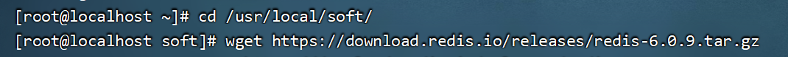
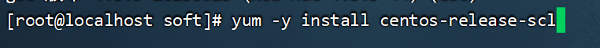
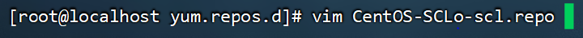
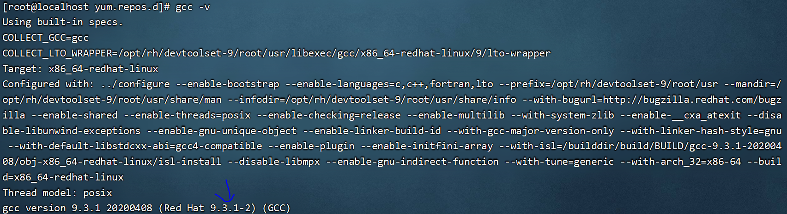
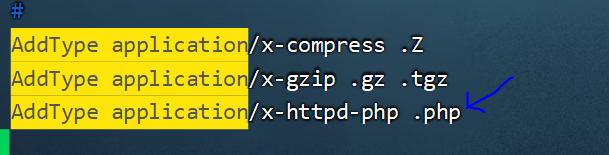
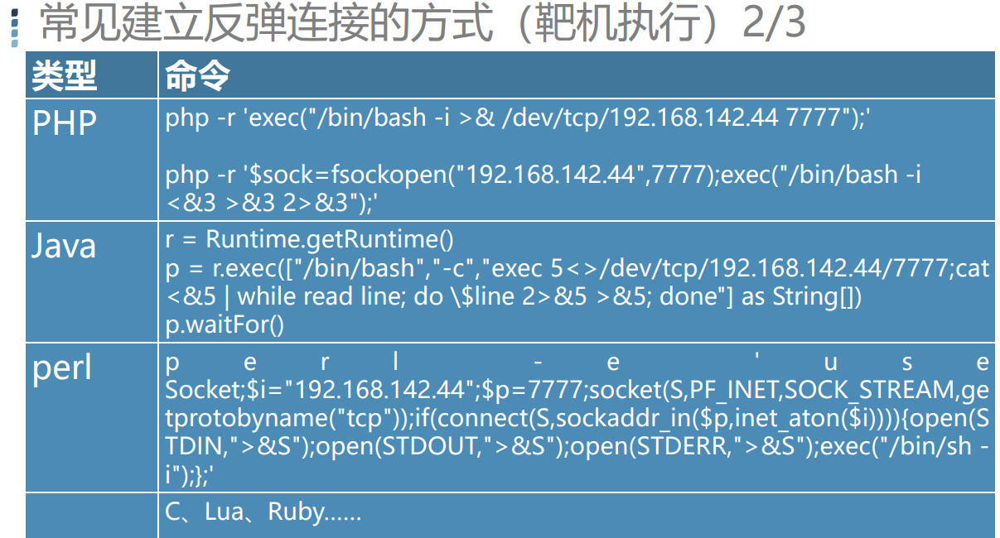

# redis未授权访问漏洞

## redis持久化机制

	

redis持久化数据，默认使用RDB，说明一下RDB保存方式，其中redis.conf配置文件中，save 3600 1指3600秒内，若有修改1次key，则会触发保存操作。 dbfilename是指明要保存这些内存数据的文件名，dir指明保存文件的路径。

	

## redis的常见用途

	

redis的value可以存放很多数据类型。

	

	

因为redis存放在内存，读写速度会快于mysql等数据库。

	

## redis环境安装

首先在靶场机安装redis的压缩包。

	

解压redis压缩包。

	

由于redis启动需要使用c语言编译，所以需要下载gcc.

	

查看gcc版本发现小于4.9，那么编译该版本的redis会出问题，于是需要升级gcc。

	

升级gcc版本，当安装这个scl库，scl库包含了多个版本的开发工具，安装完后在yum源文件夹会多出两个repo文件。

	

但是Centos7，在2024年6月底就已经停止维护了，所以scl相关的仓库也无法直接使用。

		

所以要修改内容。

	

	

只有修改这两部分内容才能使用yum源。否则yum源无法使用。

	

	

安装为gcc9版本以及相关组件。

	

由于是在scl库下载，所以要enable让其在这个bash生效gcc9,并且source保证以后重启也永久生效。

		

此时gcc升级为版本9.

使用 `make` 工具编译和安装软件

	

安装成功的结果是src目录下面出现服务端和客户端的脚本

紧接着修改配置文件

	

改为yes,这样redis启动会以后台启动，如果前台启动窗口关闭，redis也会关闭。

	

注释掉这一行，否则redis只能在本机上访问。

	

保护模式设置为no，否则漏洞无法复现。

	

由于该机子作为服务端，还需要配置别名以方便启动redis服务器。

	

添加别名，以后使用redis即可启动redis服务器，也可也使用rcli使用redis服务器。

	

有监听6379端口，说明redis已经启动了。		

为了保证漏洞复现，可以关闭防火墙，这样客户端(攻击机)才可以访问redis服务器。

	

通过rcli命令进入redis，了解redis的基本操作，flushall是清除redis全部数据。 hset是设置键中的值为一个哈希表。

	

hget专门用于访问哈希表。keys*用于查看所有的键。

	

启动redis服务器的靶场机的ip是192.168.15.50

接下来给攻击机也部署redis，ip是192.168.15.100

还是按照之前的流程安装gcc，并且升级到合适的版本，并且make编译提供的redis文件，来安装redis

最后用redis-cli命令测试，可以连接redis靶场。

	

## redis动态修改配置

	

比如在攻击机中，对redis服务器进行动态配置修改。这两个操作，把redis的持久化数据存放路径改成/root,并且设置保存的文件名为redis.php

	

设置一个值，并手动保存。

	

那么在服务端就能够发现这个redis.php文件。

	

## 提权实战

	

### webshell提权

这里模拟redis服务器同时也部署了http服务器。	

redis服务器安装一个apache

		

	

由于网站根目录在/var/www/html下。攻击机把redis的内存数据以redis.php文件命名，并存放到/var/www/html目录下。并且清空redis所有内容，并且加上一句话木马，并保存。

但是由于apache服务器没有php环境，所以不能解析这个一句话木马文件，所以先安装remi库。	

remi库携带了php的包，下载php

	

安装完后配置php.ini配置文件。

	

重启php服务，并使得开机自启。

	

	

并且apache配置文件，需要填写支持解析php文件。但由于我这里apache还是无法解析出php后端代码，所以无法用中国蚁剑连接redis.php。

	

### 反弹连接

	

没有公网IP，但有私有IP可以使用反弹连接。

	

	

常见监听端口有很多方式。

	

接下来演示一下反弹连接操作。

由于centos7没有nc命令需要安装，攻击机安装nc命令，并且监听端口。

	

	

redis服务端反弹连接到到攻击机192.168.15.100

	

此时攻击机连接上了，并且查看ip确实是redis服务器的。

	

第二个监听端口与msf的操作相关，后续课程将会学习，在此忽略。

第三个是使用kali进行7777端口监听

	

redis服务端进行反弹连接。

	

通过ip确实可以发现kali控制了服务端的bash。

	

常见的反弹连接有很多。

	

服务端也安装nc。接下来使用nc的命令进行反弹连接。

	

	

攻击机监听收到，可以实现控制

	

使用python一样可以进行反弹连接。

	

而常见的反弹连接形式还很多。

	

	

接下来演示使用msf，让微软反弹连接到kali.

使用kali生成一个微软的反弹连接。反弹连接到kali主机的7777端口

	

kali开始使用msf相关的payload监听7777端口

	

分别使用handler监听模块，并选择windows的反弹连接payload，设置监听的主机和端口，并且用exploit开始监听

	

windows下点击这个exe文件。

	

此时反弹连接成功，能查看到被攻击机的操作系统信息。

	

还可以截图获取当前win10的界面。

	

发现确实是截取到了。

	

还可以用shell来切换，此时可以对win10下达命令

	

接下来解释linux的反弹连接命令

	

	

接下来会演示使用redis和定时任务进行反弹连接。

	

### redis写入反弹连接定时任务

linux的定时任务crontab命令。

	

一般跟用户相关的定时文件是存放在/var/spool/cron路径下，并且在/etc目录下，也有放周期相关的任务。

	

比如说，目前只存放了root用户的定时任务文件。

	

在etc目录下也能查找cron周期的配置文件。

	

查看root用户的定时任务列表。

	

删除root用户下的全部定时任务。

	

攻击机监听7777端口。

	

redis客户端故意写入定时任务，意思是每隔一分钟就会反弹连接到攻击机，并且把redis的持久化数据保存到crontab中root用户的默认定时文件下。

添加键值对的时候，其中值的\n是为了换行，来保证不与里面的内容进行拼接导致命令执行不成功。

	

于是建立反弹连接成功。

	

查看到redis服务器的相关文件，从而可以控制靶场机。

	

### SSH Key免密登录

	

	

首先攻击机先删掉默认的ssh密钥，然后新生成私钥和公钥。

	

其中id_rsa.pub就是公钥。

	

查看公钥内容。

	

攻击机在.ssh隐藏目录下的authorized_keys复制这段公钥进去。

	

	

于是攻击机就可以实现ssh免密登陆了。

	

使用redis连接，并且通过键值对的形式把攻击机的公钥加入到redis的数据库中，并且把持久化数据放入到原本ssh公钥所存放的位置。

	

于是实现免密登录。所以哪怕后续redis设置密码了，但是只要之前没设置密码，我们就可以把这个公钥传入到redis服务器来实现免密登录。

服务端查看这个公钥，虽然实际上看似还有别的数据参杂其中，但只要公钥在里面，就能够触发免密登录。

	

除了以上几种攻击手法，redis还有其他的利用方式。

	

## redis加固方案

	

