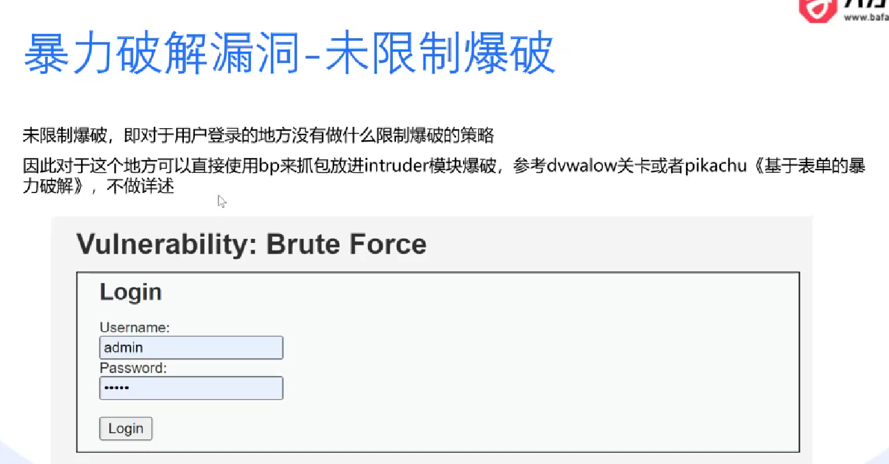
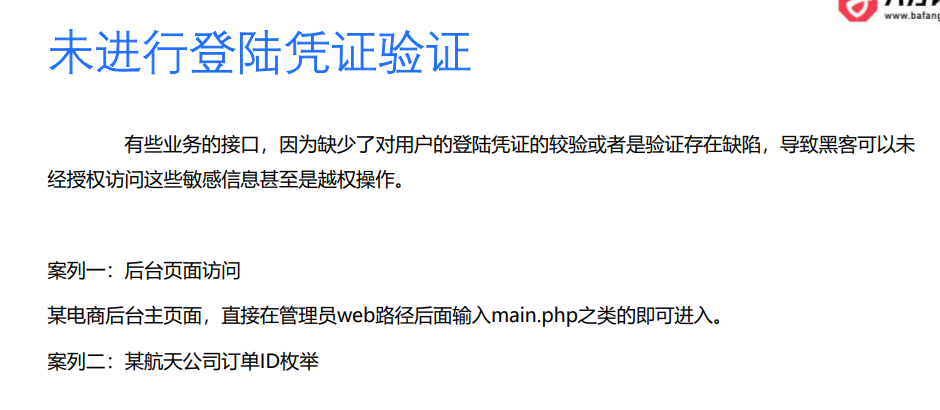
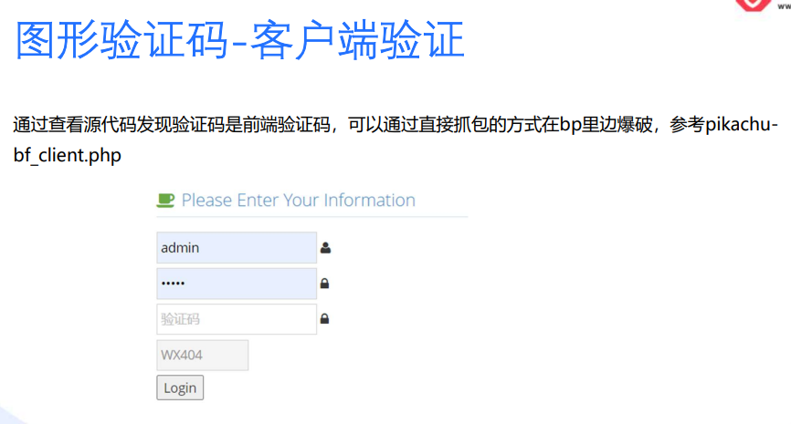
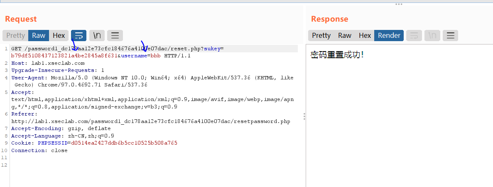
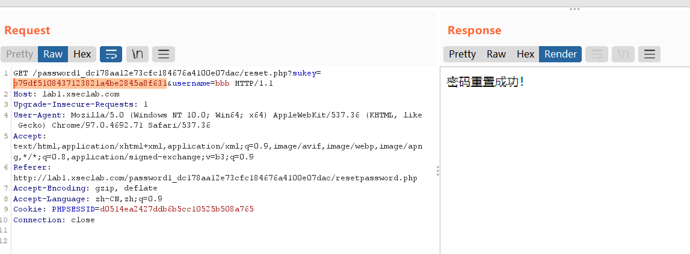
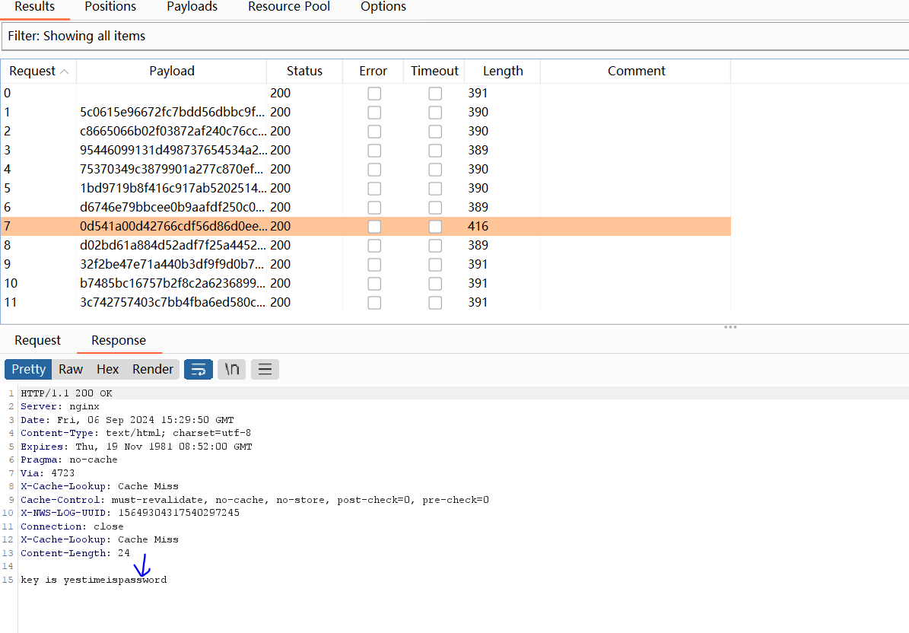
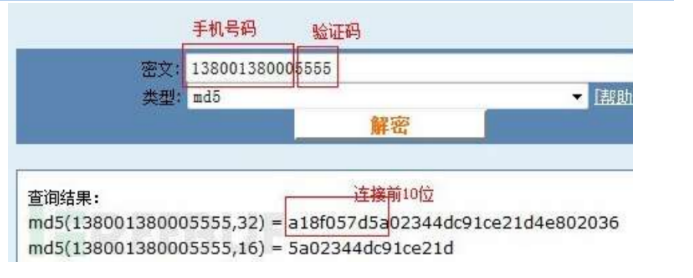
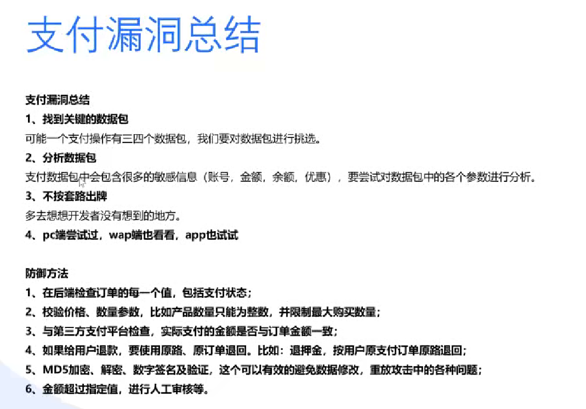

# 逻辑漏洞实战

	

	

## 身份验证漏洞

### 验证码爆破

首先要实现这个漏洞需要部署dede织梦靶场，复制源代码到phpstudy根目录下。

	

访问网站安装。

	

数据库密码记得设置为root，与mysql服务器一致。

	

php5.3版本及以上需要修改配置文件才能运行。

	

改成CGP即可。

	

于是即可打开网页进入这个织梦cms的登录管理界面。

	

解压工具包，打开pkav。

	

登录网页时使用bp进行抓包。

	

把bp抓到的请求包复制到pkav工具中，并且由于要对密码进行爆破，所以密码处需要添加标记，而因为验证码也爆破中会被使用，所以添加验证码标记。==并且注意账号要输入正确的账号，来测试密码能否爆破出来。==

	

点击添加外部字典中的国外常用密码。

	

由于验证码识别中需要知道网页的验证码来自哪里，使用f12点击对应的src来源。

	

复制这个验证码的文件来源。

	

在验证码识别模块处，把复制的地址放到验证码地址处，识别字符设置为不限定，并识别测试能够获取到验证码。

	

在发包器模块下，点击启动即可开始密码爆破

		

于是最后发现密码被爆破出来了，就是admin.

	

### 爆破-IP封锁和密码错误次数

	

代理池就是一个池子有非常多的ip作为代理，那么每次使用不同ip去暴力破解，就不会出现限制ip的情况。

	

这是一个python脚本文件，其中proxy由于没有代理，这里模拟使用本机来代替代理池作为代理，实际上我们要去网上买代理池去使用是最方便的。

```python
import requests
import re

def post():
    curl = "http://127.0.0.1/dede/dede/login.php"
    proxy = {'http':'127.0.0.1:8080'}   #代理地址以及端口，现在估计已经失效，如果需要使用，可以自建资源池
    header = {
     'User-Agent': 'Mozilla/5.0 (Windows NT 10.0; Win64; x64; rv:96.0) Gecko/20100101 Firefox/96.0',
     'Cookie': 'PHPSESSID=17u0i2fakm84eq9oc24boc8715'}
    #请求报文，发送一个 HTTP GET 请求到指定的 URL，并将响应的文本内容存储在变量 `post` 中。请求使用了定义的 `header` 和 `proxy`，即通过代理服务器发送请求，并附带自定义的 HTTP 头信息。
    post = requests.get(curl,headers=header,proxies=proxy).text   
    print(post)  #打印网站

if __name__ == '__main__':
    post()
 

#实验要求，bp能抓到python发送的报文即可，靶机IP可以选择pikachu的或者sqli的，ip不要写环回地址如127.0.0.1或者locahost
```

运行这个脚本

	

通过bp抓包即可发现代理是127.0.0.1发送过来的请求。

	

	

### 多字段爆破

比如有的时候我们光输入账号密码还需携带token才能登录成功，但是如果直接暴力破解登录，哪怕账号密码是正确的，只要token错误，我们也会登陆失败。并且不能采用多线程爆破，因为每次登录的时候，web回应的报文会携带新的token,所以我们每次只有携带新的token进行登录才行，故因此只能采用单线程进行。

token本身的作用就是为了防止简单的暴力破解。

	 

在pikachu靶场下来演示token防爆破的漏洞。

	

抓包，右键点击send to repeater,当发送两次，回显出来的错误就会是token error。所以每次登录网页都会返回一个新的token,不能无脑进行密码爆破。

	

右键send to Intruder,然后清理所有的payload,在密码处和token处添加payload,并且选择attact type类型是pitchfork

	

添加需要爆破的密码，其中输入正确的密码123456到这个密码本列表中。

		

在option菜单下，需要提取每次发送请求都会变化的token,用鼠标选中token，并点击ok，那么每次密码爆破都会获取新的token进行下次申请。

	

在payload菜单下，把payload type改成递归搜寻，那么就会根据我们上面设置的提取规则，每次登录申请都会获得新的token.

	

选择一个线程，于是开始攻击。

	

找那些长度不一样的去查看，结果发现密码123456登录成功，于是密码爆破成功。

	

除了使用bp来解决token防爆破的漏洞，但是有的网站获取token比较难，那么也可使用自定义的python脚本来解决这类问题。

python脚本如下

```python
import requests
import re

purl = "http://127.0.0.1/pikachu/vul/burteforce/bf_token.php"  #这里需要修改
user_token = "27536628ca8f3b0818871451285"
proxy = {'http':'127.0.0.1:8080'}     #可以集合bp看看发送的报文
header = {
     'User-Agent': 'Mozilla/5.0 (Windows NT 10.0; Win64; x64; rv:96.0) Gecko/20100101 Firefox/96.0',
     'Cookie': 'PHPSESSID=17u0i2fakm84eq9oc24boc8715'}

def token(response):
    user_token = re.findall('value=".*."', response)[0][7:-1]  #根据正则表达式取出token
    return user_token

def uandp(user_token):
    f = open('result.csv', 'w')     #把爆破结果储存到文件里，这里为csv格式
    f.write('用户名' + ',' + '密码' + ',' + '包长度' + '\n') #给文件设置标题
    sum = len(open("p.txt").readlines())*len(open("u.txt").readlines()) #密码本的总数量，最后得出进度
    dan = 0 #dan变量是用于查看进度用的
    for u in open("u.txt") : #先查看用户本
        for p in open("p.txt") : #查看密码本，根据这个密码本进行爆破
            u = u.replace("\n","")   #过滤掉回车符
            p = p.replace("\n","")
            session = requests.session()    #会话保持
            data= {'username':u,'password':p,'token':user_token,'submit':'Login'} #初始数据
            response = session.post(purl,data=data,headers=header).text
            user_token = token(response)
            result = u + ',' + p + ',' + str(len(response))    #用户名密码以及响应包长度
            f.write(result + '\n')  #输出到文件
            dan = dan + 1
            print("进度:"+str(dan)+'/'+str(sum))           #输出到终端
            # print(response)
    f.close()

if __name__ == '__main__':
    uandp(user_token)

```

运行该脚本后，得到一个csv文件，查看这个csv文件。

	

通过包长度，可以判断这个有可能是admin账户的密码。因为包长度其实就是response回应的内容长度，如果登录成功和登陆失败的回显结果肯定不一样，那么自然包长度也不会相同。

	


### 密文爆破

当账户密码经过加密才能够被验证时，那么我们在爆破的时候，也需要把字典密码本也需要设置对应加密编码来爆破。

	

使用tomcat8靶场。

	

靶场打开如下所示。

	

接下来使用bp进行抓包，可以发现登陆时账号和密码进行了base64加密并且放入到Authorization字段中。

	

复制这一段进行解密，会发现格式其实就是==账号:密码==

	

由于是单字段爆破，所以攻击类型使用sniper,并且把密文添加成爆破对象。

	

由于加密分成 ==账户 : 密码== 三个部分，所以payload类型必须是自定义迭代器。第一个部分是账号。

	

第二部分是冒号。

	

第三部分是密码。

	

并且对这些payload进行base64加密。

	

于是开始攻击即可爆破成功。

	

	

比如有的登录界面密码，会在前端的js进行复杂加密，我们可以使用f12查看。

	

找到name属性的关键字段。

	

对name的值进行搜索，可以直接搜索到js的加密 

	

复制到编辑器去查看对应的源码。

 这种js的加密方式:将密码先进行md5加密，得到x1，将x1转化为全大写后加上冒号和cookie得到x2，对x2进行md5加密得到x3，将x3转化为全大写得到x4，最后的值为 账号名:x4

	

### 未授权漏洞(session和cookie)

session固定攻击是指当某个用户登录一个网站，此时网站会下发一个sessionid的cookie信息，之后用户只需携带这个sessionid就可以实现登陆验证。那么黑客可以复制这段session id来实现免密登录。

	

	

### 未进行登陆凭证验证

	

## 登录验证码安全

### 验证码复用

	

比如说织梦后台靶场，只要验证码没输入错误，哪怕密码输入不正确，那么验证码就不会发送改变。那么实际上就可以直接爆破密码，而无需考虑验证码。

	

### 图形验证码绕过

验证码是否正确，通常分为前端校验和后端校验，如果是后端校验，验证码不正确就会直接拒绝登录，但是如果是前端校验，后端发现验证码不正确，会发送包给前端，让前端拒绝，但是如果使用bp拦截这个response回包，就可以让修改这个状态，让前端误以为验证码是正确的。

	

### 客户端验证

还有一种纯前端验证，验证码生成和验证码的验证都是由前端进行，如何判断前端验证呢，如果bp拦截回包，没有拦截到则说明是纯前端验证。

	

演示这个pikachu的该关卡。

	

比如说pikachu靶场，纯用前端进行验证码校验，判断验证码是否正确错误是使用js进行的。

	

如果验证码输入错误,bp是无法抓到包的。但是如果验证码输入正确，那么bp才能抓取到包。

当bp抓到包后，后续哪怕验证码随便乱输入，也一样可以验证通过。因为第一次输入正确验证码获取到包了，所以就绕过了前端的验证码验证。

	

### 短信轰炸和无效验证

这种情况可以使用bp抓取回包，就算输入错旧密码，只要回包有包含验证信息说旧密码错误，那么我们可以改成true，从而绕过输错旧密码来修改密码。

	

	

	


## 登录前端验证漏洞

### 忘记密码漏洞

	

根据下图思路可以看看接下来的案例

	

首先在一个网站注册一个用户，然后修改这个用户的密码，通过抓取数据包中的参数判 断哪里是校验用户，通过修改关键参数，达到任意修改其他用户密码的目的。下面对一个网站进行模拟攻击，以便于在攻击中讲解能够更深刻的理解。                 1. 先注册一个网站的账号，注销后在登录界面点击忘记密码。然后填写相应的信息，这里 填写了刚才注册的用户名和密码。然后开启浏览器的代理和 Burp 的截断，如下图所示。

	

2.点击下一步后，分析报文，看到请求的报文中传递了用户名和邮箱，因此判断此数据包是用来判断是否存在此用户、用户名和邮箱是否匹配的。点击 Forward 放过次数据包。	

	

3、攻击者收到网站给的验证码（到这里都是正常的网站找回的逻辑）

	

4、继续填写验证码，发现还是没有什么可以利用的数据，放包过去

	

5、 到了修改密码的界面，填好密码后点击下一步。抓包后，观察发现这里写入了用户名和密码。可以先右键报文，然后 Send to Intruder 之后可以爆破用户名，并将其修改为同 一个密码。不过这里只是测试一个叫 zhangwei 用户名，这是我们之前爆破出的一个其他的用户，如下图所示

	

6、发送之后，发现修改成功（这里漏洞点：原因是没有对校正的账号和修改的账号进行匹配，导致可以先通过用户验证后，去修改别人的密码）

	

	

接下来看看这个思路的相关案例

`

1.在找回密码的界面，发现是通过填写手机号和返回的验证码进行身份认证。

	

2.先填写一个想要修改的手机号，验证码随意填写一个。再打开浏览器代理和 Burp 的截断，这时候点击提交后，会抓取一个 请求的数据包。 再右键点击报文内容，选择如下图所示。

	

3.这个时候可以拦截到回包， 观察图数据包中的 status 字段，这里的 0 可能是验证码错误的返回代码,因此我们尝试把他改为“1”，试试

	

4.结果直接发发现已经可以输入新密码了

	

### token参数可逆

	

```
接下来总结这个ctf靶场的攻击思路:
首先我们分别按序aaa,admin,bbb用户进行忘记密码设置，并且根据抓到的用户aaa和bbb请求包sukey字段进行md5解密得到一段数字，而admin用户本身没有sukey这个字段，所以不知道token是多少，自然无法重置密码，但是一般开发当中，会使用时间搓这个关键因素来生成token,那么只要得到aaa和bbb时间之内的token,那么自然可以爆破，那么根据MD5解密这两个用户的sukey，发现有一段数字范围，那么根据这个数字范围进行bp的爆破，即可重置密码成功，在ctf通关会得到一个key.
```

这是一个ctf的靶场，我们点击忘记密码。

	

分别按需对aaa,admin,bbb进行重置密码。

	

	

	

根据aaa用户的sukey，可以发现sukey的特点是长度32位，我们不得不怀疑是进行了md5进行加密

	

于是解密得到一串数字

	

查看bbb用户的sukey并进行md5解密。

	

	

将该请求报文，send to intruder开始爆破。

	

添加需要爆破的token。并且username账户要改成admin.

		

payload是数字，并且设置爆破的范围。

	

并且需要对数字进行md5加密，来依次爆破token.

	

于是点击开始攻击，根据长度不同找到这个，最后自然就找到了key，则该关卡通关。

	

案例二：基于关键字段生成的 token 某网站密码找回功能

请求含有三个参数： 

	

1、username 是邮箱、rvcode 图片验证码、sid 未知，登录邮箱查看重置 URL

	

 2、重置的关键参数为key，直接丢到md5发现无法解密，后来发现多次尝试，发现将 md5(username + sid) 可以得到一个和邮件一样的MD5

	

3、 猜测出其 key 的生成算法，那么，后续将豪无压力重置任意账号的密码了。

4、 类似的还有，带凭证的重置链接为 http://mysite.com/sms.php?k=a18f057d5aF 多次获取重置链接发现，凭证 f198a79b9cF 末尾的 F 恒定不变，前面 10 位字符疑似 md5 加密， 尝试对不同参数的排 列组合进行 md5 加密                            当尝试到 md5(手机号+图片验证码) 时发现 生成结果与邮件中的凭证一致：

	


### 服务端验证逻辑缺陷

	

	

2.这里抓取到数据包，观察数据包，数据包中包含用户名，旧密码和新密码。

	

​    3.将用户名修改成的其他的用户名

	

 4、发现wangkaijiang的密码修改成功

	·


## 任意账号注册

	

## 权限漏洞

垂直越权是逐渐获得高权限，水平越权是获取其他的用户，拥有其他用户的权限。

	

	

	

## 其他类型

数据包重放漏洞可以 造成短信轰炸，通用修复方法可以使用token机制，每次发送请求包，服务端都会回应一个新token,如果没有携带新token，那么就无法进行验证码验证，这样就避免了短信轰炸。

	

这个可以对比之前upload-labs文件上传漏洞的18关。

	

	

	

	

	

## SRC漏洞总结

	

	

	

	

	

	

	

	


