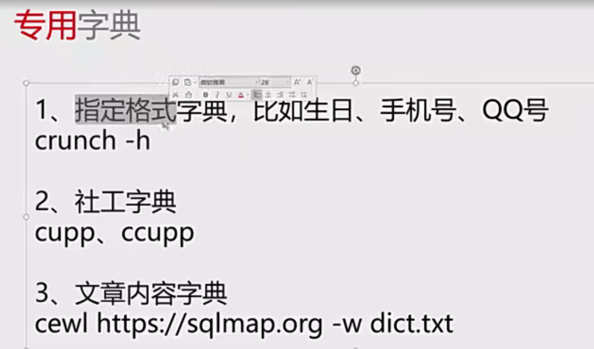
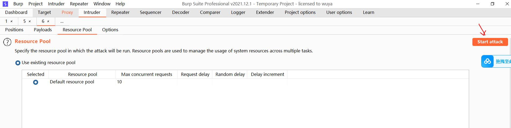
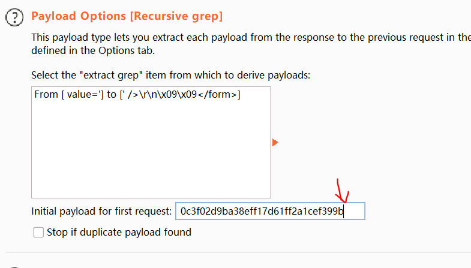
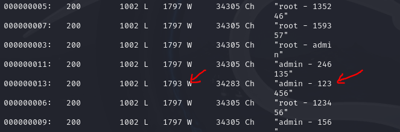

# 密码暴力破解与防御

## 密码安全概述

	

	

不安全密码，除了默认密码，还有弱口令。

有专门的网站可以检查自己的邮箱是否有泄露过密码，绿色表示没有泄露，红色表示泄露过。

	

	

社工字典，可以使用kali自带的cupp命令来进行创建专用字典。比如会输入对方的名字，生日等等。

	

crunch是kali的一个命令，专门用于生成特定的字典。这个可以用gpt去解析具体的参数是干什么的

	

## 暴力破解实战

### python暴力破解

	

这里使用dvwa的靶场进行演示。难度设置为low级别。

	

随便输入账号和密码，通过f12抓包可以发现传入了username和password以及login三个参数。

	

并且我们是要爆破网站登录之后的密码登录，所以也需要复制cookie,否则在python脚本密码暴力破解的过程中会弹回出dvwa的主页。

	

python密码暴力破解脚本。

```python
# -*- coding: utf-8 -*-
# python 3

import requests
# 如果第一个密码就提示成功，是 PHPSESSID 没有替换的问题
pwds = open("password.txt")
for pwd in pwds:
    url = "http://127.0.0.1/dvwa/vulnerabilities/brute/"
    # PHPSESSID务必替换为登录以后的PHPSESSID
    #根据f12抓包的参数填写对应参数，并且要把cookie复制到对应的headers头部中。
    resp = requests.get(url = url, params = {"username":"admin", "password":pwd.strip(), "Login":"Login"}, headers = {"Cookie":"security=low; PHPSESSID=aj0lre9888q49m70icps95dl63"})
    if 'Username and/or password incorrect.' in resp.text:
        print('破解失败：'+pwd, end='')
    else:
        print('破解成功：'+pwd, end='')
        break;
pwds.close()

```

最后密码爆破成功。

	

### bp暴力破解

Sniper狙击手是专门用来爆破单一字段。

Battering ram攻城锤可以选择多个字段，但只能选择一个字典时，那么选择的所有的爆破字段都用同样的字典里面的内容进行爆破。

Pitchfork草叉，可以选择多个字段进行爆破，可以选择多个字典，分别匹配多个字段。但是有个缺陷，比如分别选了账号字典和密码字典，并且账号和密码各有十个，那么只会请求十次，请求时分别匹配第一个账号和第一个密码。

Cluster bomb榴霰弹，可以选择多个字段进行爆破，可以选择多个字典来分别匹配多个字段，如果账号和密码各有十个，那么会请求一百次，即一个账号会把十个密码都匹配请求一遍。

	

接下来使用bp对dvwa靶场进行密码爆破,首先抓包，然后send to intruder，对password字段进行add，说明是爆破的字段。

	

导入密码字典。

	

点击开始爆破

	

于是密码暴力破解成功。

	

medium难度的话，根据查看源码，其实可以爆破密码，但是每次发送登录请求需要等两秒，顶多是延误爆破时间，但是还是能被爆破密码出来。


high级别，每次登录服务器都会下发一个token,如果下次登录没有携带token,哪怕账号密码输入正确，也依然会报错。

	

首先先使用pitchfork鱼叉攻击类型，因为是一一匹配，token每次会发生变化，所以这个攻击类型最合适，然后需要对密码和token进行爆破，所以要add标记。

	

password作为第一个字段，需要导入密码字典。

	

第二个字段需要使用递归搜寻token.

	

添加递归搜寻中寻找token的规则。

	

并且添加回复报文中的匹配项，当回复包出现登录成功的请求，会对这个请求包进行标记。

	

因为token是一对一获取，所以只能使用单进程爆破。

	

并且要注意设置最初发起请求的token，于是复制bp报文截取的token.

	

于是即可爆破成功(实际上这一步复现失败了，但是pikachu成功了。)


impossible级别也是使用token来进行防爆破。

	

并且登录失败三次，就会锁定15分钟，这使得基本上难以破解。

	

## 防御手段

可以使用sleep限制爆破速度，或者使用token防爆破，也可使用限制尝试次数来锁定用户。

但是锁定用户可能使得无辜用户无法登录，所以实际上更好的方式是锁定ip,但是黑客现在大多会使用ip池子，以防止ip锁定。

	

也可使用二次验证来防止暴力破解。

	

比如说可以异地登录，必须做验证才行。当然也可采用安全产品waf，或者说长期未登录必须修改密码等手段防止密码爆破。或者直接取消密码登录，改用验证码登录。

	

## 其他暴力破解工具

	

接下来以pikachu靶场为例，使用wfuzz暴力破解。

	

```
-z指定文件名 -d指定参数是使用post传参。

wfuzz -z file,user -z file,pass -d "username=FUZZ&password=FUZ2Z&submit=login" http://192.168.15.1/pikachu/vul/burteforce/bf_form.php
```

	

由于行数不一样，所以可以确定这个是正确密码。

	

可以多加--hw参数，可以用于过滤掉1797行的内容。这样可以清晰找到暴力破解的密码。

	

Hydra九头蛇也是一款暴力破解的软件，但是kali也有自带这个。

	

	

比如这里演示使用hydra暴力破解另外一个虚拟机(192.168.15.50)的ssh协议服务。

```
-L 参数指定一个用户名字典文件,-P 参数指定一个密码字典文件

hydra -L user -P pass 192.168.15.50 ssh
```

	

还有美杜莎也是一种暴力破解的工具。

	

比如使用美杜莎进行暴力破解ssh协议

```
-M 参数用于指定目标服务的协议类型，-h 参数指定目标主机的 IP 地址，-u 参数指定要测试的用户名，-P 参数指定密码字典文件

medusa -M ssh -h 192.168.15.50 -u root -P pass
```

	

当然除了美杜莎还能使用msf模块来实现密码暴力破解。


