# 第一节-AppScan介绍和安装

## 1.简介

Appscan 10中文版是是全新网络安全漏洞扫描软件，软件可以直接可以对OS命令、SSRF和XXE攻击等漏洞进行检测，使得漏洞检测更加容易，提高漏洞的扫描效率。软件同时支持动态、静态、互动分析三种不同的测试功能，可自动化扫描检测网络或者系统安全漏洞，并采用全新的爬虫技术，能够根据网站入口自动摸取网页链接进行安全扫描，提供了扫描、报告和修复建议等功能。

## 2.功能特色

　　1、动态分析（“黑盒扫描”）

　　这是主要方法，用于测试和评估运行时的应用程序响应。

　　2、静态分析（“白盒扫描”）【代码审计】

　　这是用于在完整 Web 页面上下文中分析 JavaScript 代码的独特技术。

　　3、交互分析（“glass box 扫描”）

　　动态测试引擎可与驻留在 Web 服务器本身上的专用 glass-box 代理程序交互，从而使软件能够比仅通过传统动态测试时识别更多问题并具有更高准确性。

　　4、软件的高级功能包括：

　　常规和法规一致性报告，并提供超过 40 个不同的开箱即用模板。

## 3.扫描流程

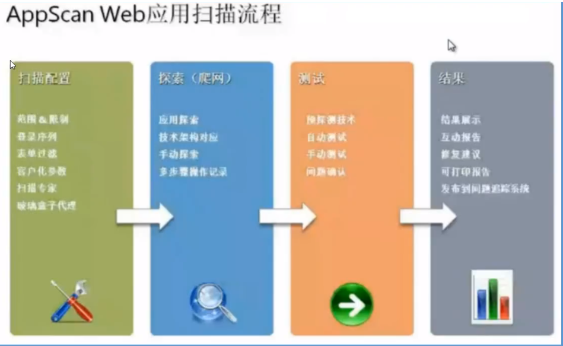

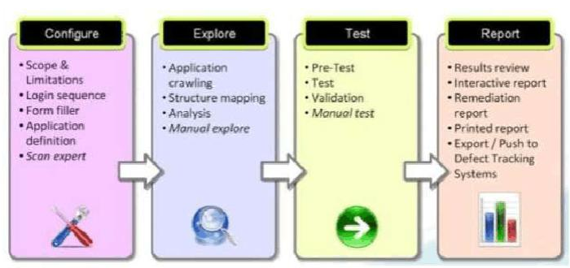

## 4.扫描方式

Static： 静态分析 （白盒扫描）   源码分析：支持（Taint analysis\pattern matching）

Dynamic： 动态分析 （黑盒扫描）

Hybrid：混合分析（黑，白）【知道源代码】

Run-Time： 运行时分析（玻璃盒）【不知道源代码】

Client-Side：客户端分析(Javascript)

## 5.安装与破解

1.安装前需安装.NET Framework 4.7.2（已安装请忽略）

2.双击运行Appscan_Setup_1002.exe，选择安装语言，点击确定；

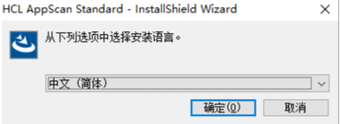

3.选择I accept，点击下一步；

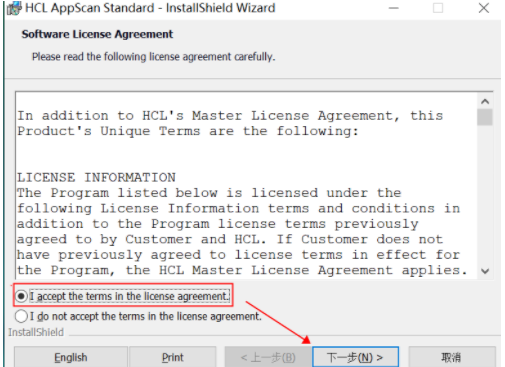

4.更改安装目录，点击安装；（注意记录下这个目录后面破解需要用到）

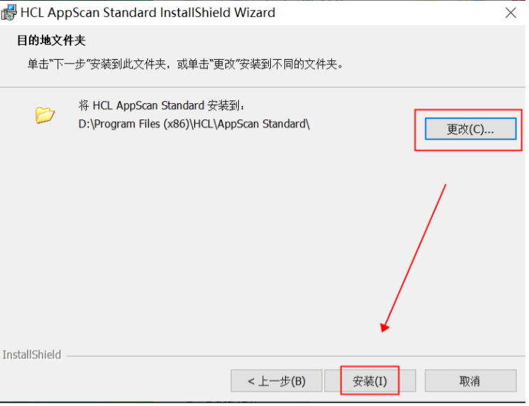

5.等待安装直到完成；

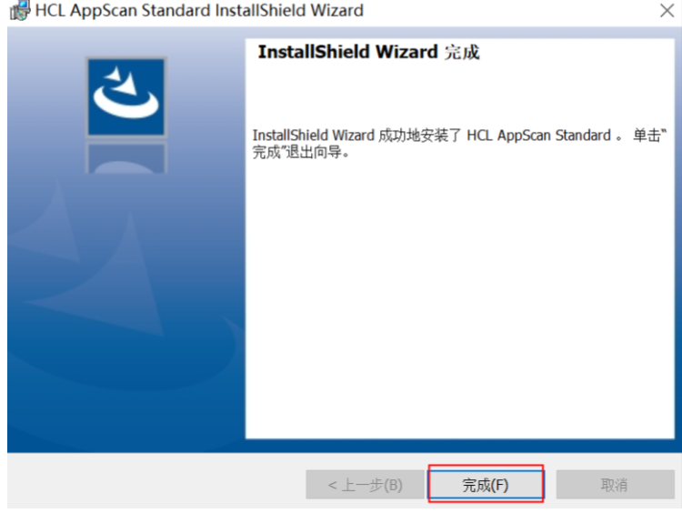

6.将破解文件 AppScanSDK.dll 和 HclLicenseProvider.dll 拷贝到安装目录D:\Program Files (x86)\HCL\AppScan Standard下替换原来的文件

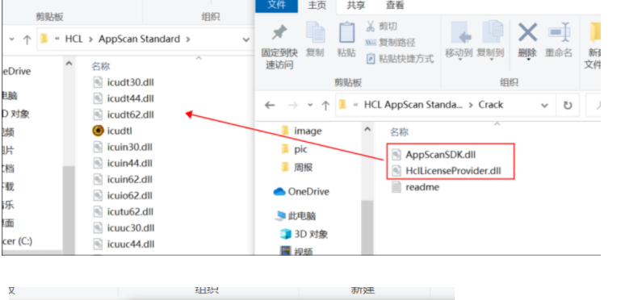

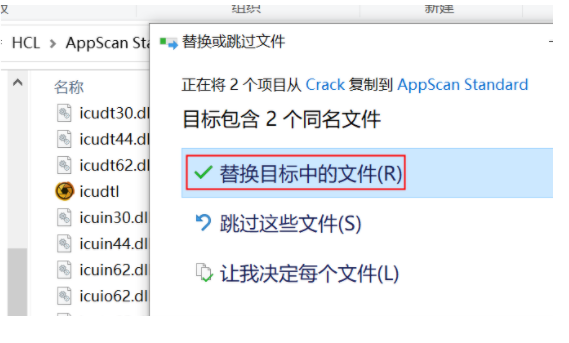

7.双击桌面图标运行AppScan；

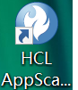

8.安装成功

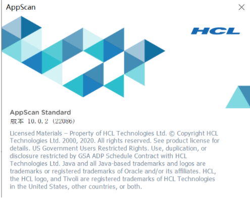

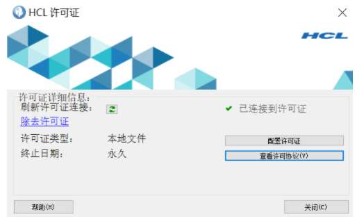

