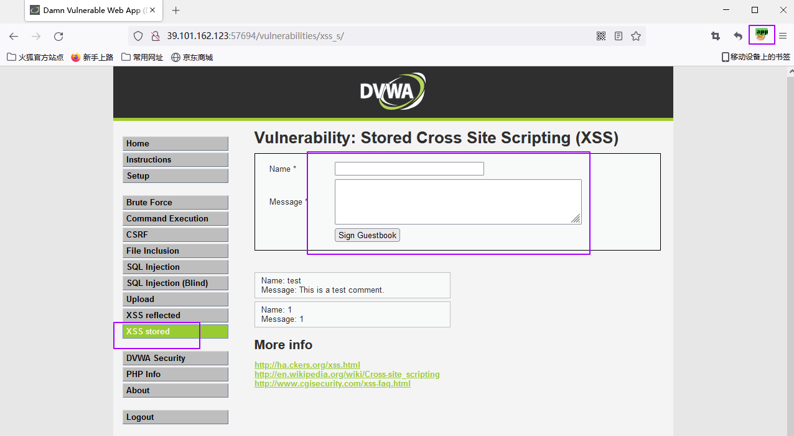

# 第三节-AppScan被动手动探索扫描

被动式扫描：浏览器代理到AppScan，然后进行手工操作，探索产生出的流量给AppScan进行扫描。

他的优点是：扫描足够精准，覆盖率更加高，减少不必要的干扰包等等

## 1.扫描基础准备

### 1.火狐安装FoxyProxy

1.打开扩展和主题

```
about:addons
```

2.输入FoxyProxy 点击【回车】搜索


3.点击 【FoxyProxy Standard】


4.点击【添加到 Firefox】


### 2.马士兵靶场

1.进入靶场

```
https://www.bafangwy.com/battle
```

2.启动dvwa靶场


3.访问靶场

```
http://39.101.162.123:64936/login.php
admin
password
```

4.设置安全等级为low


## 2.扫描步骤

### 1选择【扫描】--【手动探索】--【外部设备】


### 2.火狐浏览器点击【代理】--选择【选项】


### 3.点击【添加】


### 4.输入标题【appsacn】，添加ip【127.0.0.1】，添加端口【49729】，点击保存


### 5.开启代理


### 6.操作被测网站



### 7.切换到appScan 点击【停止记录】


### 8.选择网站，点击【确定】


### 9.点击【扫描】，选择【仅测试】


### 10.点击【是】


### 11.选则储存位置，点击保存


### 12.等待测试结果


## 3.appscan内置浏览器扫描

### 1.点击【手动探索】，选则【AppScan Chromium 浏览器】


### 2.点击【是】


### 3.输入URL 点击【确定】


### 4.点击取消


### 5.点击【配置】--【参数和cookie】--【定制头】


### 6.在火狐浏览器复制cookie


### 7.切换到AppScan，点击【+】，添加cookie，点击【确定】


### 8.点击确定


### 9.点击【手动探索】，选则【AppScan Chromium 浏览器】


### 10.进行手工探索，完成后，点击【确定】


### 11.点击【确定】


### 12.点击【扫描】--【仅测试】


13.点击【是】


### 14.选择保存位置，点击【保存】


### 15.等待扫描结果


