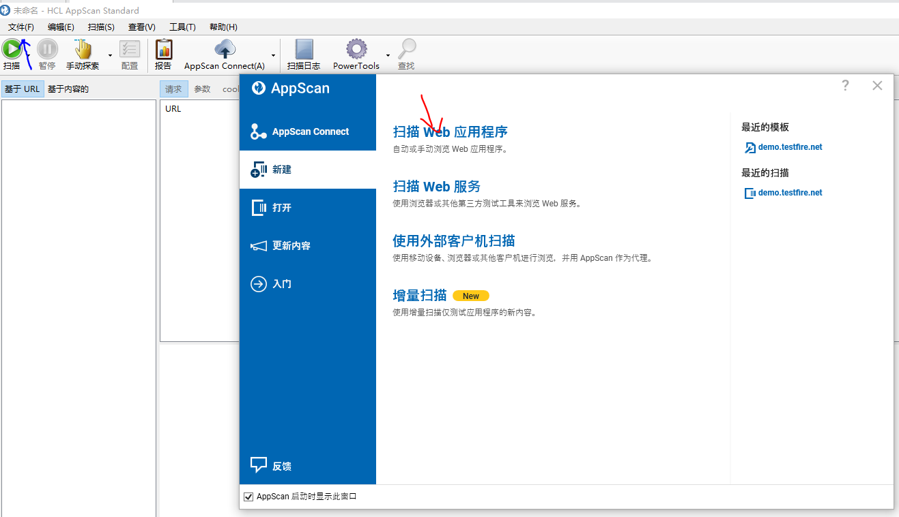
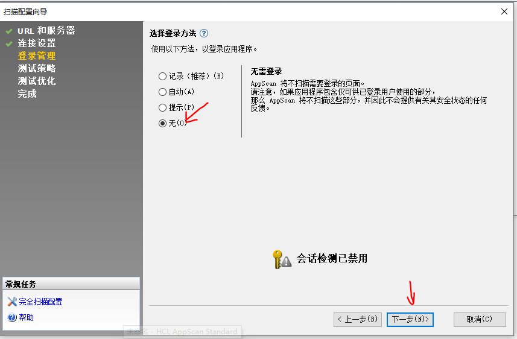

# Appscan漏洞扫描

## 靶场环境搭建

把php1目录放入phpstudy根目录，并创建网站。

	

创建gkk数据库，并且导入gkk.sql文件。然后把靶场的db.php配置文件，把mysql密码修改为root.

	

于是靶场部署成功。

	

## web应用程序扫描

文件点击新建，然后点击扫描web应用程序。

	

输入需要扫描的靶场站点的ip地址，确认能连接服务器，于是点击下一步。

	

点击不使用代理。

	

仅扫描无需登录的界面即可，后续会有新的案例去扫描需要登录的界面。

	

测试策略选择缺省值，左下角可以查看缺省值会扫描的漏洞有哪些

	

比如缺省策略会测试sql注入等等。

	

无优化速度慢，但是扫描漏洞准确率最高。

	

选择启动扫描。

	

选择是，保存扫描。

	

点击保存。

	

扫描完成后，发现有很多漏洞。可以点击进去具体查看什么修复方案。

	

## dvwa靶场扫描

复制要扫描网站的url.

	

点击扫描web应用程序

	

粘贴需要扫描的url

	

	

这次需要登录站点进行扫描，所以需要选择记录，并在这个小游览器进行登陆。

	

登陆站点后，点击我已登陆站点。

	

显示已成功配置登录，说明登陆序列记录成功，于是可以下一步。

	

	

	

选择扫描完成后，启动扫描专家。后续操作一样，等待扫描即可。

	

扫描出很多漏洞，最后扫描完成后，可以通过报告来进行生成展示。

	

保存报告。

	

