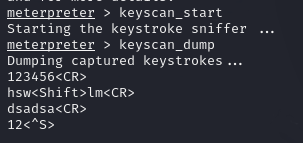

第21课 ：后渗透之上传下载文件

|  ID  | Command  |  Description   |
| :--: | -------- | :------------: |
|  1   | upload   |  传文件到靶机  |
|  2   | download | 从靶机下载文件 |

第22课：后渗透之屏幕截图

| ID   | Command    | Description     |
| ---- | ---------- | --------------- |
| 1    | screenshot | 截图（Windows） |

第23课：后渗透之键盘记录

一般用于windows操作系统。

| ID   | Conmmand      | Description           |
| ---- | ------------- | --------------------- |
| 1    | keyscan_start | 启动键盘记录(Windows) |
| 2    | keyscan_dump  | 导出键盘(Windows)     |
| 3    | keyscan_stop  | 停止键盘记录(Windows) |

导出windows键盘的打字的记录。

	