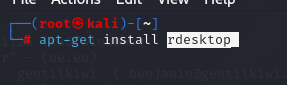
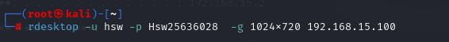

# 一、环境准备

#### 1 rdesktop

在线安装  rdesktop

	

---

Debian,Ubuntu,kali下使用以下命令

 apt-get install rdesktop

---

Centos/RedHat可以通过yum命令

yum -y install rdesktop

#### 2 一台windiows靶机（没有物理电脑可以使用虚拟机代替）

#### 3 MSF-Metasploit Framework

# 二、实战

1 使用rdesktop远程控制

这个没复现成功，但是run vnc可以复现成功。

说明：rdesktop是linux下支持Windows远程桌面连接的客户端程序，在linux系统下可通过它远程访问Windows桌面，支持多种版本。rdesktop是sourceforge下支持GPL协议的一个开源项目，采用RDP（Remote Desktop Protocol,远程桌面协议），几乎可以连接windows的所有版本

rdesktop常用参数

| id   | 参数        | 描述                                            |
| ---- | ----------- | ----------------------------------------------- |
| 1    | -u          | 账户名                                          |
| 2    | -p          | 密码                                            |
| 3    | -a 16       | 指使用16位色显示远程画面                        |
| 4    | -f          | 全屏模式（用**Ctrl+Alt+Enter** 组合键退出全屏） |
| 5    | -g          | 设置分辨率 如 :   -g 1024x768                   |
| 6    | rdesktop -h | 查看rdesktop使用帮助                            |

rdesktop -u 用户名 -p  密码  -f   靶机IP

rdesktop -u mb -p 123456 -f  -g 1024x720 192.168.15.100

	

如果远程计算机没有启动远程功能我们可以在meterpreter中输入

启动远程桌面协议：run post/windows/manage/enable_rdp

---

2 通过vnc远程，等待几秒钟即可远程连接成功。

	