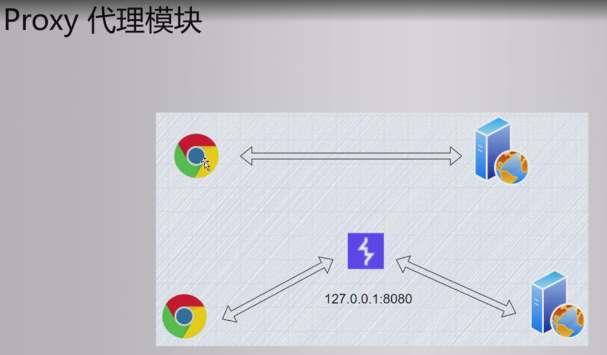
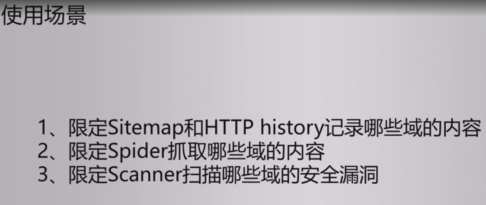
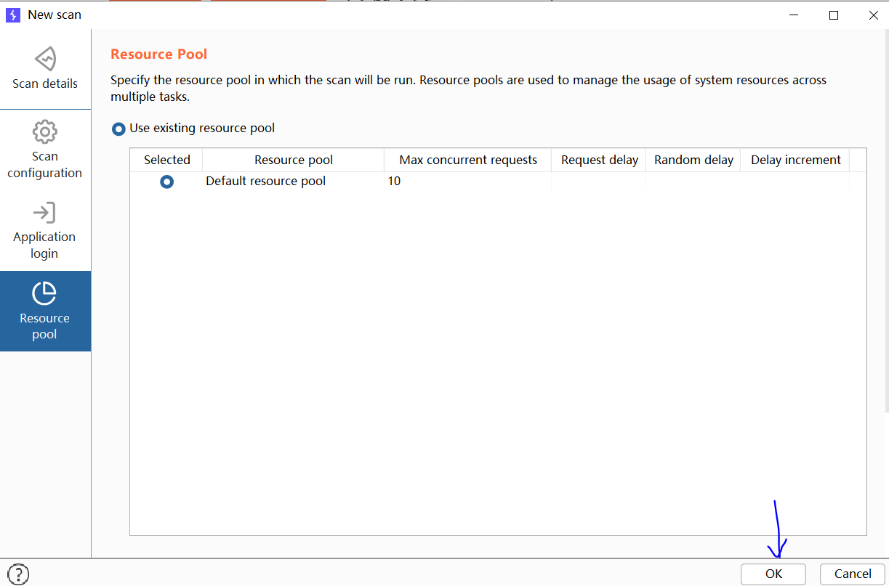
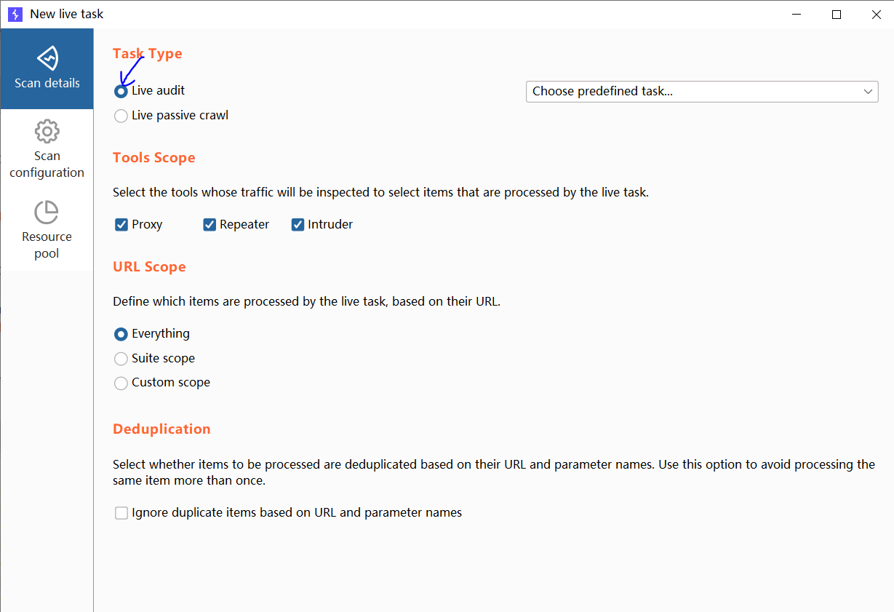
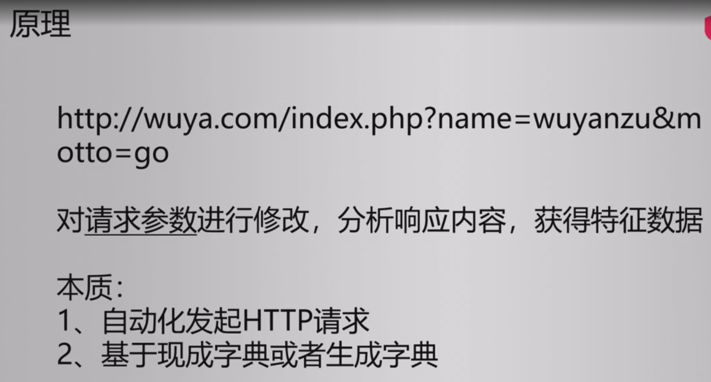

# Burp Suite


bp分为企业版、社区版、专业版

bp的下载可以去参考马士兵提供的文档进行下载。

	

## Proxy模块

	

	

	

代理指从客户端发现web端的请求，给到代理，代理可以经过修改后转发。

	

	

	

	

	

	

	

	

### 游览器代理设置

首先在火狐游览器的扩展中添加foxy Proxy

	

添加代理，设置代理的端口上8080，主机名就是自己，因为bp就是装在本机。

	

并且bp的代理也要添加好。

	

当火狐游览器设置好代理进行访问，然后bp设置好抓包，即可抓取到游览器访问的数据包

比如此时火狐访问百度。

	

那么bp就能抓到相应的请求包。

	

	

### BP拦截https流量

	

首先第一种是没有代理的https通信，那么就是游览器用信任的CA机构的公钥与服务器协商会话密钥，于是即可加密解密通信。

第二种是有bp代理的https通信，那么需要游览器信任bp代理的CA证书，才能够加解密通信，而bp还得加解密与服务端进行通信

	

如果直接使用bp访问https的网站是无法成功的。

	

所以首先加载bp的证书，使得游览器信任。

	

随便命名，并保存这个der后缀的证书。

	

火狐游览器在设置中搜索证书。

	

点击导入的证书

	

勾选信任该证书来标志网站

	

那么此时就可以使用bp代理访问https的网站。也可也进行抓包测试了

	

### BP抓手机APP流量

详细可参考文档bp抓取手机app包。

## Taget模块

### Target作用

	

	

虽然都是记录http流量，但是侧重点不一样，target是按照主机或者域名分类记录。

	

火狐游览器设置bp代理。然后访问淘宝网站，target模块就会列举出访问淘宝的所有域名，可以把握网站总体情况。

	

	

	

只有第一个满足同域，因为协议域名端口一样。

	

这里限定域的作用范围是不冲突的。

	

限定域的使用场景

	

### Target限定作用域

比如在scope这里设置限定抓取的作用域。

	

那么访问淘宝只有这个指定的域名会被抓取信息。

	

### sitemap站点地图

	

sitemap里面捕获到的http流量分为几个模块信息，第一个显示文件树的路径，可以根据域名来访问指定的文件。也可以看到request和response的信息，issues这个是漏洞扫描出来的漏洞展示信息，advisory是给出建议，如何修复漏洞等等。

	

### Target结果操作

sitemap获得的http流量右键的菜单。

	

比如说我们想对这个http请求这个淘宝的信息，再次从游览器进行生效。可以右键点击Request in browser中的In original session。

	

复制其中的url,因为这个请求报文中携带大量的信息，我们不可能直接通过url地址访问直接重复这个请求报文，这里是通过bp的url，然后bp内部会从数据库取出这些请求信息，来进行同样的报文申请。

	

访问这个url，于是跳转到淘宝界面。

	

	

同样的道理右键Engagement tools中有search菜单项，可以用于用来查找请求报文的关键字。find comment项用于查找哪些报文被设置了comment标记，这个comment标记是自己在bp设置的。

也可以通过find script查找，该域名网页前端下有哪些script脚本。


右键Engagement tools中有discover content菜单项，主要是用于扫描该域名下的有哪些目录。bp内置字典可以进行目录扫描爆破。点击扫描后，会发现淘宝这个网站有很多的目录被扫描出来。

	

右键Engagement tools中有Schedule task菜单项，可以设置晚上十点钟开始，每隔一分钟中止dashboard扫描以及停止site map捕获

	

	

如果真的添加定时任务，那么会在这个地方进行显示。

	

## Burp扫描功能

	

	

	

	

	

解释一下http only和安全标志

	

	

### scan功能使用

爬行的一些配置及作用

	

审计的一些配置选项信息。

	

	

点击new scan,使用主动扫描。

	

接下来使用scan扫描，对pikachu靶场进行扫描，可以扫描该网站有哪些目录。

	

新建一个扫描配置，这里新建一个默认配置，具体配置信息，可以查看前面的爬行配置信息。

	

application login是设置登录序列，但是pikachu靶场无需登录，所以不用设置，最后一个是线程池的配置，默认使用十个线程进行扫描即可。

	

此时开始进入扫描，可以点击view details查看扫描目录的情况。

	

可以查看到pikachu靶场的各自扫描文件和目录的信息。


点击new scan，这次不仅要文件和目录的扫描还要进行漏洞扫描	

	

	

由于进行爬取和漏洞扫描，所以要设置两个默认策略，具体策略作用参考前面的介绍。

	

另外两个保持不变，于是即可开始扫描。

最后可以扫描出各种漏洞。

	

### Live scan功能作用

	

使用被动扫描漏洞，由于是被动扫描无需提供url地址，而是通过proxy抓取的网站进行扫描。

	

使用默认的扫描策略，于是点击ok进行扫描。

	

由于代理没有抓取到网站请求，所以没有进行扫描。

	

使用bp自带的游览器进行访问。这样proxy能抓取到这些访问的url进行扫描。

	

于是会对访问的网站进行扫描，发出了几千个请求，但是被动扫描没有扫描出什么漏洞。

	

接下来使用被动爬取。对这三个tools都进行勾选上。

	

使用默认配置，点击ok进行扫描。


由于代理只访问了三个网站，所以只捕获了三个回应。但是这里对live scan被动扫描的功能不是很满意，因为扫描出漏洞的信息不太准确， 并且很多扫描不出来。

	

### 生成扫描报告

ctrl+a选中所有issue漏洞，右键report issue

	

	

其他默认，选择导出报告的路径。于是报告开始导出。

	

于是即可查看报告，发现漏洞等级分类的描述等等。

		

## Repeater模块

	

## Intruder模块

	

	

### 密码暴力破解

具体的密码破解参照以前的密码爆破的案例笔记。

密码爆破会遇到的一些payload类型。比如simple list就是常见的密码爆破用的。


	

	

### 爆破验证码以及绕过

以该网站为例，由于这个网站要求必须关注公众号才可以获取验证码，那么我们有两种思路。

第一种暴力破解验证码，前提是每次输入验证码失败后， 真实正确的验证码不会刷新，即静态验证码

第二种检查是否有逻辑漏洞，如果回复包有类似验证码正确错误的相应报文，可以进行修改。

	

第一种方式可以在kali使用该命令创建等6位的验证码,然后在bp使用intruder模块爆破

```
crunch 6 6 -t %%%%%% -o six.txt
```

第二种使用逻辑漏洞检查的方法。

随便输入一个验证码点击解锁。

	

于是捕捉到这个请求报文，右键点击do intercept中的response to this request来拦截回应报文。

	

将响应字段改为true，看是否能绕过验证码验证。

	

于是绕过验证码成功，无需关注公众号即可获得网站信息

	


