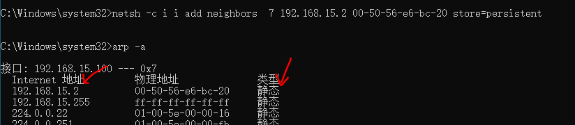
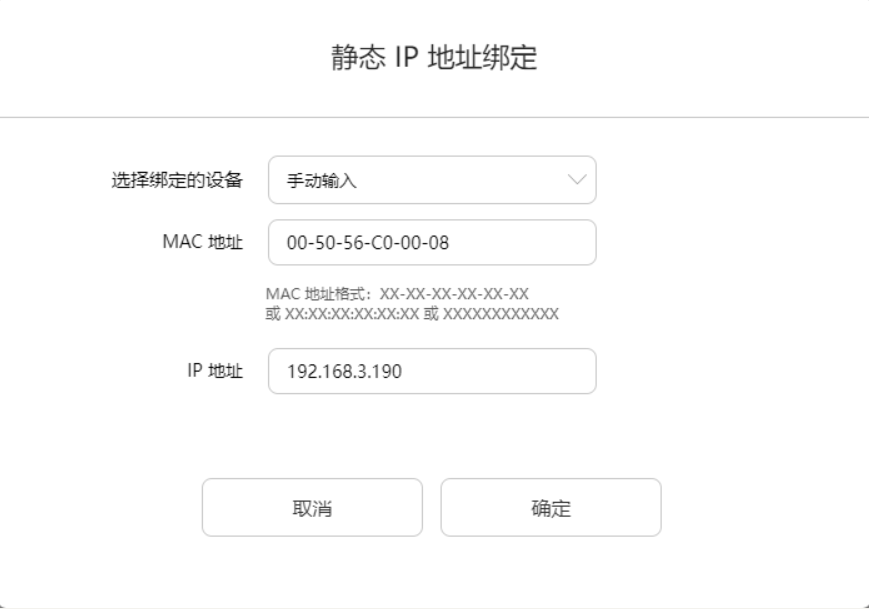

# ARP攻击防御

## 1.ARP防御方法简介

ARP攻击的原理是向网关和靶机不停的发送ARP欺骗报文，我们的计算机或者网关就会实时更新ARP缓存表，从而出现安全漏洞。假如对这种欺骗报文的处理是不相信或者不接受的话，就不会出现问题了。处理这种的欺骗的行为我们没办法提前在攻击端进行操作，因为敌人躲在暗处，而我们处明处。

针对这种情况我们可以从以下两方面入手：

1.让我们的电脑不接收欺骗包

2.即使接收到欺骗的包也不要相信

目前网络安全行业现有的ARP防御方案，基本都是基于上面两个方法实现的。

## 2.windows防御

注意使用windows自带的防火墙以及火绒杀毒是防御不住arp欺骗的。

### 1.安装arp的防火墙

##### 1.安装360安全卫士 地址：https://www.360.cn/

##### 2.选择网络安全

	

##### 3.选择流量防火墙

	

##### 4.选择局域网防护开启防火墙

	

##### 5.开启ARP攻击

```
arpspoof -i eth0 -r 192.168.110.1 -t 192.168.110.24
```

##### 6.查看防护效果

	

##### 7.查询本地arp表

```
arp -a
```

##### 8.关闭防火墙（退出360安全卫士）

##### 9.查看当前arp表

```
arp -a
```

##### 10.停止攻击

```
ctrl+c
```

### 2.设置静态mac地址

#### 1.临时绑定，重启后失去保护效果

##### 1.ARP表MAC地址绑定状态

ARP表MAC地址绑定类型有动态和静态两种。

动态：有时效限制，会实时更新，不安全

静态：长久生效，不会随时间或者通知而变化，安全。

我们来看一下电脑上的ARP表。

```
arp -a
```

大部分都是动态的，动态的MAC地址他有生命周期，一定时间之后就会被替换，另外别人通知我更新的时候，也会被直接替换，也就是说无论是被动获取时发现变化了，还是主动被告知时已经变动了，arp列表都会进行更新。如果是攻击方告诉了靶机，他也会相信，从而导致被攻击。我们解决的方法就是把动态的MAC地址变成静态的。那么该如何绑定呢？

##### 2.绑定步骤

1.Win10以管理员身份运行CMD命令提示符  

2.查询网关的ip和mac地址

```
arp -a |findstr 192.168.15.2
网关的IP：192.168.15.2
网关的MAC地址：00-50-56-e6-bc-20
```

	

3.查询本机的网卡

```
ipconfig
```

		

4.查询本地连接的网卡ID号

```
netsh i i show in

#netsh i i show in  是netsh  interface ipv4 show interfaces 的缩写
```

找到自己本地网卡的id号。

		

5.临时绑定mac地址，重启失效

在id7号的网卡上绑定网关的mac地址为临时静态。

```
netsh -c i i add neighbors  7 192.168.15.2 00-50-56-e6-bc-20 store=active

-c Context 指定上下文
i: interface 更改到 `netsh interface' 上下文。
i:ipv4
add: 在项目列表上添加一个配置项目
neighbors: 添加邻居地址
store=active：设置为临时绑定
查询帮助命令：netsh -c /?
```

此时网关的mac地址变成临时静态。

		

6.发起ARP攻击

```
arpspoof -i eth0 -r 192.168.15.2 -t 192.168.15.100
```

7.查询靶机ARP表

```
arp -a
```

发现靶机的arp表没有被毒化。

	

8.停止ARP攻击。

==但是静态临时绑定有个缺陷，就是重启后mac地址又变成动态得了。==

==并且静态绑定mac地址，有时不一定可以访问成功外网，因为网关可能会被欺骗，那么回包的信息，会被网关返回给kali机，还是可能导致断网。==

```
ctrl+c
```

#### 2.永久绑定，重启后不失效

1.绑定命令

```
netsh -c i i add neighbors  6 192.168.15.2 00-50-56-e6-bc-20 store=persistent
store=persistent：永久绑定
```

2.查看ARP表

```
arp -a
```

	

3.发起ARP攻击

```
arpspoof -i eth0 -r 192.168.15.2 -t 192.168.15.100
```

4.查看arp缓存表

```
arp -a
```

仍然保持不变。

	

5.重启电脑，查看ARP表，也会发现仍然保持不变，因为是静态而非临时静态绑定。

```
arp -a
```

6.删除静态配置

```
第一种方法删除非常不建议，因为用第一种删除，下次再绑定静态mac会出问题。
arp -d ip #不推荐使用，下次设置时，出现错误

其中7代表网卡的id号。
netsh -c i i delete ne 7  #推荐使用
```

7.查看靶机arp表

```
arp -a
```

此时又变回动态绑定了。

	

8.停止攻击

```
ctrl+c
```

## 3.linux防御

#### 1.查询arp表命令

```
arp -a
ip neigh
 
#这两个状态stale、reachable都是静态的。 
192.168.110.1 dev ens33 lladdr e4:3a:6e:35:98:00 STALE #不新鲜的
192.168.110.1 dev ens33 lladdr e4:3a:6e:35:98:00 REACHABLE #可到达的
```

	

#### 2.临时添加静态地址，重启后失效

给centos7的arp表中把网关的mac地址进行临时静态绑定。

```
arp -s 192.168.15.2 00:50:56:e6:bc:20
```

#### 3.查询arp表

```
ip n
192.168.110.1 dev ens33 lladdr e4:3a:6e:35:98:00 PERMANENT #永久的
```

	

#### 4.发起ARP攻击

```
arpspoof -i eth0 -r 192.168.15.2 -t 192.168.15.50
```

#### 5.查看靶机arp表

```
 ip n 
```

mac地址仍然保持不变，但是实际上靶机无法上网了，因为网关那边也会被arp欺骗。

	

#### 6.重启靶机

```
reboot
```

#### 7.查看靶机arp表

重启后发现mac地址变成动态的了。

```
ip n
```

	

#### 8.将其添加到 rc.local里边 开启自动执行

```
vi  /etc/rc.local
chmod +x /etc/rc.d/rc.local
添加：
arp -s 192.168.110.1 e4:3a:6e:35:98:00
wq保存
```

	

加入这一条命令即可。

	

设置好可执行权限后，那么每次重启之后，都会自动执行这个脚本的命令。

	

#### 9.重启centos7

```
reboot
```

#### 10.查看arp表

```
ip n
```

重启以后，网关的mac地址也是静态的了。

	

## 4.路由/网关防护设置

这部分无法复现，因为虚拟机的网关并不是真实的路由器。所以无法在网关进行配置静态mac绑定。

### 1.打开路由器配置网站

​	一般是http://网关ip

### 2.点击更多功能

	

### 3.选择网络设置--局域网

	

### 4.添加静态ip地址绑定列表

	

### 5.手动添加绑定

	

## 5.WEB服务防御ARP攻击

web服务防御明文传输泄露用户信息的手段：使用加密协议:https

### 1.什么是HTTP

超文本传输协议，是一个基于请求与响应，无状态的，应用层的协议，常基于TCP/IP协议传输数据，互联网上应用最为广泛的一种网络协议,所有的WWW文件都必须遵守这个标准。设计HTTP的初衷是为了提供一种发布和接收HTML页面的方法。使用明文传输，容易被劫持。

### 2.什么是HTTPS

《图解HTTP》这本书中曾提过HTTPS是身披SSL外壳的HTTP。HTTPS是一种通过计算机网络进行安全通信的传输协议，经由HTTP进行通信，利用SSL/TLS建立全信道，加密数据包。HTTPS使用的主要目的是提供对网站服务器的身份认证，同时保护交换数据的隐私与完整性。使用加密传输，不容易被拦截，更加安全。

TLS是传输层加密协议，前身是SSL协议，由网景公司1995年发布，有时候两者不区分。

### 3.HTTPS加密通讯工作原理

	

## 5.课堂小结

请参照：ARP攻击防御.xmind

