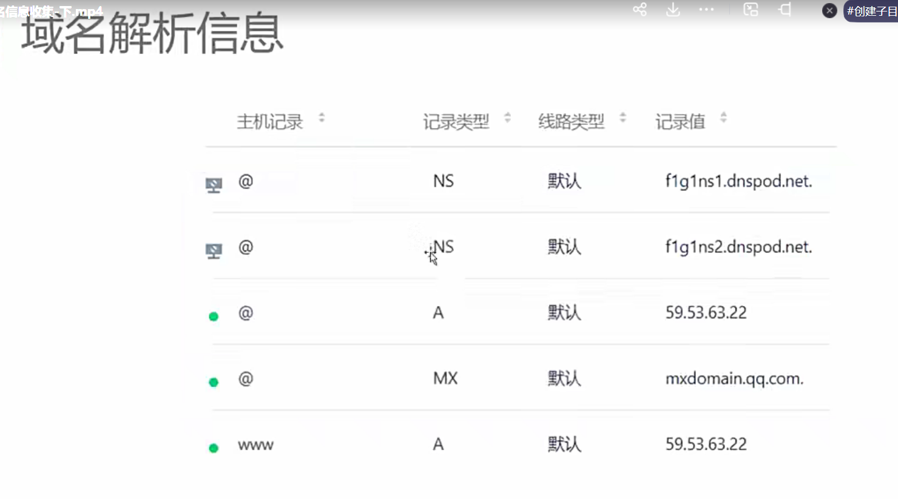

# 信息收集

	

	

## 域名信息收集

可以通过这三个网站查找域名信息，也可以使用kali虚拟机的whois命令

可以通过域名去查询这个人的邮箱名和手机号码等联系信息，但是现在大多数都会做隐藏。

注意:kali的虚拟机可以去官网下载使用

使用kali也可以查找对应域名的相关负责人信息	

	

	

域名反查的这个网站，可以通过邮箱或者注册人的名字或者电话去反查拥有哪些域名。

	

使用中国的服务器，那么使用的域名都要ICP备案

	

所以可以在ICP当中查找域名的主办方，这个无法隐藏主办方名字。

	

可以通过域名获取这些数据，如果是企业的话，可以通过==天眼查==官网查找有关企业的相关信息

	

子域名可以得知百度有哪些系列的网站

	

		

可以通过工具，对指定的域名去查询对应80和443端口是否有多余的子域名，比如下图就查询了很多子域名

	

	

	

