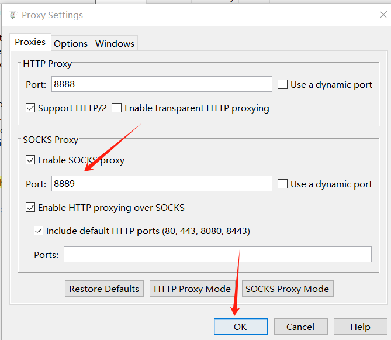
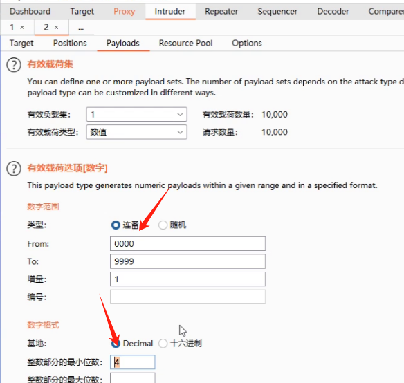
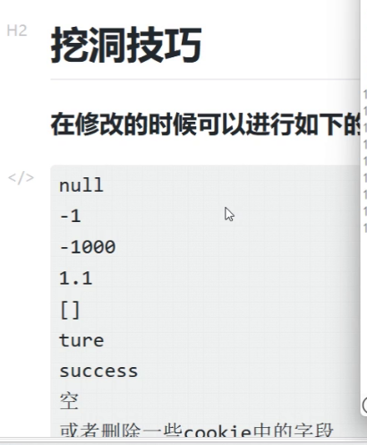
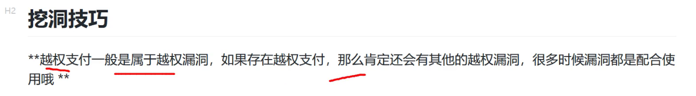
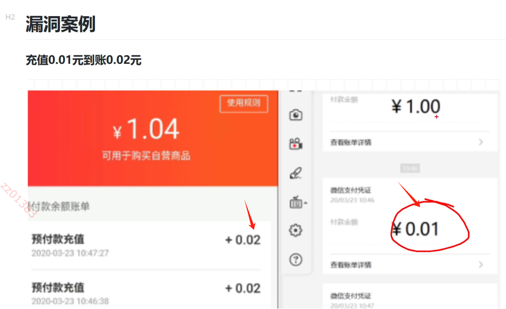

# 企业SRC挖洞实战

```
SRC介绍
SRC: 安全应急响应中心（Security Response Center）通过给企业提交漏洞获取相应的报酬（钱）,

SRC的分类大致有以下几种
企业SRC: 阿里SRC 百度SRC 腾讯SRC,BOSS直聘，字节跳动等（还有一部分没有自己的直属SRC平台比如联想之类的）https://www.anquanke.com/src/（SRC导航）
众测平台：补天众测，漏洞盒子 雷神众测 火线 360众测（需要一定的门槛）
还有其他的平台比如：教育SRC,CNVD 公益SRC(目前不挖这个了)

SRC准则
每一个SRC都有自己的挖掘准则，请白帽子们仔细阅准则
https://bsrc.baidu.com/v2/#/announce/127

SRC范围
每一个SRC都有自己的资产范围，确定资产范围是我们的第一步要做就是确定资产目前来说分为两种
1、平台规定的资产和域名，只能从其中挖掘
2、平台没有规定域名，只是某一个应用名或者没有需要采用QCC(企查查)的方法

SRC评级
每个漏洞都有评级，评级不同对应的积分不同，漏洞还分为核心，一般，边缘，白帽们阅读公告。
```

## SRC抓包

```
首先手机抓包，要先下载charles-proxy代理工具。
访问https://www.zzzmode.com/mytools/charles,可以实现永久激活,随便使用一个name生成license key
```

	

```
导入密钥，点击help中的register charles
```

	

	

```
点击help中的ssl proxy中的save charles root certificate，保存证书到本地，这个证书可以用于抓手机的https的包。
然后打开逍遥游览器中的指定位置存放这个pem证书。
```

	

	

```
打开设置找到从SD卡安装。选择证书，自定义证书名称然后安装即可。
```

	

	

```
从信任凭据可以看到安装好的证书。
```

	

```
将postern.apk包放到逍遥模拟器进行安装，这个是一个手机的代理app.
```

```
打开charles中的proxy settings,打开socks proxy,并设置端口为8889
```

	

```
并打开SSL Proxying settings,这样可以接受所有代理。
```

	

```
逍遥模拟器打开postern添加代理。
```


```
设置好代理的服务器是charles所在的ip地址下。
```

	

```
并设置好代理规则，动作设置为通过代理连接，并开启抓包。
```

	

```
下面的位置可以设置是否打开vpn，于是模拟器访问游览器，就会抓取到数据了。
```

	

```
于是手机即可实现抓包。
```

	

```
除了使用postern进行手机的代理服务，也可以在模拟器的设置中点击wlan-》长按网络-》修改网络-》代理手动。
```

## 信息收集

```
主要根据src可以挖的域名目标，去ICP备案查询公司名，并根据公司名在小蓝本查询有哪些资产可以作为挖洞目标。
```

```
企业SRC漏洞的挖掘步骤和思路
漏洞挖掘中就分为两步
第一步：收集目标的相关资产
第二部：对资产进行漏洞挖掘
第一步:收集目标的相关资产
收集目标的资产和相关信息如下：
一般收集的资产如下：
1、子域名（oneforall 灯塔 水泽 goby fofa 鹰图等工具可以进行资产）
2、小程序（小蓝本 企查查 爱企查）
3、APP（小蓝本 企查查 爱企查）
任务：每个人找一个目标的SRC网站然后开始进行信息收集
子域名  小程序  APP 三个维度收集
1、收集完成之后，整理成报告，可以发在论坛里，遇到什么问题可以在论坛讨论，
2、收集完成的资产进行抓包，（网站，小程序，APP等）

第二步：针对资产进行挖掘（后续安排学习）
挖掘的方式一般如下：
针对不同的功能点进行测试
如果没有发现相关漏洞，需要进行如下操作
1、目录扫描
2、FUZZ
3、JS相关
4、CMS，插件，中间件
通过其他的技术挖掘甚多的资产，寻找更多的漏洞.
```

## 短信验证码相关逻辑漏洞

### 验证码爆破漏洞

	

	

	

	

```
放到intruder模块，设置载荷为数值，设定验证码范围是0000-9999，并设置整数部分最小位数是4,即可开始爆破。
```

	

```
对于六位验证码可以尝试分段破解，比如用自己手机号测试得知到验证码，然后bp只暴力测试1000个验证码，也可以尝试忽悠审核员说有任意用户注册漏洞等等。
```

	

### 验证码回显漏洞

	

```
可能验证码会出现在响应包当中。
```

	

```
有的返回数据包的内容经过加密，如果能解密成功，说不准也可能有验证码信息。
```

	

	

```
返回数据包的头部，即cookie字段也可能存在验证码回显的情况。
```

	

```
具体操作就是，抓包的时候，设置拦截响应包。
```

	

```
然后放包通行，查看响应包，如果存在漏洞，很可能出现在code字段。
```

	

	

### 验证码与手机未绑定认证关系漏洞

```
这意味着先用一个手机号获取验证码，然后在把手机号换成另一个手机号，来使用这个验证码，如果能登陆说明存在该漏洞。
```

	

	

	

### 修改返回包绕过验证码漏洞

	

```
抓取返回包，强行修改返回包的状态，来绕过认证登录。
```

	

```
具体操作就是抓包拦截响应包
```

	

```
如果这个code是状态，用于判断是否能够登录，那么我们修改响应包即可实现绕过认证。
```

	

	

### 短信验证码转发漏洞

	

```
比如输入两个手机号
```

	

```
两个手机号同时收到了验证码。
```

	

```
具体操作就是登录的时候抓包，并发送到repeater模块
```

	

```
加一个空格，多加一个手机号，如果正常响应，可能同时两个手机号收到同一个验证码。
```

		

```
写两个手机号有多种写法，可以都尝试一下试试。
```

	

### 无效验证任意验证码登录漏洞

```
比如随便获取验证码，但是输入验证码随便输入，小概率有可能存在能登陆的情况
```

	

	

### 验证码为空登录漏洞

	

```
比如抓包的时候，把验证码的值设置为null，有可能存在空值绕过的情况。
```

	

```
修改验证码的值也可以换成如下的值，并且也可以配合把cookie字段内容清除来测试，能否绕过。
```

	

### 固定验证码登录漏洞

	

```
一般可能存在的固定验证码。
```

	

### 手机短信轰炸漏洞

```
通常情况下横向轰炸的src接受漏洞的可能性较低,但是可和审核员battle，说明其中的危害性。
```

	

```
具体就是抓包，放到repeater，一直点击发送，如果有多个短信接收到，证明有此漏洞。
```

	

```
手机号前面或者后面加空格，看能否绕过。
```


	

	

	

	

	

	


	

	

	

## 支付相关逻辑漏洞

	

	

### 订单金额任意修改漏洞

	

```
比如点击立即购买。
```

	

```
抓包后，将原本的值1改成-3450，其实实际操作的过程中，每一个参数都可以改一改试试。
```

	

```
于是收到订单为0.5元。
```

	

```
这里使用大米的cms系统来进行漏洞复现。
```

	

```
对抓包的里面的参数修改，可以基于之前验证码逻辑漏洞总结的修改参数方式来结合，比如写成小数，双写法，中文，数组等等。
```

	

	

	

### 负数购买漏洞


```
购买时抓包，把qty参数改为-1
```

	

	

	

### 越权支付漏洞

	

```
将自己的openid换成别人的openid，从而可进行积分兑换礼物。
```

	

```
比如买东西的时候，把id字段进行修改。
```

	

	

### 优惠卷修改漏洞

	

	

	

	

	

### 修改运费价格漏洞

```
抓包把运费字段改为0
```

	

	

	

### 四舍五入支付漏洞

	

	

```
使用1毛钱，获得2毛钱。
```

	

### 无限利用优惠漏洞

```
这个漏洞最近一年来最热门，甚至大厂都有出现这样的漏洞
```

	

	

	

### 整数溢出漏洞

	

	

	

## 权限相关漏洞

	

```
1、修改登录状态：
常见响应码：200、000000、true、0、success、ok、1等等

第一种：后端未作验证，修改状态码就可以直接绕过权限检查，可定级为高危漏洞。
第二种：后端做了验证，修改状态码后仍然会显示后台页面，或是泄露后台部分的功能接口，但是没有数据和操作权限，可定级为低中危。
```

	

```
2、身份信息/登录信息伪造
常见测试就是修改URL和响应包中鉴权参数
鉴权参数：id、username、login、session、cookie、token等。
例如某些系统修改Login=1、修改UserName=admin均可以被系统判定为管理员登录。
有一个账户的前提下，找到身份控制的参数。遍历id（POST、GET、URL）
参数名称：partnerId、accountNo
```


## 并发及相关漏洞

```
并发的漏洞很重要，近几年最流行的挖洞方式，基本只要坚持测试并发，就能挖到。
具体笔记参考pdf.
```

## FUZZ技术讲解

```
详情看pdf。
```

## JS漏洞挖掘作用

```
详情看pdf
```


