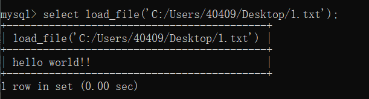
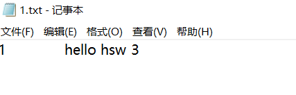
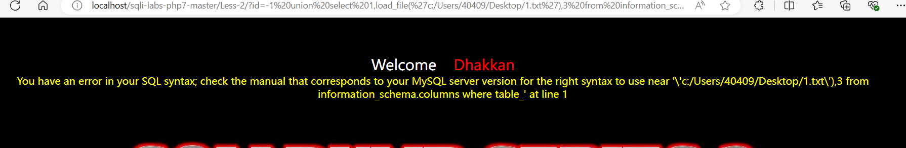
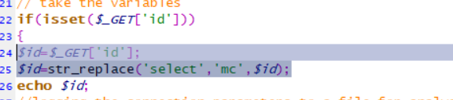
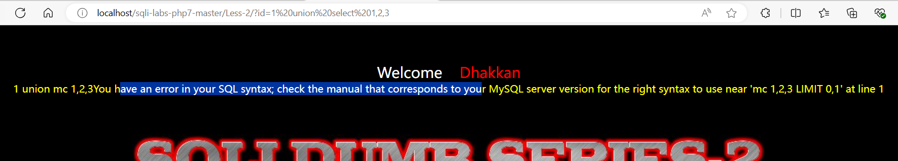

# SQL注入之文件读写

#### 文件读写注入的原理

就是利用文件的读写权限进行注入，它可以写入一句话木马，也可以读取系统文件的敏感信息。

#### 文件读写注入的条件

高版本的MYSQL添加了一个新的特性secure_file_priv，该选项限制了mysql导出文件的权限

**secure_file_priv选项**

```
linux
cat  etc/conf

win
www/mysql / my.ini

```

show global variables like '%secure%'  查看mysql全局变量的配置

注意:在windows下修改该配置文件，需要重启mysql服务才能使得配置文件生效

1、读写文件需要 `secure_file_priv`权限

**`secure_file_priv=`**

代表对文件读写没有限制

`secure_file_priv=NULL`

代表不能进行文件读写

`secure_file_priv=d:/phpstudy/mysql/data`

代表只能对该路径下文件进行读写

`secure_file_priv=''`

代表所有路径都可进行读写

2、知道网站绝对路径

Windows常见：


Linux常见：


路径获取常见方式：

报错显示，遗留文件，漏洞报错，平台配置文件等

#### 读取文件

使用函数：`load_file()`

后面的路径可以是单引号，0x，char转换的字符。

注意：路径中斜杠是/不是\。

一般可以与union中做为一个字段使用，查看config.php(即mysql的密码)，apache配置...

	

同理可以把文件读写用于sql注入

```
http://localhost/sqli-labs-php7-master/Less-2/?id=-1 union select 1,load_file('c:/Users/40409/Desktop/1.txt'),3 from information_schema.columns where table_name='users'
```

	

#### 写入文件

使用函数：`Into Outfile`（能写入多行，按格式输出）和 `into Dumpfile`（只能写入一行且没有输出格式）

outfile 后面不能接0x开头或者char转换以后的路径，只能是单引号路径

比如可以在网页的url注入中写入信息。

```
http://localhost/sqli-labs-php7-master/Less-2/?id=-1 union select 1,'hello hsw',3 into outfile 'C:/Users/40409/Desktop/1.txt'
```

于是可以在电脑中找的被注入sql的写入信息。

	

# 2.6 SQL注入之基础防御

### 魔术引号

魔术引号（Magic Quote）是一个自动将进入 PHP 脚本的数据进行转义的过程。
最好在编码时不要转义而在运行时根据需要而转义。

魔术引号功能开启后，会把游览器get和post等请求的数据，自动给单引号和双引号前面加\,以防止sql注入。

魔术引号：
在php.ini文件内找到

```
magic_quotes_gpc = On 开启

将其改为

magic_quotes_gpc = Off 关闭
```

开启魔术引号后,用读取文件的sql注入失效。因为单引号和双引号被自动加上了\，导致无法正常识别文件路径

	

### 内置函数

做数据类型的过滤

is_int()等,通过判断web申请的数据类型来防止sql注入。

addslashes()，类似魔术引号，可以把web请求的数据中，带有单引号等加上\,使得sql注入失败。

mysql_real_escape_string()

mysql_escape_string()

### 自定义关键字

str_replace()，可以通过该函数去过滤sql关键字，从而防止sql注入。

比如在php当中对web申请的数据进行关键字过滤，把select过滤成mc使得sql注入失败。

	

比如这里过滤失败了，并且从php的输出结果，可以发现select关键字被过滤成mc使得sql注入失败。

	

其他安全防护软件 WAF ......
