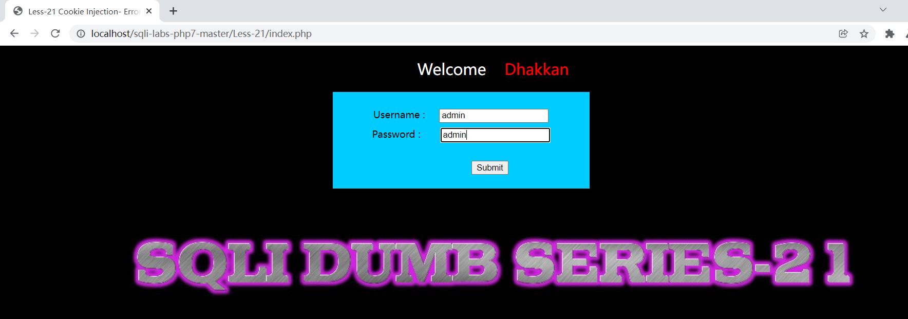
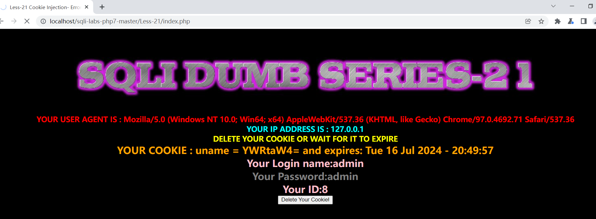
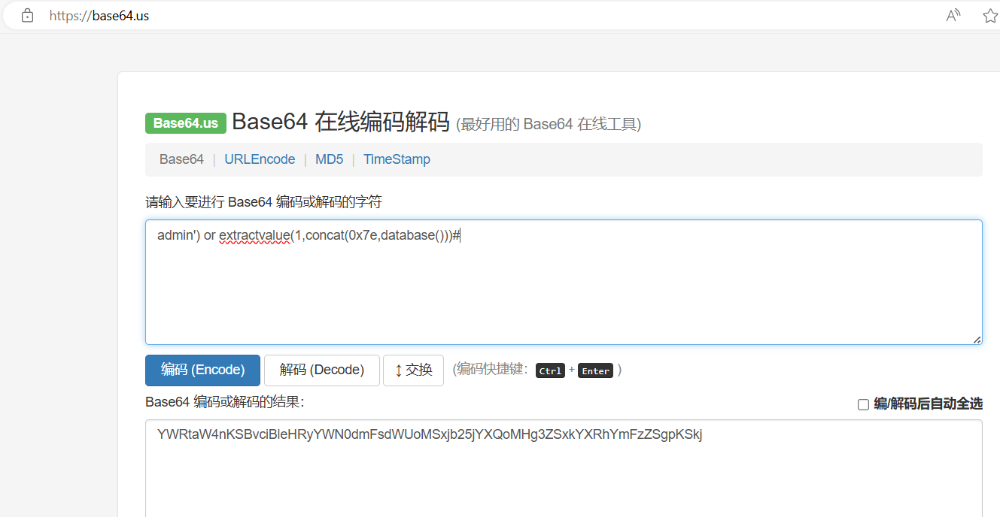
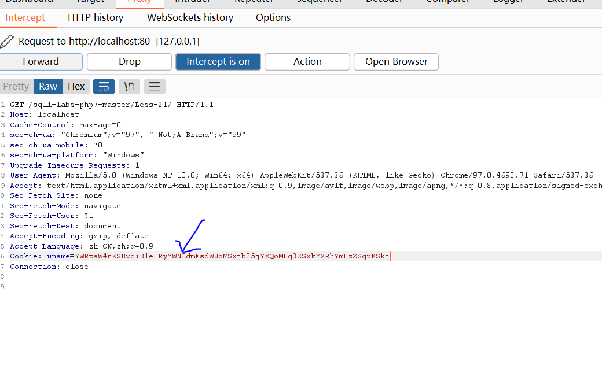
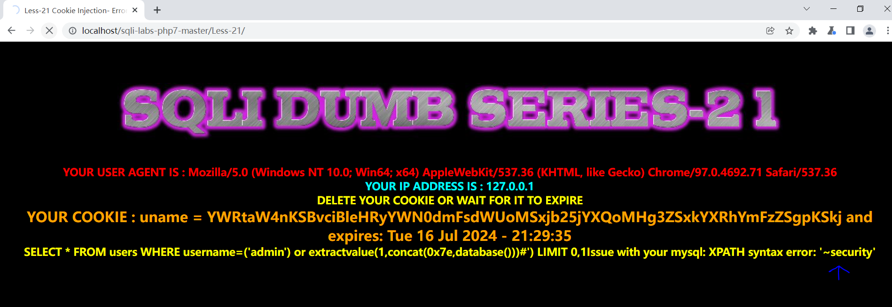

```
SQL注入之加解密注入
```

Base64是网络上最常见的用于传输8Bit[字节码](https://baike.baidu.com/item/%E5%AD%97%E8%8A%82%E7%A0%81/9953683)的编码方式之一，Base64就是一种基于64个可打印字符来表示[二进制](https://baike.baidu.com/item/%E4%BA%8C%E8%BF%9B%E5%88%B6/361457)数据的方法。

Less-21关 Cookie加密注入：


通过Burpsuite抓包：


进行Base64解密：

注意%3D要写成=


使用admin作为账号密码登录靶场21关

	

刷新该网站，让burp suite抓取到

	

sql注入代码,其中admin后面的')是为了闭合后端的sql处理，防止sql语法错误。

```
admin') or extractvalue(1,concat(0x7e,database()))#
```

把写好的sql注入代码进行base64加密。

	

将burp suite抓取的内容修改成加密的base64的sql注入代码。



前端从而获得数据库名。

	


