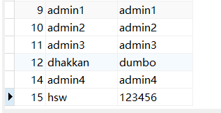

# SQL注入之堆叠注入

在SQL中，分号 ；是用来表示一条sql语句的结束，试想一下我们在 ； 结束一个sql语句后面继续构造下一个语句
会不会一起执行？因此这个想法也就造就了堆叠注入。

注意:mysql才支持堆叠注入,oracle是不支持的。


而union injection（联合注入）也是将两条语句合并在一起
两者之间有什么区别？区别就在于union执行语句类型有限，可以用来执行查询语句，而堆叠注入可以执行的是任意语句

Less-38

```
http://localhost/sqli-labs-php7-master/Less-38/?id=1';insert into users values(15,'hsw','123456');--+
```


从数据库可以查询到,说明注入成功。

	
