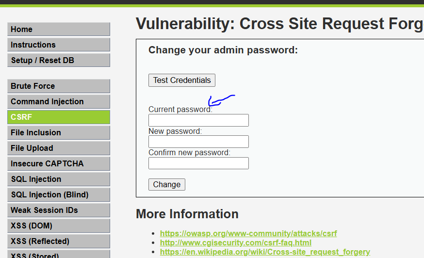

# CSRF渗透与防御

## 什么是CSRF?

CSRF跨站请求伪造

CSRF的实现流程

	

首先通过一个小案例演示来了解CSRF漏洞，先把两个网站丢入到php的根目录，并在phpstudy创建网站。

	

在host文件中添加两个本地识别的域名，这样方便试验成功。

	

由于bank网站要识别数据库,所以要对配置文件进行修改，数据库名是bank，账号密码设置为mysql的账号和密码。

	

在navicat新建数据库，并导入已有的sql文件。

	

	

查看数据库的账号和密码

	

==注意:访问网站必须使用火狐游览器才能生效这个实验。==

登录第一个用户

	

向另外一个用户转账，查看数据库变化

	

	

于是该用户转完帐的同时，去访问黄色网站。

		

		

于是该用户就少了1000块钱。

	

	

查看porn网站的源码发现，当点击这个链接后,这个网站会自动发起get请求，把账户的信息转入到nameid为1102的账号上，并且转账1000元。

	

从上面案例可以得知，使用其他的网站伪造请求，从而使得银行的网站去实现转账，而实现的原理在于该用户登录，有了对应的cookie，所以使得在自己电脑点击黄色网站，自动去触发了这个get请求。

## CSRF案例分析

	


	

## CSRF漏洞挖掘

	

先点击抓包,然后点击转账确定。

	

这是抓包信息,以及发送的get请求,但是还是不确定哪里有csrf漏洞，所以需要右键点击Engagement tools中的CSRF poc

	

复制这个csrf html的代码

	

把前端代码随便编写到一个文件中，每次点击都会触发csrf漏洞使得对方账户被转账。

	

每次点击都会转账一元。

	

## CSRF漏洞防御

	

referer字段用于查看从哪个网站来发出请求访问该网站的。

主要可以用于区分请求是否是来自自己的前端还是第三方网站。

	

但是referer字段可以被抓包进行修改。

	

第二种防御，让自己的前端页面请求和第三方网站伪造的请求不一致。

	

	

	

	

比如以dvwa靶场为例,如果是low级别，需要更改密码，则会在f12得知哪两个字段修改密码,于是这样可以bp抓包生成csrf pop漏洞去让该用户点击，从而修改密码。

	

medium难度的dvwa靶场，其中前端源代码会对http中referer字段进行检测，如果与服务端的域名没有包含，则可以发现是跨站请求，直接拒绝。

但是仍然有办法攻击，只需抓包修改referer字段，实现绕过。

	

对于high级别的dvwa靶场，服务端会生成一个随机token给用户，这个token会放到前端的一个隐藏标签当中，当发送请求时才会携带这个token,而如果是第三方网站跨站请求没有这个token是无法进行跨站访问的。

	

	

但是一样也有漏洞，可以配合xss漏洞注入，来获取用户的token,比如说

```
xss注入代码,iframe是内联框架,当加载csrf这个目录成功后，会触发onload属性的事件,于是会发出弹窗获得usertoken的字段。

<iframe src="../csrf" onload=alert(frames[0].document.getElementsByName('user_token')[0].value)>
```

利用xss的反射入口，注入代码获得user token.

	

而对于impossible级别,第三方网站是不可能得知对方的当前密码的。如果不其他的渗透方式，是无法使用csrf进行渗透来修改密码的。

	

而之所以前面演示的csrf案例必须由火狐游览器才能实现，原因在于其他游览器现在都有referer policy,一旦发现是跨站请求，会把跨站请求的参数全部删掉。


