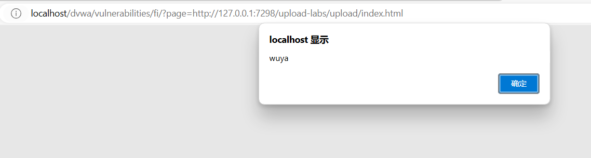

# 文件包含漏洞

## 什么是文件包含漏洞

首先得先理解什么是文件包含。文件包含的作用主要是为了减少开发的代码量。

举个例子比如下列main.php文件，其中包含footer.php文件。

	

footer.php代码如下

	

这就是文件包含所获得的内容。

	

但是现在大部分开发，都是基于动态传参数来包含不同的文件。比如下图的include.php使用get文件包含参数。

	

除了之前使用文件包含漏洞来执行图片马来控制web服务器，也可以获取服务器的敏感文件数据。

比如查看system.ini文件。

	

一般除了让文件包含来包含服务器的本地文件，也可以包含其他服务器的外部文件，这样就可以包含其他的木马文件，来控制这个服务器。

修改php.ini配置文件为On，这样可以包含外部文件。

	

在另一个apache服务器上分别有三个文件。我们使用这里的文件作为外部文件来包含到phpstudy环境下的web服务端。

	

于是通过包含外部文件获得php版本信息。

	

包含文件去执行恶意脚本。

	

也可以在中国蚁剑进行连接，但是这里没有复现。感觉可能是版本问题。

	

## php函数和相关伪协议

关于读取文件的相关函数和伪协议

	

	

	

## dvwa靶场演示

### low级别

分析low级别的源代码，发现只有文件包含，但是没有做任何过滤。

		

于是让其包含其他服务器的文件，去执行一些恶意脚本。

	

### medium级别

分析源码会发现遇到关键字http://和目录的结构会被处理为空。

	

但是一样有漏洞，采用双写法即可绕过。

	

### high级别

分析源码可以得知，fnmatch函数会去匹配传入的文件名参数，只要file参数不是以file开头则会报错。但这样依然有漏洞，如果有文件上传漏洞就可以结合本地包含来渗透。

	

比如如果得知服务器的配置文件路径，则可以获取该文件的信息。

```
payload:
http://localhost/dvwa/vulnerabilities/fi/?page=file://C:\Windows\system.ini
```

	

### impossible级别

分析源码得知，如果file传入的参数不是指定if分支中的这几个文件，则会提示报错信息，这从根源上解决了文件包含的问题。哪怕是利用文件上传漏洞，但是也不一定是当前路径，所以依然可以防范文件包含漏洞。

	

## CTF题目案例

在这个网站注册账号使用。

	

在点击RCE


点击文件包含，完成第一个靶场。

	

打开环境后,点击链接进入靶场。

	

### 案例1

由于是通过file进行传参。并且提示有shell.txt,所以输入shell.txt

	

获得一句话木马的密码ctfhub,使用ctfhub来作为木马的接收参数

	

首先包含这个shell.txt文件，所以会使用php解析这个一句话木马文件，通过post请求给这个木马文件传入ls命令，查看当前目录有哪些文件。


于是利用find命令查找flag文件。

	

查看flag文件的内容即可通关。

	

获得flag文件内容，提交即可。

	

### 案例2


分析源代码，还是以file进行传参数。并且还做了过滤必须以php://开头。


用bp抓包

	

修改成post请求，并且携带post的请求参数。右键send to repeater


点击发送，通过response确定该目录有两个文件。

	

通过查找flag关键字，找到对应的文件。

	

于是获得对应的内容。

	

完成成功。

	

### 案例3

	

右键点击send to repeater


点击send，获取需要的文件

与前两关一样，查看内容复制即可通关。

	

## 文件包含漏洞挖掘与利用

	

有的时候并不知道对应服务器的敏感文件路径是怎么样的，可以使用kali里面的wfuzz命令进行字典扫描，查看有哪些敏感文件可以查找到。

```
-w这个选项告诉 wfuzz 使用指定的单词列表文件（wordlist）进行模糊测试
其中 FUZZ 是一个占位符，表示 wfuzz 会在那里插入单词列表中的每个词
```

	

其中有两个payload，说明有两个敏感文件被扫描出来。

	

由于dirTravelsal-win.txt包含的都是window系统常见的敏感文件目录字典，可以拿来测试扫描

	

从结果还是能扫描出很多敏感文件的。

	

## 文件包含漏洞修复方案

	


